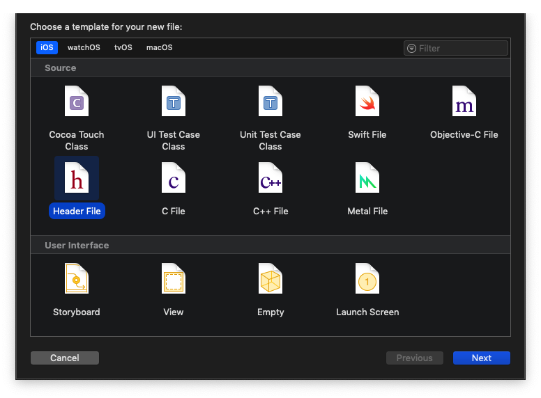
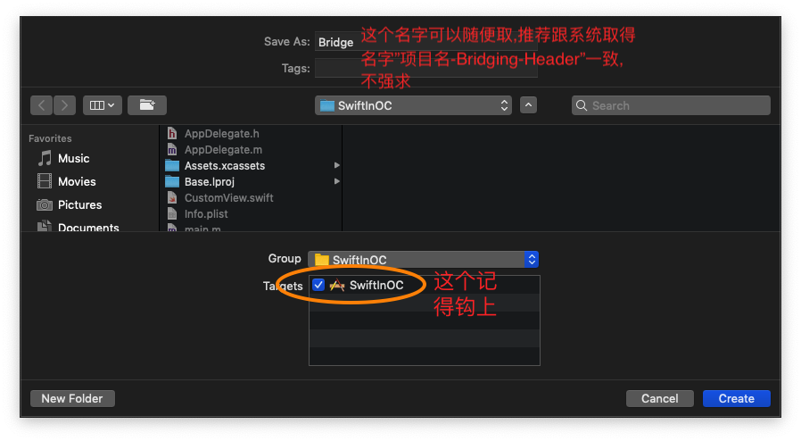
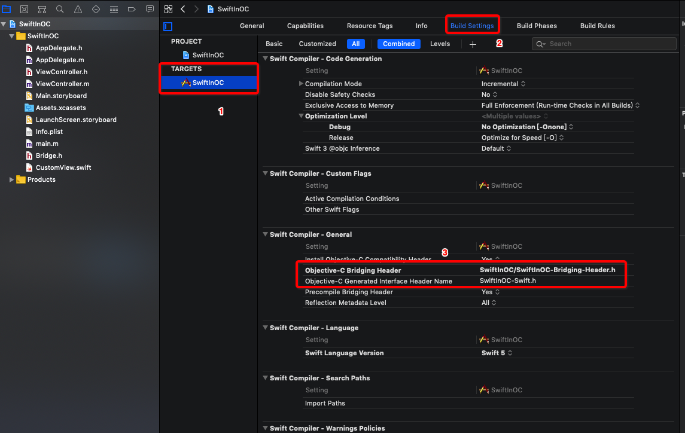

# 记录一下,OC 和 Swift 混编的问题

在OC项目中,需要使用 Swift 的时候,一般情况下,在你的 OC 项目中新建一个 Swift 文件的时候,系统会自动提示你是否需要配置一个 Objective-C 桥接头文件,如下图:

点击最右侧的创建桥接头文件,系统就会帮你配置创建并配置好一个桥接头文件...这个桥接头文件的作用是,让你可以在 Swift 代码中使用 OC 中的类;只需要将你需要在 Swift 代码中使用的类的头文件在桥接头文件中导入一下就可以使用了;如果一不小心点击了 Don't Create 按钮,那就需要你自己再手动创建一个头文件,将它配置成桥接头文件,才可以使用.配置步骤如下:

1. 创建一个头文件
	
	
2. 配置成为OC桥接头文件
	 
	 
在里面导入 OC 的头文件,就可以在 Swift 代码中使用了

如果是想要在 OC 的代码中使用 Swift 的类的话,这个就更加简单了,只需要导入一个系统自动生成的头文件就可以访问了,这个头文件在项目目录中看不到;但是在上图标记 ③ 的框框下面你可以看到它的名字,直接导入这个头文件就可以使用了,需要注意的是系统并不会自动补全这个头文件...没有提示,需要你自己一个一个字母敲进去

再来说一下,在 Swift 项目中,想要使用 OC 代码;跟上面的步骤是一样的,第一次在 Swift 项目中创建 OC 类的时候,系统就会提示你是否创建 Objective-C 桥接头文件;这个头文件的作用跟上是一样的,让你可以在 Swift 代码中使用 OC 的类,只需在这个头文件导入 OC 类就行了...在 OC 代码中想要使用 Swift 类也跟上面一样,导入系统自动生成的那个头文件就可以使用了
