flutter 现在是越来越火了，现在作为一个 iOS 开发，如果你不会 flutter 都好像不算个正常人似的？而且现在的 flutter 情况，有点像 2012 年那会儿刚刚兴起的 iOS，Android 开发一样，会点皮毛 UI 就可以提升不少身价...这些年过来，有无数的前端跨平台框架兴起。却只有 flutter 一家独秀，说明它还是有两把刷子的。今天这篇文章内容是基于 Mac 和 Android Studio 基础来开发 flutter 的，如果你还没有配置好开发环境，可以在网上搜索，或者直接到官网安装。这篇文章主要用来记录我学习 flutter 的过程，如果你也对 flutter 感兴趣可以跟着一起练习。

配置好 Flutter 环境之后，开始创建我们的第一个 Flutter 工程

# 创建第一个 Flutter 工程

打开 iTerm2，cd 到 ~/AndroidStudioProjects 目录，输入以下命令，没有 iTerms 的使用 Mac 系统自带的 Terminal 也行。<br>

``` sh
flutter create flutter_demo
```

这里需要注意，AndroidStudio 项目名称不能使用大写字母，这里推荐使用小写字母加下划线给工程命名。

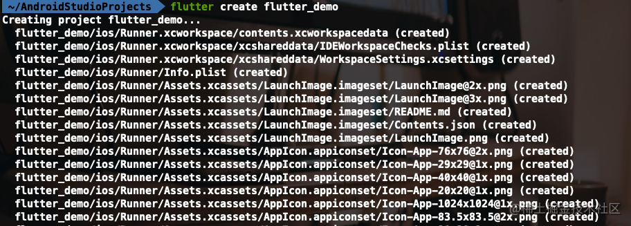

打开对应的目录，可以看到新建了一个 `flutter_demo` 目录

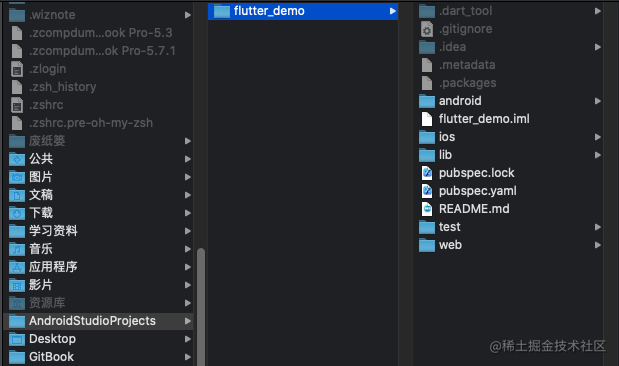<br>

接下来，cd 到 `flutter_demo` 目录，在终端输入 `flutter run` 命令，它就会运行项目，如果你电脑连接了真机，就会自动运行到真机上，没有真机会去寻找模拟器并运行，模拟器也没有，就会打开一个 Chrome 网页运行项目 (flutter 项目目前可以运行在 iOS，Android，web 上)。我这里连上了 iPhone 真机，运行项目会报一个 BUILD FAILED 的错误:

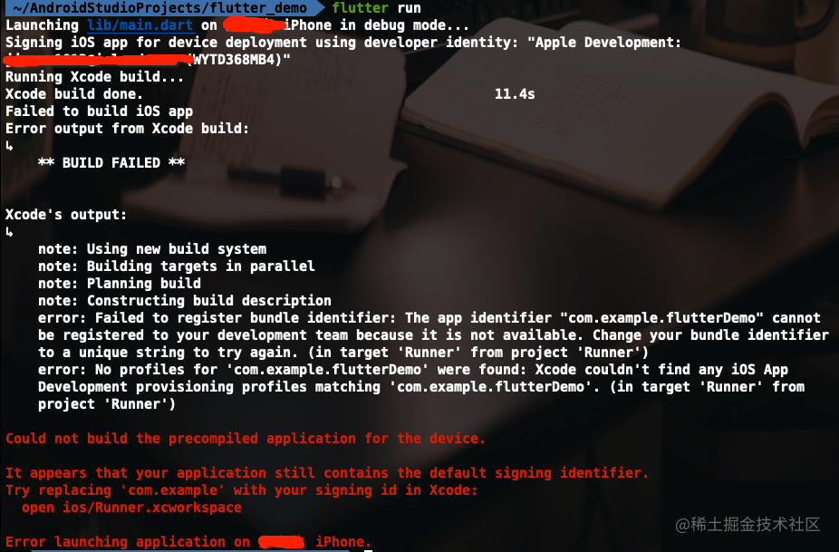

原因是 flutter_demo 项目生成的 iOS 项目默认的 bundle identifier 咱们用不了，去 iOS 项目里面修改一下就好了

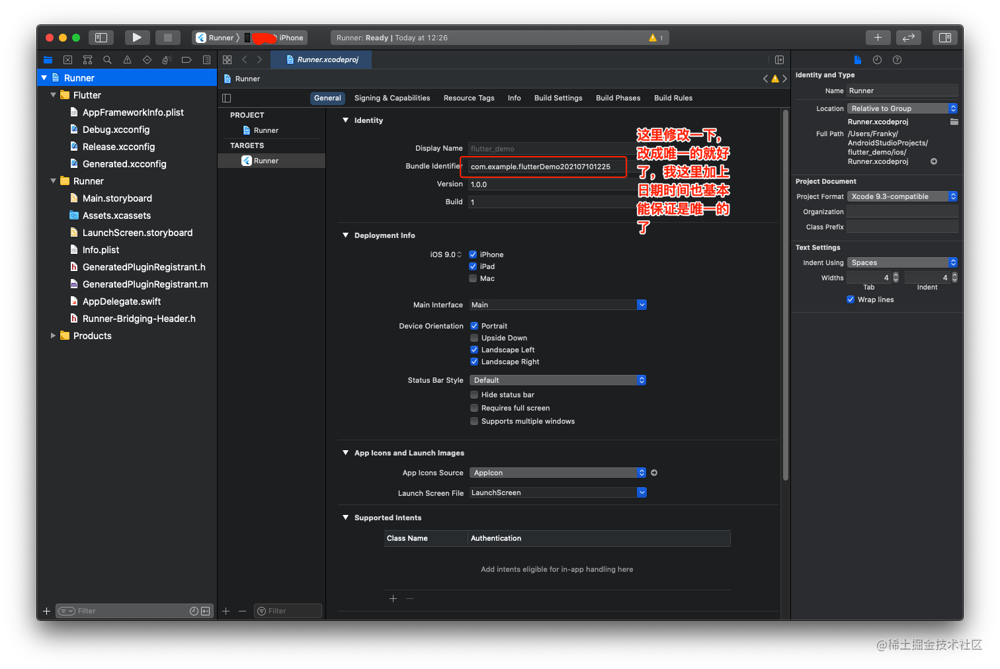

这里注意我们免费的开发者证书，在 iPhone 上最多安装 3 个开发中的 APP，多了就安装不了，删掉之前的 APP 就好了，再次运行 `flutter run` 

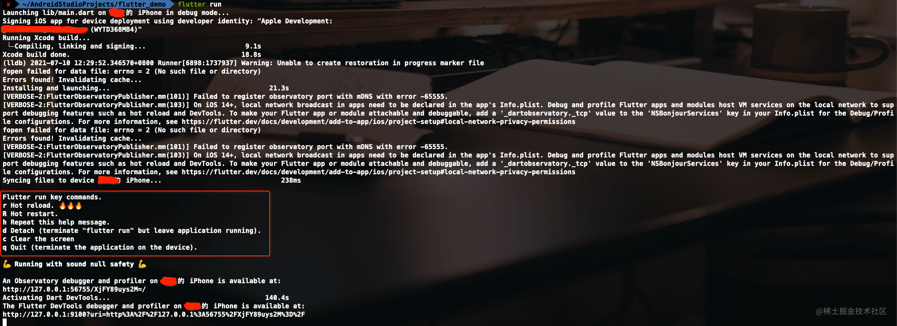

可以看到这里给出了 flutter 运行的一些关键命令，Hot reload 热重载，这个特性对我们开发 UI 时还是比原生的体验好不少的，它不用我们重新运行项目就能看到 UI 的一些改变。Hot restart 热重启，意思不用退出 APP，就直接重新运行了。此时真机上就打开了我们的第一个 flutter 工程的 APP

<div align=center>
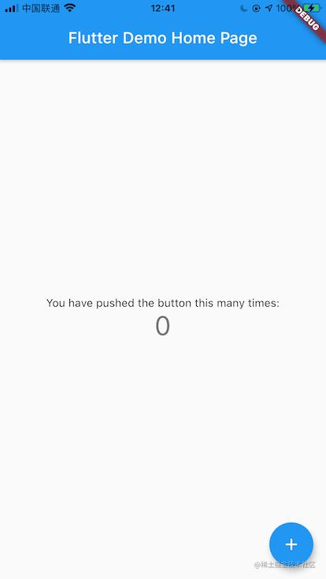
</div>

# HelloFlutter

上面是通过命令创建一个 flutter 项目，当然在实际开发过程我，我们一般不会这么操作。使用 Android Studio 来创建 flutter 项目。没有这个选项的同学，在 Android Studio 的插件里面选择 flutter 并安装就有了，如果提示还需要安装 Dart 就一块安装了，flutter 使用的是 Dart 语言。iOS 开发者没必要被这个新语言给吓到了，现代的语言基本都差不了太多，敲着敲着就熟悉了

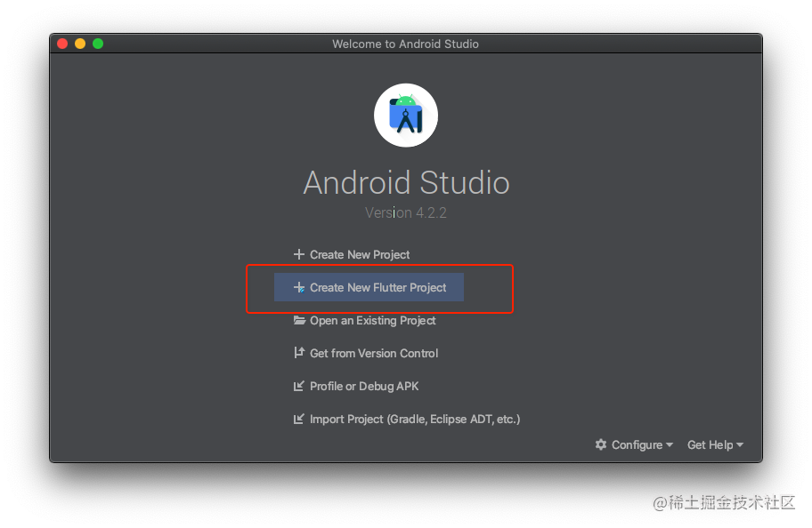

点击后会出现以下界面，目前我们选择 Flutter App 就好了

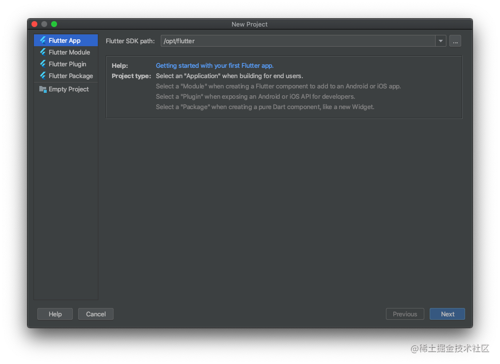

下一个界面会让我们设置工程名称，工程位置，工程描述，工程组织，Android 语言，iOS 语言等等...我这里设置工程名称为 hello_flutter，其他的默认选择就好了...也可以根据你自己的需要选择

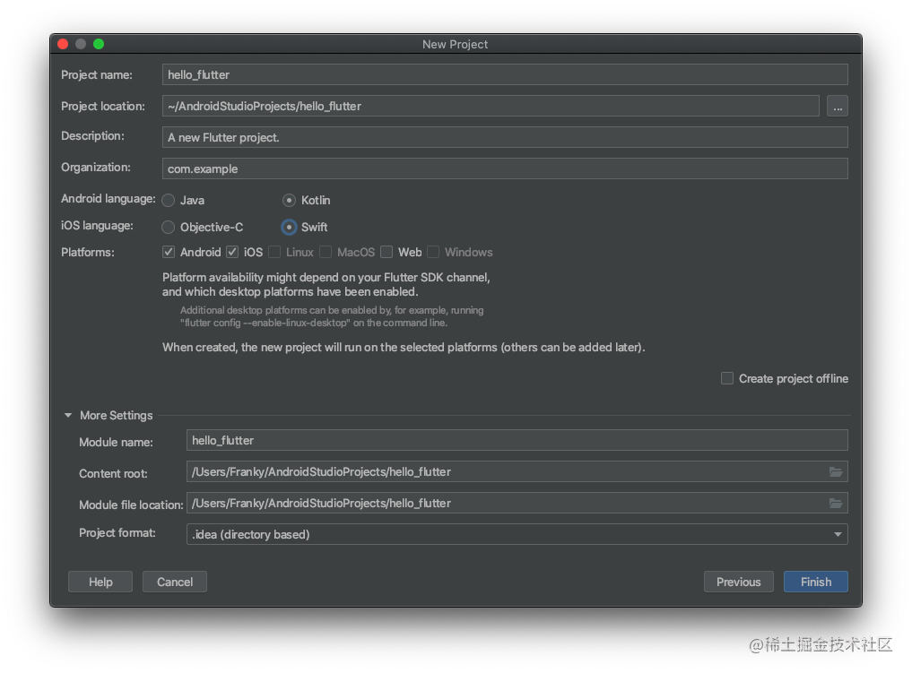

点击 Finish 之后就可以看到完整的工程目录了，flutter 工程的主入口，跟我们 iOS 项目一样有一个 main.m 文件，flutter 的是 main.dart 文件，可以看到这个文件里面已经有不少初始的代码了，今天是我们第一次接触 flutter 项目，就不要这里的代码，全部删掉，我们从第一行代码开始自己敲出来

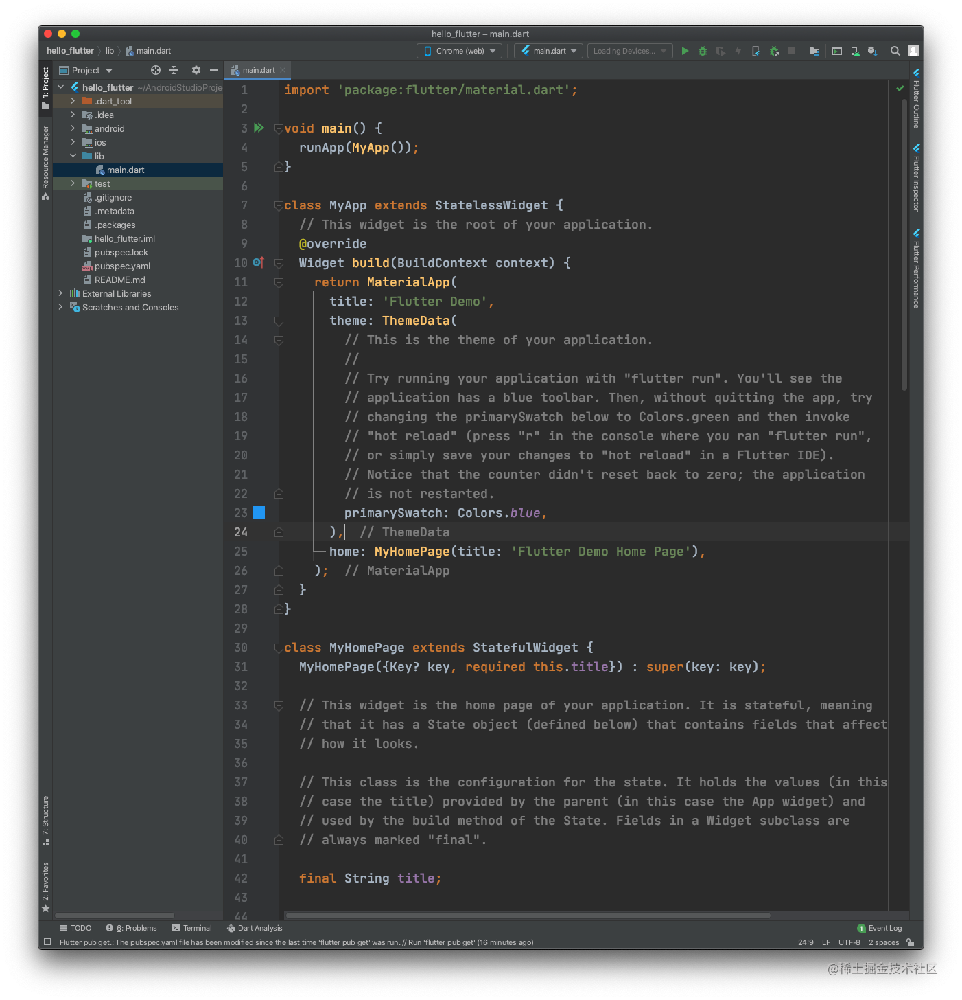

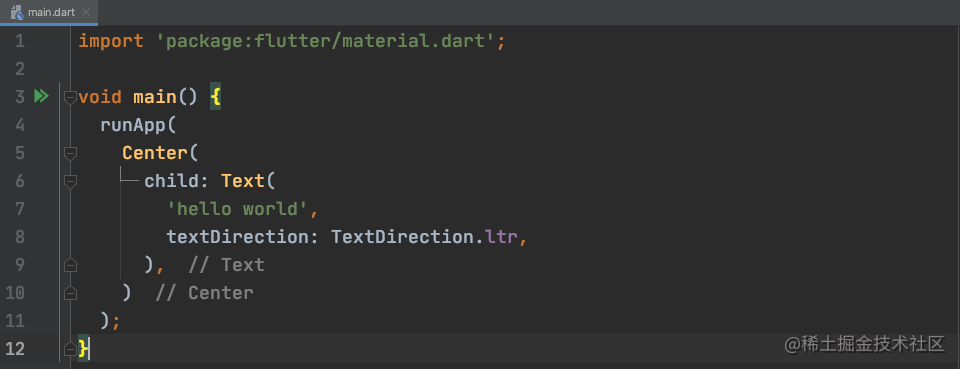

- 导入 material.dart 头文件(相当于 iOS 中 UIKit)
- 写一个 main() 函数作为主入口
- 调用 runAPP() 函数
- Center 类是用来布局的类，表示一个位置，child 属性表示他有的子控件的意思。Text 类就是我们文本类，有点儿我们 iOS 的 UILabel 的意思，Text 类的第一个参数就是具体的文本，省略了参数名，第二个参数 `textDirection` 表示文本显示方向，我们习惯的从左至右就是 `TextDirection.ltr`，left to right。像一些阿拉伯语言，希伯来语的文字就是从右到左显示的，我这里试了一下 hello world 的方向并没有变化，可能还需要其他设置吧...<br>

运行之后 iPhone 显示如下：

<div align=center>

</div>

# 自定义 Widget

flutter 里面的 Widget 类叫作小部件，是 flutter 里面经常用到的，它分为有状态的 Stateful 和 Stateless 无状态的。其中无状态的比较简单，我们先自定义一个类 CustomWidget 继承自 StatelessWidget。我们自定义的 Widget 想要显示到屏幕上需要实现一个 build 的函数，系统会调用这个函数来渲染我们想要显示到屏幕上的内容

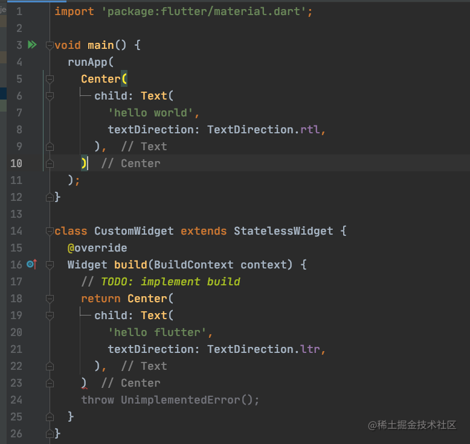

这个时候，如何将我们的 hello flutter 显示到屏幕呢，可以看到 runApp 函数里面有一个 Center 类，我们 CustomWidget 类的 build 方法也是返回的一个 Center 类，所以可以直接将我们 CustomWidget 初始化给 runApp 作参数

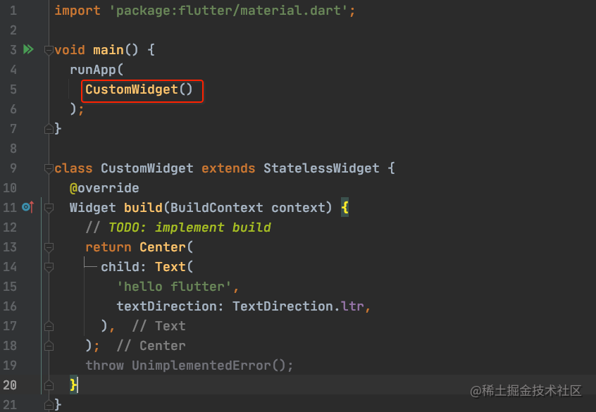

有些时候，我们发现 hot reload 无法更新界面，可以使用 hot restart，如果 hot restart 还是无法更新界面，那就需要重新运行一下就可以了。此时我们发现 main() 函数里面就只有一句调用 runApp() 代码，在 Dart 语言中，函数定义如果只有一句代码，那么可以省略成如下箭头形式

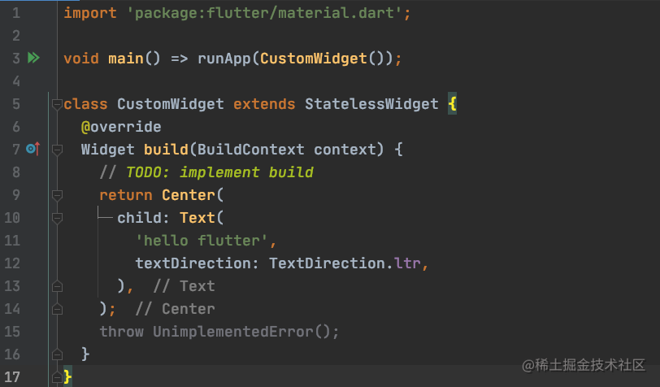

# 设置文字样式 style

按住 command 再用鼠标左键点击 Text 类，就会跳到一个 text.dart 文件，会看到一个 this.style 属性，再次按住 command 点击，会来到 style 的声明部分：

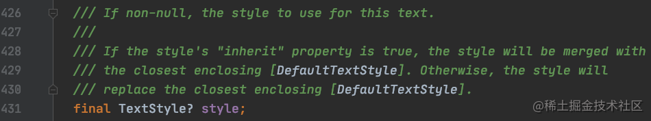

这里的 final 表示不可变，常量的意思，类似于 Swift 里面的 let。可以看到 style 是一个 TextStyle 类型，查看 TextStyle 类，会发现里面很多的属性，比如 color，backgroundColor，fontSize，fontWeight...这些都是很熟悉的属性,接下来我们设置一下 hello flutter 的一些文字样式

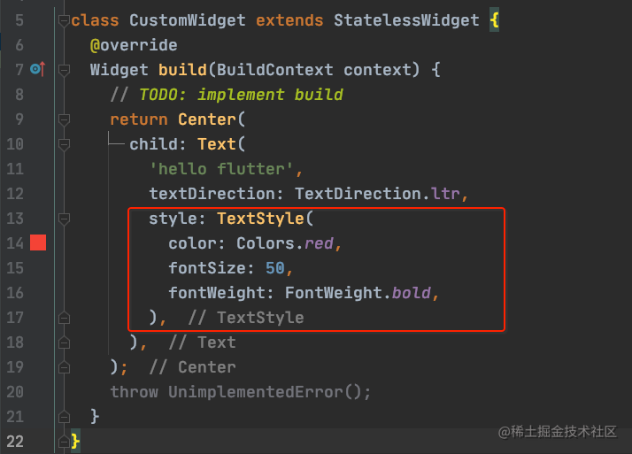

使用 Android Studio 快捷键 command + \ 查看界面

<div align=center>
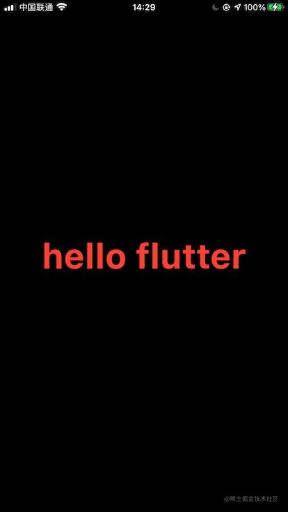
</div>

# Material App

在 flutter 提供的头文件 material.dart 中，提供了一个快速构建 APP 的类型 MaterialApp，我们可以使用它来快速构建一个 APP 的基础框架。<br>

我们先新建一个App类来写我们的代码

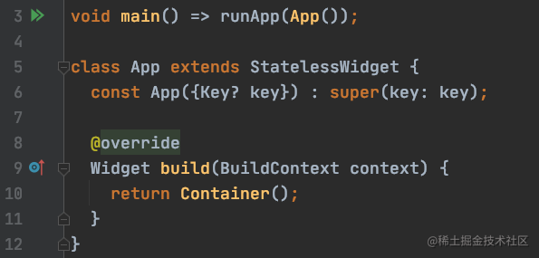<br>

然后我们在 App 的 build 方法中，返回一个 MaterialApp 类，如果 MaterialApp 不传入任何参数的话，运行后会发现APP整个屏幕变成红色，并且显示了一行文字，意思是出错了之类的，说明我们的 MaterialApp 应该是需要传入一个必要的参数的。

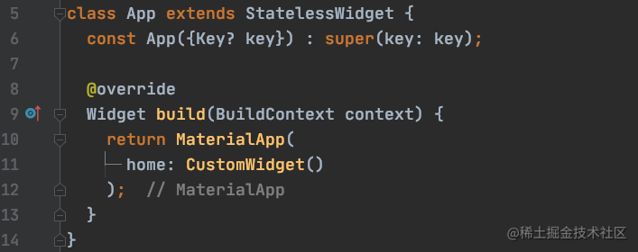

没错就像我们 iOS 的 APP 同样需要一个 rootViewController 一样，MaterialApp 函数需要一个 home 参数，home 参数可以传一个 Widget 类，如果传入我们刚刚写的 CustomWidget 类，运行后发现有了一点不一样的地方

<div align=center>
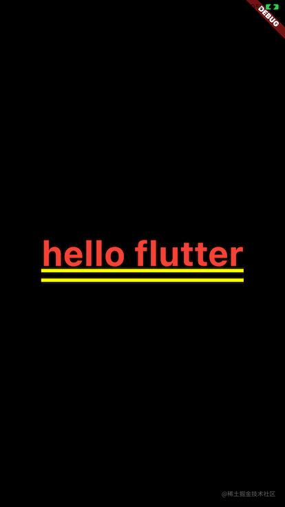
</div>

右上角有一个 debug 的图标，hello flutter 下面也出现了两条横线。

flutter 还提供了一个 Scaffold 的类，这个类翻译过来叫作脚手架，有点像是我们 iOS 中的一些基础控制器(比如 UITabBarController，UINavigationController)的封装。我们来使用一下这个类，这个 Scaffold 类有一个 appBar 的属性，这个属性就跟我们的 UINavigationController 的 UINavigationBar 一样，appBar 是一个 AppBar 类型，它的 title 属性可以传入一个 Widget，我们传入一个 Text 类试试看。Scaffold 类除了 appBar 属性，还有一个 body 属性表示的内容，把这个 body 设置为我们刚刚的 CustomWidget，看看是什么效果，代码如下：

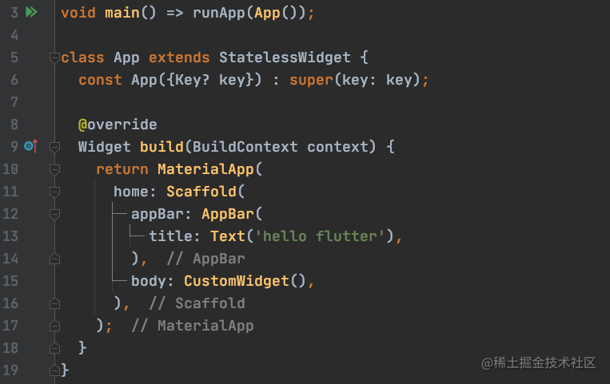

APP上显示效果：

<div align=center>
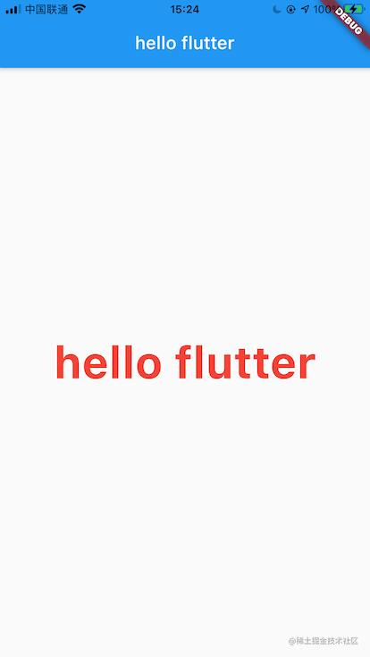
</div>

这个时候，是不是发现像那么回事了

MaterialApp 还有一个 theme 的属性，这个属性用了配置 app 的主题，设置一下主题颜色代码如下：

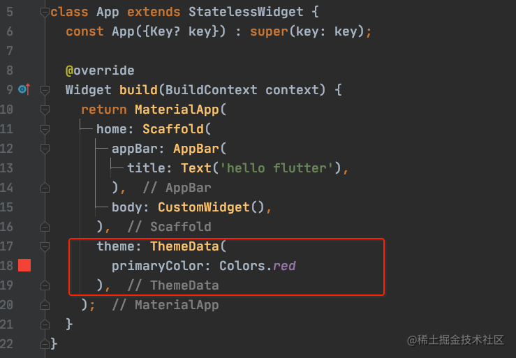

APP上显示效果：

<div align=center>
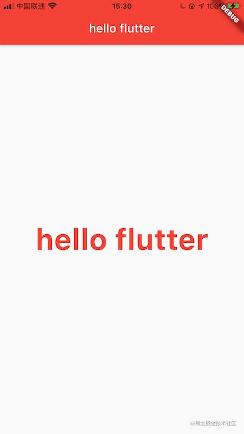
</div>

# 初探 ListView

在探索 ListView 之前，我们先把模型实现一下，我们这里展示的一组关于汽车的图片和名字，就定义一个 Car 类，我们新建一个 car 文件用来存放我们的模型代码，代码如下：

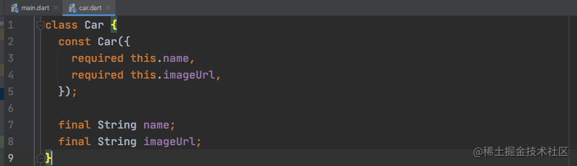

再定义一个数组，用来存放一组汽车模型，我这里放了一组网络图片，你可以直接使用，也可以自己在网上找几张图片，填入模型数组中

``` dart
final List<Car> cars = [
  Car(
    name: '保时捷918 Spyder',
    imageUrl:
    'https://upload-images.jianshu.io/upload_images/2990730-7d8be6ebc4c7c95b.png?imageMogr2/auto-orient/strip%7CimageView2/2/w/1240',
  ),
  Car(
    name: '兰博基尼Aventador',
    imageUrl:
    'https://upload-images.jianshu.io/upload_images/2990730-e3bfd824f30afaac?imageMogr2/auto-orient/strip%7CimageView2/2/w/1240',
  ),
  Car(
    name: '法拉利Enzo',
    imageUrl:
    'https://upload-images.jianshu.io/upload_images/2990730-a1d64cf5da2d9d99?imageMogr2/auto-orient/strip%7CimageView2/2/w/1240',
  ),
  Car(
    name: 'Zenvo ST1',
    imageUrl:
    'https://upload-images.jianshu.io/upload_images/2990730-bf883b46690f93ce?imageMogr2/auto-orient/strip%7CimageView2/2/w/1240',
  ),
  Car(
    name: '迈凯伦F1',
    imageUrl:
    'https://upload-images.jianshu.io/upload_images/2990730-5a7b5550a19b8342?imageMogr2/auto-orient/strip%7CimageView2/2/w/1240',
  ),
  Car(
    name: '萨林S7',
    imageUrl:
    'https://upload-images.jianshu.io/upload_images/2990730-2e128d18144ad5b8?imageMogr2/auto-orient/strip%7CimageView2/2/w/1240',
  ),
  Car(
    name: '科尼赛克CCR',
    imageUrl:
    'https://upload-images.jianshu.io/upload_images/2990730-01ced8f6f95219ec?imageMogr2/auto-orient/strip%7CimageView2/2/w/1240',
  ),
  Car(
    name: '布加迪Chiron',
    imageUrl:
    'https://upload-images.jianshu.io/upload_images/2990730-7fc8359eb61adac0?imageMogr2/auto-orient/strip%7CimageView2/2/w/1240',
  ),
  Car(
    name: '轩尼诗Venom GT',
    imageUrl:
    'https://upload-images.jianshu.io/upload_images/2990730-d332bf510d61bbc2.png?imageMogr2/auto-orient/strip%7CimageView2/2/w/1240',
  ),
  Car(
    name: '西贝尔Tuatara',
    imageUrl:
    'https://upload-images.jianshu.io/upload_images/2990730-3dd9a70b25ae6bc9?imageMogr2/auto-orient/strip%7CimageView2/2/w/1240',
  )
];
```

然后回到 main.dart 文件新建一个 Home 类，用来存放我们 ListView 相关代码,和 Xcode 一样 Android Studio 同样有代码块功能，直接输入 stl 就会出现提示，回车就会生成 StatelessWidget 类相关代码。我们将 Scaffold 相关的代码挪到 Home 中来。

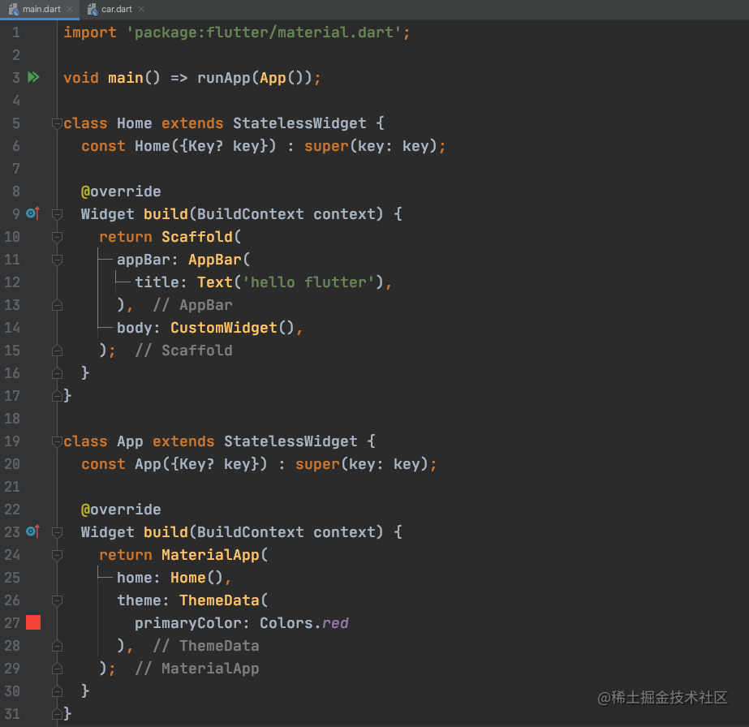

接下来就是正式开始使用 ListView 了，ListView 跟其他一般的类不太一样，它的初始化需要调用 build 方法，并且传入两个参数，一个是 itemCount，一个是 itemBuilder，有点类似我们 UITableView 的 cellForRow 方法，只不过我们 UITableView 使用的是代理的设计，而这里的 ListView 使用的代码块回调的设计。

这里说一个 Android Studio 的比 Xcode 好用的地方，如图的 itemCount 使用了 cars.length 但是提示 cars 报错，是因为没有导入 car.dart 文件，给了个小红灯泡。这个时候，我们光标移动到 Car 类上，然后使用 option + 回车 会弹出一个菜单，再按一次回车就可以导入我们的 car.dart 文件了

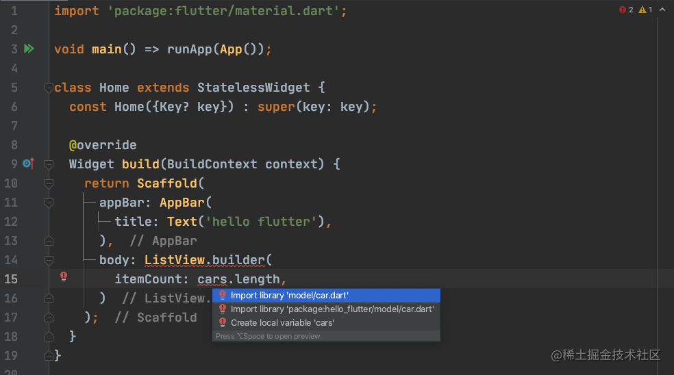

itemBuilder 属性就是一个代码块，用来配置每个 item 的样式，我们可以先统一返回一个 Text 文本看看效果。

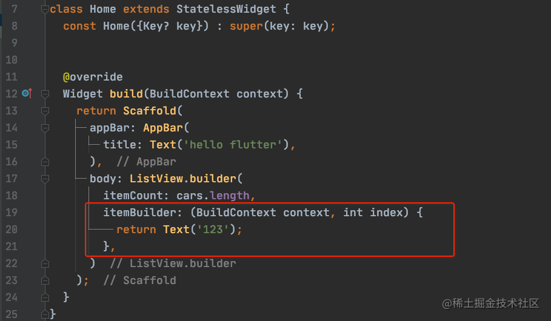

显示效果就是类似于 tableView 一样的一行行的文本

<div align=center>
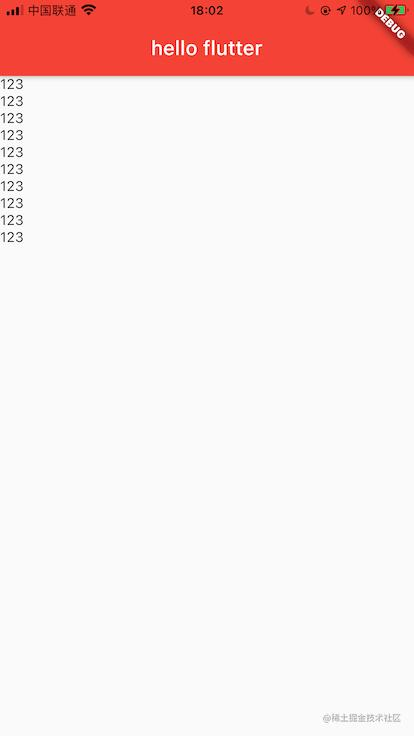
</div>

接下来介绍一个类似于 UIView 的容器类 Container，它跟 UIView 类似，可以设置一些颜色，间距，子控件之类的，我们来试一下，将 Text 改为 Container，child 属性就是子控件的意思，再给 child 设置为 Text，文本就是 cars 里面的 name，代码如下：

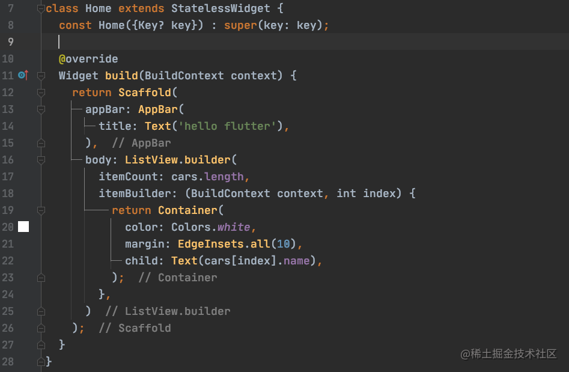

再看一下显示效果

<div align=center>
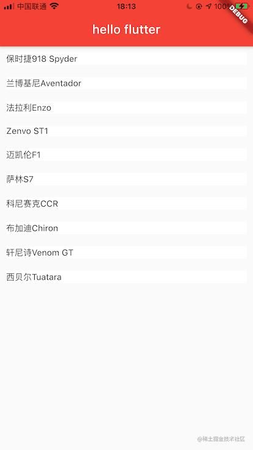
</div>

那么如果我们现在想要显示图片加文字的话应该怎么做呢？这里再介绍一个 Column 类,和前面介绍 Center 类类似，同样是属于布局的类，Column 表示上下的布局，因为我们想把图片和文字上下摆放，所以需要用到 Column 这个类。然后关于图片的显示，这里我们先不讲怎么去网络请求，而是直接使用 Image 类提供的一个方法去加载网络图片，代码如图：

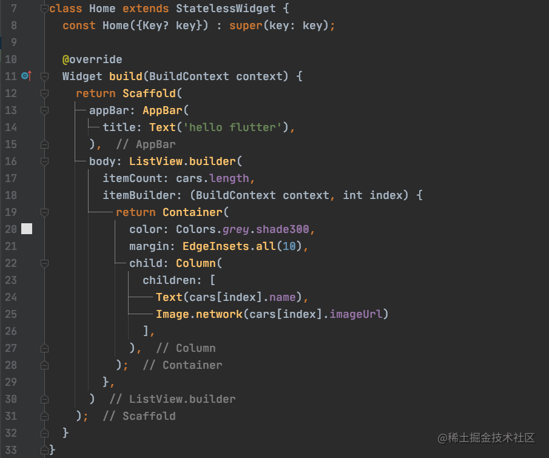

显示效果如图：

<div align=center>
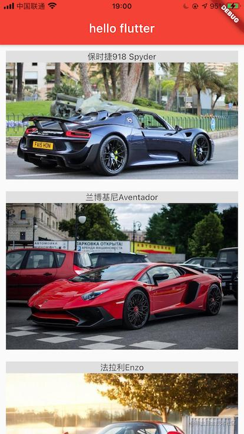
</div>

这个时候，你应该也猜到了，如果挪动 children 里面 Text 和 Image 和顺序，会发现图片和文字的顺序就交换了，是不是很容易理解。如果想要调整图片和文字之间的间距怎么调呢，使用 SizedBox 类，传一个 height 就可以调整间距了，也可以继续使用 Container，代码如下：

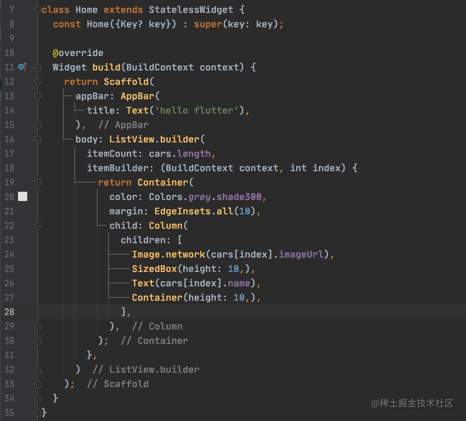

如果觉得 itemBuilder 的代码太长，也可以将它的代码封装到一个方法里面，例如我这里使用 iOS 中的 _cellForRow 来命名这个方法。使用下划线的意义的是表示这是一个私有方法。

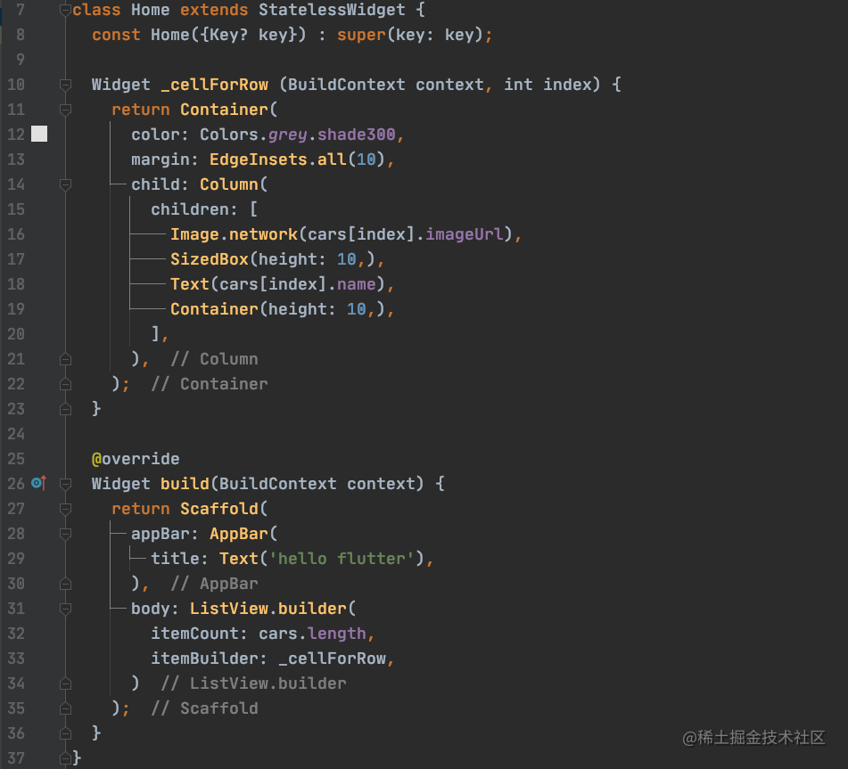

APP 右上角会发现有一个 debug 图标，这个图标的显示在 MaterialApp 类里面有一个属性可以控制显示隐藏。

`debugShowCheckedModeBanner: false`

# 常用 Widget 介绍

在介绍常用 Widget 之前，我们想把刚刚写的 ListView 相关代码，封装到一个文件内，这样方便以后我们回头学习。listView_demo 代码如下：

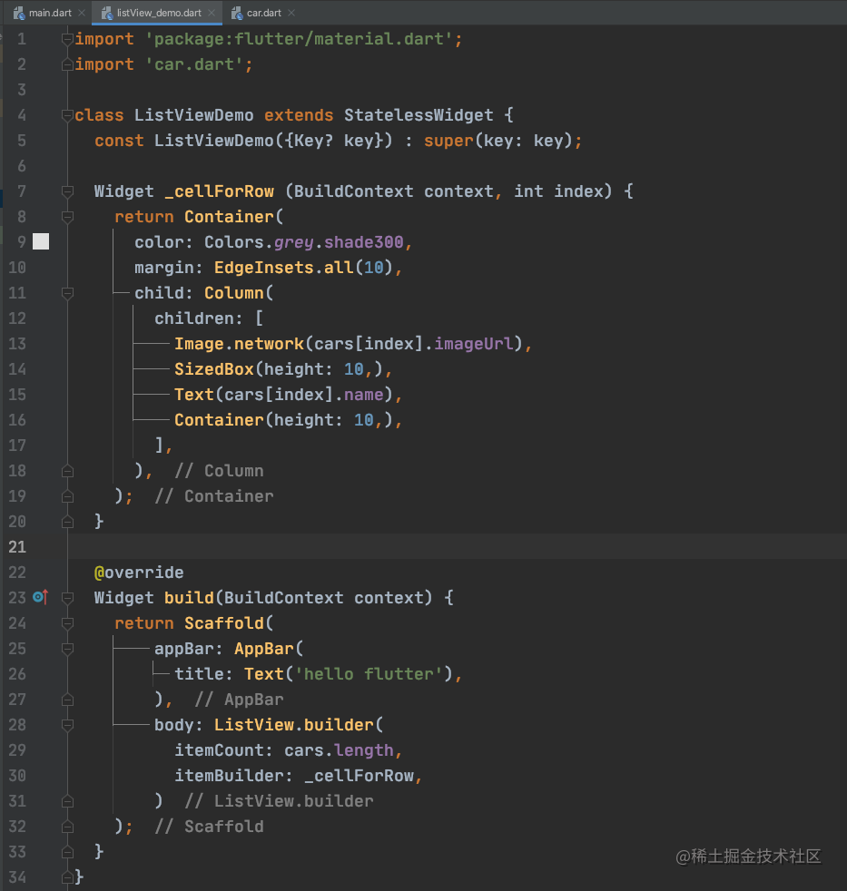

这个时候，main.dart 文件内的 Home 类的 build 方法里，返回我们的 ListViewDemo 初始化方法就行了。

然后再新建一个新的 base_widget 文件，用来存放我们将要介绍的基础 Widget 代码。

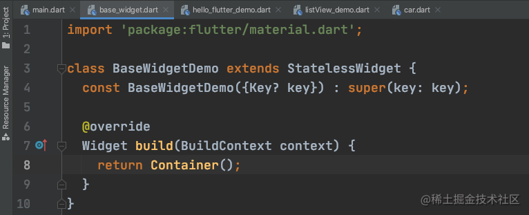

可以在 main.dart 文件中直接使用我的 BaseWidgetDemo 初始化方法，这样我们就不需要再去 main.dart 文件修改代码了。每介绍一个新 Widget 直接修改 BaseWidgetDemo 的 build 方法返回值为我们的自定义类 xxxDemo() 就好了

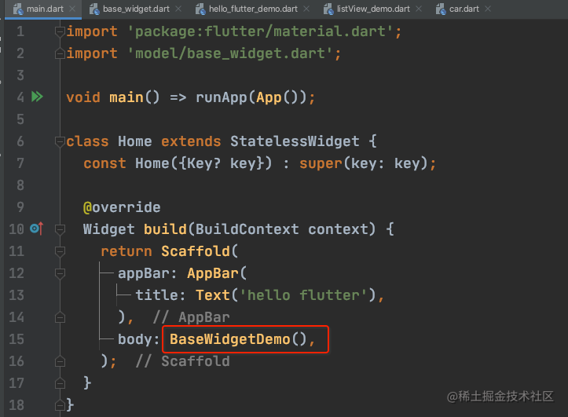

第一个介绍是 Text

## Text

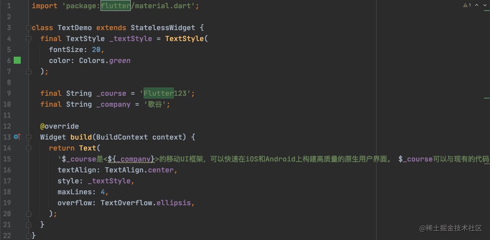

Text 我们一开始讲过了，这里就再讲一点关于字符串相关的，如果需要拼接字符串可以使用 \$ 符号，如果字符串中有特殊符号，那就使用 ${}。其他 Text 常用的属性，跟我们 iOS 中都差不太多，需要注意的是 Text 的样式，是在 style 里面设置的。下面看一下 APP 显示的效果

<div align=center>
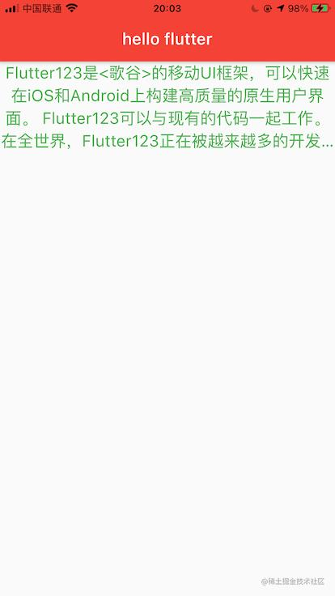
</div>

## RichText

RichText 就是富文本，它的 text 属性可以传一个 TextSpan 的类，这个 TextSpan 类可以设置 text 文本，设置 style 样式，还可以设置 children 子控件，这样就可以无限加花样拼接各种字符串在一起，代码如下

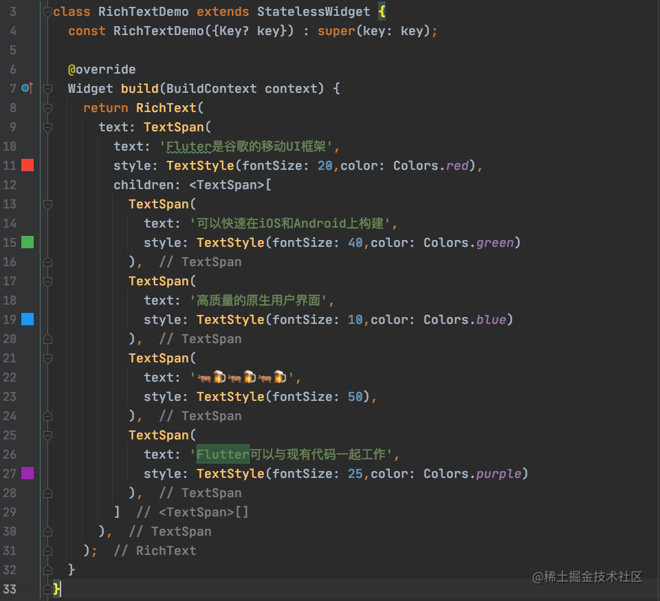

APP上显示的效果：

<div align=center>
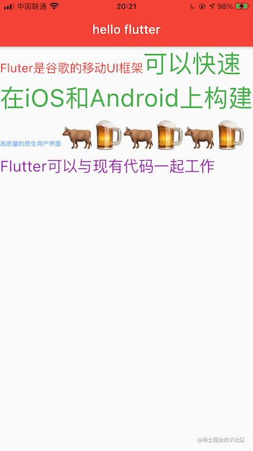
</div>

## Container，Row

Container 是个容器，Row 是个用于布局的类，跟 Column，Center 类似，根据代码查看一下 APP 的显示，就能大概明白意思了，代码如下：

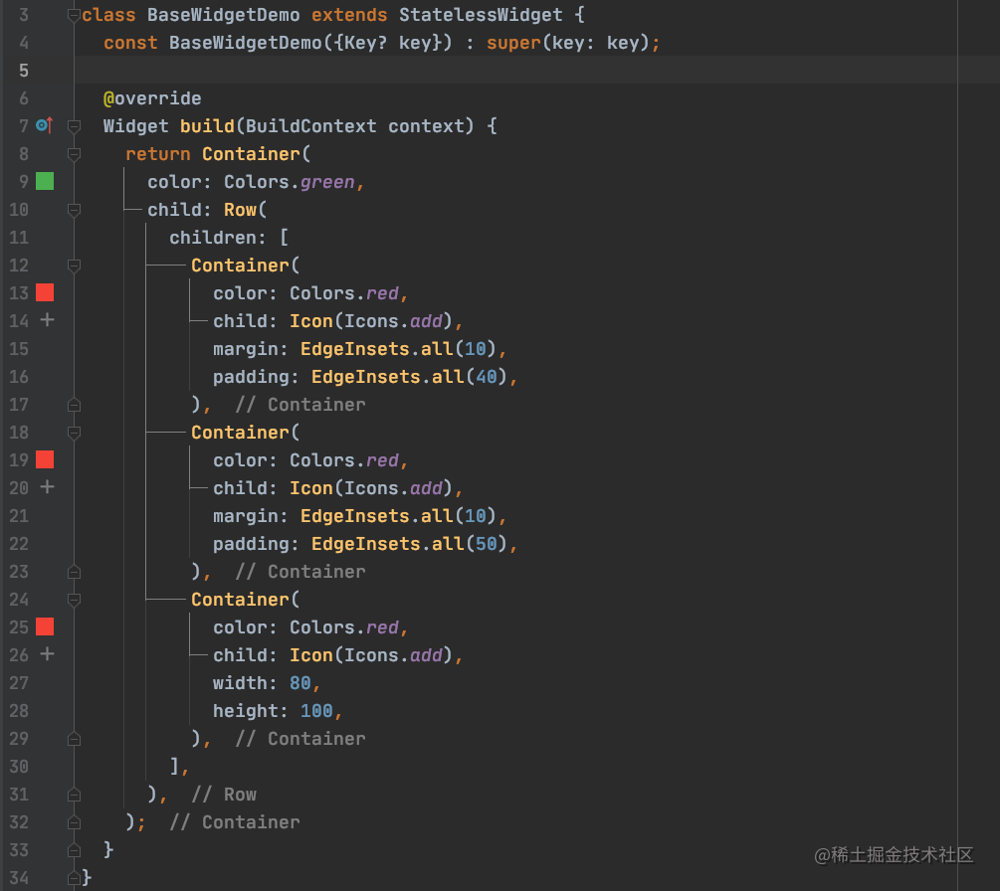

APP显示如下：

<div align=center>

</div>

# 总结

今天介绍了 Flutter 里面的许多的基础 Widget，有用于布局的 Center，Row，Column...有用于显示文本的 Text，RichText，TextSpan...有列表展示 ListView，有基础架构 Scaffold，MaterialApp 类，虽然东西有点多，但基本还没有什么难以理解的内容


