上一篇文章我们已经完成首页聊天页面的导航条和列表展示，今天的任务是完成搜索 cell 的展示和点击之后的搜索页面的功能。

# 自定义 SearchCell

## 新建 search_cell.dart 文件

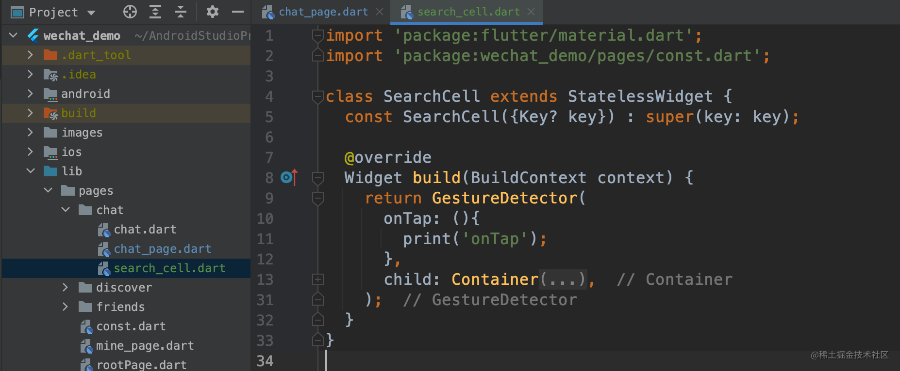

## 实现 SearchCell 代码

SearchCell 的话，因为仅仅只是展示，点击之后就进入搜索页了，应该来说是不需要状态的，所以用一个 StatelessWidget 就够了。然后布局的方式使用一个 Container 包含一个 Row，Row 里面包一个图片和文本就可以了。布局的方式其实多种多样，能实现就好了。完整代码如下：

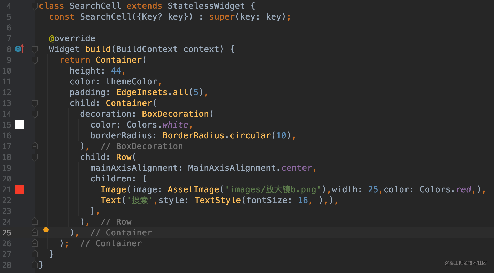

一个有意思的地方是，flutter 里面的 Image 居然可以设置颜色，而且颜色是设置给图片的。比如我的放大镜图片原本是黑色的，设置红色之后，居然真的变红色了！！！

## 使用 SearchCell

SearchCell 的展示就算写完了，然后在 ChatPage.dart 中使用，我们把 ListView 的 itemBuilder 方法抽取出来，然后因为我们多加了一个 SearchCell，所以 itemCount 需要加 1，然后取 _chatList 数据的时候也要处理一下下标。

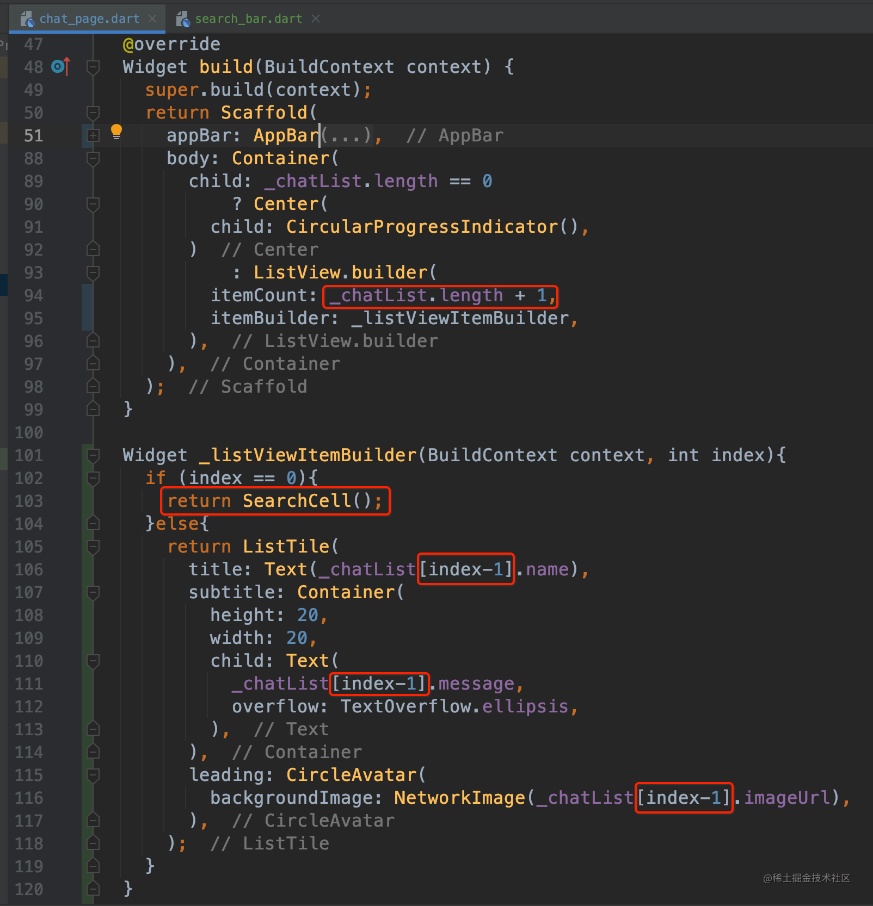

# 自定义 SearchPage

## 新建 search_page.dart 文件

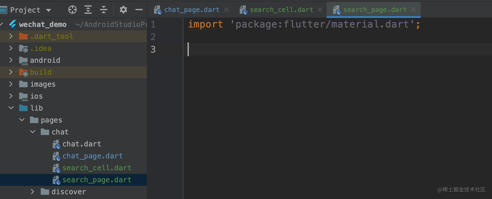

## 简单实现 SearchPage

SearchPage 作为一个页面，使用 StatelessWidget 肯定是无法胜任的，所以使用一个 StatefulWidget。而由于 AppBar 的样式和我们需要显示的效果图还是有差别的，所以这里我们不使用 Scaffold 提供的 AppBar 了。我们自定义一个 SearchBar，配合一个 ListView 来搭建基本的布局。这里面基本没有新鲜的东西，就简单贴一下代码：

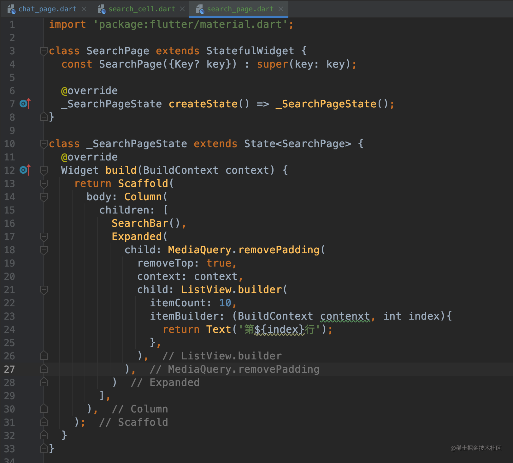

SearchBar 由于是在 SearchPage 中使用的，所以就直接定义在 SearchPage 中了，代码也是先简单定义如下：

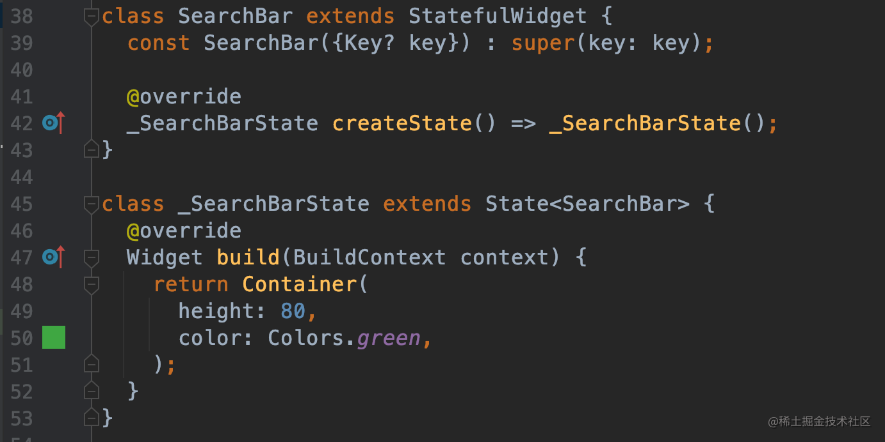

## 点击跳转到 SearchPage

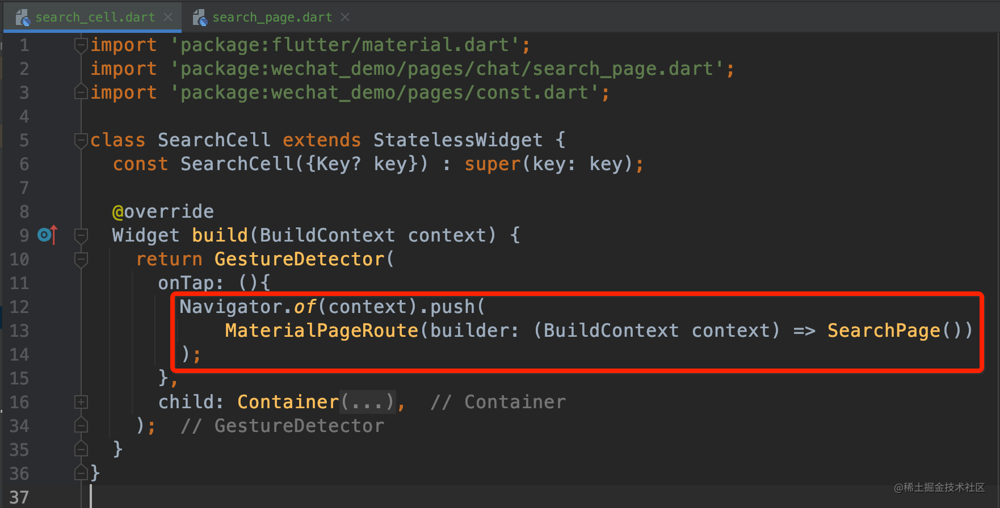

在搜索 cell 里面实现点击方法，然后跳转到 SearchPage，显示效果如图：

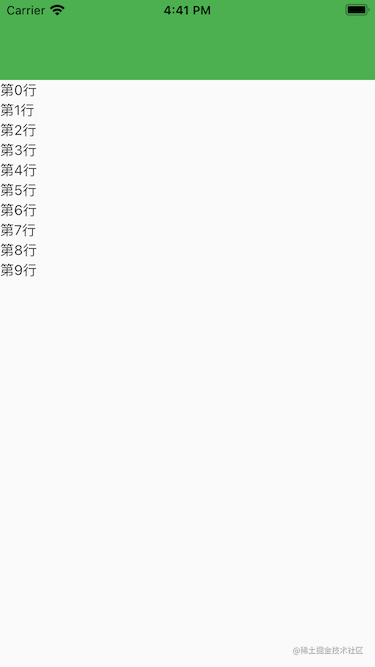

# 实现 SearchBar

## SearchBar 的布局

SearchBar 的布局，最外层分为上下两个部分，上面的部分是系统状态栏的高度。下面的部分就是显示搜索条的高度。而搜索条的布局，使用 Row 分隔为左右两个部分，左侧包含放大镜，文本输入框和删除图片。右侧就是一个返回上级页面的取消。这里主要提一下 flutter 中的文本框，跟 iOS 中 UITextField 真的很不一样，UITextField 中左侧的图标，右侧的删除，都是封装在内部的。而在 flutter 中，文本框 TextField 真的就只有文本框，没有其他的东西，都需要自己添加。完整代码如下：

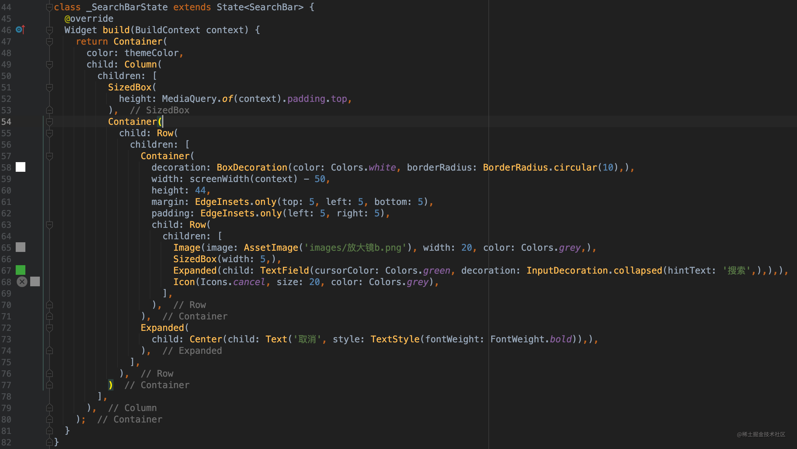

## SearchBar 事件处理

### 取消的处理

点击取消需要 pop 到上一个界面，给取消加一个 `GestureDetector` 实现 `onTap` 就好了。代码如下：

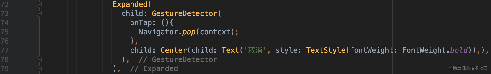

### 清除按钮功能实现

未输入文本的时候，不显示清除按钮。有输入文本的时候，显示清除按钮。点击清除按钮，清空文本内容并隐藏清除按钮。

使用一个bool值 `_showClear` 控制清除按钮的显示隐藏。代码如下：

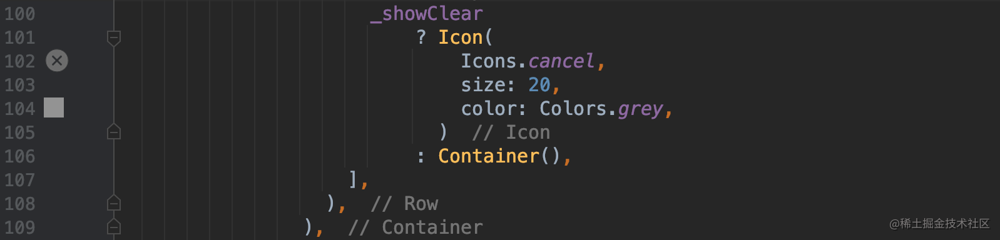

在文本变化的时候，修改 `_showClear` 值并刷新状态。文本的变化在TextField的 `onChanged` 属性就可以监听到。代码如下：

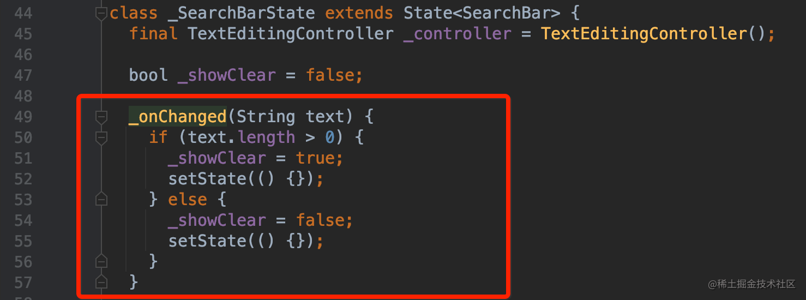

最后就是清除按钮的点击功能，由于需要清空 TextField 的文本内容，需要使用到 `TextEditingController`,给 TextField 的 `controller` 属性赋值，然后通过 `TextEditingController` 对象清除文本内容。文本清除之后并不会自动调用系统的 `onChanged` 方法，自己手动调用一下就好了。代码如下：

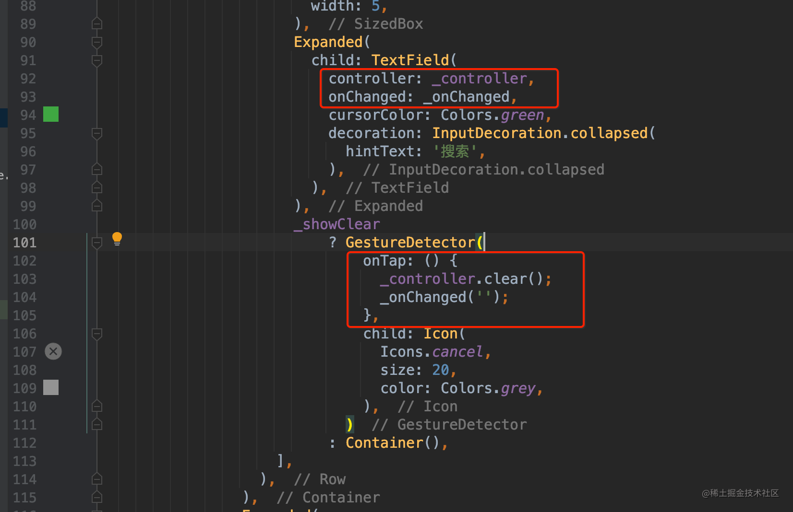

### SearchBar 回调文本框的内容

文本框的内容变化的时候，需要回调给 SearchBar 外部，这样我们才能在 SearchPage 页面进行搜索内容。使用一个回调作为参数就可以实现了。代码如下：

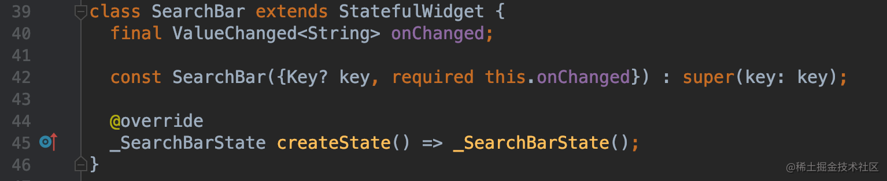

`onChanged` 是一个闭包属性，在初始化 SearchBar 的时候传入，在 TextField 的文本变化的时候调用闭包，并将文本作为参数回传给 SearchBar 外部。因为将 `onChanged` 作为了必传参数，所以编译器自然会在用到了 SearchBar 的地方报错。很容易找到报错的地方，加个参数就好了。

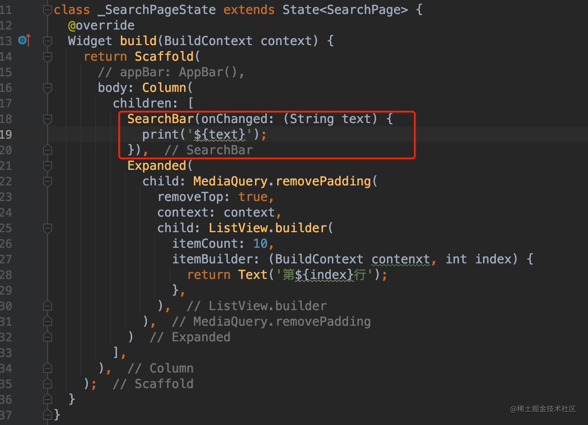

SearchBar 相关的代码就算差不多完成了，其实可以将 SearchBar 单独作为一个文件独立出来。接下来就是处理 SearchPage 了

# 实现 SearchPage

搜索页面的搜索功能，往细了说，可以搜索很多内容，我们这里只是简单的搜索名字，只要名字包含输入的内容，就将搜索结果展示出来。由于这里对中文名进行搜索的时候，能匹配到的数据比较少，所以这里已经将网络请求返回的名字由中文改为英文名字了。前面展示中文名字的截图就不做修改了。

## SearchPage 的搜索功能

### 添加 `datas` 数据源

要实现 SearchPage 的搜索功能，那么它首先必须要有数据源，很明显它的数据源是从首页来的。先定义一个 `datas`,作为必传参数，然后通过外部层层传递过来。

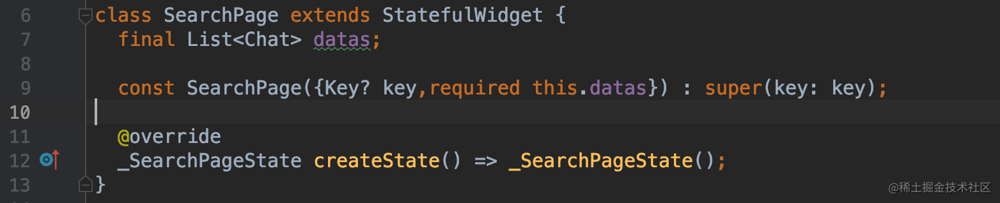

`datas` 定义好了以后，报红色错误的地方，就是需要传参数的地方，很方便，都不用我们自己去翻哪里需要加参数了。发现 SearchCell 里面需要传入数据源，同样的方式，在 SearchCell 里面定义 `datas`,然后在报错的地方处理。

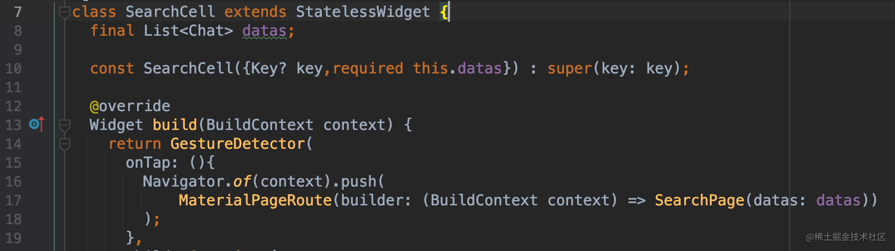

就这样子顺藤摸瓜，直到来到 chat_page 将数据源传入就完成了

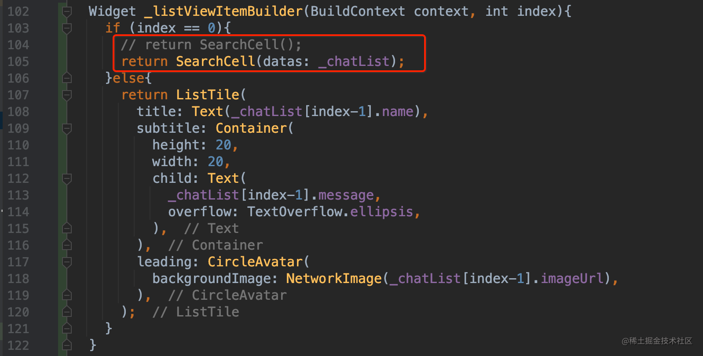

### SearchPage 自己的数据源

SearchPage 需要展示搜索之后的结果，所以自己定义一个数组用来存放搜索的结果。并且暂时先使用 Text 做一个最简单的展示。代码如下：

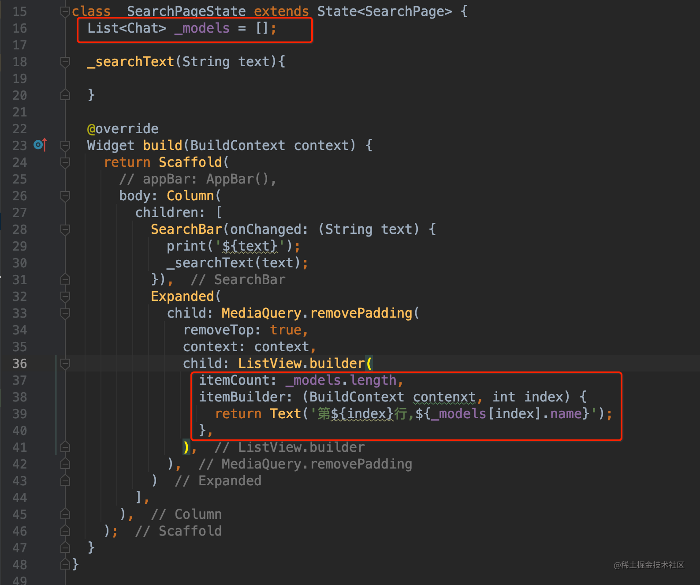

### 实现搜索功能并展示数据

搜索的功能实现很简单，就是判断数据源里面的名字是否包含输入的文本，如果包含就全部添加并展示。
代码如下：

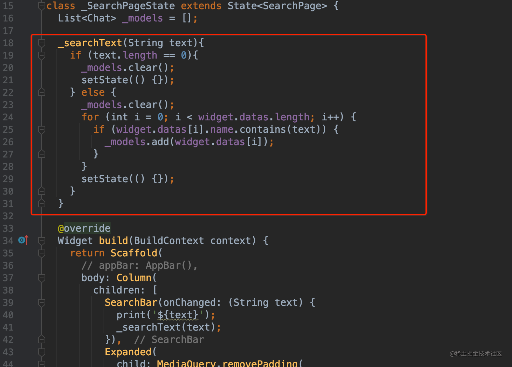

APP 上如图，我输入 son，显示结果：

## SearchPage 的搜索结果列表展示

SearchPage 的搜索结果列表展示的数据样式，应该和首页是类似的。所以可以直接使用首页的布局。代码如下：

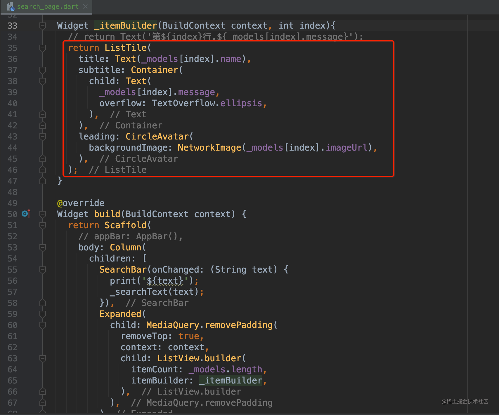

## SearchPage 高亮显示搜到的结果

这里的思路是，高亮显示搜到的结果，那么普通的文本肯定是不行了，必须是富文本。如何找到搜索的关键字在文本中的位置呢，这个不用我们考虑了。flutter 中对字符串有一个分隔方法 `split`,这个方法跟 iOS 中的字符串的 `componentsSeparatedByString:` 方法类似，根据传入的参数来分隔字符串。这里贴一下 iOS 的代码：

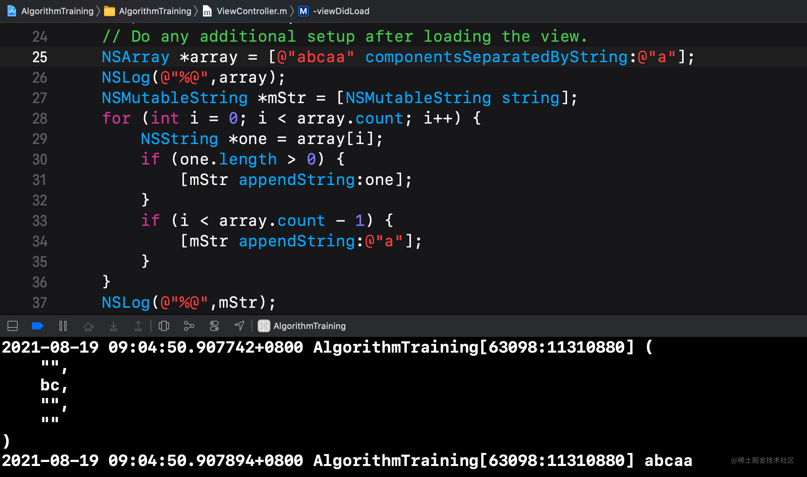

（还是Xcode看着顺眼啊）我们将字符串 `abcaa` 以字符 `a` 分组，再将分组的结果拼接回原来的字符串。为什么要这么操作？因为重新拼接新字符串的时候，我们就可以处理富文本字符串了。现在回到 flutter 中来，flutter 中拼接的富文本的方式太方便了，RichText 花样拼接 TextSpan 这个我们在前面也讲过了。

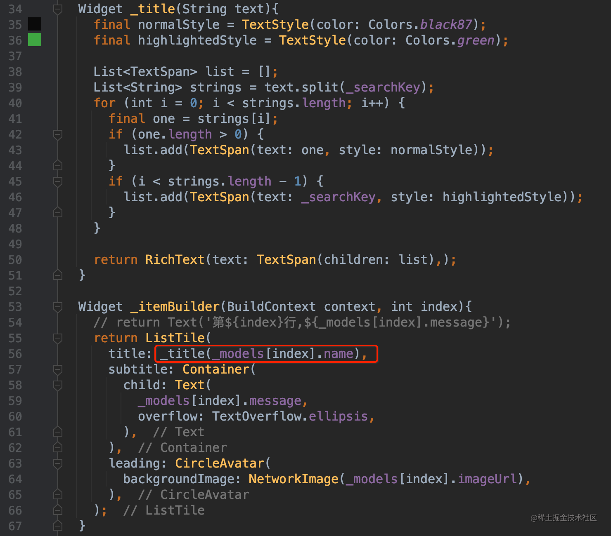

`_searchKey` 就是我们输入的文本，在 SearchPage 中声明属性，在 SearchBar 的回调中赋值就好了。

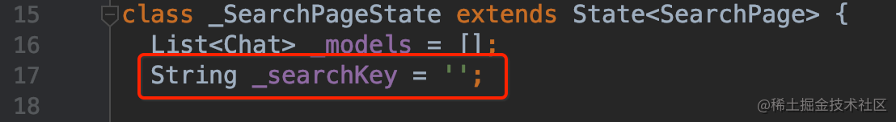

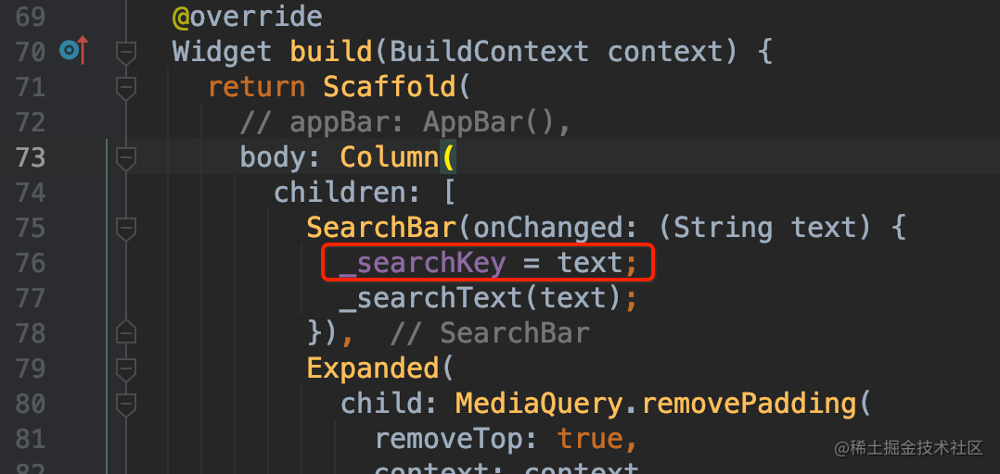

现在测试一下，输入 son，APP 显示如图：

## 滚动列表叫回键盘

ListView 的滚动，我们在前面已经说过一次，需要将 ListView 包在 `NotificationListener` 里面。然后叫回键盘的代码 `FocusScope.of(context).requestFocus(FocusNode());` 这个记住就好了，代码如下：

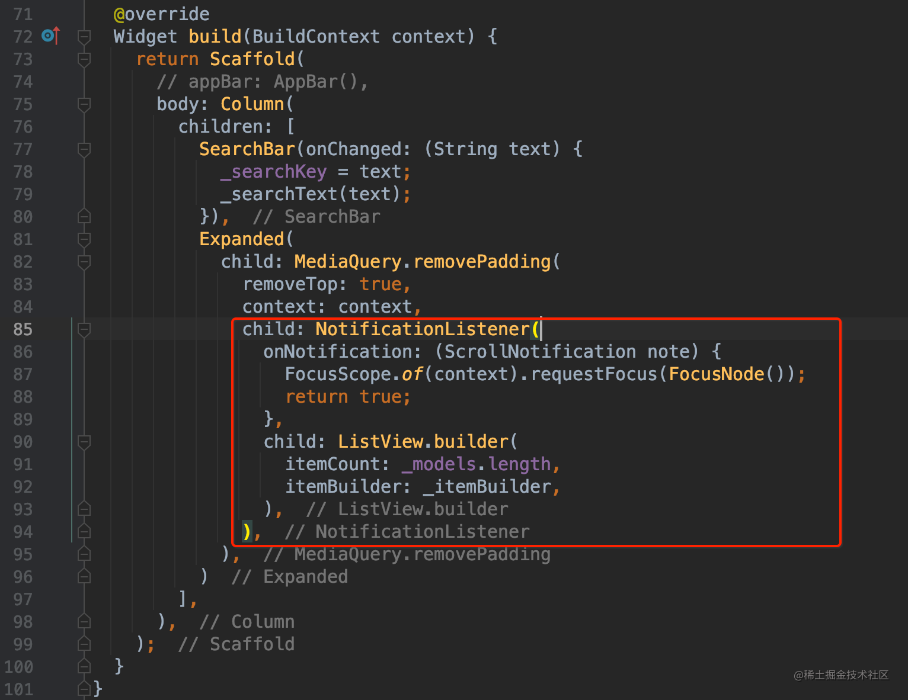

# 总结

到这里我们的 flutter 仿微信 Demo 功能就差不多完了，还剩最后一篇就是介绍 flutter 和原生混合开发的一些东西。这个也是实际项目中应该经常会遇到的情况。其实写到这里会发现很多东西和原生都是相通的或者类似的。除了新的语言 Dart 不是很熟悉之外，其他很多地方比如很多属性的名字，颜色，闭包，都能够看到原生的影子。flutter 创造者们也不会闭门造车，都会去借鉴原生里面的东西。

