# 搭建项目主框架

## 新建微信聊天，通讯录，发现，我的四个文件

上一篇文章最后我们已经将 APP 的 TabBar 和四个对应的子视图搭建好了，但是每一个子视图里面肯定会有大量的代码，全部放到 rootPage 文件里面肯定是不合理的。所以我们为每个子视图创建单独的文件，并将代码分散到每个文件中。

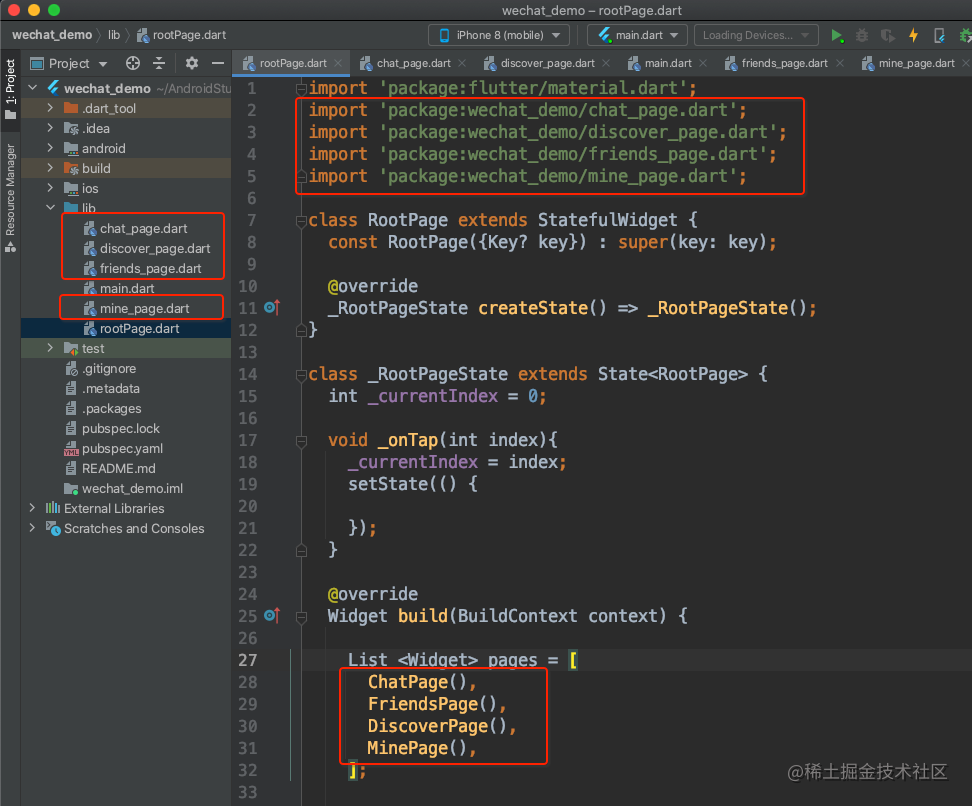

比如聊天页面，返回自己的 Scaffold：

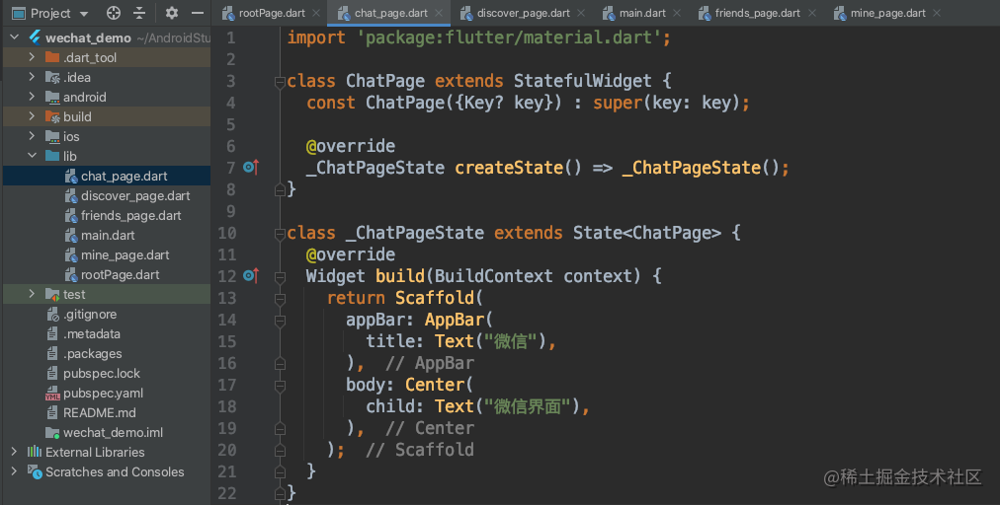

现在我们点击切换一下 tabBar 的 item，发现会有一些高亮的颜色，以及一个水波纹效果，这些都是 MaterialApp 类的 theme 提供的。如果想去掉这些效果，要来到 main.dart 文件，设置以下两个属性：

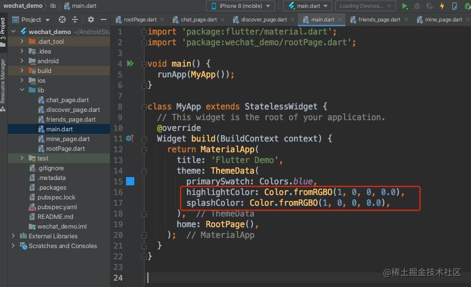

仔细查看点击 item 的时候，文字被放大了。这个是 bottomNavigationBar 的属性 `selectedFontSize` 决定的，将它设置为 12.0 之后，就不会变大了，在 rootPage.dart 文件里面：

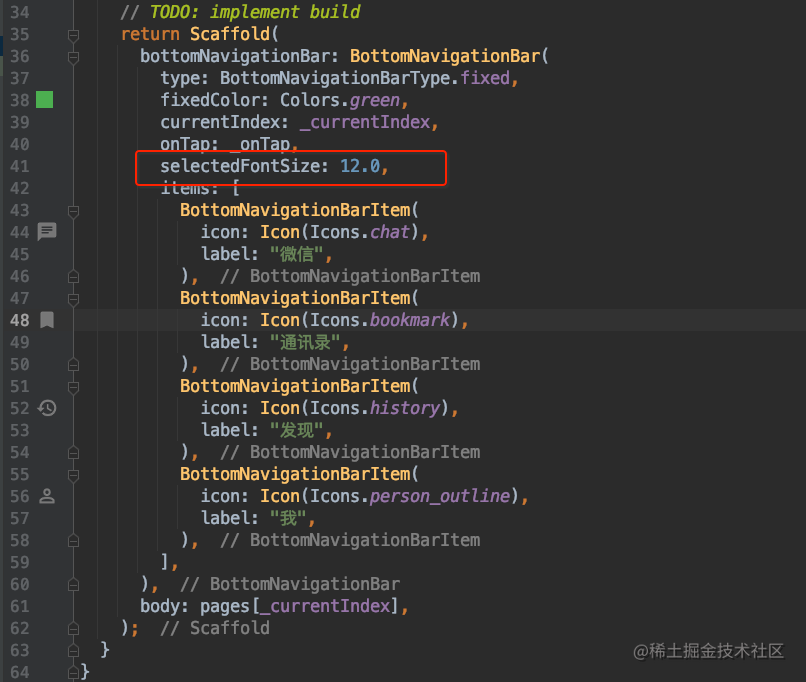

# 本地资源文件

## 配置 Android 的启动图和应用图标

Android 和 iOS 的资源文件，比如 APP 的图标，启动图，需要到相应的项目文件里面去配置。我们大家都是 iOS 开发者了，这里就只说一下 Android 的图标和启动图如何配置。有需要图片资源的同学可以前往 [下载](https://github.com/masterKing/wechatDemo)

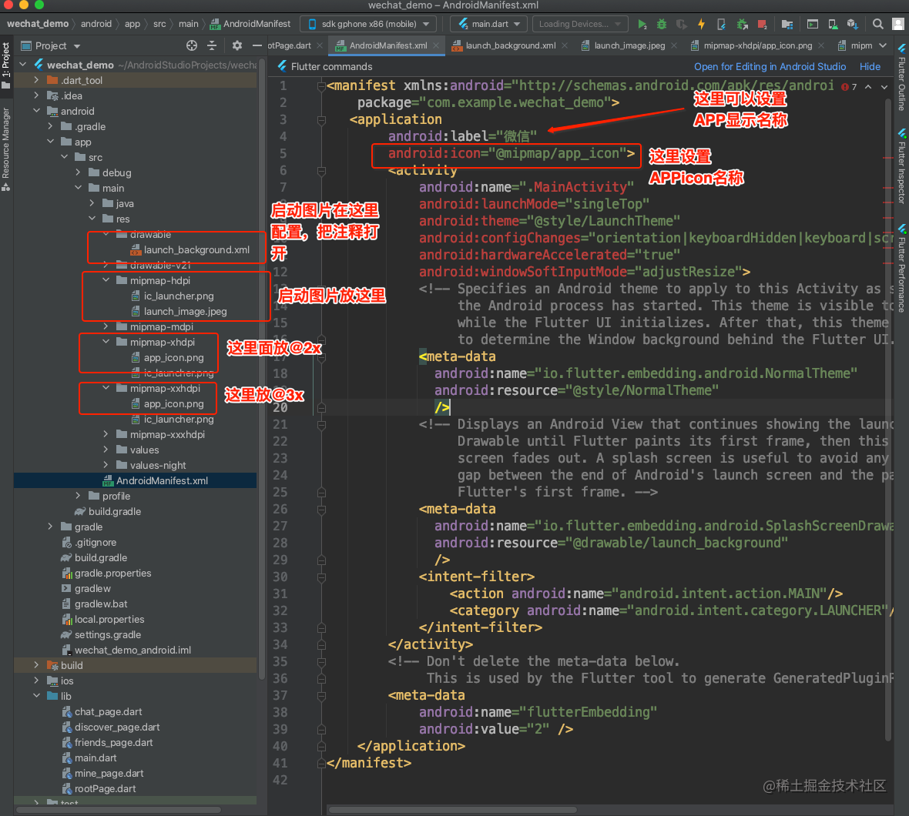

在安卓模拟器上运行起来之后，会发现安卓的标题不是在中间

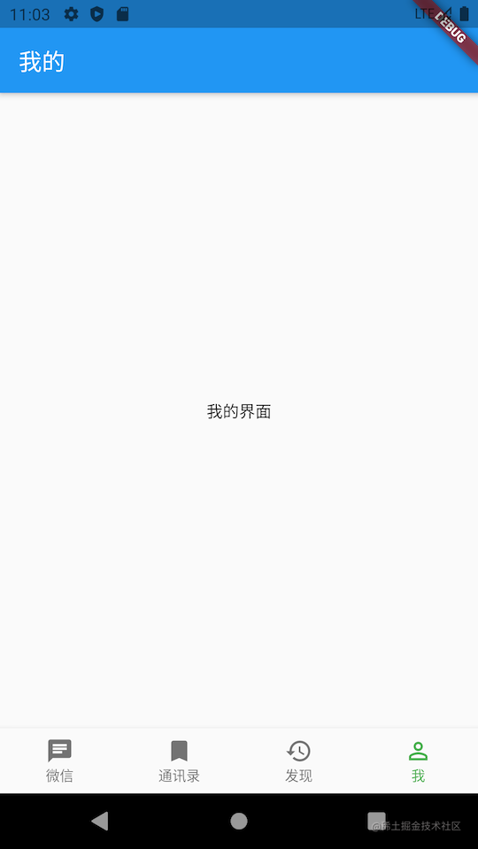

这里可以通过 AppBar 的一个属性，来调整让它变成中间显示

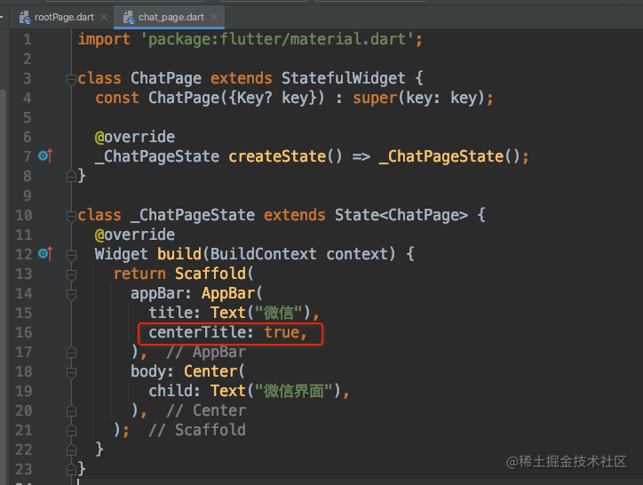

## 配置公共的资源

如果是两端都需要的资源，比如我们 APP 的微信，通讯录，发现和我的图标。需要在当前 flutter 项目中配置了。

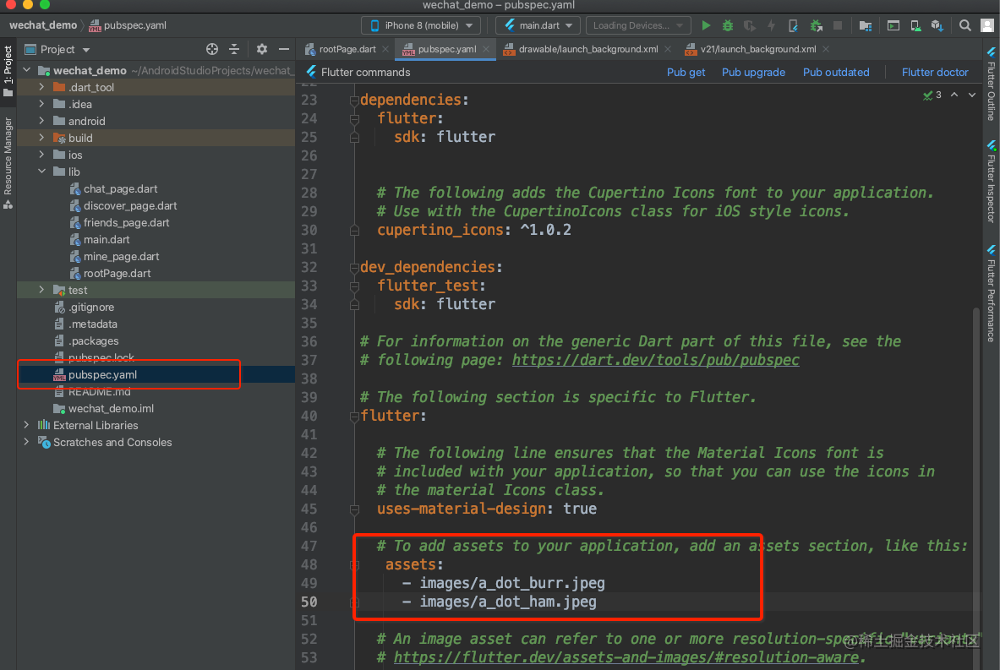

pubspec.yaml 文件是我们 flutter 项目的配置文件。文件内 assets 和下面的几行表示需要的图片路径，可以在 flutter 项目的根目录下创建一个 images 的目录，里面存放所有当前 flutter 需要用的图片。然后还需要手动导入一张一张图片...这点就比较恶心人了...更恶心人的是，这个 yaml 文件的格式，包括位置都不能错，比如刚刚放开注释的时候，如果你使用的是 command + / 快捷键，那么你就得好好挪动下位置了，位置不对编译不通过。

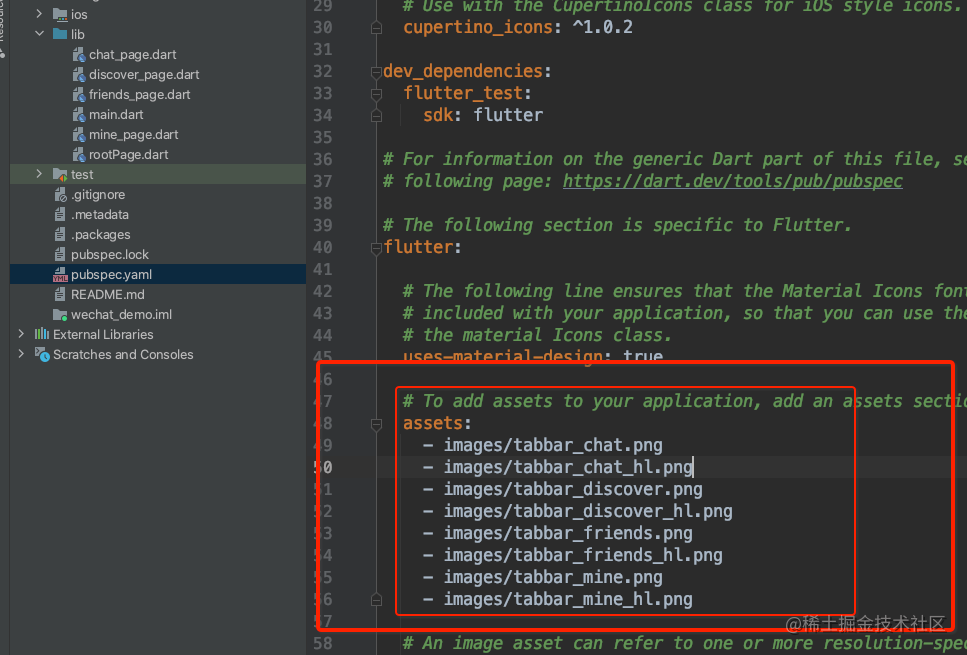

# 实现发现页

<div align=center>
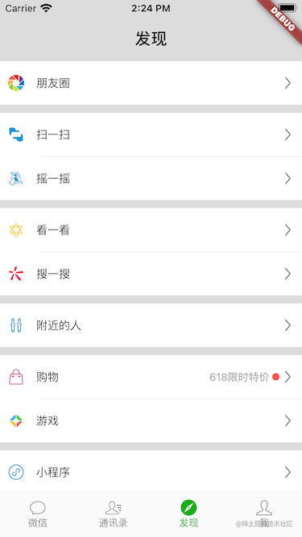
</div>

## 设置APP启动默认展示发现页面

这个方便我们开发调试这个发现页面，我们开发原生 APP 的时候也经常会这么干。直接将 rootPage.dart 里的 _currentIndex 设置为 2 就 OK 了，这个不用多说

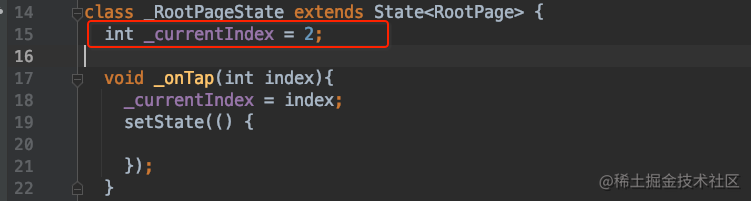

## 配置导航条

微信的导航条颜色是灰色的。然后在安卓上这个导航条标题默认在左侧，这里也需要设置一下在中间。然后标题的颜色也不是白色，改为黑色。然后导航条和下面的 body 有一条黑线，可以通过设置 `elevation` 的值来控制。

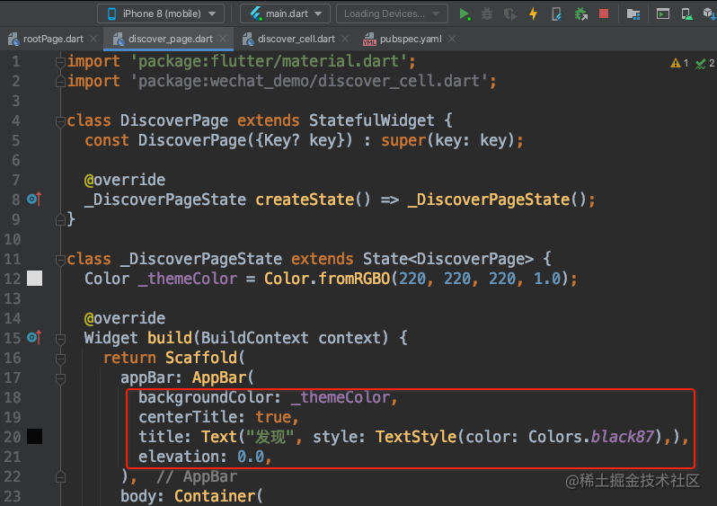

<div align=center>
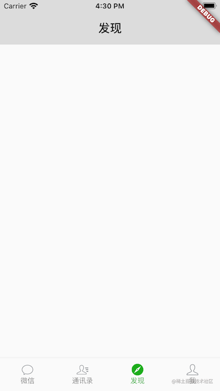
</div>

## 自定义发现 cell

新建一个 pages 文件，将所有页面文件都放到里面。然后在新建一个 discover_cell 准备实现自定义的 cell。按道理来说一个 cell 应该是需要更新UI的所以应该是有状态的，但是现在我们是练手过程，可以先用一个无状态的 cell。 

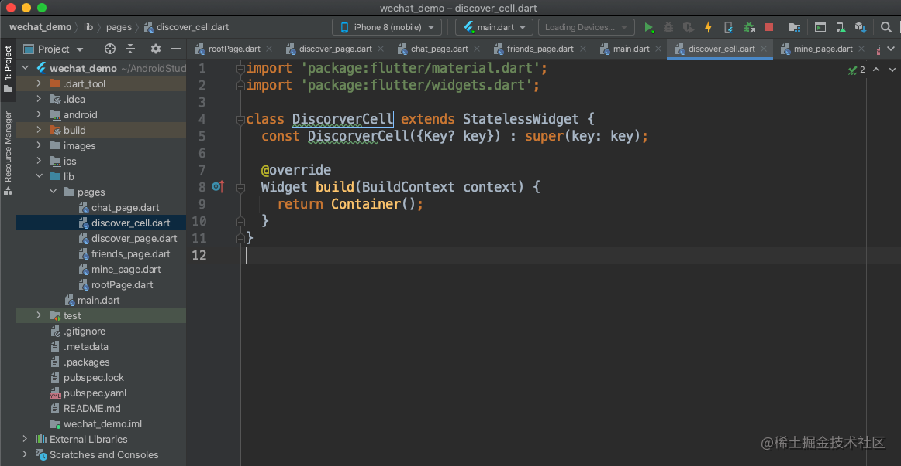

接下来就是实现这个自定义 cell（discover_cell）的代码了；首先观察微信的发现页的 cell，左侧有一个图标，和一个标题，这两个是必须要有的，不然无法构成一个完整的 cell，然后是右侧有些 cell 会有子图标和子标题，还有一个右箭头，这个是每个 cell 都存在的。根据以上这些信息，我们就可以定义出 discover_cell 应该要有的一些属性了。如下：<br>

- `title` 左侧的标题，必传参数<br>
- `imageName` 左侧的图标，必传参数<br>
- `subTitle` 右侧的标题，非必传参数，也叫可选参数<br>
- `subImageName` 右侧的图标，可选参数<br>

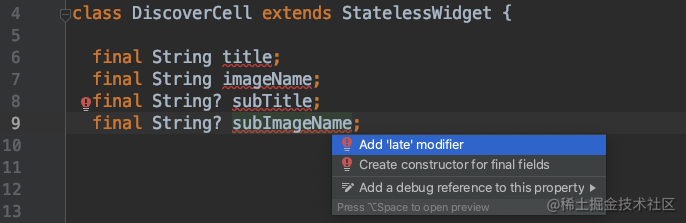

如图所示，声明了这四个属性之后，给出了红色的报错，可以将光标移到报错的红色字母任意处，按住 option + 回车 就可以弹出右侧的选择菜单，第一个选项应该是新版本加的，俺也不是很清楚如何使用，网上资料很少，推荐去查询官方文档了。我这里就懒的去查了，因为我们要选择的是第二个选线 `Create constructor for final fields` 创建构造方法。细心的同学会发现 `subTitle`,`subImageName` 的类型是 `String?` 这个类型后面跟了个问号，就是代表可选参数的意思，这里跟 iOS 的 Swift 倒是十分相似。

选择创建构造方法之后，系统会自动生成一行代码，但是这一行代码很长而且它不换行，非常难看。这里有个小技巧，在生成的代码最后一个属性后面加上一个,号然后再按 option + command + L 重新格式化代码，就会自动换行了。

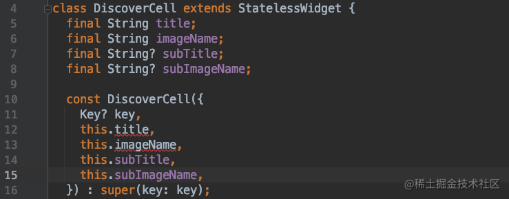

换行之后发现，两个必传参数报错，还是老办法，光标移动到报错的地方，按住 option + 回车 就会给出提示，意思我们要给必传参数加上 `required` 关键字。这样属性的定义就算完成了。

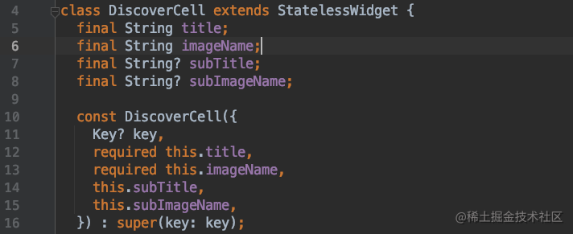

属性定义完了之后就是实现 build 方法搭建界面了。布局界面的方式有很多，可以使用 Row 来布局，也可以使用 Stack 加 Positioned 布局，不管什么方式能实现界面效果都可以。我这使用 Row 布局。代码如下：

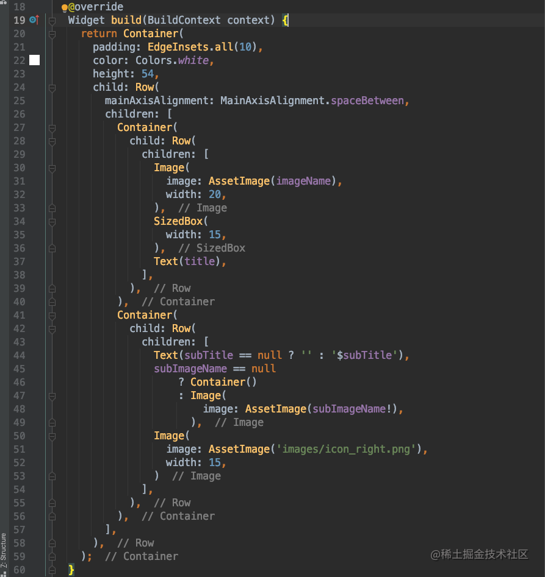

最外层使用一个 Container 包装一个 Row，然后 Row 里面再包含两个 Container 包着的 Row 分别代表左右两边子视图。这样看上去应该还算蛮清晰明了的。左侧部分的图标和标题是必传参数，没啥好说的。

右侧由于子标题和子图标都不一定存在，所以需要做一些处理，Text 控件如果没有子标题可以显示空字符串‘’，这个比较好解决。而子图标不能说给一张空图片，所以需要根据 subImageName 是否为空来显示不同的控件，如果有就显示 Image，如果没有就显示一个 Container 占位。最右侧的箭头图标是每个 cell 都存在的就没啥好说的了。自定义 discover_cell 的代码就算完成了，下一步完善我们的发现页面

## 完善发现页面

cell 写好之后，完善发现页面就简单多了。这里使用最简单的方式来实现，就是直接拼接每个子 cell 的方式。

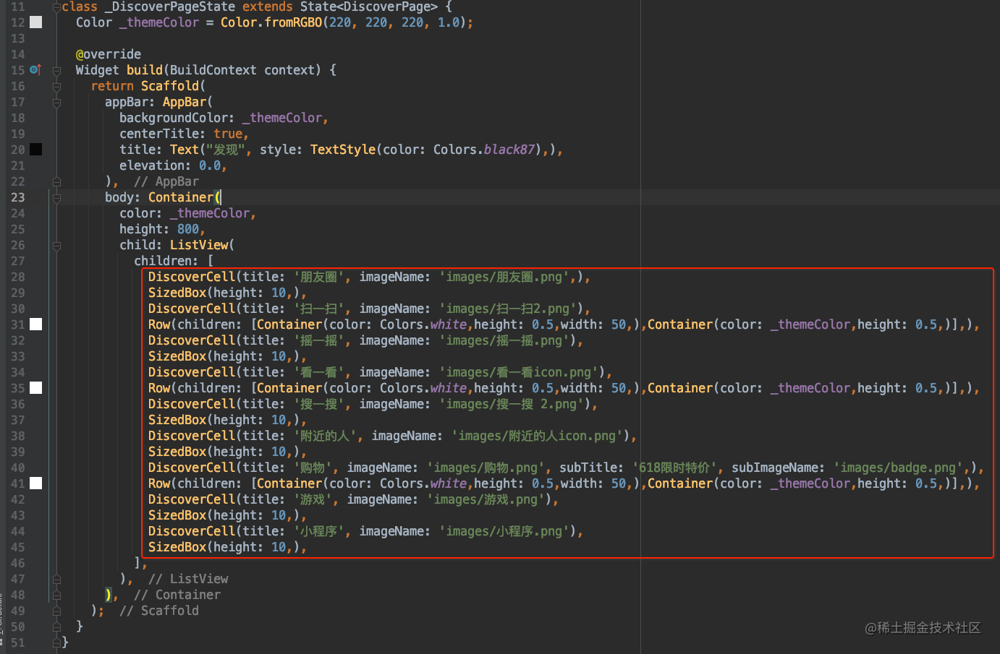

flutter 里面的 ListView 并不像 iOS 中的 UITableView 那样分组和行。ListView 只有行，自行合并几个行组成一组，组与组之间使用一个 SizedBox 隔开，行与行之间使用 Row(因为分割线左侧是白色的，右侧是灰色的，所以需要组合两个 Container)隔开。

其中购物哪一行 cell 右侧的子标题和子图标没有设置字体大小和图标大小，所以显示可能会有点问题，回到 cell 里面设置一下就好了。

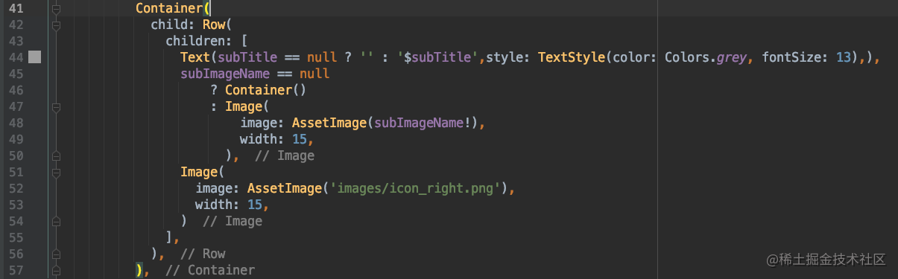

# 实现点击cell切换到新页面

## 让cell能够响应点击事件`GestureDetector`

flutter 提供了一个 `GestureDetector` 类用来检测手势，它有一个 child 属性，可以放我们的UI代码。它还能响应各种手势，在不同的属性里面处理，比如我们点击 cell 就是 onTap 属性。除了 onTap 之外，还有 onTapDown,onTapCancel。其中 onTapCancel 是触摸之后离开了，onTapDown 是按下就会被调用，onTap 按下去并松开之后调用。实现如下代码之后，自己试试就能明白其中差别了。

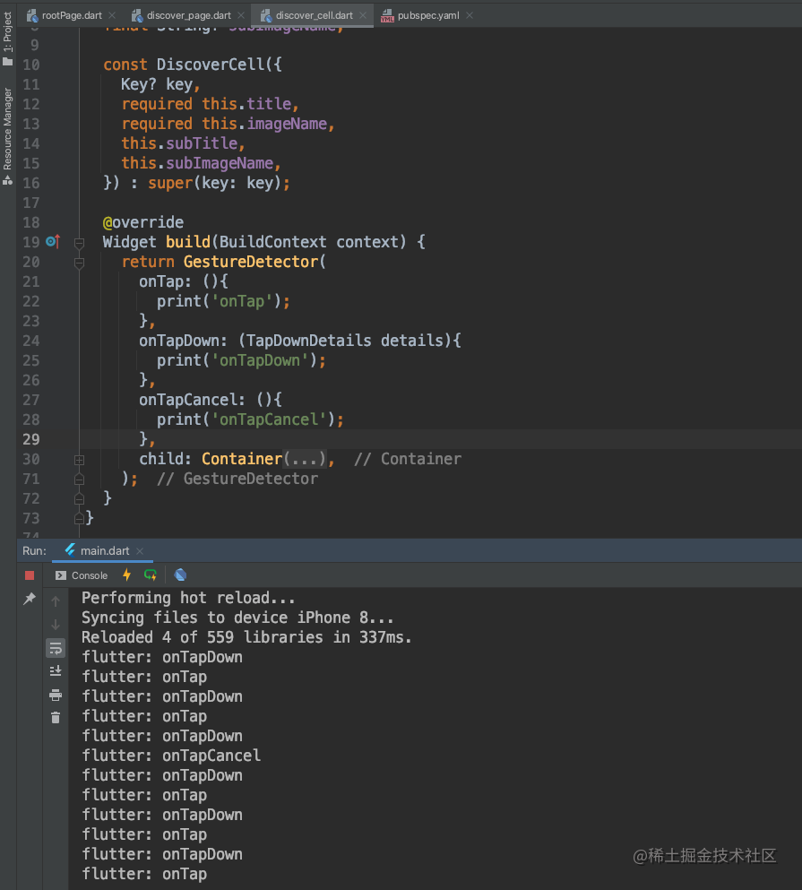

## 实现页面之间跳转

点击发现 cell 之后，需要跳转它对应的详情页面，就需要一个详情页。可以新建一个 discover_child_page.dart 文件，再去补充里面的页面代码。也可以从现有的一些空白文件中复制一份，比如 mine_page.dart 文件，它里面就只有基本的我的页面代码,只需少量修改代码就可以使用。不论使用哪种方式，新建 discover_child_page.dart 完成后，页面代码如下：

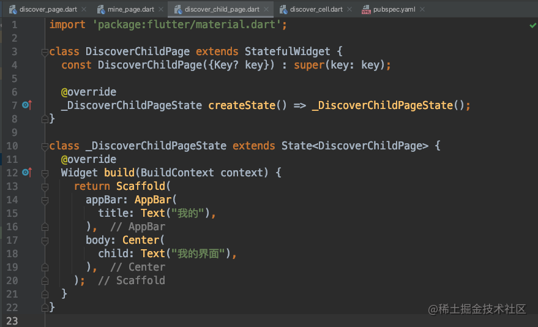

这个详情页的一些属性，应该是需要从外面传入的，比如 title。于是定义一个 title属性。

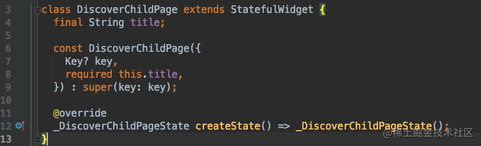

然后在当前页面展示我们的 title，之前都是在 StatelessWidget 里面使用我们的属性，那在 StatefulWidget 里面我们怎么使用属性呢？属性前面加上 widget.

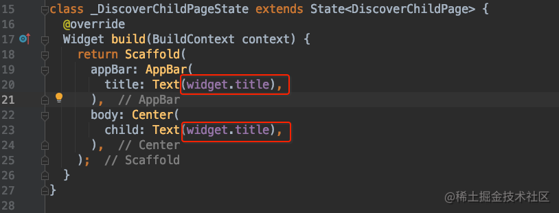

到这里发现详情页就算差不多完成了。

回到 cell 里面的点击方法，实现点击跳转。这里和 iOS 有点类似的地方就是同样是使用一个导航控制器类。flutter 也是使用一个名字叫导航的类 `Navigator`。调用以下方法。

``` dart
Navigator.of(context).push(）
```

push() 的参数需要一个 Route 类型，这里使用 `MaterialPageRoute` 类，`MaterialPageRoute` 的构造方法返回一个 Widget，这个返回的 Widget 就是我们需要跳转到的页面。代码如下：

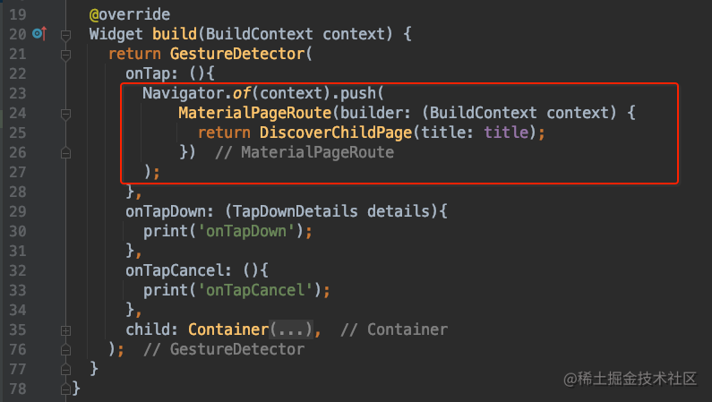

前面讲过的，在 flutter 中，如果函数体的代码只有一句的话，可以使用 => 的形式，于是上面可以简写成这样：

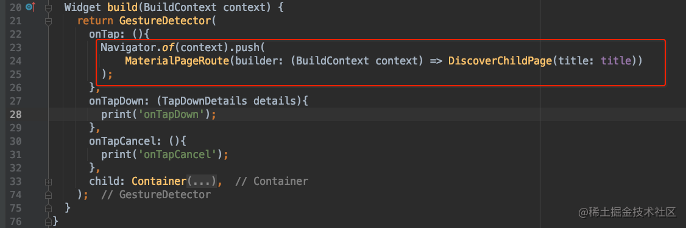

# 实现有状态的 discover_cell

## 修改 discover_cell 为 StatefulWidget

原生的微信 APP 在点击 cell 的时候，会有一个灰色的背景，在松开的时候会变回最初的颜色。现在来实现这个效果。所以我们的 discover_cell 需要从 StatelessWidget 改为 StatefulWidget。先将 build 方法缩起来，快捷键 command 加 - 号，0 右边那个减号。

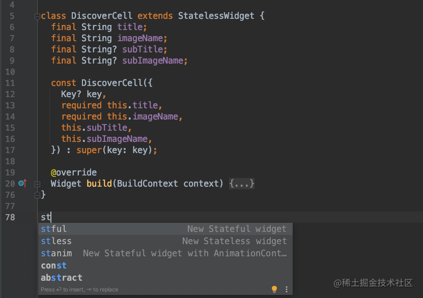

然后先将 bulid 方法覆盖，再将属性和构造方法覆盖。最后删除原有的 StatelessWidget 类。这时候 build 方法里面会爆一个错误，原因是`_DiscoverCellState` 类里面拿不到 `DiscoverCell` 的属性，所以我们在属性前面加上 `widget.` 就好了。

## 实现点击变灰需求

我们前面说过了 onTap 方法，onTapDown 方法，onTapCancel 方法的调用时机。实现这个需求就在这三个方法里面更新状态就好了。代码如下：

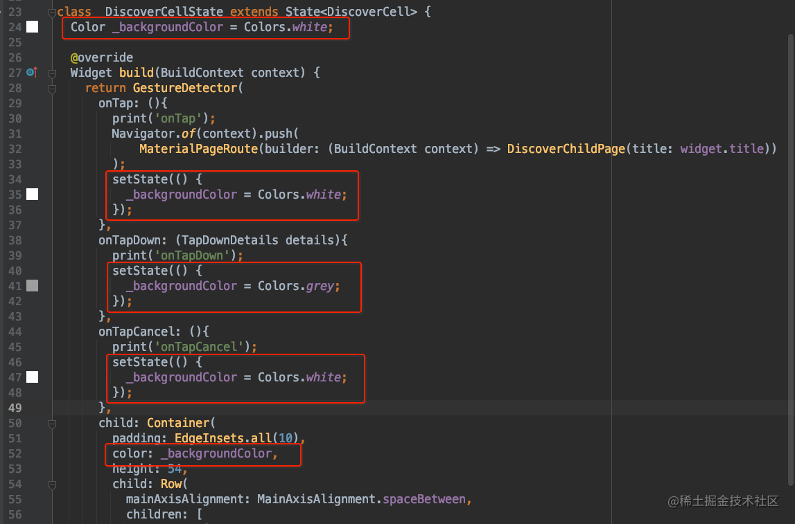


