# Flutter布局

## Alignment

Container 类里有一个 alignment 属性，翻译过来应该叫对齐方式，这个属性用来控制 Container 的子控件相对于它自身的一个位置。在我们 iOS 开发中，我们知道坐标系的原点是在左上角。

而在 flutter 中，坐标系的原点在父控件的正中心，可以使用这个 alignment 属性来控制子控件在父控件中的位置，它有两个参数分别是 double 类型的 x,y。取值是 -1 到 1，

- 当 (0, 0) 的时候表示子控件在父控件的正中心，当 (1, 0) 的时候，表示子控件位于 x 方向上的最右侧，y 方向上居中；
- 当 (-1, -1) 的时候，表示子控件位于父控件的左上角位置。有点类似于 CALayer 的 anchorPoint 属性。

如图代码如下：

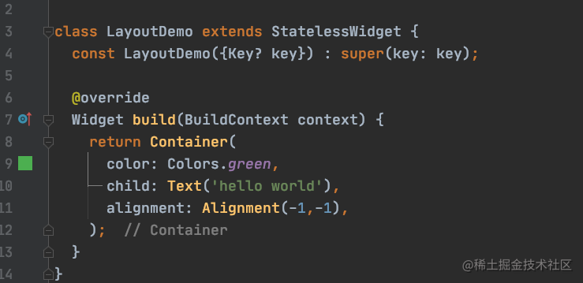

<div align=center>
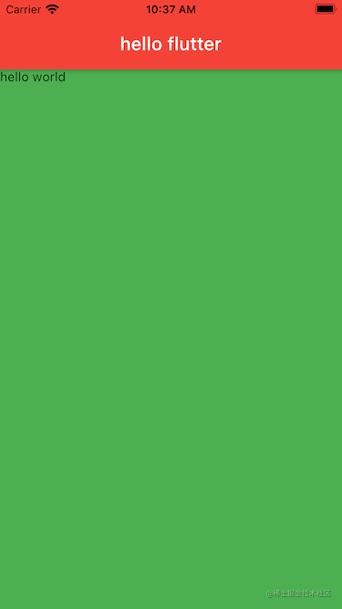
</div>

## Row

Row 表示水平布局，它有一个 children 属性，用来存放它的子控件。代码如下：

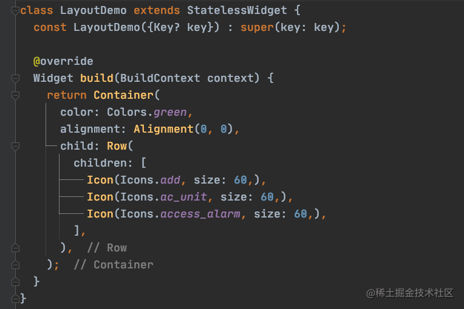

<div align=center>
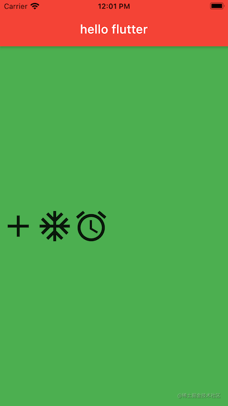
</div>

其中 Icon 类是 flutter 提供的一个快速创建一些常用图标的类。如果想给每个 Icon 都加一个背景色，直接设置 Icon 的 color 是不行的，这样修改的是图标的颜色而不是背景色，给 Icon 包一层 Container 容器，然后再设置 Container 颜色这样就可以实现了。

最开始我们尝试了 alignment 属性的作用，当它是 (0，0) 的时候，Text 的位置默认是在屏幕中央的。为什么这里换成我们的 Row 之后，Row 的子控件位置不在屏幕中央呢？

### mainAxisAlignment

Row 和 Column 都有一个 mainAxisAlignment 属性，叫作主轴对齐方式，默认是 MainAxisAlignment.start 意思沿着主轴方向开始，Row 布局下就是从左至右，Column 布局下就是从上至下。<br>

- `MainAxisAlignment.spaceAround`:将剩下的空间平均分配<br>
- `MainAxisAlignment.spaceBetween`:将剩下的空间分配到子控件之间<br>
- `MainAxisAlignment.spaceEvenly`:等间距分配子控件

### crossAxisAlignment

交叉轴对齐方式。start，end，center 这几种方式试一下很好理解，stretch 会将子控件拉伸。而 baseline 用的比较少,单独使用它会报错，需要和 Text 文本结合，还需要配合 `textBaseline` 属性一起使用。如下图所示，如果不设置 `CrossAxisAlignment.baseline` 和 `TextBaseline.alphabetic` 就会根据控件高度水平对齐，而如果设置了就会根据控件内文本的基线对齐。<br>

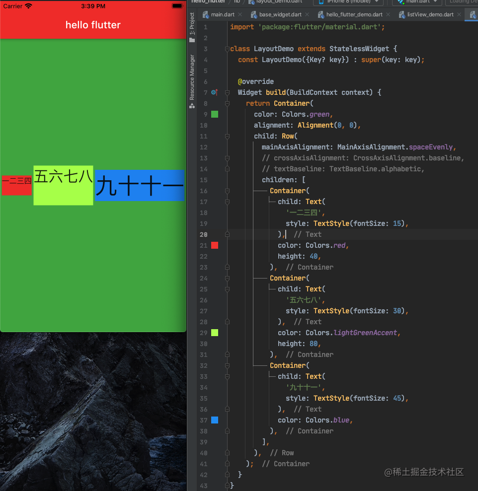

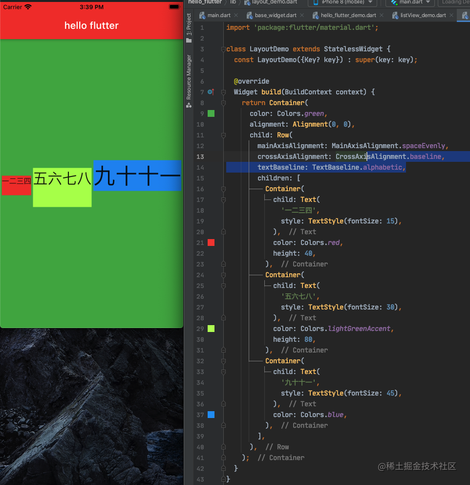

## Column

这个和 Row 是对应的，Row 是水平布局，这个 Column 是垂直布局

``` dart
class LayoutDemo extends StatelessWidget {
  const LayoutDemo({Key? key}) : super(key: key);

  @override
  Widget build(BuildContext context) {
    return Container(
      color: Colors.green,
      alignment: Alignment(0, 0),
      child: Column(
        children: [
          Container(
            child: Icon(Icons.add, size: 180,),
            color: Colors.red,
          ),
          Container(
            child: Icon(Icons.ac_unit, size: 120,),
            color: Colors.yellow,
          ),
          Container(
            child: Icon(Icons.access_alarm, size: 60,),
            color: Colors.blue,
          ),
        ],
      ),
    );
  }
}
```

显示效果如图：

<div align=center>
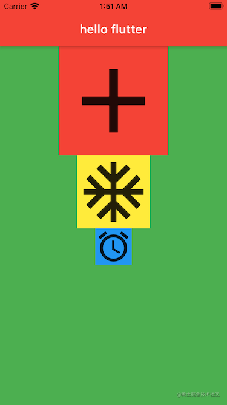
</div>


### mainAxisAlignment

这个跟 Row 类似

### crossAxisAlignment

这个跟 Row 类似

## Stack

这个是用在 Z 轴上的布局的，row 是 X 轴，column 是 Y 轴。children 数组第一个放在最底部，最后一个放在上面，离用户最近的地方。

``` dart
class LayoutDemo extends StatelessWidget {
  const LayoutDemo({Key? key}) : super(key: key);

  @override
  Widget build(BuildContext context) {
    return Container(
      color: Colors.green,
      alignment: Alignment(0, 0),
      child: Stack(
        children: [
          Container(
            child: Icon(Icons.add, size: 180,),
            color: Colors.red,
          ),
          Container(
            child: Icon(Icons.ac_unit, size: 120,),
            color: Colors.yellow,
          ),
          Container(
            child: Icon(Icons.access_alarm, size: 60,),
            color: Colors.blue,
          ),
        ],
      ),
    );
  }
}
```

APP显示效果：

<div align=center>
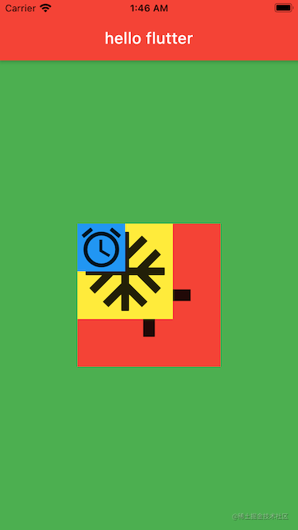
</div> 

### alignment

Stack 里有一个 alignment 属性，它用来控制所有子控件相对于最大那个子控件的位置

``` dart
class StackDemo extends StatelessWidget {
  const StackDemo({Key? key}) : super(key: key);

  @override
  Widget build(BuildContext context) {
    return Stack(
      alignment: Alignment.bottomRight,
      children: [
        Container(
          child: Icon(Icons.add, size: 180,),
          color: Colors.red,
        ),
        Container(
          child: Icon(Icons.ac_unit, size: 120,),
          color: Colors.yellow,
        ),
        Container(
          child: Icon(Icons.access_alarm, size: 60,),
          color: Colors.blue,
        ),
      ],
    );
  }
}
```

<div align=center>
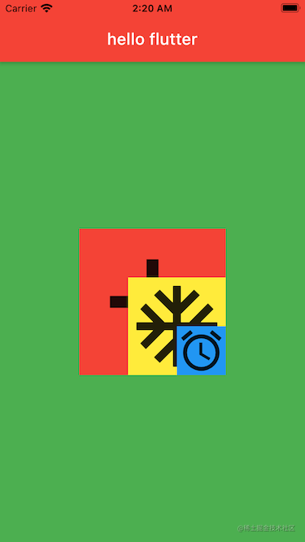
</div> 

### Positioned

Stack 里配合 Positioned 类使用的话，跟我们 iOS 的约束有点类似了，可以设置上，左间距之类的

``` dart
class StackDemo extends StatelessWidget {
  const StackDemo({Key? key}) : super(key: key);

  @override
  Widget build(BuildContext context) {
    return Stack(
      children: [
        Positioned(
          child: Container(
            child: Icon(
              Icons.add,
              size: 180,
            ),
            color: Colors.red,
          ),
        ),
        Positioned(
          child: Container(
            child: Icon(
              Icons.ac_unit,
              size: 120,
            ),
            color: Colors.yellow,
          ),
        ),
        Positioned(
          top: 20,
          left: 20,
          right: 20,
          child: Container(
            child: Icon(
              Icons.access_alarm,
              size: 60,
            ),
            color: Colors.blue,
          ),
        ),
      ],
    );
  }
}
```

<div align=center>
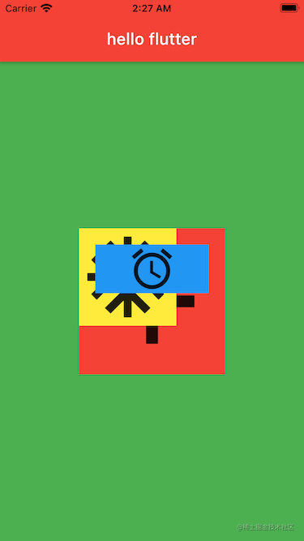
</div> 

可以看到最小的蓝色视图的上左右均设置了 20 的间距，是不是熟悉的约束味道。。。

## Expanded 

Expanded 是一个类似 Container 的常用的布局容器，它用来填充布局，使用了填充布局在主轴方向上是不会有间隔的,所以 Expanded 用在 Row 里面的时候，子控件的宽度设置就没有意义了，而在 Column 里面使用的使用，子控件的高度设置就没有意义了。这里以 Column 为例：

``` dart
class LayoutDemo extends StatelessWidget {
  const LayoutDemo({Key? key}) : super(key: key);

  @override
  Widget build(BuildContext context) {
    return Container(
      color: Colors.green,
      alignment: Alignment(0, 0),
      child: Column(
        children: [
          Expanded(
              child: Container(
                child: Icon(Icons.add, size: 180,),
                color: Colors.red,
              ),
          ),
          Expanded(
              child: Container(
                child: Icon(Icons.ac_unit, size: 120,),
                color: Colors.yellow,
              ),
          ),
          Expanded(
              child: Container(
                child: Icon(Icons.access_alarm, size: 60,),
                color: Colors.blue,
              ),
          ),
        ],
      ),
    );
  }
}
```

<div align=center>
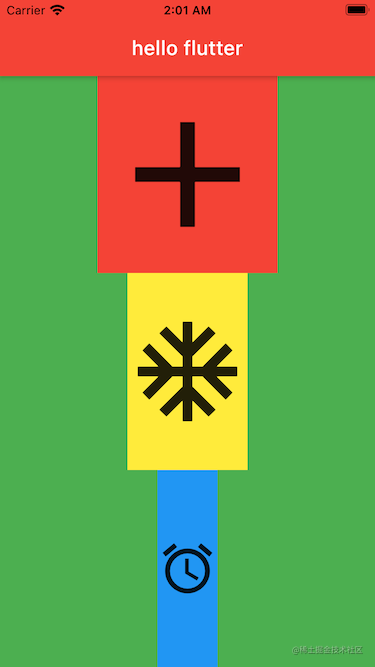
</div> 

## AspectRatio

AspectRatio 是一个容器类，它有一个属性 aspectRatio 表示宽高比。如果指定了宽度，根据这个 aspectRatio 可以自动算出高度；如果指定了高度，根据 aspectRatio 可以自动算出宽度。如下面代码指定了父视图高度为 100，aspectRatio 宽高比为 2，子视图宽度就是 200，再把父视图撑起来也是 200。

``` dart
class LayoutDemo extends StatelessWidget {
  const LayoutDemo({Key? key}) : super(key: key);

  @override
  Widget build(BuildContext context) {
    return Container(
        color: Colors.green,
        alignment: Alignment(0, 0),
        child: Container(
          color: Colors.blue,
          height: 100,
          child: AspectRatio(
            aspectRatio: 2,
            child: Icon(
              Icons.add,
            ),
          ),
        ));
  }
}
```

<div align=center>
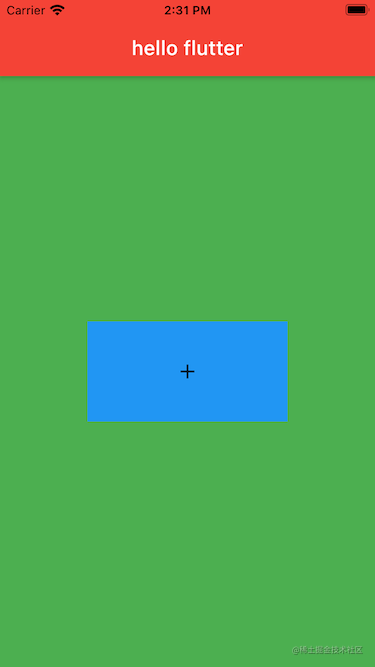
</div> 

# Flutter状态管理

之前介绍的这么多类都是无状态的，意思是显示之后没办法更新 UI 的，如果想要实时更新 UI 的话，就不能继承无状态的类了。我们先来看一个例子：明明 count 变化了，但是界面显示没有变化

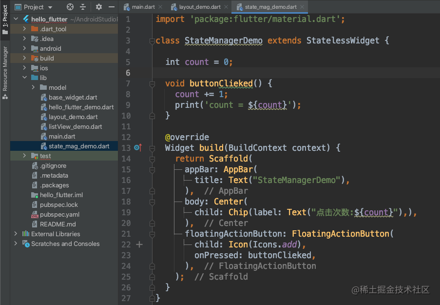

记得修改 APP 的 home 视图

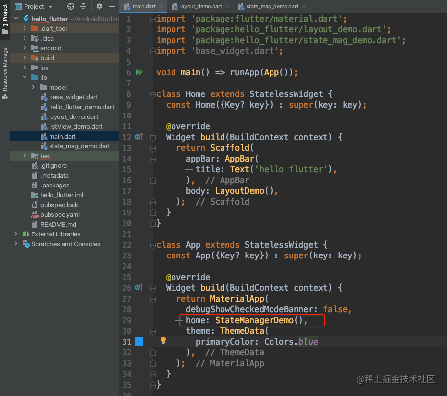

然后点击屏幕右下角的加号按钮，可以发现明明控制台打印了 count 的值已经发生了变化，但是界面显示依然是 0

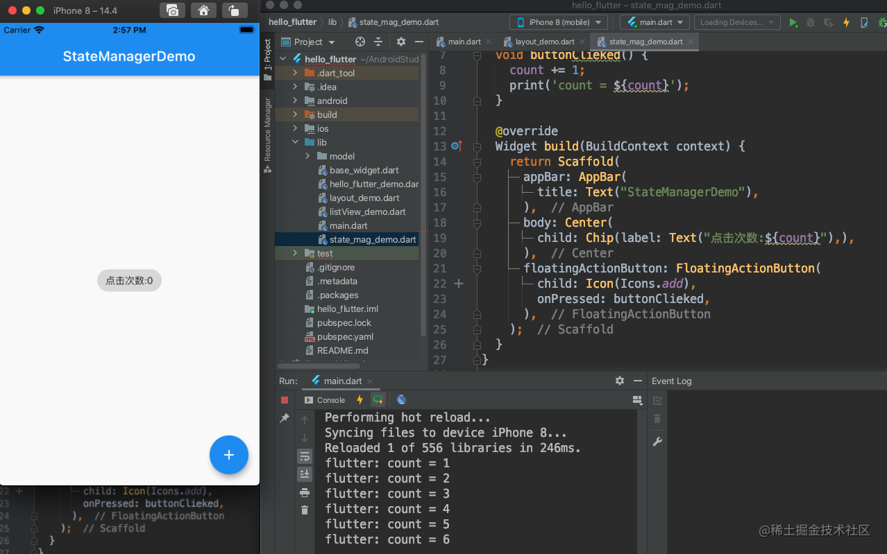

下面我们解决这个问题，将 StateManagerDemo 继承改为 StatefulWidget，实现 createState 方法返回一个自定义的 State 对象，自定义的 State 对象里面实现 build 方法。还需要注意在按钮的点击方法里调用一下 setState 方法。这样每次点击加号按钮就能实时更新 UI 了。改造完之后如下图所示：

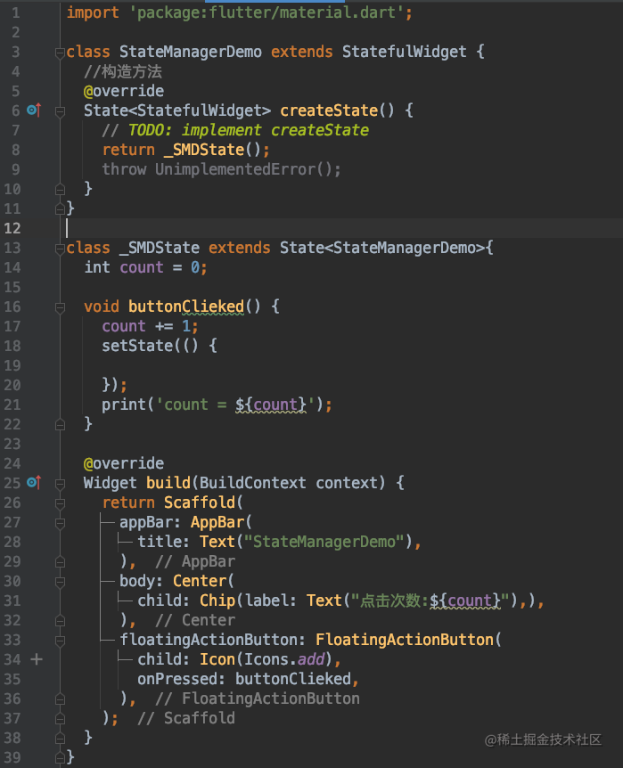


# 项目搭建之底部TabBar

到目前为止，我们对 flutter 的一些基础知识就算是介绍的差不多了。接下来我们开始做一个简单的仿微信 APP。我们应该都有经验，理论的知识学得再多，不动手开始敲代码，不在项目中运用，是很难真正掌握一门知识的。

新建一个 flutter 工程，命名 wechat_demo：

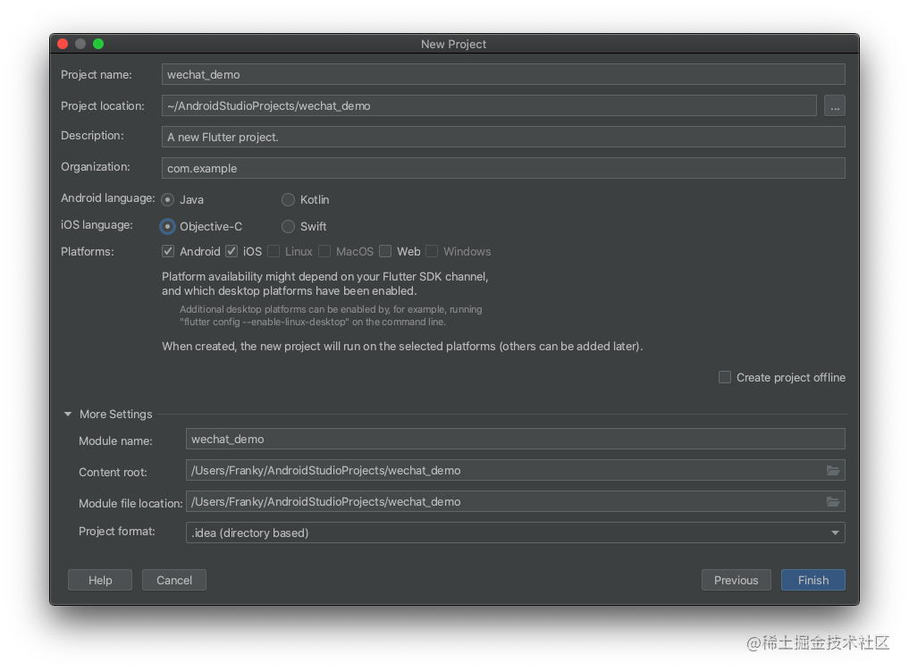

删掉多余的代码，可以全部重新自己写：

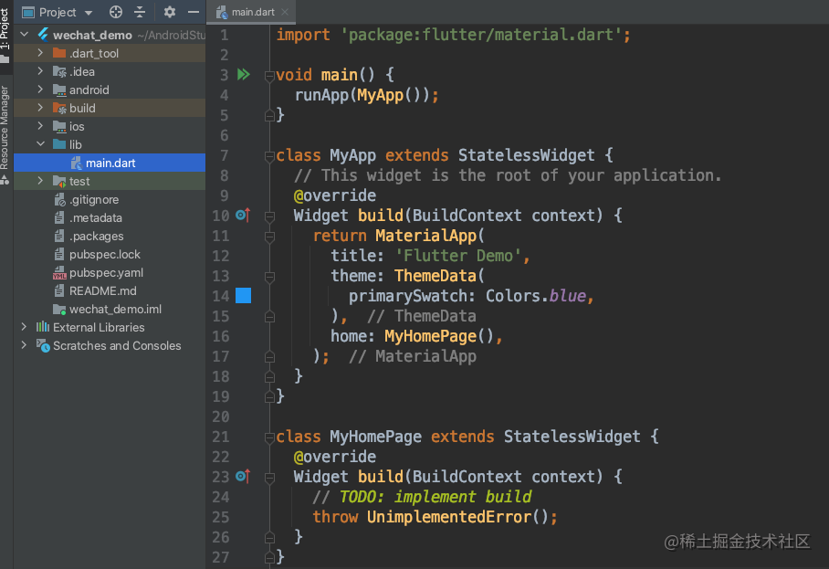

创建底部的 TabBar 和 item,默认的 type 是白色的，显示效果很难看所以改为 fixed，还可以设置 fixedColor：

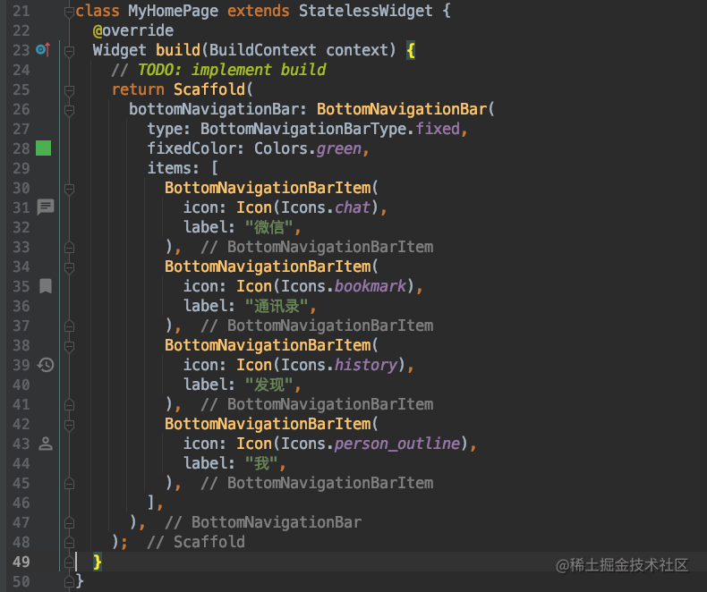

<div align=center>
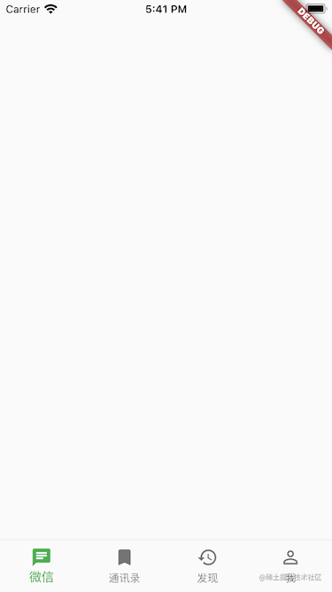
</div> 

这样底部的 TabBar 就显示出来了，会发现点击没有效果，对比 iOS 会发现这块地方还是 iOS 提供的 UITabBarController 封装的更舒服，每个平台都各有优劣吧。

BottomNavigationBar 有一个属性 currentIndex 即代表了当前选中的下标。我们可以通过设置它的值来控制哪个按钮被选中。既然需要改变 UI 了，说明我们需要将 StatelessWidget 改为 StatefulWidget 了。还有一个参数 onTap 是用来回调点击事件的。实现点击事件，切换 currentIndex，重新 setState 就可以实现，点击切换了。我们将 bottomNavigationBar 相关代码放到一个新的文件 rootPage 中。代码如下：

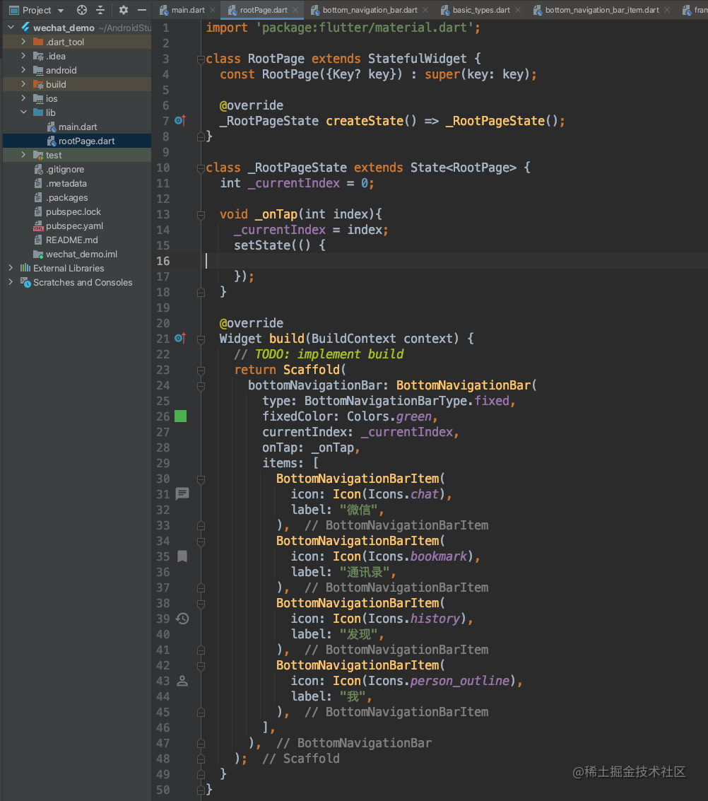

记得修改 main.dart 文件中

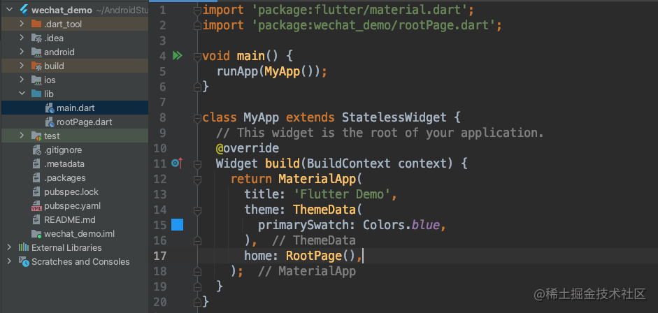

这样就实现了 APP 的底部 TabBar 的展示，点击功能。点击每个 item 的时候，会发现 flutter 的 bottomNavigationBar 还自带了动画效果...

我们知道 Scaffold 还有一个 body 的属性，表示展示在屏幕上的内容。我们每个 item 对应的界面都需要一个 AppBar，那么也许意味着，body 属性还需要一个 Scaffold 来展示我们的每个 item 对应的内容。

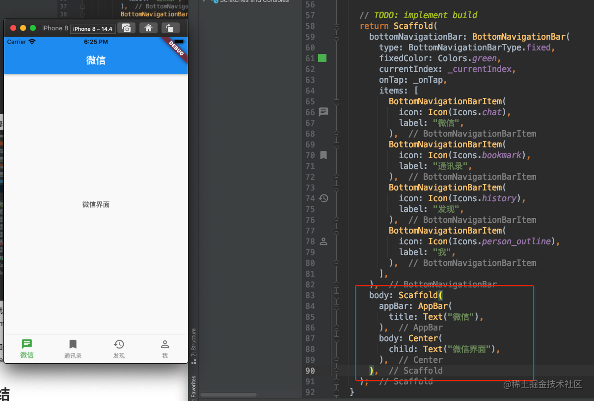

可以看到微信首页就已经大概出来了，但是点击的时候只会显示这个微信页面，怎么实现切换不同的页面呢，肯定需要一个数组，来存放对应的每个页面了。

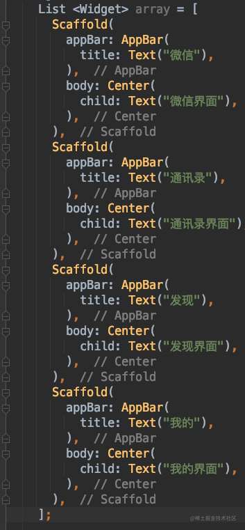

然后 body 里，根据我们的 _currentIndex 返回对应的 body

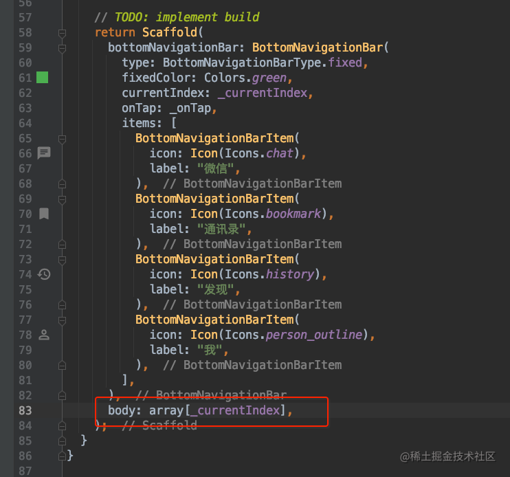

这样点击每个 item 都会跳转到对应的界面了，APP 的主框架的搭建好了。

# 总结

今天主要讲了 flutter 的三大布局类 Row，Column，Stack 以及他们的一些属性。然后是有状态的 Widget 和无状态的 Widget，最后搭建了一下我们要做的仿微信 APP 的底部 bottomNavigationBar 和切换页面功能


