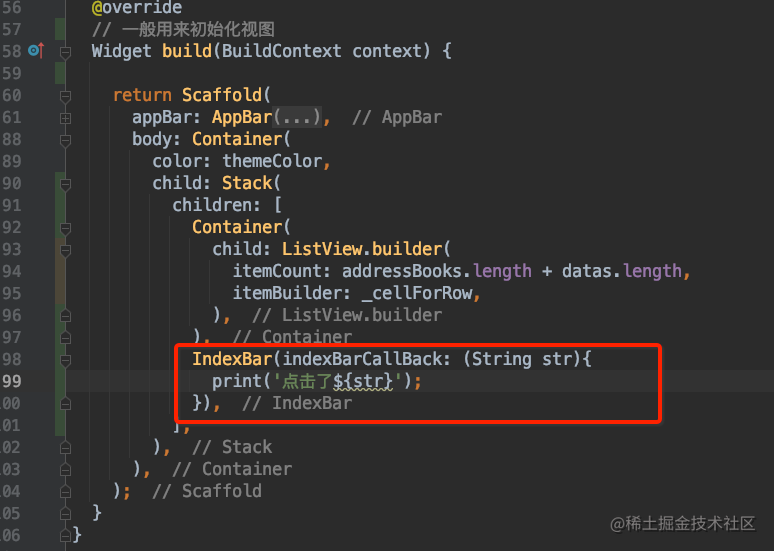

上篇文章，我们已经完成了通讯录的列表。这篇文章介绍完成通讯录右侧的索引条的功能。

# 显示索引条

之前我们已经做过了我的页面的布局，我的页面上有一个列表和一个拍照按钮，和我们今天要实现的索引条布局十分类似。我的页面的布局如下：

通讯录界面的布局，和我的页面的布局都是使用一个 Stack 包含列表和其他子视图来实现。索引条是紧贴屏幕右侧，然后里面的子视图是由上至下的。所以自然的会想到使用一个 Positioned 包含 Column 来实现。Positioned 和 Stack 的组合我们之前讲过，这两个组合起来使用，就和我们 iOS 的约束布局类似，可以设置上左宽高等等。Column 就更不用多说，我们已经使用过很多次了。所以代码如下图所示：

然后优化一下索引条的位置，高度我们设置为屏幕高度的一半，那么上下的间距就不能设置为 0 了，设置距离上间距为屏幕的 1/8 看起来比较合适。

# 抽取 IndexBar

写到这里我们会发现，这个索引条还有很多的功能需要我们来实现，还是有点复杂的，如果代码都写在 friends_page.dart 里会有点冗余，我们完全可以将这个索引条作为一个独立的 Widget 来实现。新建 index_bar.dart 文件，代码如下：

# 实现 IndexBar 的点击切换状态 

当没有触摸到 IndexBar 的时候，默认是不展示背景色的，文字也是黑色的。当我们开始点击 IndexBar 的时候，显示出背景色，然后文字也变成了白色。

实现这个功能，主要是要对 `GestureDetector` 的两个方法有所了解。`onVerticalDragDown` 方法会在手指触摸 IndexBar 的时候就会被调用，`onVerticalDragEnd` 会在手指松开屏幕的时候调用。利用这两个方法就可以实现需求。代码如下：

因为要对文字的颜色进行修改，所以初始化 Text 的时候，就需要使用变量 _textColor;

# 获取当前选中的下标

同样是对 `GestureDetector` 的一个手势方法的使用，`onVerticalDragUpdate` 这个方法的调用时机，在手指移动的时候会不停的调用这个方法。这个方法有一个 `DragUpdateDetails` 参数，它包含了手指所在的坐标信息。不过是相对于整个屏幕的坐标，可以将它转化为相对于 IndexBar 的坐标，然后通过计算可以得到我们当前选中的是哪个下标。代码如下：

方法中的 ~/ 是 flutter 特有的运算符，意思是除后取整。而 clamp() 是对边界情况的处理，意思调用该函数的结果在它的两个参数之间。

# 回调选中的下标

这里的回调，和 OC 里面的 block，Swift 里面的闭包都是一个意思。flutter 里面带有下划线的变量是私有的，外部无法访问的。所以对外暴露的参数，不能写在 `_IndexBarState` 类里面，需要写在 IndexBar 类里面。声明一个闭包(或者叫 block)属性,作为必传参数在初始化的时候传入。

这样，在 `friends_page.dart` 文件中初始化 `IndexBar` 的时候，就需要传入一个闭包。然后 `IndexBar` 内部在 `onVerticalDragUpdate` 的时候，调用这个闭包，就可以将当前选中的下标回调给外部了。

这个时候，会发现一个小问题，就是点击 IndexBar 的时候，回调没有执行，只有在点击并手指挪动的时候才会执行。所以需要在 `onVerticalDragDown` 方法里面也调用一次闭包。这时候如果直接将 `onVerticalDragUpdate` 方法里面的代码复制到 `onVerticalDragDown` 方法里面确实没有问题，但是会明显的看到重复的代码太多了。

所以可以抽取一个方法，将重复的代码放到一块。

然后调用的时候就简单多了。

# 优化回调执行的频率

已经成功的实现了回调，但是从打印的结果来看，会发现同样一个下标会被回调许多次。这样我们滚动好友列表的时候会造成不必要的性能消耗。明明只需要滚动一次，结果却滚动了无数次到同一个位置。所以这里我们需要优化一下，一个很自然的想法就是记录一个 `_currentIndexLetter`，每次执行回调的时候，判断回调的首字母是否和 `_currentIndexLetter` 是否不同，如果是一样的就没有必要回调了，只有不同的时候，才执行回调。

代码如下：

这样回调的频率就正常了。

# 滚动好友列表 ListView

可滚动的 widget 都有一个 controller 属性，用于控制滚动条的行为。controller 属性是一个 `ScrollController` 对象。可以使用它来实现指定滚动到某个位置，实现回到顶部等功能。

滚动好友列表需要一个新的对象 `ScrollController` 实例，将它设置给 ListView 的 `controller` 属性，然后就可以通过使用 `ScrollController` 实例来操作 ListView 的滚动。

这里暂时先将滚动的偏移设置为固定值 250，试试看效果。可以看到当我们点击 IndexBar 的时候，ListView 就会滚动到偏移为 250 的地方。接下来就是处理滚动的实际偏移值了。

滚动的实际偏移，是根据我们的数据源来计算的。因为我们的 cell 的高度是确定的，不显示组头的 cell 高度是 54，有组头的 cell 高度是 54 + 30 = 84。使用首字母作为 key，计算出对应的偏移为 offset，然后使用 Map(类似 iOS 中字典)记录下来。由于第一个是不是字母，而是搜索符号，而它对应的偏移也是固定的 0。所以可以在初始化 Map 的时候就指定好。而其他的高度我们在 initState 方法中计算。代码如下：

有了这个 Map 之后，我们在 IndexBar 的回调方法中，就可以根据 IndexBar 回调给我们的首字母得到对应的偏移值了。代码如下：

到这里，我们的 IndexBar 基本上就实现了滚动 ListView 的功能。但是滚动几次之后就会发现一个小问题。。。滚动到底部的几个组头的时候，会出现 ListView 先将组头滚动到指定位置，然后又滚回底部的情况。原因很好理解，后面的组头内容不够显示一整个屏幕了。所以我们这里需要做下处理。这里主要是对 ListView 的滚动的监听，如果是在 iOS 中我们会想去获取滚动视图的 contentSize 然后减去 UITableView 的高度，就是 UITableView 的最大的滚动范围。而在 Flutter 中，这些都不需要我们计算了。

如果需要获取到 ListView 的一些滚动相关的信息，可以将它包裹在 `NotificationListener` 里面，它有一个 `onNotification` 属性，是一个闭包，可以回调给我们一些滚动的相关信息。包含在闭包参数 `ScrollNotification note` 里面。准确来讲滚动相关的信息包含在 `ScrollNotification` 的属性 `metrics` 里面。它包含当前滚动偏移值，能滚动的最大范围(这就是我们 iOS 中 contentSize 的高减去 UITableView 的高)等等信息。完整代码如下：

将 `_maxScrollExtent` 定义为一个属性就好了。需要注意的是并不能给初始值为 0，否则没有滚动 ListView 之前，使用 IndexBar 就无法滚动 ListView 了。

至此，IndexBar 滚动 ListView 的功能就实现了。

# 显示指示器

终于来到了最后一步，显示我们 IndexBar 的指示器。首先考虑的就是布局。最初的 IndexBar 只有右侧的下标一列。现在我们左侧需要一块容器用来显示我们的指示器，所以 IndexBar 的根视图应该考虑改为 Row。指示器背景的不规则图形可以使用一张图片展示，图片已经准备好了。中间的文字，使用 Text 就够了。先看下大概布局代码：

如果觉得位置不是很合适，可以修改一下各自的宽度。然后是对指示器的显示与隐藏做控制，指示器的显示与隐藏的控制，应该说跟背景色的显示隐藏是类似的。都是在手势的那两个方法里面实现控制。使用一个 bool 变量来控制指示器的显示与隐藏，在手势的触摸方法和离开方法里面操作这个 bool 变量，然后 setState() 就可以实现了指示器的显示与隐藏了。

然后是关于指示器的显示文本的。这个文本就是我们的 `_currentIndexLetter`，直接使用就好了。最后是关于如何控制整个 IndexBar 的上下位移的。通过对 Alignment 的使用，发现可以控制 IndexBar 的上下位移。通过不断的修改 Alignment 的 y 值会找到一个合适的 y 值指向第一个放大镜，那么 -y 就指向最后一个字母 Z。我这里试了几次发现 y=-1.13 的时候，指示器刚刚好指向第一个放大镜的位置。那么现在的问题就是将 1.13 * 2 = 2.26 分成`_index_words.length - 1`份，然后根据选择的下标，取得对应的Alignment 的 y 值。当我们选择第一个的时候下标为 0，y 值应该为 -1.13,当我们选择最后一个的时候下标为 `_index_words.length - 1`,y 值应该为 1.13。根据这些信息就可以找到计算 y 值的公式。最终的代码如下： 

新增两个变量`_showIndicator`和`_indicatorAlignmentY`。

使用这两个变量还有`_currentIndexLetter`

到这里，我们就终于实现了通讯录的 IndexBar 的封装。下一节会介绍一些网络请求了...

