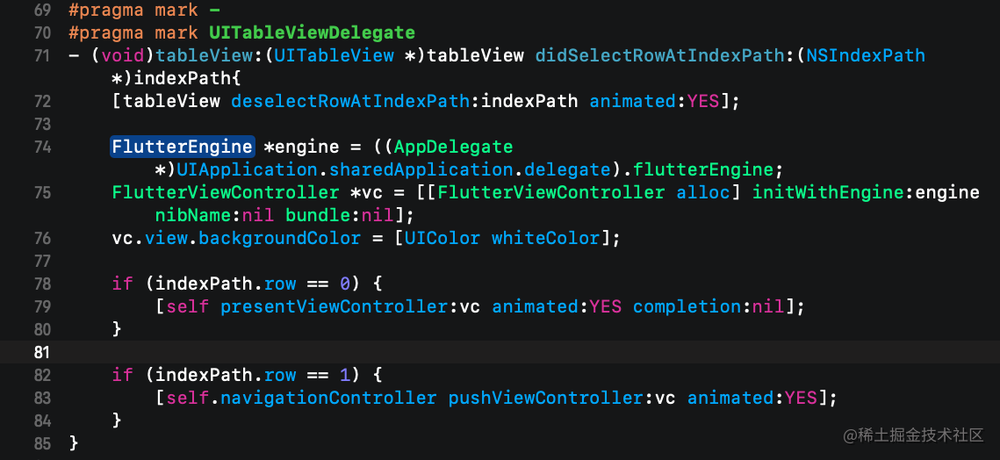

# 介绍四种 Flutter Project

先介绍一下这四个的差别和使用的场景。


## Flutter App

如果是想要使用 flutter 开发一个新的项目，那么就选择 Flutter App。就像我们之前的 `wechat_demo`

## Flutter Module

但是很多时候我们目前手上的原生 APP 可能会很庞大，不是随便就可以重新使用 flutter 重新再写一遍的。但是又想在现有的 APP 中体验一下 flutter，那么就选择 Flutter Module

## Flutter Package

Flutter 支持使用其他开发者向 Flutter 和 Dart 生态系统贡献的共享 package(类似于 iOS 中的第三方库吧，AFNetworking，YYKit等等...)，这意味着你可以快速构建应用而不是一切从零开始。

Package 最低要求是包含一个 `pubspec.yaml` 文件。此外，一个 package 可以包含依赖关系 (在 `pubspec.yaml` 文件里声明)、 Dart 库、应用、资源、测试、图片和例子等。 pub.dev 上列出了很多 package，由 Google 工程师和 Flutter 和 Dart 社区的开发者开发和发布，你可以用在自己的应用里。

## Flutter Plugin

插件 (plugin) 是 package 的一种，全称是 plugin package，我们简称为 plugin，中文叫插件。插件 (plugin package) 是一种特别的 package，特别指那些帮助你获得原生平台特性的 package。插件可以为 Android (使用 Kotlin 或 Java 语言)、 iOS (使用 Swift 或 Objective-C 语言)、Web、macOS、Windows、Linux 平台，或其任意组合的平台编写。比如：某个插件可以为 Flutter 应用提供使用原生平台的摄像头的功能。

# 使用 Flutter Module 进行混合开发

我们前七天开发的项目就是 Flutter App，今天主要介绍如何使用 Flutter Module 进行混合开发。混合开发官方推荐只使用单个 Flutter 页面，多个 Flutter 页面也能支持，但有可能会出现稳定性、性能问题以及 API 仍然可能变动的问题。请大家谨慎使用。[官方介绍链接](https://flutter.cn/docs/development/add-to-app/multiple-flutters)

# iOS 原生项目中导入 Flutter

## 准备一个原生 iOS 项目

进行混合开发就一定需要一个原生项目，根据你的需求，可以使用目前手上的 APP，也可以临时创建一个 Demo 来先练练手。我们这里就临时新建一个 iOS 原生 Demo。


这个原生项目很简单，就这么两行代码。

## 新建 Flutter Module 项目

新建一个 Flutter Module 项目，项目名就叫 module。


最好将两个项目放在同级目录下，因为原生项目需要知道 Flutter Module 项目的位置。


## 使用 cocoapods 建立关联

在原生项目 Demo 里建立 Podfile 文件,然后编辑 Podfile。

``` dart
flutter_application_path = 'Podfile相对flutter module的路径'
load File.join(flutter_application_path, '.ios', 'Flutter', 'podhelper.rb')
```

在每个需要集成 flutter module 的 target 添加如下代码
 
``` ruby
target '你的APP' do
  install_all_flutter_pods(flutter_application_path)
end
```

编辑完之后的 Podfile 如下。


然后执行 `pod install` 命令


如上图所示就表示集成好了。就接下来就是如何在原生项目中展示 flutter 的内容了。

## 展示单个 Flutter 页面

展示单个 Flutter 页面的方式有两种，一种是使用 FlutterEngine 的方式，一种是不使用 FlutterEngine 的方式，其实不使用 FlutterEngine 的说法是不严谨的，只是我们没有使用代码创建 FlutterEngine 而已，Flutter 框架内部自己创建了 FlutterEngine，但是为了方便记忆，我们可以这么理解。但是这种不使用 FlutterEngine 的方式[官方并不推荐](https://flutter.cn/docs/development/add-to-app/ios/add-flutter-screen#alternatively---create-a-flutterviewcontroller-with-an-implicit-flutterengine)。

因为按需创建 `FlutterEngine` 的话，在 `FlutterViewController` 被 present 出来之后，第一帧图像渲染完之前，将会引入明显的延迟。但是当 Flutter 页面很少被展示时，当对决定何时启动 Dart VM 没有好的启发时，当 Flutter 无需在页面（view controller）之间保持状态时，此方式可能会有用。

### 不使用 FlutterEngine 展示单个 Flutter 页面(官方并不推荐)

来到 `ViewController.m` 文件中导入 `Flutter` 的头文件


直接创建 `FlutterViewController` 对象，并使用 present 和 push 两种方式展示


APP显示如下图所示：<br>

present方式显示如图：

<div align=center>

</div>

push方式显示如图：

<div align=center>

</div>

### 使用 FlutterEngine 展示单个 Flutter 页面

#### 创建 FlutterEngine

创建 `FlutterEngine` 的合适位置取决于您的应用。作为示例，我们将在应用启动的 `AppDelegate` 中创建一个 `FlutterEngine`，并作为属性暴露给外界。

在 `AppDelegate.h` 中


在`AppDelegate.m`中


#### 展示 FlutterViewController



现在，你的 iOS 应用中集成了一个 Flutter 页面。

## 展示多个 Flutter 页面

使用上面的方式，最终展示的 Flutter 页面都是同一个页面。而在实际混合开发中，想要展示多个不同的 Flutter 页面的需求应该是普遍的。那么 Flutter 能做到吗？答案是可以的，官方的说法是自 Flutter 2.0.0 开始，可以同时添加多个 Flutter 实例。由于稳定性，性能问题以及 API 任然可能变动，请谨慎使用。[链接](https://flutter.cn/docs/development/add-to-app/multiple-flutters)

### 使用 FlutterEngineGroup

展示多个 Flutter 页面需要使用到 `FlutterEngineGroup` 来创建 `FlutterEngine`,而不是上面直接使用 `FlutterEngine` 的方式。

在`AppDelegate.h`中


在`AppDelegate.m`中


### 新建一个 flutter 页面

来到 Android Studio 中的 Flutter module 项目，新建一个 page_two.dart 文件，并做些简单的展示


`PageTwo` 页面写好之后，还需要到 main.dart 文件中声明一个新的 dart 入口。这样才能在原生中找到这个 `PageTwo` 页面,代码如图：

<br>

`page_two` 就是 `PageTwo` 的入口函数，在原生中待会就会用到。

### 展示两个 Flutter 页面

回到原生项目的 ViewController.m 文件中，实现如下代码：


在第0行，我们创建 `engine` 的时候，并没有传入 Entrypoint 参数，所以就会展示默认的入口函数 `main` 对应的页面。在第 1 行中，我们创建 `engine` 的时候，指定了入口函数为 `page_two`，那么就会展示 page_two() 所对应的页面。

present 展示的页面如图：

<div align=center>

</div>

push展示的页面如图：

<div align=center>

</div>

# Flutter 与 iOS 端通信

Flutter 和 iOS 端的通信主要是使用各种通道。有`MethodChannel`，`BasicMessageChannel`,`EventChannel`等等，这里主要介绍前面两种通道。通道通过名称来建立联系，所以通道的名称需要确保是唯一的。如果有同名的通道，通信会受到干扰

## MethodChannel 方法通道

方法通道主要用了传递方法名称和参数。在前面我们新建 PageTwo 的时候，就已经创建了一个 `MethodChannel` 了，名字为 `page_two_channel`。然后在文本‘返回上一页’的点击手势里面调用了一个方法 `invokeMethod()`。这个方法可以传递多个参数，第一个参数就是方法名称，后面是方法参数。我们这里没有参数，就只传入一个方法名 `pop`。那么 Flutter 端的工作就完成了，再回到我们的 iOS 原生端，ViewController.m 里面。实现如下代码：


在 iOS 中给 `MethodChannel` 加了一个 `Flutter` 前缀。然后初始化 `FlutterMethodChannel` 的时候，传入的名字一定要和 flutter 端是一致的，不然是无法建立通讯的。然后调用 `setMethodCallHandler:` 方法传入一个 block 参数。block 参数会在 channel.invokeMethod() 的时候被调用。block 参数 `call` 就是对 invokeMethod 参数的一个封装。`call` 的 `method` 就是方法名，还有一个 `arguments` 就是方法参数。这样就可以根据方法名进行判断后作出处理了。现在是从 flutter 向 iOS 原生通信，实现了在 flutter 中点击方法实现了 pop 回到上个页面的。相反的，也可以从 iOS 端向 flutter 端通信。在 iOS 端，使用 `channel` 调用 `invokeMethod()` 就可以向 flutter 发送消息了，在 flutter 端同样设置 `channel` 的 `setMethodCallHandler` 就可以接收了。

flutter 端 `setMethodCallHandler` 代码如下：


这里说一句，这些通道不能在无状态的 Widget 里使用，改为有状态的就可以了。

## BasicMessageChannel 基础消息通道

除了上面提到的 `MethodChannel`，你还可以使用[`BasicMessageChannel`](https://docs.flutter.io/flutter/services/BasicMessageChannel-class.html)，它支持使用自定义消息编解码器进行基本的异步消息传递。 此外，您可以使用专门的 [`BinaryCodec`](https://docs.flutter.io/flutter/services/BinaryCodec-class.html)，[`StringCodec`](https://docs.flutter.io/flutter/services/StringCodec-class.html)和 [`JSONMessageCodec`](https://docs.flutter.io/flutter/services/JSONMessageCodec-class.html)类，或创建自己的编解码器。

`BasicMessageChannel` 这个通道的使用方法跟上面的 `MethodChannel` 是一样的，不同点是在 flutter 中创建 `BasicMessageChannel` 这个通道需要传入一个编解码器，使用一个标准的编解码器 `StandardMessageCodec` 可以将基本的数据类型进行编解码。`BasicMessageChannel` 通道可以实现基础数据类型的通讯。iOS 和 flutter 的基础数据类型对应编解码关系：


# 总结

本来还想写一个混合开发的实际案例的，但是鉴于本人目前的重点并不是 flutter，而且网上也有较多的介绍这种混合开发的实际案例，所以这里篇文章就写到这里了。这 8 篇文章的内容应该说只是一个 iOSer 入门 flutter 的教程，只是些皮毛东西，离掌握 flutter，Dart 还差的很远。而 flutter 的出现也并不是说会完全取代 Android 和 iOS 开发者，flutter 只能用来搭建一套各平台统一的 UI，而各个平台相关的功能，和硬件相关的需求，都依然需要各个平台的开发者去实现。


