发现了一个宝藏网址，这里讲解的 [flutter实战](https://book.flutterchina.club/) 比我写的靠谱多了。

# 准备网络数据

这一步不是很重要，提供一些假数据而已，不是重点嫌麻烦的可以跳过。

先介绍一个网址：[http://rap2.taobao.org/account/login](http://rap2.taobao.org/account/login) 这个网址用来搭建我们需要的网络数据，注册账号非常简单，这里就不多说了。

注册完成之后，新建一个仓库，简简单单取个名字就够了：

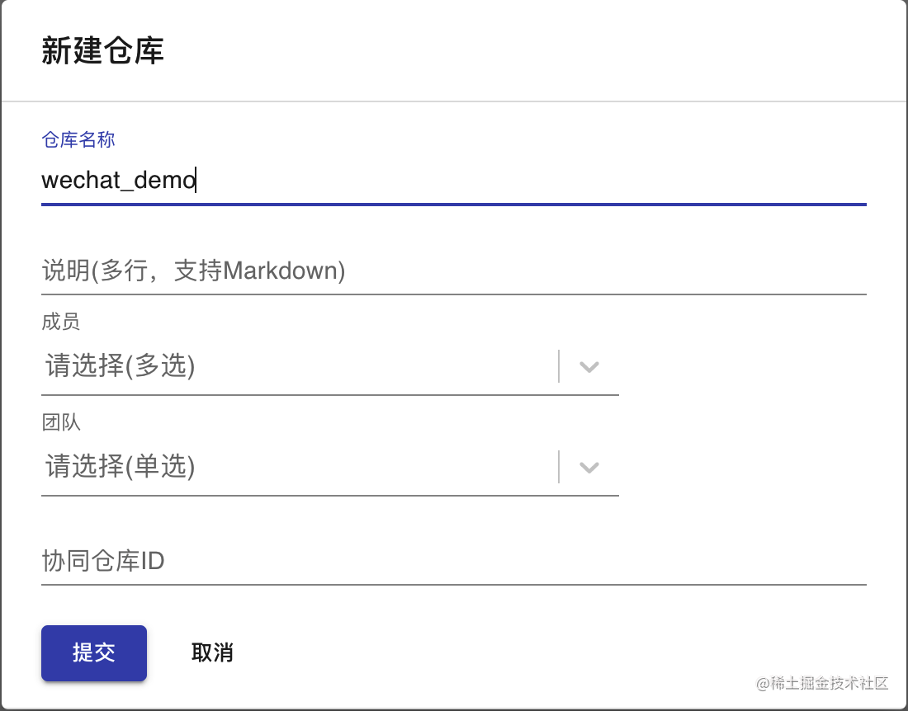

之后点击进入仓库，可以看到下图：

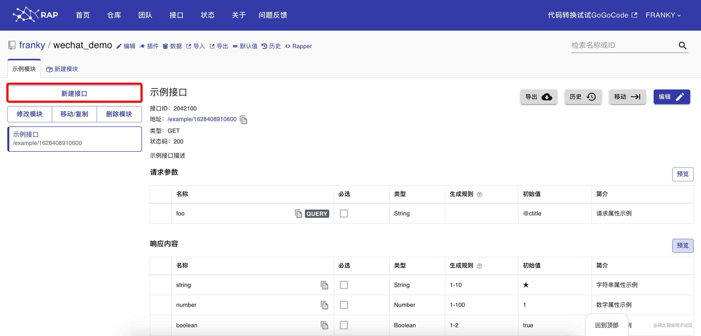

会默认生成以一个示例接口，可以看一看示例接口的生成规则。看不懂也没关系，我们直接直接上手自己新建一个接口，如图所示：

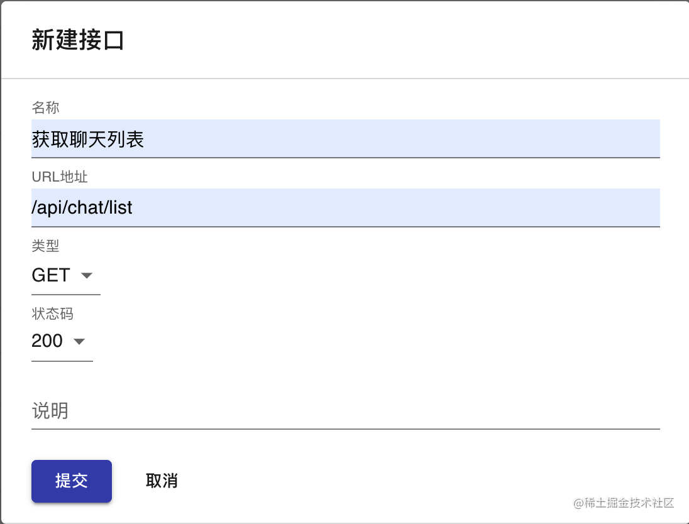

点击右上角的编辑按钮进入编辑模式，新建一个响应 chatlist，类型为 Array。然后生成 chatlist 的数据，imageUrl 表示每条聊天数据的用户头像。其中用户头像的初始值里面有一段 @natural(20,99)，这个是 Mock.js 代码。这里是相关介绍 [http://mockjs.com/](http://mockjs.com/)

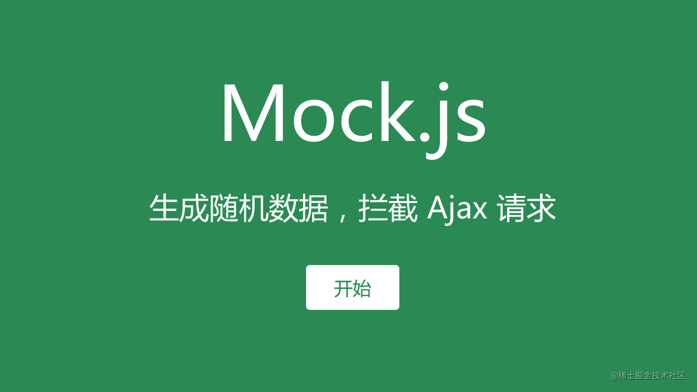

每条聊天数据，除了 imageUrl 还需要有用户名 name 和消息的内容 message。@cname 用来生成随机的中文名，@cparagraph 用来生成随机的中文段落来表示聊天内容。我们这里只是简单的构造一下这个聊天列表所需要的数据，真正的聊天列表的数据肯定是不会这么简单的。。。

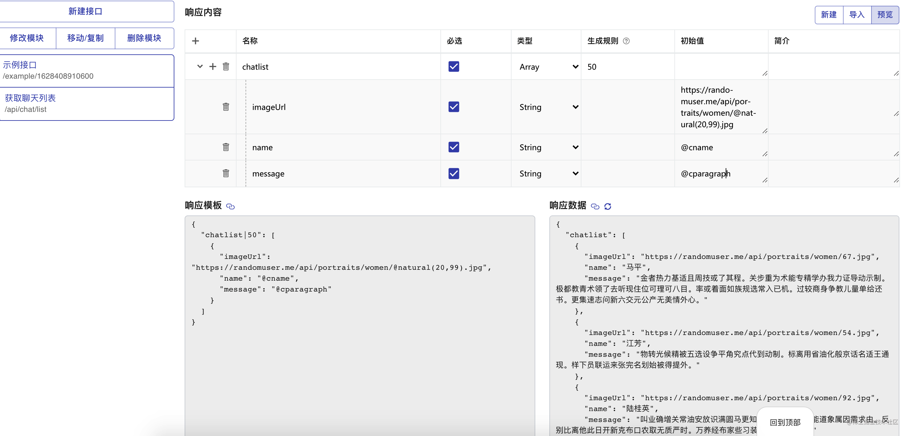

编辑的差不多的时候，记得点击保存,保存之后点击红圈中的图标就可以获取到数据

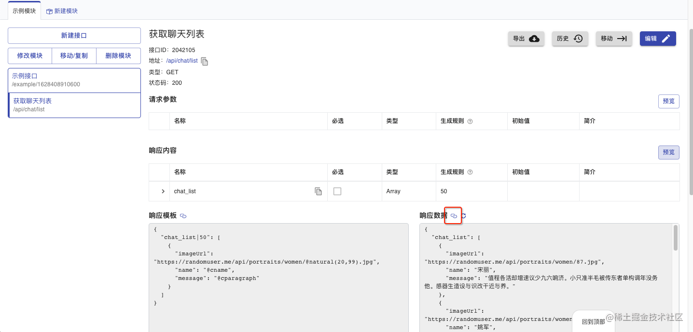

# 聊天页面导航条

## 准备工作

默认展示页面改为 `_currentIndex` 改为 0,新建 chat 目录，将相关文件放在这里。

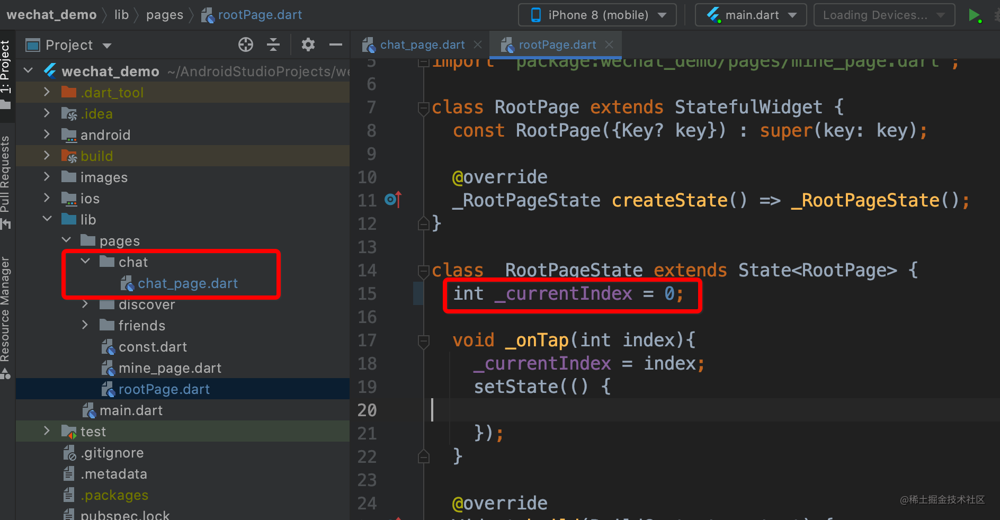

## 添加加号按钮

加号按钮这个东西，我们之前已经添加过类似的了，appBar 的 actions 就是我们需要添加代码的地方。

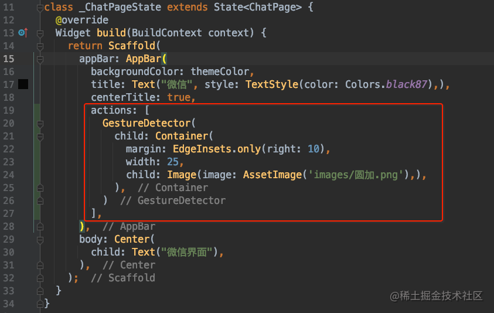

如果我们按照这个思路写下去的话，就需要自己再去实现一个弹出菜单的类。其实 flutter 提供了我们一些现成的类可以做到类似的效果。

## `PopupMenuButton`

`PopupMenuButton` 类用来弹出一个菜单，必传参数为 `itemBuilder`，用来实现它需要展示的内容。`PopupMenuItem` 就是用来展示内容的类。这里有一个细节说一下，`PopupMenuButton` 有一个 `onSelected` 属性，这个属性是个闭包，意思是选中某个 `PopupMenuItem` 的时候，会调用这个闭包。但是有一个前提就是每个 `PopupMenuItem` 的 `value` 必须不为 null 的时候，才会执行 `onSelected` 闭包，我在这里卡了半天，网上找了半天资料也没有明确讲到这里。其他就没什么好讲的了，都比较简单。

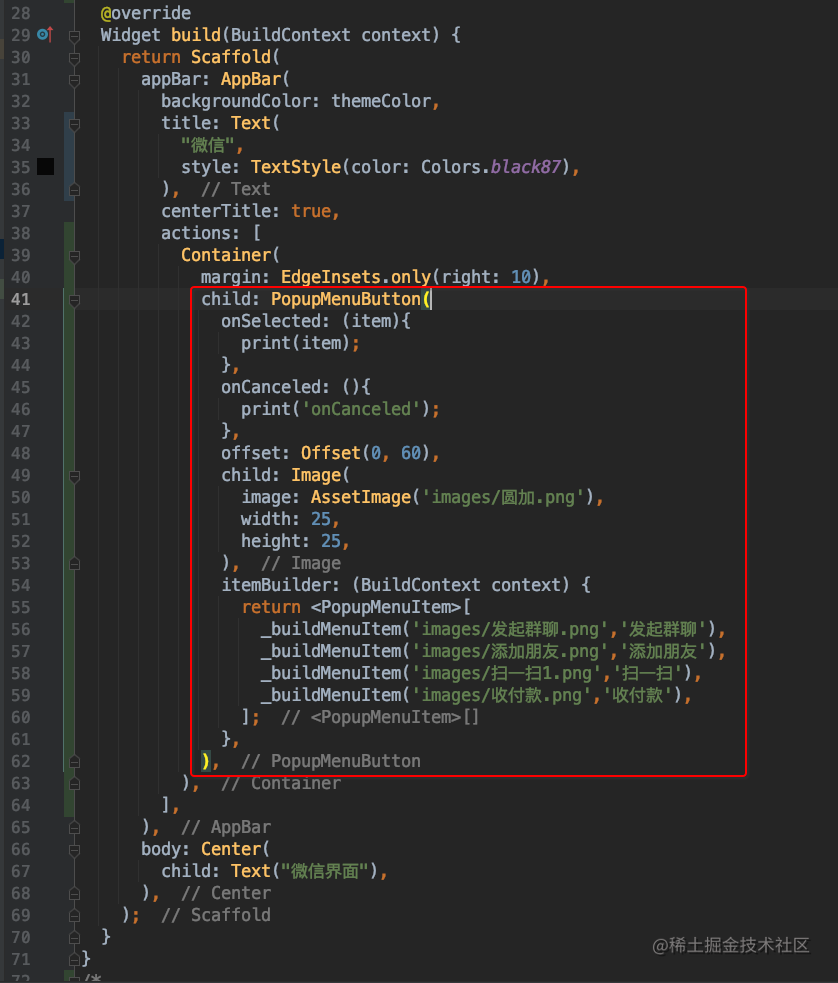

其中 `_buildMenuItem` 的实现如下，注意 `value` 要赋值就好了，不为空就行，不然 `PopupMenuButton` 的 `onSelected` 不执行：

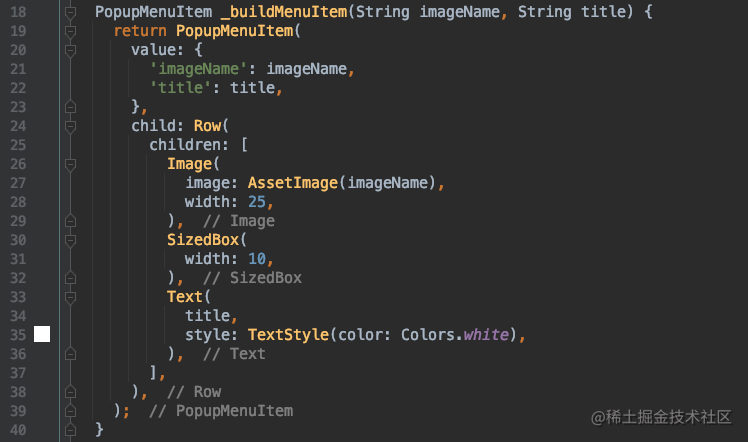

还有一个小细节，如何设置 `PopupMenuButton` 的颜色，可以直接设置它的颜色

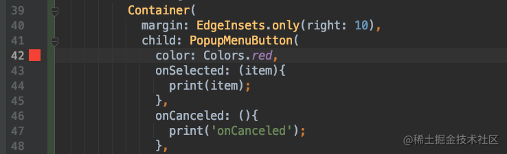

还可以设置APP的主题的 `cardColor`，不过这个优先级没有直接设置 `PopupMenuButton` 颜色高。

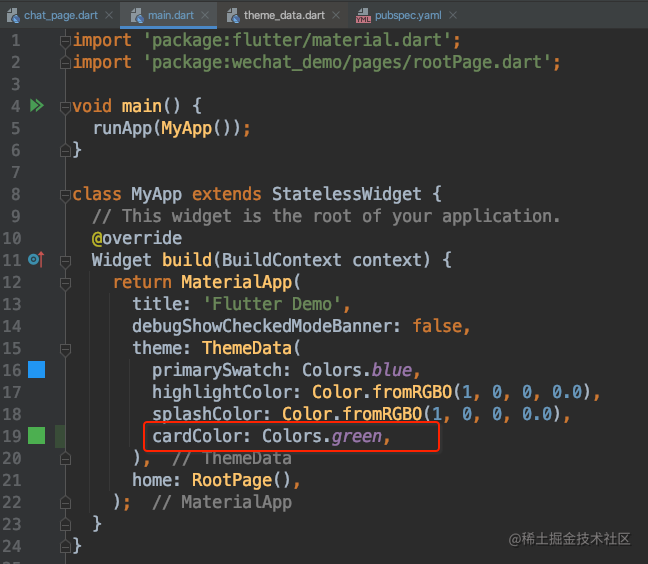

# 请求网络数据

## https://pub.flutter-io.cn/

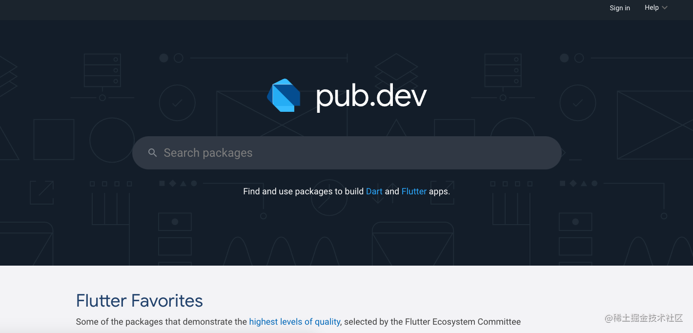

这个网站可以搜索 flutter 使用的包 packages。我们使用 http 这个包来请求我们的网络数据。这个包是 flutter 官方提供的。实际项目开发的时候可能并不会使用 http 这个包，大部分是使用 dio 来请求网络数据。这里只介绍官方的 http 包如何使用。

## 导入http包

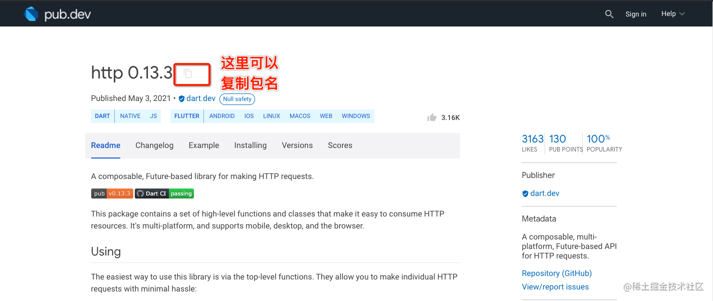

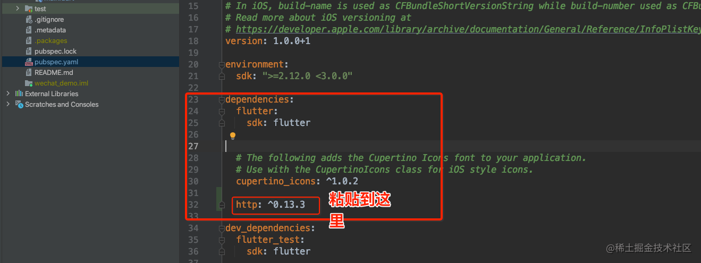

粘贴完成之后需要更新一下，就是获取一下包对应的代码。可以通过上方的 `Pub get`,也可以在终端中输入 `flutter packages get` 

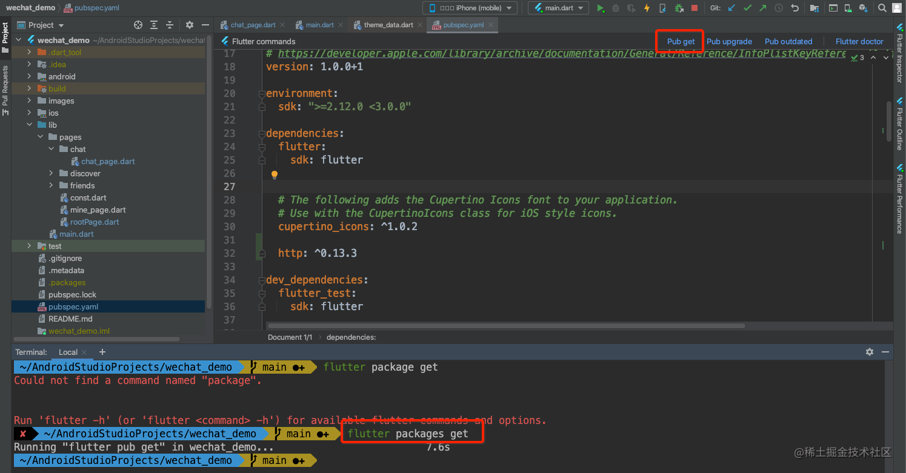

命令执行完之后，就可以使用这个包了。

## 导入 http 头文件并取别名

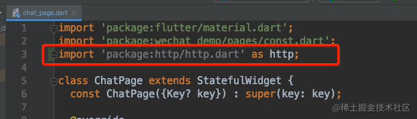

## 发送请求

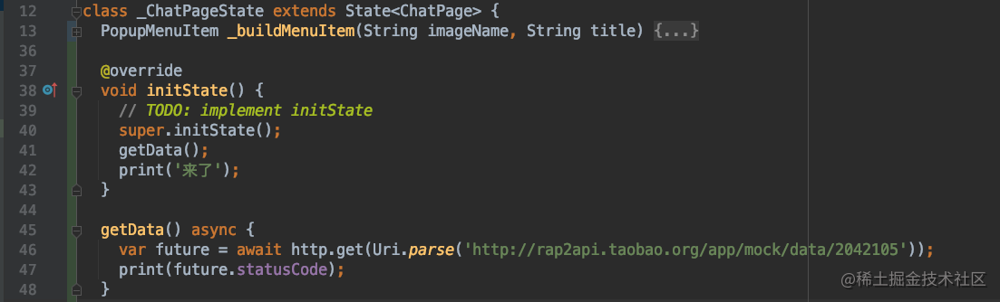

请求的发送写在 `initState` 里面。`getData()` 后面跟了一个 async 表示的是异步执行。async 需要搭配 await 使用，await 后面跟着的是耗时的代码。所以上面的程序会先打印来了，然后再输出请求的状态码；

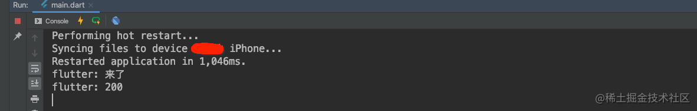

点击其他的页面，再次回到当前页面会发现 initState 方法重新走了一遍，这是因为我们还没有保存住状态，后面会讲到如何保持 Widget 的状态。

## 处理返回的数据

首先介绍一下，在 flutter 中如何将请求返回的 JSON 数据转为 Map，在我们 iOS 开发中是转为字典，而 flutter 中没有字典这个类型，对应的类型是 Map。以及如果将 Map 转为 JSON。在 iOS 中我们知道会使用一个 `NSJSONSerialization` 的类用来处理JSON数据。同样的，在 flutter 中也会有一个专门的类 `JsonCodec` 来处理。

### JSON 和 Map 互相转

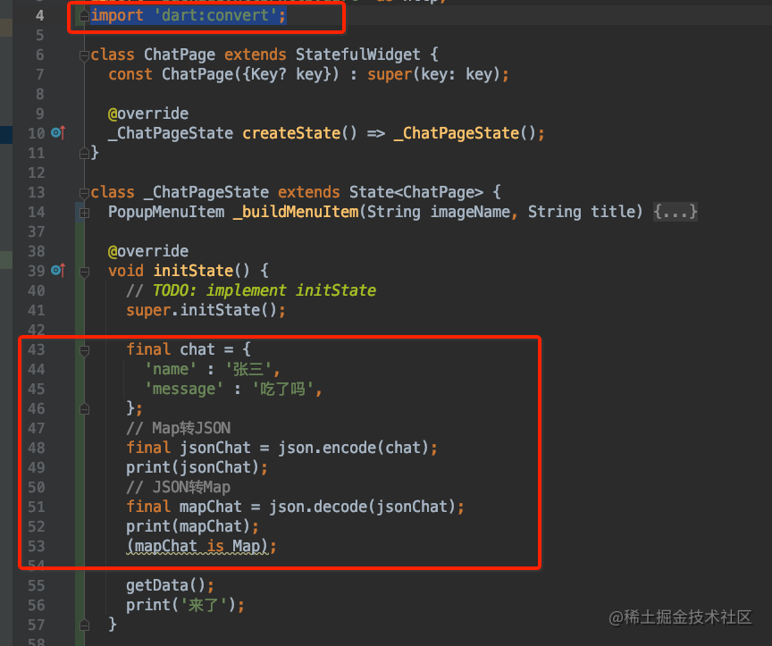

其中的 json 就是 `JsonCodec` 的实例。需要导入 `'dart:convert'` 头文件。flutter 中还可以通过 `is` 来判断是不是某个类型。

### 新建聊天模型

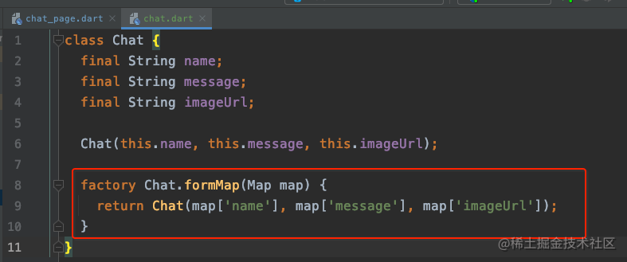 

除了红框内的方法之外，其他没什么新鲜事物。红框内的方法应该说是一个工厂方法，是设计模式的一种，用来初始化对象的。除了默认的初始化方法，还可以使用这个工厂方法来实例化一个 Chat 对象。模型建立好了之后就可以处理响应的数据了

### 处理响应的数据

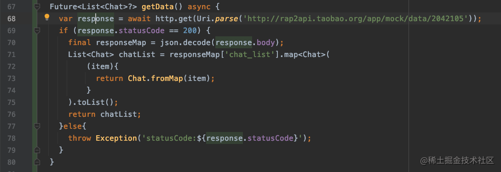

这里用到了 Future，关于 Future 的讲解可以看官方文档 [https://dart.cn/tutorials/language/futures](https://dart.cn/tutorials/language/futures)

# 使用 FutureBuilder 显示界面

很多时候我们会依赖一些异步数据来动态更新 UI，比如在打开一个页面时我们需要先从互联网上获取数据，在获取数据的过程中我们显示一个加载框，等获取到数据时我们再渲染页面；当然，通过 StatefulWidget 我们完全可以实现上述这些功能。

但由于在实际开发中依赖异步数据更新UI的这种场景非常常见，因此 Flutter 专门提供了 `FutureBuilder` 来快速实现这种功能。`FutureBuilder` 会依赖一个 `future`，它会根据所依赖的 `future` 的状态来动态构建自身。这个 `future` 我们刚刚已经准备好了。关于 `FutureBuilder` 的介绍 [这篇文章](https://book.flutterchina.club/chapter7/futurebuilder_and_streambuilder.html#_7-5-1-futurebuilder) 讲解的很详细。
最后完整代码如下：

# 不使用 FutureBuilder 的方式

刚刚说了，我们可以使用 FutureBuilder 来快速实现展示异步网络数据，也可以自己实现，现在我们自己实现一下。使用一个私有变量 \_chatList 记录请求下来的数据，再根据 \_chatList 的值来展示不同的页面。代码如下：

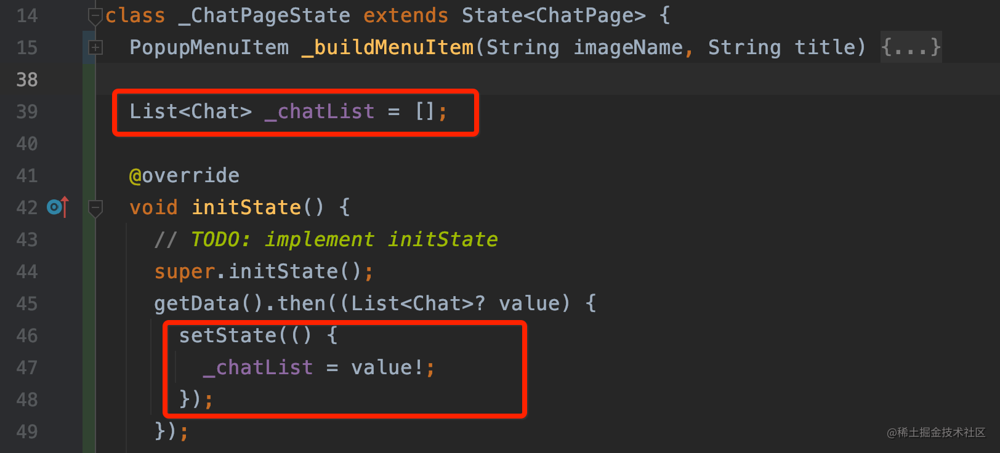

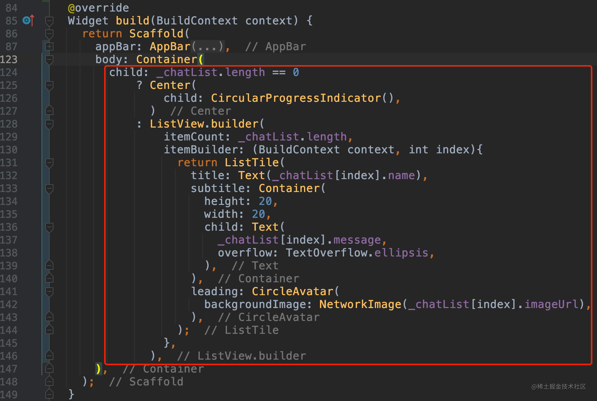

因为 getData 的返回值是 Future 的原因，getData() 后面可以跟 `then` 方法，还可以跟错误捕获 `catchError`,完成时的回调 `whenComplete`，超时设置 `timeOut` 等等，这种写法挺有意思，一路点下去就完了...

## 实现超时取消刷新功能

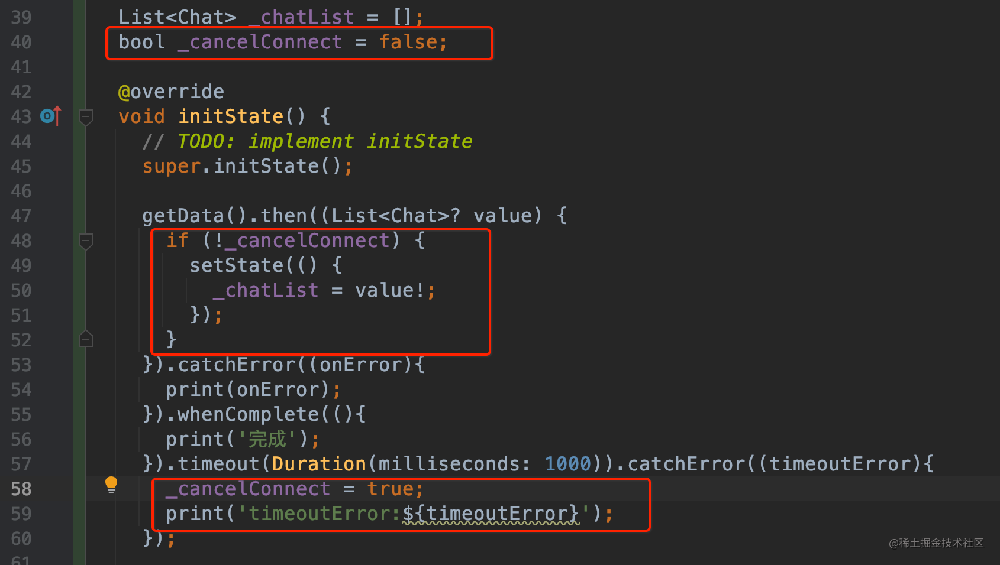

在每次请求的时候，重置 `_cancelConnect` 的值。

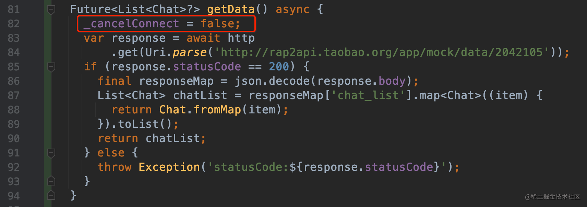

# 保持 Widget 的状态

我们来回点击通讯录页面和聊天页面，会发现每次点击进入当前的页面，都会重新的载入，`initState()` 会被重新调用。将通讯录页面滑动到底部，再次点击进入会发现又默认回到了顶部。为什么会出现这样的问题。正是因为我们的Widget的状态没有保持，每次展示都重新创建了。

Dart 语言中有一个 Mixins 的概念：[官方的解释是这样](https://dart.cn/samples#mixins)，可以给类 A Mixins 一个 B，那么 A 就拥有了 B 的属性和方法。有点像 OC 的类扩展的意思。保持 Widget 的状态就需要用到这个语言特性。一共有三个步骤：

1. Mixins 类`AutomaticKeepAliveClientMixin`
2. 重写`wantKeepAlive`方法
3. 调用父类Builder方法

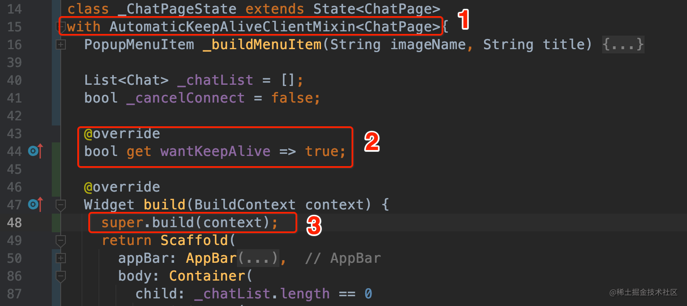

同样把通讯录页面也实现上面的步骤。然后再次来回点击发现还是没有保持住状态？？？这里有一个最大的问题就是我们的根 Widget 都没有保持住状态，那还谈什么保持子 Widget 的状态呢。。。

## 使用 PageView

来到 rootPage.dart 文件，我们会看到 body 里面直接取了数组的某个元素作为根 Widget 展示。这样是无法保持住状态的，使用 PageView 才可以保持住状态。

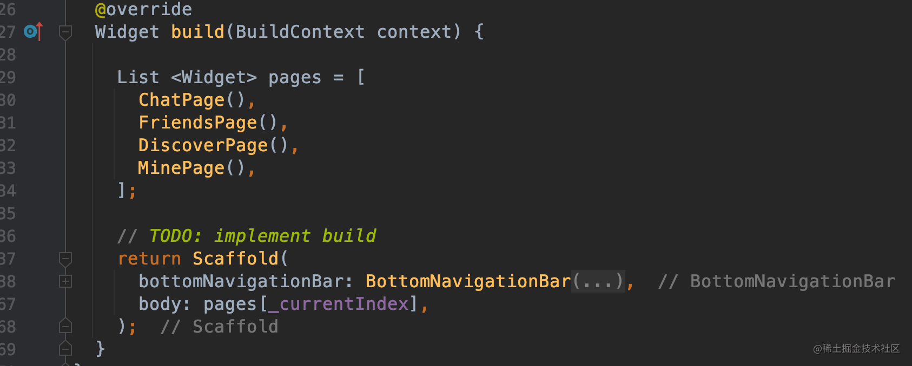

使用 PageView，代码如下：

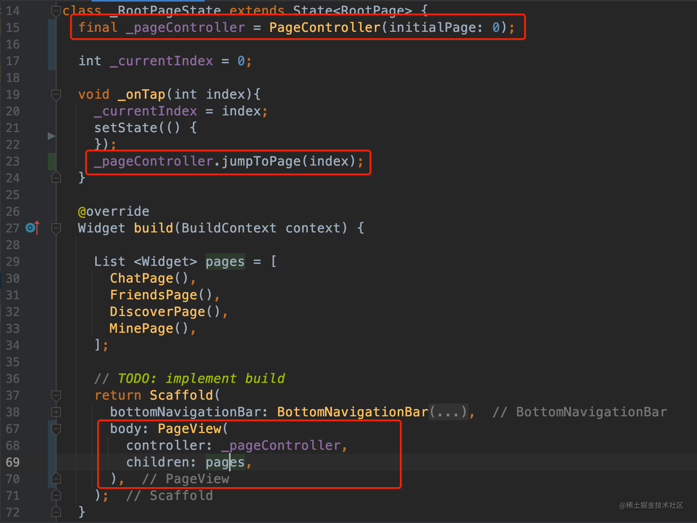

点击跳转到其他页面就可以直接通过 _pageController 来完成。使用了 PageView 之后会发现，不同的页面之间可以直接通过手势左右滑到就能切换了。这样的效果我们一般是不需要的，可以设置直接关闭。如果需要的话，在滑动的方法里面重新设置底部导航条的正确位置也是没有问题的。

### 使用滑动切换，解决 bug

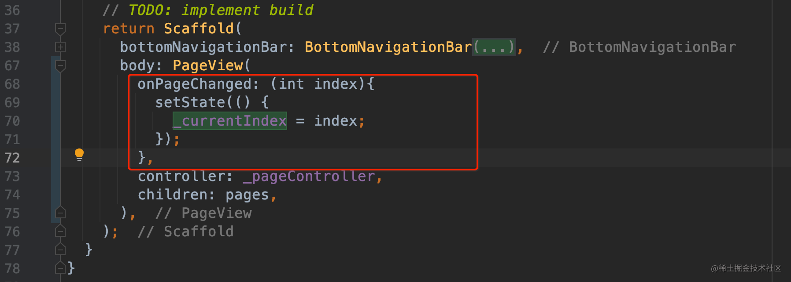

### 禁用滑动切换

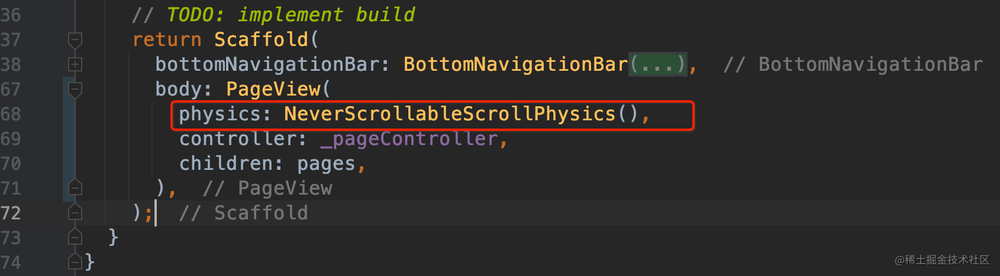

