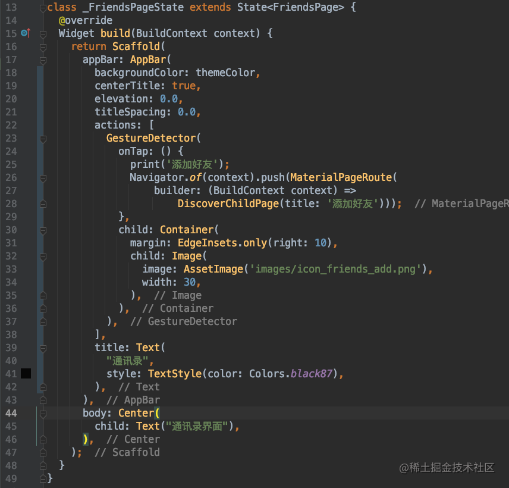

上一篇文章我们已经完成了发现页面的搭建，下一步我们实现微信的我的页面

# 我的页面

在着手开发我的页面之前，先新建一个 discover 目录，将发现页面相关的文件统一挪动到这个目录下。这里会发现 Android Studio 一个比较特别的地方，新建一个目录后，挪动了的文件不需要重新导入头文件。AndroidStudio 会在需要的地方自动补全路径。这点感觉还是蛮智能的。

## 设置APP启动默认展示我的页面

这个设置在上一篇文章开发发现页面的时候也说过了，就是修改 rootPage.dart 文件里 _currentIndex 的值。

## 布局右上角的拍照按钮

观察这个右上角的拍照按钮，会发现上下拖动列表的时候，这个拍照按钮的位置是不会发生变化的。意思是拍照按钮和列表是同级的关系，不是父子控件的关系。所以这里的布局我们可以使用 Stack 来实现，ListView 放在底下，这个拍照按钮放在上面。布局的方式多种多样，只要是能实现需求效果的都是可行的。这个 flutter 的 UI 布局有时候写着写着就会发现括号对不上，使用 command + option + L 也不管用，依然对不齐，这对于某些强迫症的人看起来是真的挺难受的，下图里都还是我一行一行调整了之后的。

## 实现 ListView 的普通 cell 部分

我的页面的 ListView 的头部那个 cell 明显和它其他的 cell 不同，其他的 cell 跟我们上一篇文章里开发的 discover_cell 基本上是类似的，所以可以直接拿过来使用。做过 iOS 开发的都知道，tableView 等滚动视图作为控制器的根视图的时候，顶部都会有一个间距，在 flutter 里面也有这样的情况，如果需要干掉，就需要将我们的 ListView 包装在一个 `MediaQuery.removePadding()` 里面，然后设置它的属性 `removeTop: true`。这样就可以去掉顶部的间距了。完整代码如下：

此时APP显示如图：

## 实现 ListView 的头部 cell

可以看到我们的 _MinePageState 的 build方 法已经够长了，所以关于头部 cell 的代码我们可以封装为一个方法写在其他的地方。

关于头部 cell 这里除了布局稍微复杂了一些之外，就只有给图片加圆角是没有讲过的。要设置圆角图片的话，就不能使用 Image 类了。需要使用到 `BoxDecoration` 类，它可以设置圆角半径 `borderRadius` 和图片 `image`。完整代码如下：

 
APP 显示效果如图： 

我的页面就这样完成了。发现页面和我的页面这两个页面主要是对布局的灵活运用，都还是比较简单的。

# 通讯录页面

接下来实现通讯录界面，这节课先只实现到下图这样，边上的索引下节课再实现。

## 设置 APP 启动默认展示通讯录页面

这一步已经讲过 2 次了，就不再贴图了...

## 设置通讯录页面导航栏

导航栏的颜色，我们修改了好几次了。这个颜色可以放在一个 const.dart 的公用文件里。以后统一使用这个颜色，也方便以后统一修改。

然后是通讯录页面的导航条，除了标题之外，右侧还有一个添加好友的按钮，可以使用 AppBar 的 title 实现一个复杂的导航条，但其实没那个必要。AppBar 提供了一个 actions 属性，这个属性就是展示在导航条右侧的，直接使用这个 actions 就可以了。代码如下：

## 实现通讯录列表 cell

通讯录列表 cell 可以使用一种 cell 来完成，也可以使用两种不同的 cell 来完成，如果使用一种 cell 的话，代码里面需要判断的逻辑就会有点多。所以我这里推荐使用两种 cell 来完成。第一种就是头部的 4 个 cell，这几个属于一类，我们使用类 `_FriendLocalCell` 来表示，而其余的都是属于好友 cell 属于一类，用类 `_FriendNetworkCell` 表示。关于这两种 cell 我们暂时先不新建文件存放，直接在 friends_page.dart 文件中写。

### 实现 `_FriendLocalCell`

这一类 cell 主要是用来展示当前列表头部的几个 cell 的，这几个 cell 的图片都是从本地加载的。从效果图上可以看出，这个 cell 只需要 title，和 imageName 这两个必传参数就够了。然后是关于布局。最外层使用一个 Row 进行左右布局，左侧使用一个能显示圆角的图片。右侧再用一个 Column 进行上下布局，将文本和底部的分隔线上下排列。这里主要有一个地方没有讲到过，就是在 flutter 中获取屏幕的宽高，我们会抽成一个方法，放在 const.dart 文件中。如下图所示：

`_FriendLocalCell` 完整代码如下：

### 实现 `_FriendNetworkCell`

关于 `_FriendNetworkCell`，可能乍一看之下，会觉得应该和上面的 cell 差不太多。但是实际上还是有那么些区别的。首先 flutter 的 ListView 的是没有组的概念的，所以关于组标题就需要我们自己来动手实现了，这里的做法就是，除了上面的 `_FriendLocalCell` 所有的子控件之外，每一个 cell 都带上一个组标题，然后根据组标题是否有值，来显示或不显示组标题。那么在布局方面，就需要对上面的 cell，再包装一个 Column，将组标题和头像名称部分包起来。所以当前 cell 所需要的属性，除了好友的名字 `name` 和头像 `imageUrl` 为必须之外，还需要一个 `groupTitle` 为可选参数。

完整的代码如下：

## 准备数据模型

同样的，数据我们也分为两种，一种我们就叫作通讯录，使用 `AddressBook` 来表示。另一种叫好友用 `Friends` 表示。我们将好友列表用到的数据模型都放在新的文件 friends_data.dart 文件中。

### 准备 `AddressBook` 模型数组

这个模型数组，可以直接根据我们在效果图上看到的东西，生成对应的模型，和数组就好了。完整代码如下：

### 准备 `Friends` 模型数组

这里的数据源已经准备好了，我们只需要根据数据源创建出对应的模型。这个数组是好友数组,有需要的可以自行前往[下载](https://github.com/masterKing/wechatDemo)。

## 实现部分通讯录页面

现在我们的视图和数据都已经准备好了。接下来就是直接使用了，我们之前在发现页面使用 ListView 的方式，没有使用 builder，是直接使用的方式，就跟我们在 iOS 中的 cellForRow 方法中每次创建一个新的 cell 的方式一样，cell 没有重复利用。而今天我们使用 builder 的这种方式，就是 cell 被放入缓存池中被重复利用的方式。使用 `ListView.builder()` 的方式，需要传入两个参数，一个是 itemCount 元素的个数。一个是 itemBuilder，类似于 cellForRowAtIndexPath 方法，需要我们创建 cell 并返回。完整的代码如下：

这里再说一下对 datas 进行排序的地方。这个方法 `initState()` 有一个 @override 修饰，意思就会重写父类的方法，而且这个方法应该是调用的比 build 要早的。这样才能保证展示数据的时候，数据是已经经过排序过的。而这个排序的方法，其实跟 iOS 中的 `sortedArrayUsingComparator:` 排序也非常的像，传入一个代码块的方式。所以有开发经验的同学，会发现真的有些东西，各个平台都是通用的，学起来也会更快更容易上手。最后 APP 的显示如下图：

