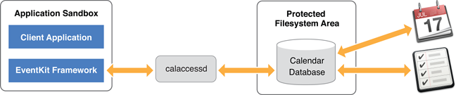

最近的项目需要用到 EventKit 来实现，于是在官网找到了这篇文章，虽然属于老文档了，但是对于需要接入 EventKit 的人来说还是有必要了解一下的。最新的文档也只是在这个基础上做了些更新，对于英语好的读者，完全可以直接看 [官网介绍](https://developer.apple.com/library/archive/documentation/DataManagement/Conceptual/EventKitProgGuide/Introduction/Introduction.html#//apple_ref/doc/uid/TP40004759-SW1)就好了，我这里是对官方文档的一遍翻译，再加上自己实践的一点点内容。

# 介绍 Calendars 和 Reminders

EventKit 框架帮助您访问用户的日历和提醒信息。虽然两个不同的应用程序显示用户的日历和提醒数据，但操作数据的框架是相同的。类似地，存储该数据的数据库(称为 Calendar 数据库)同时保存日历和提醒信息。

EventKit architecture



> 重要： iOS10.0 及之后的 APP 必须在它们的 Info.plist 文件中配置需要访问这些数据的使用说明，否则 APP 将会崩溃。来访问 Calendars 和 Reminders 数据，Info.plist 必须分别包含 NSRemindersUsageDescription 和 NSCalendarsUsageDescription 这两个键。

EventKit 不仅允许你的应用程序检索用户现有的日历和提醒数据，它也可以让你的应用程序为任何日历创建新的事件和提醒。此外，EventKit还允许用户编辑和删除他们的事件和提醒(统称为“日历项”)。更高级的任务，如添加闹铃或指定重复事件，也可以通过 EventKit 实现。如果你的应用程序外部发生了日历数据库的变化，EventKit 能够通过通知检测到变化，这样你的应用程序就可以适当地运行。使用 EventKit 对日历项所做的更改会自动同步到相关的日历(CalDAV, Exchange，等等)。

本文档描述了 EventKit 的概念和常见的编程任务。如果你想在应用程序中显示或编辑日历事件和/或提醒数据，你应该阅读本文档。EventKit  提供对用户日历数据库的有限访问。它不包括实现一个功能齐全的日历或提醒应用程序所需的所有内容，比如添加与会者或账户。

## At a Glance 

本文档包含以下章节，描述了如何在应用程序中集成用户的日历和提醒数据:

* 读和写日历事件：说明如何检索、创建和修改日历事件。
* 读和写提醒：说明如何检索、创建和修改提醒。
* 配置闹铃：说明如何将闹铃附加到日程表项目。
* 创建重复事件：解释如何将事件设置为重复事件。
* 观察日历数据库的外部更改：说明如何注册与 Calendar 数据库的外部更改有关的通知
* 为事件提供接口：说明如何显示事件视图控制器以允许用户创建和编辑事件

# 读和写日历事件

您可以使用 `EKEventStore` 类从用户的 Calendar 数据库中获取、创建、编辑和删除事件。您可以获取与您提供的谓词匹配的自定义事件集，也可以通过其惟一标识符获取单个事件。获取事件后，可以通过`EKEvent`类的属性访问其关联的日历信息。同样，您可以通过设置`EKEvent`类的属性来修改它的日历信息。

> 重要：iOS10.0 之后的 APP，如果需要访问日历数据，需要在你的 APP 的 Info.plist 文件中包含 NSCalendarsUsageDescription 的键，说明写不写都不重要，不过为了更好的用户体验建议写上

## 连接到 Event Store

使用指定的初始化器初始化一个 `EKEventStore` 对象：

``` objc
EKEventStore *store = [[EKEventStore alloc] initWithAccessToEntityTypes:EKEntityMaskEvent];
```

实践发现上面的初始化方式已经废弃了，而且仅在 MacOS10.8-10.9 可用。现在使用直接 alloc，init 初始化就行了。初始化 `EKEventStore` 后，在试图获取或创建实体类型的数据之前，必须调用 `requestAccessToEntityType:completion:`。

一个 `EKEventStore` 对象需要相当多的时间来初始化和释放，因此，不应该为每个与事件相关的任务初始化和释放单独的 `EKEventStore` 对象。相反，在应用程序加载时初始化单个 `EKEventStore` 对象，并重复使用它，以确保您的连接是长期的。

`EKEventStore` 对象不能在其他 EventKit 对象之前被释放。否则，可能会出现未知的行为。

## 检索事件

检索事件有两种方法

- 通过谓词或搜索查询进行的获取将返回零个或多个与给定查询匹配的事件。
- 通过唯一标识符获取将返回与给定标识符对应的单个事件。

> 请注意：从 Calendar 数据库检索事件并不一定会按时间顺序返回事件。要按日期对一个 EKEvent 对象数组排序，在数组中调用 `sortedArrayUsingSelector:`，为 `compareStartDateWithEvent:` 方法提供选择器。

### 使用谓词

获取日期范围内的事件是很常见的。`EKEventStore` 方法 `eventsMatchingPredicate:` 获取在你提供的谓词中指定的日期范围内的所有事件。以下代码演示了如何获取当前日期前一天到之后一年之间发生的所有事件。

> 请注意：尽管 `eventsMatchingPredicate:` 方法接受 `NSPredicate` 类型的参数，但你必须提供一个由 `EKEventStore` 方法 `predicateForEventsWithStartDate:endDate:calendar:` 创建的谓词。

使用谓词获取事件代码

``` objc
    NSCalendar *calendar = [NSCalendar currentCalendar];

    NSDateComponents *oneDayAgoComponents = [[NSDateComponents alloc] init];
    oneDayAgoComponents.day = -1;
    NSDate *oneDayAgo = [calendar dateByAddingComponents:oneDayAgoComponents
                                                  toDate:[NSDate date]
                                                 options:0];
                                                 
    NSDateComponents *oneYearFromNorComponents = [[NSDateComponents alloc] init];
    oneYearFromNorComponents.year = 1;
    NSDate *oneYearFromNow = [calendar dateByAddingComponents:oneYearFromNorComponents
                                                       toDate:[NSDate date]
                                                      options:0];

    EKEventStore *store = [(AppDelegate *)UIApplication.sharedApplication.delegate eventStore];
    NSPredicate *predicate = [store predicateForEventsWithStartDate:oneDayAgo
                                                            endDate:oneYearFromNow
                                                          calendars:nil];
    NSArray *events = [store eventsMatchingPredicate:predicate];

    NSLog(@"%zd,%@",events.count,events);
```

通过传递一个 EKCalendar 对象数组作为 `predicateForEventsWithStartDate:endDate:calendar:` 方法的日历参数，可以指定要搜索的日历子集。您可以从 `EKEventStore` 对象的 `calendarsForEntityType:` 方法中获取用户的日历。传递 `kNilOptions` 告诉方法从用户的所有日历中获取。

因为 `eventsMatchingPredicate:` 方法是同步的，所以你可能不想在应用的主线程上运行它。对于异步行为，使用 `dispatch_async` 函数或 `NSOperation` 对象在另一个线程上运行该方法。

### 使用惟一标识符

如果您之前通过谓词获取到了事件的唯一标识符，那么您可以使用 `EKEventStore` 对象的方法 `eventWithIdentifier:` 来获取事件。如果是循环事件，此方法将返回该事件的第一次出现。您可以使用 `eventIdentifier` 属性获得事件的唯一标识符。

## 创建和编辑事件

> 注意:如果你是在 iOS 上开发，你可以选择让用户使用 EventKit UI 框架提供的事件视图控制器修改事件数据。有关如何使用这些事件视图控制器的信息，请参见为事件提供接口。

使用 EKEvent 类的 eventWithEventStore: 方法创建一个新事件。

您可以编辑事件的细节通过设置事件的相应属性，不管是新创建的事件，还是之前从日历数据库中获取到的事件。你可以编辑的一些细节包括以下几个方法：

- `title` 属性，编辑事件的标题
- `startDate` 和 `endDate` 属性，编辑事件的开始日期和结束日期
- `calendar` 属性，编辑与事件相关联的日历
- `alarms` 属性，编辑与事件相关联的警报（有关详细信息，请看后面的配置警报）
- `recurrenceRules` 属性，编辑事件的循环规则（如果它是一个重复事件，有关更多细节，请看后面的创建重复事件）

## 保存和删除事件

> 重要提示:如果你的应用修改了用户的日历数据库，那么它必须在修改之前得到用户的确认。如果没有用户的特定指令，应用程序永远不应该修改日历数据库。

在保存事件之前，对事件所做的更改不是永久的。通过 `EKEventStore` 的方法 `saveEvent:span:commit:error:` 保存你对事件的更改。如果你想从日历数据库中删除一条事件，使用 `EKEventStore` 的方法 `removeEvent:span:commit:error:`。无论您是保存还是删除事件，实现相应的方法都会自动将您的更改与事件所属的日历(CalDAV、Exchange等)同步。

如果您正在保存一个重复发生的事件，则您所做的更改可以应用于将来发生的所有事件，通过为 `saveEvent:span:commit:error:` 方法的 `span` 参数指定 `EKSpanFutureEvents`。同样地，你可以通过为 `removeEvent:span:commit:error:` 方法的 `span` 参数指定 `EKSpanFutureEvents` 来删除所有将来发生的事件

> 注意:如果向 commit 参数传递 NO，请确保稍后调用 commit: 方法永久保存更改。意思是如果上面这些方法的 commit 参数你传了 NO，那么就需要在后面的代码手动调用 commit 方法来保存更改

## 对事件执行批量操作

你可以使用 `EKEventStore` 方法 `enumerateEventsMatchingPredicate` 对所有谓词匹配的事件执行操作:你必须通过 `EKEventStore` 的方法 `predicateForEventsWithStartDate:endDate:calendars:` 来创建上述方法中用到的谓词。你提供的操作是一个类型为 EKEventSearchCallback的Block。

``` objc
typedef void (^EKEventSearchCallback)(EKEvent *event, BOOL *stop);
```

block 被传递两个参数:<br>

event<br>
&emsp;&emsp;当前正在操作的事件。<br>
stop<br>
&emsp;&emsp;一个布尔值，确定

`enumerateEventsMatchingPredicate:usingBlock:` 是否应该停止处理事件。如果是，则任何与谓词匹配但尚未处理的事件将保持未处理状态。

> 重要提示:请记住，使用此方法可能会对用户的 Calendar 数据库造成重大更改。当您请求用户确认时，请确保用户完全了解将要执行的操作。

因为 `enumerateEventsMatchingPredicate:usingBlock:` 方法是同步的，所以你可能不想在你的应用程序的主线程上运行它。对于异步行为，使用 `dispatch_async` 函数或 `NSOperation` 对象在另一个线程上运行该方法。

# 读和写提醒

提醒是与特定时间或地点相关联的任务。提醒是与特定时间或地点相关联的任务。它们类似于日历事件，但是可以标记为完成，并且不一定跨越一个确切的时间段。

因为 `EKReminder` 继承自 `EKCalendarItem`，所以你可以像处理事件一样对提醒执行相同的方法，比如使用 `addAlarm:` 添加一个告警，或者使用 `addRecurrenceRule:` 设置一个递归规则。

> 重要提示:如果你的 iOS 应用链接在 iOS 10.0 或之后，你需要访问提醒数据，请确保在你的 Info.plist 文件中包含 NSRemindersUsageDescription 关键字

## 检索提示

与事件一样，您必须首先建立到 `EKEventStore` 的连接，以访问现有提醒。如果尚未连接到 Event Store，请参见连接到 Event Store。

初始化连接并访问提醒，传递 `EKEntityMaskReminder` 而不是`EKEntityMaskEvent`。

``` objc
EKEventStore *store = [[EKEventStore alloc] initWithAccessToEntityTypes:EKEntityMaskReminder];
```

同样的，上面这段代码也是废弃了，直接创建`alloc init`创建 EKEventStore 对象就好了。

就像搜索事件一样，有两种方法可以检索提醒。

### 使用谓词

你可以调用 `fetchRemindersMatchingPredicate:completion:` 来访问多个与谓词匹配的提醒。传递由下列方法返回的谓词:

- `predicateForIncompleteRemindersWithDueDateStarting:ending:calendars:` 在可选的时间段内找到未完成的提醒
- `predicateForCompletedRemindersWithCompletionDateStarting:ending:calendars:` 在可选的时间段内找到完成的提醒
- `predicateForRemindersInCalendars:` 查找所有的提醒

通过将 block 传递给 completion 参数，可以在匹配的提醒之间进行迭代，如下面代码所示。

``` objc
    NSPredicate *predicate = [store predicateForRemindersInCalendars:nil];
    [store fetchRemindersMatchingPredicate:predicate completion:^(NSArray *reminders) {
        for (EKReminder *reminder in reminders) {
            // do something for each reminder
            
        }
    }];
```

> 注意:与通过谓词获取事件不同(参见使用谓词)，您可以通过谓词异步获取提醒，而无需分派给另一个线程。如果你想通过谓词终止取回请求，调用 `cancelFetchRequest:`，参数是 `fetchRemindersMatchingPredicate:completion:` 返回的标识符。

### 使用惟一标识符

如果您知道某个特定提醒的唯一标识符，那么您可以调用 `calendarItemWithIdentifier:` 对象方法。 `calendarItemWithIdentifier:` 可以获取任何日历项(提醒和事件)，而 `eventWithIdentifier:` 只获取事件。

## 创建和编辑提醒

你可以使用 `EKReminder` 的 `reminderWithEventStore:` 类方法来创建提醒。标题和日历属性是必需的。提醒的日历属性是将其分组的列表。

像事件一样，提醒可以触发基于时间或位置的闹铃，提醒用户某项任务。有关如何将闹铃附加到日历项目的详细信息，请参阅配置闹铃。

要将开始日期或到期日期与提醒关联，请使用 `startDateComponents` 和 `dueDateComponents` 属性。要完成提醒，请将 completed 属性设置为 YES，它会自动将 completionDate 设置为当前日期。

## 保存和删除提醒

> 重要提示:如果你的应用修改了用户的日历数据库，那么它必须在修改之前得到用户的确认。如果没有用户的特定指令，应用程序永远不应该修改日历数据库。

提醒以类似于事件的方式保存。要将提醒保存到 Calendar 数据库，调用 `saveReminder:commit:error:` 方法。要删除一个事件，调用 `removeReminder:commit:error:` 方法。

记住，在保存提醒之前，必须显式设置标题和日历属性。

> 注意:与保存或删除事件时一样，请确保如果将 NO 传递给 commit 参数，稍后调用 commit: 方法来保存更改。

# 配置闹铃

提醒用户即将发生的事件的一个简单方法是为他们的日历项目设置闹铃。无论当前运行的应用程序是什么，闹铃都会以通知的形式出现在前台，提醒用户有预定的事件。如果将闹铃设置为日历事件，则通知来自日历应用程序。如果一个闹铃被设置为提醒，通知来自提醒应用程序。闹铃可以是基于时间的，在指定的时间触发。或者是基于位置的，当穿越地理围栏时触发。

闹铃可以应用于日历事件和提醒。

> 注意:闹铃不打算作为 UILocalNotification。闹铃需要你创建一个事件或提醒，在用户的日历或提醒应用程序中可见。 UILocalNotification 更适合于不涉及 Calendar 数据库的一般用途。

## 挂载和移除闹铃

可以使用 `addAlarm:` 方法将告警添加到事件中。可以使用绝对日期或相对于事件开始日期的偏移量创建闹铃。使用相对偏移量创建的警报必须发生在事件的开始日期之前或开始日期。

在 OS X 中，你可以在发出警报的同时触发一个动作;例如,设置:

- 发送电子邮件的 emailAddress 属性
- 用于播放声音的 soundName 属性
- 打开 url 的 url 属性

您可以使用 removeAlarm: 方法从事件中删除闹铃。

## 设置地理围栏

> 注意:地理围栏在 OS X 和 iOS 上都得到支持，但它们在移动设备上更有效。

“地理围栏”是一个围绕着某个地理位置的虚拟边界，当它被越过时，就会触发某个事件的警报。地理围栏是一种有用的方法，可以提醒用户在进入或离开某个区域时需要执行的任务。例如，当用户离开他们的工作场所时，警报器就会响起，提醒他们在杂货店停下来。作为开发人员，您可以控制中心的纬度和经度，以及地理围栏的半径。

通过创建闹铃并设置其结构位置和接近度，为事件配置一个地理围栏。调用 `locationWithTitle:` 方法来创建一个结构化位置。要设置经度和纬度坐标，请将 `CLLocation` 传递给返回的结构化位置的 `geoLocation` 属性。radius 属性的值为 0 将使用系统的默认 radius。要选择自己的半径，请指定一个以米为单位的值。

虽然启用了地理围栏功能的闹铃可以应用于事件，但它们更适合用于提醒。

# 创建重复事件

重复事件在指定的时间间隔内重复。要使一个事件成为一个重复发生的事件，请为它分配一个重复发生规则，该规则描述事件发生的时间。递归规则由 `EKRecurrenceRule` 类的实例表示。

递归适用于日历事件和提醒。与重复事件不同，只有重复集的第一个未完成提醒是可获得的。EventKit 和提醒应用都是如此。当提醒完成时，递归集中的下一个提醒就可用了。

## 使用基本的规则

可以使用 `initRecurrenceWithFrequency:interval:end:` 方法创建简单的日、周、月或年模式的递归规则。你给这个方法提供了三个值:

- 递归频率。这是 `EKRecurrenceFrequency` 类型的值，表示复发规则是每天、每周、每月还是每年。
- 递归间隔。这是一个大于0的整数，用于指定模式重复的频率。例如，如果递归规则是每周递归规则，并且它的间隔是1，那么模式每周重复一次。如果递归规则是月递归规则，且其间隔为3，则模式每三个月重复一次。
- 递归结束。这个可选参数是 `EKRecurrenceEnd` 类的一个实例，它指示递归规则何时结束。递归结束可以基于一个特定的结束日期或出现的数量。如果你不想为递归规则指定结束，则传递 nil。

## 使用复杂的规则

你可以使用

``` objc
    initRecurrenceWithFrequency:
                       interval:
                  daysOfTheWeek:
                 daysOfTheMonth:
                monthsOfTheYear:
                 weeksOfTheYear:
                  daysOfTheYear:
                   setPositions:
                            end:
```

方法来创建一个复杂的递归规则。对于基本的递归规则，您可以为重复发生的事件提供频率、间隔和可选的结束。此外，还可以提供描述自定义规则的可选值组合，如下表中所示

复杂递归规则分解

|参数名称|接受的值|可以组合什么|例子|
|----|----|----|----|
|天:事件发生的星期几|一个`EKRecurrenceDayOfWeek`对象数组|除每日递归规则外,所有递归规则|包含`EKTuesday`和`EKFriday`对象的数组将创建一个每周二和周五发生的递归。|
|月日:事件发生的月份中的天数|一个非零NSNumber对象数组，范围为-31 ~ 31。负值表示从月末开始倒数计数。|仅限每月重复规则。|包含值1和-1的数组将创建一个在每个月的第一天和最后一天发生的递归。|
|个月:一年中发生事件的月份。|NSNumber对象数组，取值范围为1 ~ 12，对应于公历月份。|仅限每年重复规则。|如果初始事件发生在1月10日，则可以提供一个包含值1和2的数组，以创建每年1月10日和2月10日发生的递归。|
|周年:一年中发生事件的几周。|一个非零NSNumber对象数组，范围为-53 ~ 53。负值表示从年末开始向后计数。|仅限每年重复规则。|如果初始事件发生在星期三，则可以提供一个包含值1和-1的数组，以创建在每年第一周和最后一周的星期三发生的递归。如果指定的星期不包含当前年度中的星期三(可以是一年的第一个或最后一个星期)，则不会发生事件。|
|日年：一年中发生事件的日子。|一个非零NSNumber对象数组，范围为-366 ~ 366。负值表示从年末开始向后计数。|仅限每年重复规则。|您可以提供一个包含值1和-1的数组，以创建在每年的第一天和最后一天发生的递归。|
|设置位置：递归规则中包含的次数。此筛选器应用于根据您提供的其他参数确定的事件集。|一个非零NSNumber对象数组，范围为-366 ~ 366。负值表示从出现列表的末尾向后计数。|除每日递归规则外,所有递归规则|如果为一个年递归规则提供一个包含值1和-1的数组，该规则将周一到周五指定为其值，表示每周的天数，则递归仅在每年的第一个和最后一个工作日发生。|

您可以为上表中的任意多个参数提供值。不应用于特定递归规则的参数将被忽略。如果您为上述多个参数提供了一个值，则递归仅在应用于所有提供的值的日子发生。

一旦创建了递归规则，就可以使用 `EKCalendarItem` 的 `addRecurrenceRule:` 对象方法将其应用到日历事件或提醒。

# 观察日历数据库的外部更改

在你的应用程序运行时，其他进程或应用程序有可能修改日历数据库。如果你的应用程序获取日历事件或提醒，你应该注册以获得日历数据库的更改通知。通过这样做，可以确保向用户显示的日历和提醒信息是当前的。

## 注册通知

当 `EKEventStore` 对象检测到日历数据库发生变化时，它会发送一个 `EKEventStoreChangedNotification` 通知。如果你的应用程序处理事件或提醒数据，请注册此通知。

下面的代码注册了 EKEventStoreChangedNotification 通知，如下所示。

``` objc
[[NSNotificationCenter defaultCenter] addObserver:self
                                         selector:@selector(storeChanged:)
                                             name:EKEventStoreChangedNotification
                                           object:eventStore];
```

## 响应通知

当你收到一个 `EKEventStoreChangedNotification` 通知时，你获取的对象——比如 `EKEvent`、`EKReminder` 或 `EKCalendar` —— 可能已经发生了变化。这些更改的效果取决于是否添加、修改或删除了事件。

- 如果添加了一个事件，它不会影响你之前获取的任何事件或提醒，但是添加的事件可能会在你显示给用户的事件的日期范围内。
- 如果一个事件被修改或删除，则表示该事件的 `EKEvent` 和 `EKRemindr` 对象的属性可能会过期。

由于在 Calendar 数据库中发生更改时，您的本地数据通常是无效的或不完整的，所以当您收到 `EKEventStoreChangedNotification` 通知时，应该重新获取事件的当前日期范围。如果你正在修改一个事件，除非绝对有必要，否则你不想重新取回它,您可以调用事件的刷新 `refresh` 方法。如果方法返回 YES，则可以继续使用该事件;否则，需要重新获取。

> 注意:当日历数据库发生变化时，在带有 EventKit UI 的事件视图控制器中被修改的事件会自动更新。要更深入地了解 EventKit UI，请阅读下一章，为事件提供接口。

# 为事件提供接口

> 重要提示:本章引用的 EventKit UI 框架仅适用于 iOS。如果你是为 OS X 开发，你要负责构建自己的事件视图控制器;更多信息，请阅读 NSViewController 类参考。

EventKit UI 框架提供了两种类型的视图控制器来操作事件:

- EKEventViewController: 如果你有一个想要显示的事件，请使用这个类。
- EKEventEditViewController: 使用这个类允许用户创建、编辑或删除事件。

## 显示事件数据

要使用 EKEventViewController 类，你必须有一个从事件存储中获得的现有事件。在呈现这类视图控制器之前，你需要设置事件属性和任何其他显示选项。下面代码展示了如何创建事件视图控制器并将其添加到导航控制器中，假设 myEvent 已经存在。如果不允许用户编辑事件，则将 allowsEditing 属性设置为 NO。

``` objc
    EKEventViewController *eventViewController = [[EKEventViewController alloc] init];
    eventViewController.event = myEvent;
    eventViewController.allowsEditing = YES;
    navigationController = [[UINavigationController alloc] initWithRootViewController:eventViewController];
```

您需要为事件视图控制器分配一个委托，以便在用户完成查看事件时接收通知。该委托符合 `EKEventViewDelegate` 协议，并且必须实现 `eventViewController:didCompleteWithAction:` 方法。

## 修改事件数据

要允许用户创建、编辑或删除事件，请使用 `EKEventEditViewController` 类和 `EKEventEditViewDelegate` 协议。您可以创建一个类似于事件视图控制器的事件编辑视图控制器，但是必须设置 eventStore 属性(设置事件属性是可选的)。

- 当你呈现视图控制器时，如果 event 属性为 nil，用户就会在默认日历中创建一个新事件，并将其保存到指定的事件存储中。
- 如果 event 属性不为 nil，则用户编辑一个现有的事件。事件必须驻留在指定的事件存储区中，否则将引发异常。

`EKEventEditViewController` 类的实例被设计为模态显示，如下面代码所示。在这段代码中，self 是导航控制器的顶视图控制器。关于模态视图控制器的详细信息，请阅读 modal Presenting a view Controller。

模态地呈现事件编辑视图控制器

``` objc
    EKEventEditViewController* controller = [[EKEventEditViewController alloc] init];
    controller.eventStore = myEventStore;
    controller.editViewDelegate = self;
    [self presentModalViewController:controller animated:YES];
```

您还必须指定一个委托，以便在用户完成事件编辑后接收通知。该委托符合 `EKEventEditViewDelegate` 协议，并且必须实现 `eventteditviewcontroller:didCompleteWithAction:` 方法来解散模态视图控制器。通常，模态地呈现视图控制器的对象负责解散它。

委托将解散模态视图

``` objc
- (void)eventEditViewController:(EKEventEditViewController *)controller
          didCompleteWithAction:(EKEventEditViewAction)action
    {
        [self dismissModalViewControllerAnimated:YES];
    }
```

委托还传递了用户在完成编辑时所采取的操作。用户可以取消更改、保存事件或删除事件。如果你需要在用户退出模态视图后执行更多代码，实现 `eventteditviewcontroller:didCompleteWithAction: delegate` 方法。


