# 什么是 Cycript

Cycript 是一种用于 iOS 操作系统的脚本语言，同时也是该语言的解释器（一般来说不需要编译的脚本语言都会提供它对应的解释器，比如 Python、JavaScript、Ruby、PHP 等），Cycript 是 JavaScript，Objective-C++ 等语言的混合物这意味着它能理解 JavaScript，Objective-C++ 甚至是 Objective-C 语法，但是需要注意的是 Cycript 主要支持 JavaScript 的语法，对前端开发人员比较友好，而由于 Swift 吸收了 JavaScript 等其他各种语言的优点，所以 Cycript 中也能看到 Swift 的影子，Cycript 对 Objective-C 语法并不是完全支持，比如 Objective-C 创建一个 UIView 的代码是

```
UIView *view = [[UIView alloc] init];
```

而在 Cycript 中，= 号后面的部分可以识别，而前面的部分不支持，需要使用 JavaScript 的语法。

```
var view = [[UIView alloc] init]
```

作者最初设计的目的好像就是希望通过 JavaScript 学习使用 Cocoa/UIKit 。


Cycript 同时还是一个可交互的控制台工具。主要用于在运行时与 iOS 应用程序远程交互、调试和分析。它允许开发人员以一种动态的方式与 iOS 应用程序进行通信，甚至可以修改其行为。这一点对比 lldb 来说更加灵活，lldb 调试时总是需要中断当前调试的进程，当然 lldb 有它的优势是可以下断点调试，可以手动砸壳 APP，是苹果的亲儿子等等优势。

Cycript 在越狱设备上广泛使用，越狱 iOS 安装 cycript 工具之后可以在越狱 iOS 上直接调试大部分 APP。在非越狱的设备上也是可以使用的，虽然一般在非越狱开发都会使用苹果 Xcode 提供的 lldb 调试，cycript 提供了一个 cycript.framework 库可以用来集成到 APP 中实现非越狱环境下的远程（通过 IP 地址和端口号）调试，这一点就非常酷炫了，想想在非越狱环境下你在远程调试分析一个 APP。有些人认为 Cycript 只能用于界面分析。。。其实 Cycript 远比大多数人想象的要强大...

cycript 的源码位于 [https://git.saurik.com/cycript.git](https://git.saurik.com/cycript.git) 感兴趣的同学们可以下载下来看看。

Cycript 的主要特点包括：

1. **动态注入和交互：** Cycript 可以将脚本注入到运行中的应用程序进程中，从而允许开发人员在应用程序的上下文中执行代码。这使得开发人员可以检查应用程序的内部状态、调用其方法并进行交互。

2. **访问对象和类：** Cycript 允许开发人员直接访问运行中的对象和类的属性、方法和成员变量。这对于调试和分析应用程序非常有用，尤其是当源代码不可用或者难以访问时。

3. **修改应用程序行为：** 使用 Cycript，开发人员可以在运行时修改应用程序的行为，例如重定义方法、改变变量值等。这使得开发人员可以实时测试和验证不同的应用程序行为。

4. **探索界面元素：** Cycript 还可以用于查找和探索应用程序的界面元素（例如视图和控件），以便更好地了解应用程序的界面层次结构和布局。

# 非越狱环境使用 cycript

在非越狱环境下使用有两个前提条件

- Cycript.framework 将这个框架集成到你的 iOS 项目中。
- cycript 终端命令行工具。在 MacOS 的终端运行这个工具，加上 IP 地址和端口就能和 iOS 项目建立联系，实现调试探索 APP 了。

## iOS 项目集成 Cycript.framework

从官网 http://www.cycript.org/ 下载最新版本的 cycript 可能无法直接使用，会报一些库找不到的错误，没关系我们一步步解决。本人使用的是 MacOS ventura 13.5 的系统，进入下载文件夹后解压刚刚下载好的 cycript_0.9.594.zip 压缩包后如下图所示：

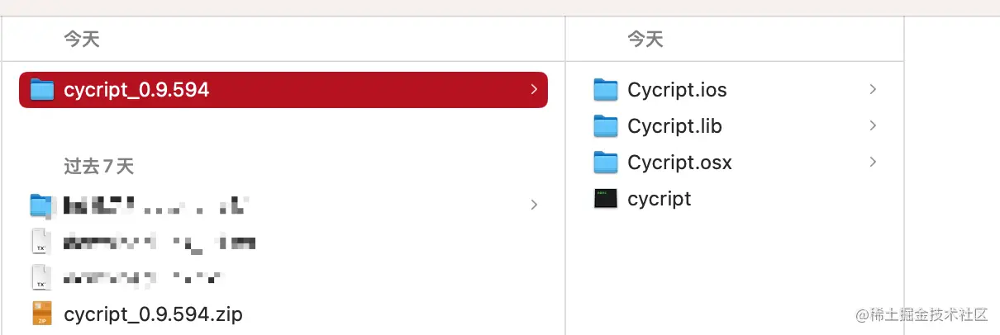

其中 Cycript.ios 里面就有我们需要的 Cycript.framework 文件。黑色的 cycript 就是我们需要的终端命令行工具。先将 Cycript.framework 集成到我们的 iOS 项目中，我这里新建了一个 CycriptDemo 的空工程。

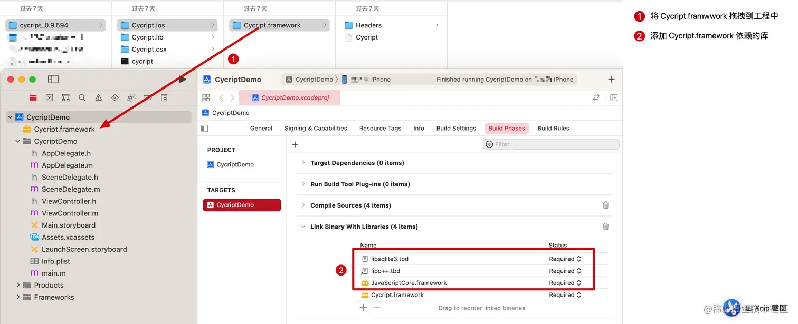

Cycript.framework 集成成功之后，我们在 APP 启动的时候添加一点代码，如下图：

``` objc
#import "AppDelegate.h"
#import "Cycript/Cycript.h"
@interface AppDelegate ()

@end

@implementation AppDelegate


- (BOOL)application:(UIApplication *)application didFinishLaunchingWithOptions:(NSDictionary *)launchOptions {
    // Override point for customization after application launch.
    CYListenServer(3335);
    return YES;
}

@end
```

这里填写的端口号，只要是可用的端口号就都可以。可用的端口范围取决于您的操作系统和网络设置。通常情况下，TCP/IP 协议定义的端口号范围是从 0 到 65535。然而，其中一些端口已经被标准协议用于特定的服务（例如，端口 80 用于 HTTP，端口 443 用于 HTTPS 等），因此不是所有的端口都可以随意使用。

通常情况下，非特权用户（普通用户）可以使用的端口号范围是从 1024 到 49151，而特权用户（如管理员或超级用户）可以使用从 0 到 1023 的端口号。

现在，运行 CycriptDemo 将 APP 安装到未越狱的 iPhone 上。不出意外应该会遇到以下报错

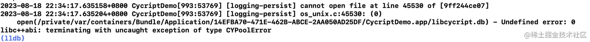

让人感到有点莫名其妙，不过开发过程中有报错并不可怕，按照报错的提示去解决就好了，可怕的是没有任何提示而又没有按照预期的运行这才是最可怕的，根本无从下手解决。在做安全防护的时候也是如此，不要给出任何明显的提示或者报错，这样会让攻击者更容易就找到破解的办法。

回到之前解压的 cycript_0.9.594 目录中，在 Cycript.lib 目录下存在 libcycript.db 文件，将它拖进项目中就可以解决。


到这里 iOS 端的准备工作就差不多做好了。。。

## 解决 cycript 命令行工具依赖库问题

下一步我们需要解决 cycript 终端命令行工具的依赖库找不到的问题，让 cycript 成功运行起来。首先打开终端进入到刚刚解压的 cycript_0.9.594 文件夹，输入 `./cycript` 执行在我的环境下给出如下报错：


意思就是找不到 Python.framework 库，这是由于 MacOS 在版本 macOS 11.0（Big Sur）中正式移除了预装的 Python 2.7。cycript 在 2016 年之后就停止更新了，在无法更新 cycript 的依赖库的情况下（或许可以通过反汇编修改二进制，但目前看没有这个必要），我们只能想办法在上述指定位置安装 Python 库，也不一定要使用指定 Python2.7 版本，因为在软件开发领域新版本的程序一般都会向下兼容老版本的程序，就是说如果一个软件的依赖库找不到了，可以使用较新的版本的库直接替换，如果用更老的版本就可能出现问题，这个做开发的应该都知道但没想到。

所以我准备将我电脑上已经安装好的 Python3.11 版本的 Python.framework 复制到到上述路径并修改一下版本号就行了。如果你的电脑上本来就没有安装 Python 库，那就使用 `brew install python` 安装好了。安装好之后同样找到 Python.framework 复制到上述路径。

使用 `brew list python` 发现我的电脑已安装的 Python 版本


由于 MacOS 的 SIP 限制，/System/... 路径是只读的，在 MacOS 13.5 上即使禁用了 SIP 也依旧无法修改。也许有办法只是目前我还没有找到可以修改的方法。
好在给出的错误提示，指出了多个路径都找不到同一个库，于是猜测到这么多路径中只要有一个路径存在指定库就可以，其中最后一个路径 /Library 目录是可以修改的，于是尝试将 Python3.11 版本的 Python.framework 复制到 /Library/Framework/ 目录下，并将 Versions 目录下的 3.11 重命名为 2.7 之后就解决了上面这个报错。最终结果就是按照上面报错的最后一个路径 `/Library/Frameworks/Python.framework/Versions/2.7/Python` 配置好一个 Python 可执行文件。

继续输入 `./cycript` 看是否能运行成功。没有那么顺利，在我的环境下，又报了以下错误：

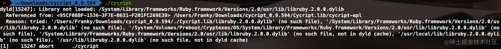

解决方式跟刚刚类似，找到电脑上已安装的 libruby.dylib 库，将它复制到了 `/usr/local/lib/` 目录下，这个 `/usr/local/` 目录一般就是用来存放用户级别的库的。如果你的电脑上没有安装 ruby 库，那就先安装好，再复制到 `/usr/local/lib/` 目录下，并重命名为 `libruby.2.0.0.dylib`。

继续输入 `./cycript` 发现进入了交互环境了，表示依赖库都配置好了，如果你还有其他报错，继续按照刚刚的方法解决就行了。


## 开始远程调试

接下来找到 iPhone 所在网络的 IP 地址，确认 iPhone 和 Mac 需要在同一局域网内。打开刚刚安装的 CycriptDemo ，然后在 Mac 终端输入 `./cycript -r IP:端口号` 如果不出意外（除非你新建的项目 bundleIdentifier 是之前使用过的，并且之前该 APP 已经成功安装运行并允许使用无线局域网），那么大概率是无法连接成功的，会报以下错误：

```
*** _syscall(connect(socket_, info->ai_addr, info->ai_addrlen)):../Console.cpp(306):CYSocketRemote [errno=60]
``` 

这是 socket 连接返回的错误码，错误码 "errno=60" 对应的是 "ETIMEDOUT"，这是基于一般的网络编程经验和标准的错误码定义而来。这是因为我们新创建工程并没有获取到使用无线局域网络的用户授权，也就是很多 APP 第一次启动访问网络时会弹出的授权提示，如下图所示。所以在我们新创建的 CycriptDemo 工程中还需要添加一些访问网络的代码，让系统自动弹出这个授权弹窗并选择无线局域网与蜂窝网络、或者仅限无线局域网都可以。如果你不小心点击了不允许，可以在 iOS 的设置 APP 中找到你当前的 APP -> 无线数据，重新选择。

<p align=center>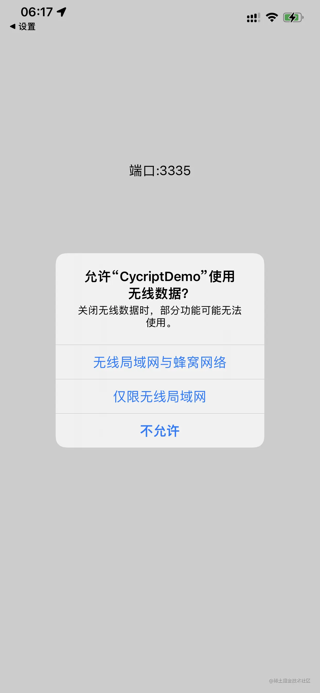</p>

添加如下访问网络连接的代码再次启动时就会弹出上面的授权弹窗。如果你是集成到已经获取了授权的项目中，可以不用添加这行代码。获取到用户授权之后可以删除掉。

``` objc
- (BOOL)application:(UIApplication *)application didFinishLaunchingWithOptions:(NSDictionary *)launchOptions {
    // Override point for customization after application launch.
    [[[NSURLSession sharedSession] dataTaskWithRequest:[NSURLRequest requestWithURL:[NSURL URLWithString:@"https://httpbin.org/get"]]] resume];
    CYListenServer(3335);
    return YES;
}
```

成功获取使用无线局域网授权之后，我们再次尝试连接，应该可以看到以下结果：

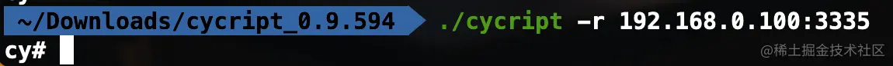

有时候还有可能会遇到以下错误

``` sh
*** _syscall(connect(socket_, info->ai_addr, info->ai_addrlen)):../Console.cpp(306):CYSocketRemote [errno=61]
``` 

这个一般是 APP 还没有启动成功，服务还没开始运行，或者在后台被杀掉导致的。确保 APP 在前台并且启动完成之后再连接就好了。

连接成功进入交互环境后可以输入 `UIApp` 获取应用实例对象，这是 Cycript 对 iOS 中的 `[UIApplication sharedApplication]` 的包装，也可以直接输入 `[UIApplication sharedApplication]` 获取，就像在 lldb 调试那样。退出交互环境使用键盘快捷键 control + D ,或者输入 `?exit` 。

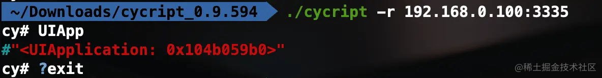

# 越狱环境下使用 cycript

在越狱环境下使用 cycript 就没有那么麻烦了，只需要在 Cydia 或者 Sileo 中搜索并安装 Cycript 。安装好之后通过 ssh 远程连接到越狱 iPhone 之后，直接可以输入 `cycript -p pid或进程名称` 就可以开始调试了。可以使用 `ps -A | grep app` 获取到 pid 或者 进程名称。如果提示没有 `ps` 这个命令，需要安装 adv-cmds 工具，不过一般在安装 Cycript 的时候应该已经一并安装了。

关于如何通过 ssh 远程连接到越狱 iPhone 可以看我之前的文章 [从 Mac 远程登录到 iPhone](https://juejin.cn/post/7262982452768145465)。

在越狱设备上输入 `ps -A | grep app` 获取 pid 或 进程名称的结果如下：

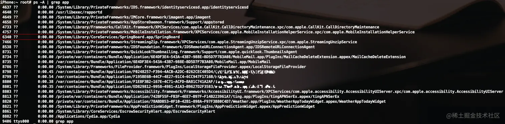

前面的数字就是 pid ，路径最后就是进程名称。我们以红框中的 SpringBoard APP 为例，附加到这个 APP 中。这个 APP 就是我们 iOS 用户最熟悉的陌生人了，天天看的最多，用的最多的手机桌面。输入以下代码会看到手机桌面显示出了弹窗

``` sh
iPhone:~ root# cycript -p SpringBoard
cy# var alertvc = [UIAlertController alertControllerWithTitle:@"title" message:@"message" preferredStyle:1]
#"<UIAlertController: 0x101b66a00>"
cy# [alertvc addAction:[UIAlertAction actionWithTitle:@"confirm" style:0 handler:nil]]
cy# [alertvc addAction:[UIAlertAction actionWithTitle:@"cancel" style:1 handler:nil]]
cy# [UIApp.keyWindow.rootViewController presentViewController:alertvc animated:YES completion:nil]
cy# 
```

iPhone 桌面显示如图：

<p align=center>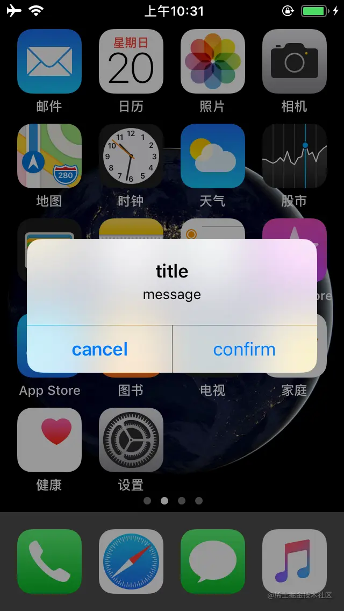</p>

# cycript 基础用法

好了，到这里不论你是在非越狱环境还是在越狱环境应该都可以进入 Cycript 与 APP 的交互环境了。现在先了解一下 Cycript 提供的一些基础用法，就用刚刚在非越狱环境使用 Cycript 中创建的 CycriptDemo 进行演示。打开手机上的 CycriptDemo APP，然后打开终端 cd 进入 cycript_0.9.594 目录下并进行连接（有需要可以配置成环境变量方便全局使用），如下图：


## 创建最简单的 UIView 并添加到 keyWindow 上

``` sh
cy# var rect = new (struct CGRect)
&{origin:{x:new Number{},y:new Number{}},size:{width:new Number{},height:new Number{}}}
cy# rect->origin.x = 50
50
cy# rect->origin.y = 100
100
cy# rect->size.width = 100
100
cy# rect->size.height = 60
60
cy# var greenView = [[UIView alloc] initWithFrame:*rect]
#"<UIView: 0x10450a690; frame = (50 100; 100 60); layer = <CALayer: 0x282ddbcc0>>"
cy# greenView.backgroundColor = [UIColor greenColor]
#"UIExtendedSRGBColorSpace 0 1 0 1"
cy# [UIApp.keyWindow addSubview:greenView]
```
APP 的显示如图：

<p align=center>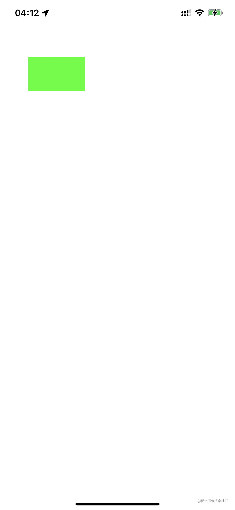</p>

可以看到，Cycript 中的 CGRect 用起来并不是特别方便，而且默认也没有提供对 CGRectMake() 函数的支持，这一点我也不是太明白。不过我们可以定义自己的函数，实现同样的功能。代码如下：

``` sh
cy# function CGPointMake(x, y) { return {0 : x, 1 : y} }
cy# function CGSizeMake(w, h) { return {0 : w, 1 : h} }
cy# function CGRectMake(x, y, w, h) { return {0 : CGPointMake(x, y), 1 : CGSizeMake(w, h) } }
cy# var rect2 = CGRectMake(160, 100, 100, 60)
{0:{0:160,1:100},1:{0:100,1:60}}
cy# var redView = [[UIView alloc] initWithFrame:rect2]
#"<UIView: 0x107610070; frame = (160 100; 100 60); layer = <CALayer: 0x282de62e0>>"
cy# redView.backgroundColor = [UIColor redColor]
#"UIExtendedSRGBColorSpace 1 0 0 1"
cy# [UIApp.keyWindow addSubview:redView]
```

我们定义了 CGPointMake(),CGSizeMake(),CGRectMake() 三个函数实现了类似的功能。并使用 CGRectMake() 创建了一个新的红色视图 `redView` 并添加到了 `keyWindow` 上。

APP 显示如下：

<p align=center>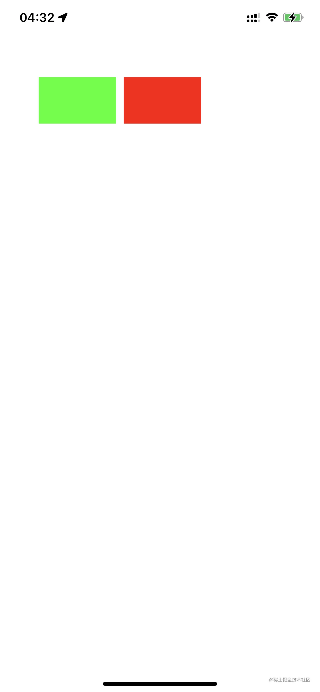</p>

## #内存地址

使用 #内存地址 获取内存地址所在的对象。比如我们刚刚创建的 redView ，这是我们创建的变量所以可以直接使用 redView 变量获取对象，但是在平时调试过程中我们很少会创建变量，而是通过打印输出很多对象的内存地址，通过 # 符号获取这个对象。使用 #内存地址 修改我们刚刚创建的 redView 的大小的代码如下：

``` sh
#0x107610070.backgroundColor = [UIColor orangeColor]
```

可以看到我们的 redView 的背景色被修改为橙色了。

## \*对象

使用 \* 号加对象，会打印出对象的所有成员变量名和对应的值。以我们刚刚修改的 redView 为例：

``` sh
cy# *#0x107610070
{isa:UIView,_responderFlags:@error,_constraintsExceptingSubviewAutoresizingConstraints:null,_cachedTraitCollection:#"<UITraitCollection: 0x2814e8620; UserInterfaceIdiom = Phone, DisplayScale = 3, DisplayGamut = P3, HorizontalSizeClass = Compact, VerticalSizeClass = Regular, UserInterfaceStyle = Light, UserInterfaceLayoutDirection = LTR, ForceTouchCapability = Available, PreferredContentSizeCategory = XS, AccessibilityContrast = Normal, UserInterfaceLevel = Base>",_animationInfo:null,_layer:#"<CALayer: 0x282de62e0>",_layerRetained:null,_gestureRecognizers:null,_window:#"<UIWindow: 0x1045057e0; frame = (0 0; 414 896); gestureRecognizers = <NSArray: 0x28238d770>; layer = <UIWindowLayer: 0x28238d860>>",_subviewCache:@[],_viewDelegate:null,_cachedScreenScale:new Number{},_layoutEngineWidth:new Number{},_viewFlags:@error,_unsatisfiableConstraintsLoggingSuspensionCount:0,_pseudo_id:8,_retainCount:new Number{},_draggingSourceDelegate:null,_tintAdjustmentDimmingCount:0,_layoutSubviewsCount:0,_imminentLayoutSubviewsCount:0,_countOfFocusedAncestorTrackingViewsInSubtree:0,_layoutMarginsGuide:null,_minXVariable:null,_minYVariable:null,_boundsWidthVariable:null,_boundsHeightVariable:null,_layoutEngine:null,_stashedLayoutVariableObservations:null,_internalConstraints:null,_safeAreaLayoutGuide:null,_keyboardLayoutGuide:null,_readableContentGuide:null,__preferedContentsFormat:new Number{},__lastNotifiedTraitCollection:#"<UITraitCollection: 0x2814e41c0; UserInterfaceIdiom = Phone, DisplayScale = 3, DisplayGamut = P3, HorizontalSizeClass = Compact, VerticalSizeClass = Regular, UserInterfaceStyle = Light, UserInterfaceLayoutDirection = LTR, ForceTouchCapability = Available, PreferredContentSizeCategory = XS, AccessibilityContrast = Normal, UserInterfaceLevel = Base>",__alignmentRectOriginCache:null,_rawLayoutMargins:{top:new Number{},left:new Number{},bottom:new Number{},right:new Number{}},_inferredLayoutMargins:{top:new Number{},left:new Number{},bottom:new Number{},right:new Number{}},_safeAreaInsets:{top:new Number{},left:new Number{},bottom:new Number{},right:new Number{}}}
```

## 递归打印层级结构

### 递归打印视图层级结构

``` sh
cy# UIApp.keyWindow.recursiveDescription()
@"<UIWindow: 0x1045057e0; frame = (0 0; 414 896); gestureRecognizers = <NSArray: 0x28238d770>; layer = <UIWindowLayer: 0x28238d860>>\n   | <UITransitionView: 0x1076068d0; frame = (0 0; 414 896); autoresize = W+H; layer = <CALayer: 0x282ddd500>>\n   |    | <UIDropShadowView: 0x102e07170; frame = (0 0; 414 896); autoresize = W+H; layer = <CALayer: 0x282dc4900>>\n   |    |    | <UIView: 0x107607070; frame = (0 0; 414 896); autoresize = W+H; layer = <CALayer: 0x282ddd480>>\n   | <UIView: 0x10450a690; frame = (50 100; 100 60); layer = <CALayer: 0x282ddbcc0>>\n   | <UIView: 0x107610070; frame = (160 100; 100 60); layer = <CALayer: 0x282de62e0>>"
```

会发现打印的字符串中有很多 \\n 符号并没有真正的换行。可以使用 `toString()` 函数让 \\n 真正的换行

``` sh
cy# UIApp.keyWindow.recursiveDescription().toString()
`<UIWindow: 0x1045057e0; frame = (0 0; 414 896); gestureRecognizers = <NSArray: 0x28238d770>; layer = <UIWindowLayer: 0x28238d860>>
   | <UITransitionView: 0x1076068d0; frame = (0 0; 414 896); autoresize = W+H; layer = <CALayer: 0x282ddd500>>
   |    | <UIDropShadowView: 0x102e07170; frame = (0 0; 414 896); autoresize = W+H; layer = <CALayer: 0x282dc4900>>
   |    |    | <UIView: 0x107607070; frame = (0 0; 414 896); autoresize = W+H; layer = <CALayer: 0x282ddd480>>
   | <UIView: 0x10450a690; frame = (50 100; 100 60); layer = <CALayer: 0x282ddbcc0>>
   | <UIView: 0x107610070; frame = (160 100; 100 60); layer = <CALayer: 0x282de62e0>>`
```

这样看起来就清晰多了。

### 递归打印根控制器的层级结构

``` sh
cy# UIApp.keyWindow.rootViewController._printHierarchy().toString()
"<ViewController 0x1045049f0>, state: appeared, view: <UIView 0x107607070>"
```

由于我们的 CycriptDemo APP 中只有一个根视图控制器，所以只能看到这样的打印。

### 递归打印自动布局信息

``` sh
cy# UIApp.keyWindow._autolayoutTrace().toString()
`
UIWindow:0x1045057e0
|   UITransitionView:0x1076068d0
|   |   UIDropShadowView:0x102e07170
|   |   |   UIView:0x107607070
|   UIView:0x10450a690
|   UIView:0x107610070

Legend:
\t* - is laid out with auto layout
\t+ - is laid out manually, but is represented in the layout engine because translatesAutoresizingMaskIntoConstraints = YES
\t\u2022 - layout engine host`
```
这里出现了一些不该显示的 \t 字符，猜测可能是解析字符串的时候出了点问题，在打印对象的 `_ivarDescription` 和 `_methodDescription` 的时候也会出现。可惜 Cycript 的作者已经停止更新了。。。

## choose 查询类或其子类的实例对象

``` sh
cy# choose(UIView)
[#"<UIWindow: 0x1045057e0; frame = (0 0; 414 896); gestureRecognizers = <NSArray: 0x28238d770>; layer = <UIWindowLayer: 0x28238d860>>",#"<UIDimmingView: 0x1045065a0; frame = (0 0; 0 0); opaque = NO; gestureRecognizers = <NSArray: 0x28238d230>; layer = <CALayer: 0x282dd9ea0>>",#"<UIDimmingView: 0x1045070e0; frame = (0 0; 0 0); opaque = NO; gestureRecognizers = <NSArray: 0x28238d1a0>; layer = <CALayer: 0x282dda100>>",#"<UIView: 0x10450a690; frame = (50 100; 100 60); layer = <CALayer: 0x282ddbcc0>>",#"<UITransitionView: 0x1076068d0; frame = (0 0; 414 896); autoresize = W+H; layer = <CALayer: 0x282ddd500>>",#"<UIView: 0x107607070; frame = (0 0; 414 896); autoresize = W+H; layer = <CALayer: 0x282ddd480>>",#"<UIView: 0x107610070; frame = (160 100; 100 60); layer = <CALayer: 0x282de62e0>>",#"<UIDropShadowView: 0x102e07170; frame = (0 0; 414 896); autoresize = W+H; layer = <CALayer: 0x282dc4900>>"]
```

## tab 键自动补全代码

在输入代码的时候，可以尝试使用 tab 键进行自动补全或者代码提示。在输入的代码足够分析出正确的完整代码的时候按一次 tab 键会自动补全，在输入的代码不足以分析出正确的代码的时候按两下 tab 键会给出所有可能得提示，在输入的代码完全不够解析的时候终端会有声音提醒，再多输入几个字符试试就好了。我们以对象的私有方法或成员变量（以下划线_开头）为例：

``` sh
cy# choose(UIView)
[#"<UIWindow: 0x1045057e0; frame = (0 0; 414 896); gestureRecognizers = <NSArray: 0x28238d770>; layer = <UIWindowLayer: 0x28238d860>>",#"<UIDimmingView: 0x1045065a0; frame = (0 0; 0 0); opaque = NO; gestureRecognizers = <NSArray: 0x28238d230>; layer = <CALayer: 0x282dd9ea0>>",#"<UIDimmingView: 0x1045070e0; frame = (0 0; 0 0); opaque = NO; gestureRecognizers = <NSArray: 0x28238d1a0>; layer = <CALayer: 0x282dda100>>",#"<UIView: 0x10450a690; frame = (50 100; 100 60); layer = <CALayer: 0x282ddbcc0>>",#"<UITransitionView: 0x1076068d0; frame = (0 0; 414 896); autoresize = W+H; layer = <CALayer: 0x282ddd500>>",#"<UIView: 0x107607070; frame = (0 0; 414 896); autoresize = W+H; layer = <CALayer: 0x282ddd480>>",#"<UIView: 0x107610070; frame = (160 100; 100 60); layer = <CALayer: 0x282de62e0>>",#"<UIDropShadowView: 0x102e07170; frame = (0 0; 414 896); autoresize = W+H; layer = <CALayer: 0x282dc4900>>"]
cy# #0x107610070._
Display all 501 possibilities? (y or n)
cy# #0x107610070._lay
_layer()                                           _layoutEngine                                      _layoutEngineRelativeAlignmentRectOriginIsValid()  _layoutRect()
_layoutDebuggingIdentifier                         _layoutEngineCreateIfNecessary()                   _layoutHeightDependsOnWidth                        _layoutVariablesWithAmbiguousValue()
_layoutDebuggingTitle()                            _layoutEngineHostConstraints()                     _layoutMarginsGuideIfExists()
_layoutDescriptionIfDifferentFromDefault()         _layoutEngineIfAvailable()                         _layoutMarginsGuideIgnoresSystemMinimumMargins
cy# #0x107610070._lay
```

首先使用 choose 查询 UIView 或其子类的实例对象。选取其中的一个 #0x107610070 ，输入 ._ 之后会出现提示显示所有 501 个可能的结果？输入 y 表示显示，n 不显示。501 个结果太多了，我选择不显示，继续输入 lay 之后按两下 tab 键由于数量不是很多于是直接将所有可能得结果都显示出来了。这个功能我只能说🐂🍺

# cycript 高级用法

我们刚刚创建了几个变量和函数，这些变量和函数都的确处于进程的内存当中，但是当 APP 进程被杀掉重新启动的时候，我们创建的变量和函数就都会消失。如果我们需要在每次进入交互环境的时候，重新辛辛苦苦编写重复的函数代码那可就太折磨人了。

Cycript 作者早就想到了这样的情况，所以它支持从文件加载自己的脚本。首先编写好 Cycript 的 .cy 文件，我们 tool.cy 为例。.cy 文件使用的是 JavaScript 语法，所以没有相关背景知识的开发人员编写起来可能会感到很困难。没错，作者本人就是如此，为了实现了一个函数并让它按照预期运行就经受了一番痛苦的折磨。。。这里参考了 MJ 大神的一些[源码](https://github.com/CoderMJLee/mjcript)，并对其中个人感觉不是很实用的进行了删减，对一些做了修改。同时对 @import 方式进行了优化，在 @import 的时候，会给出 .cy 文件中的一些关键信息，这样就不用去记忆一些变量和函数名。同时也省去了需要使用文件名.才能调用函数的麻烦（这里是参考了 AloneMonkey 大神的写法）。

## 编写 .cy 文件

tool.cy 文件源码如下：

``` javascript
(function(tool) {

	var t = tool.constants = {};

	MJPointMake = function(x, y) { 
		return {0 : x, 1 : y}; 
	};

	MJSizeMake = function(w, h) { 
		return {0 : w, 1 : h}; 
	};

	MJRectMake = function(x, y, w, h) { 
		return {0 : MJPointMake(x, y), 1 : MJSizeMake(w, h)}; 
	};

	// 返回 bundleIdentifier
	t.bundleId = [[NSBundle mainBundle] bundleIdentifier];

	// 返回安装包路径
	t.bundlePath = [[NSBundle mainBundle] bundlePath];

	var _MJFrontVc = function(vc) {
		if (vc.presentedViewController) {
        	return _MJFrontVc(vc.presentedViewController);
	    }else if ([vc isKindOfClass:[UITabBarController class]]) {
	        return _MJFrontVc(vc.selectedViewController);
	    } else if ([vc isKindOfClass:[UINavigationController class]]) {
	        return _MJFrontVc(vc.visibleViewController);
	    } else {
	    	var count = vc.childViewControllers.count;
    		for (var i = count - 1; i >= 0; i--) {
    			var childVc = vc.childViewControllers[i];
    			if (childVc && childVc.view.window) {
    				vc = _MJFrontVc(childVc);
    				break;
    			}
    		}
	        return vc;
    	}
	};

	// 返回最靠近用户的控制器
	t.frontVc = function() {
		return _MJFrontVc(UIApp.keyWindow.rootViewController);
	}

	MJIsString = function(str) {
		return typeof str == 'string' || str instanceof String;
	};

	var _MJClass = function(className) {
		if (!className) throw new Error(missingParamStr);
		if (MJIsString(className)) {
			return NSClassFromString(className);
		} 
		if (!className) throw new Error(invalidParamStr);
		// 对象或者类
		return className.class();
	};

	// 获取 className 的所有子类，reg 正则过滤
	t.subclassesWith = function(className, reg) {
		className = _MJClass(className);

		return [c for each (c in ObjectiveC.classes) 
		if (c != className 
			&& class_getSuperclass(c) 
			&& [c isSubclassOfClass:className] 
			&& (!reg || reg.test(c)))
			];
	}

	// 获取按钮的 TouchUpInsideEvent 的 target 和 actions
	t.touchUpInsideTargetAndActionWith = function(btn) {
		if (![btn isKindOfClass:[UIControl class]]) {
			throw new Error("invalid parameter type,must be kind of UIControl class");
		}
	    var allTargets = [[btn allTargets] allObjects];
    	var dict = [NSMutableDictionary dictionary];
    	for (var i = 0; i < allTargets.count; i++) {
    		var actions = [btn actionsForTarget:allTargets[i] forControlEvent:UIControlEventTouchUpInside];
    		[dict setValue:actions forKey:[allTargets[i] description]];
    	}
    	return dict;
	};

	var _MJGetMethods = function(className, reg, clazz) {
		className = _MJClass(className);

		var count = new new Type('I');
		var classObj = clazz ? className.constructor : className;
		var methodList = class_copyMethodList(classObj, count);
		var methodsArray = [];
		var methodNamesArray = [];
		for(var i = 0; i < *count; i++) {
			var method = methodList[i];
			var selector = method_getName(method);
			var name = sel_getName(selector);
			if (reg && !reg.test(name)) continue;
			methodsArray.push({
				selector : selector, 
				type : method_getTypeEncoding(method)
			});
			methodNamesArray.push(name);
		}
		free(methodList);
		return [methodsArray, methodNamesArray];
	};
	
	var _MJMethods = function(className, reg, clazz) {
		return _MJGetMethods(className, reg, clazz)[0];
	};
	
	// 打印对象方法
	t.instanceMethods = function(className, reg) {
		return _MJMethods(className, reg);
	};

	// 打印类方法
	t.classMethods = function(className, reg) {
		return _MJMethods(className, reg, true);
	};

	// 打印响应者
	t.rp = function(target) {
		var result = "" + target.toString();
		while (target.nextResponder) {
			result += "\n" + target.nextResponder.toString();
			target = target.nextResponder;
		}
		return result;
	}

	for (var k in tool.constants) {
		Cycript.all[k] = tool.constants[k];
	}

})(exports);
```

## 越狱环境下使用 .cy 文件

在越狱环境下，可以将编写好的 tool.cy 文件放到 `/usr/lib/cycript0.9/com/masterking` 目录下。这里的 masterking 是文件夹名，你可以自己创建一个文件夹换成你想要的名字。Cycript 成功附加到 APP 进程之后，使用以下命令就可以导入该文件：

``` sh
cy# @import com.masterking.tool
{constants:{bundleId:@"com.masterking.CycriptDemo",bundlePath:@"/var/containers/Bundle/Application/85010A56-FF88-4EDE-A9CA-BA5C76638197/CycriptDemo.app",frontVc:function (){return s(UIApp.keyWindow.rootViewController)},subclassesWith:function (r,i){r=d(r);return function(n,t){var e;n=[];{e=ObjectiveC.classes;for(t in e){t=e[t];if(t!=r&&class_getSuperclass(t)&&objc_msgSend(t,"isSubclassOfClass:",r)&&(!i||i.test(t)))n.push(t)}}return n}()},touchUpInsideTargetAndActionWith:function (r){var e,t,n,i;if(!objc_msgSend(r,"isKindOfClass:",objc_msgSend(UIControl,"class"))){throw new Error("invalid parameter type,must be kind of UIControl class")}i=objc_msgSend(objc_msgSend(r,"allTargets"),"allObjects");n=objc_msgSend(NSMutableDictionary,"dictionary");for(e=0;e<i.count;e++){t=objc_msgSend(r,"actionsForTarget:forControlEvent:",i[e],UIControlEventTouchUpInside);objc_msgSend(n,"setValue:forKey:",t,objc_msgSend(i[e],"description"))}return n},instanceMethods:function (t,e){return i(t,e)},classMethods:function (t,e){return i(t,e,!0)},rp:function (t){var e;e=""+t.toString();while(t.nextResponder){e+="\n"+t.nextResponder.toString();t=t.nextResponder}return e}}}
cy# frontVc()
#"<ViewController: 0x10f119400>"
```

可以看到输出了 tool.cy 中的源码，这样不必要记忆函数名和变量名，写好了导入就可以直接使用，也不需要使用 tool.frontVc() 调用函数，直接 frontVc() 就可以调用，同时还可以使用 tab 键补全函数代码。

## 非越狱环境下使用 .cy 文件

### 逆向开发的情况使用 .cy 文件

在非越狱环境下进行逆向开发，首先推荐的肯定是 AloneMonkey 的 [MonkeyDev](https://github.com/AloneMonkey/MonkeyDev) 工具提供了 Xcode 工程模板，可以像正向开发那样方便的使用 Xcode 在未越狱环境进行逆向开发。由于也是很多年没有更新了，没有适配最近的几个 Xcode 版本导致可能无法成功安装。看到 Fork 里有人适配了 Xcode 13 ，使用 Xcode 13 的可以试试。由于我本人使用的是 Xcode 14.3.1 所以就没有尝试，由于之前的 Xcode 可以成功安装，于是我下载了旧版本的 Xcode 好像是 12.4。安装到了 Mac 13.5 上，会显示无法打开。不需要打开使用，直接运行 MonkeyDev 安装脚本根据提示安装，然后还是修改了 md-install 脚本之后，再升级到最新的 Xcode 版本经过一番折腾，终于算是用上了。


MonkeyApp 工程默认就集成了 cycript 库到项目中，经过我的观察好像不是使用的 Cycript.framework 的方式，但是也能通过 cycript 连接成功。使用自己的 .cy 文件的方式有两种，一种是使用 MDConfig.plist 配置文件，在其中添加自己的 .cy 文件配置。这个配置文件也很简单，需要一个 url 就行了，配置一个本地环境的 url 也可以。或者直接将 cy 代码复制到 content 中(这种我没试过，感兴趣的可以自己试试) 这两种方式不需要自己再手动 @import 导入 tool.cy 文件，非常省事。

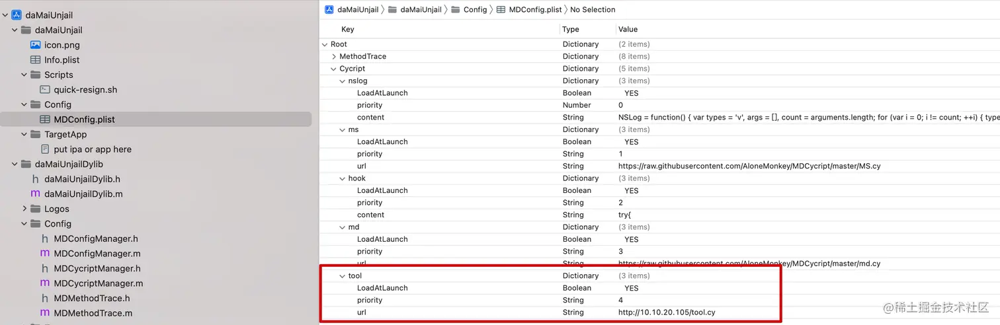

另一种就是手动将 tool.cy 文件拖进项目中。

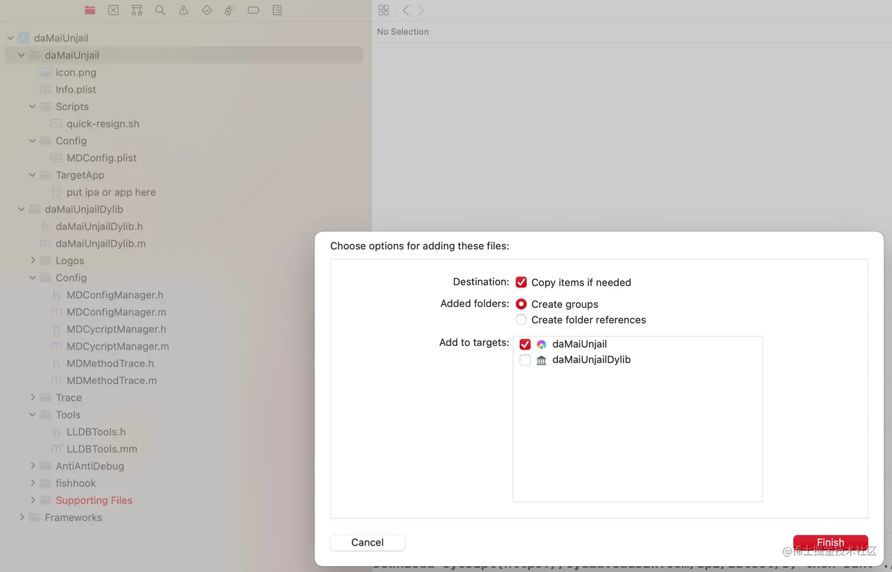

然后再进入 cycript 交互环境的时候，手动 @import 导入一下，如下图：


### 正向开发的情况使用 .cy 文件

在非越狱环境正向开发的情况下，原以为可以将 tool.cy 文件打包进 APP 的安装包中之后就可以 @import 导入了。万万没有想到并没有这么简单，不确定是哪里出了问题，如果有知道的大神可以在评论区交流一下。会报以下错误：

``` sh
cy# @import tool
throw new TypeError{}
```

最关键的信息在{}里面没有显示。。。也没办法了

# cycript 实战

能看到这里的人一定都是热爱学习的人，这里给大家准备了一个惊喜，使用 cycript 绕过某付费直播 APP 观看限制。为了防止有人说我打广告嫌疑和规避法律责任，这里不会明确是哪个 APP 并在此声明**本文案例供技术交流，禁止用于商业及非法用途，如产生法律纠纷与本人无关。**。

APP 图标大概长这样：
<p align=center></p>

下载好 APP 之后，进入 APP 的包里面，发现干净的很，分析一下原来是 Flutter 项目生成的 iOS APP。Flutter 项目也没关系，不管是什么技术，只要你需要兼容 iOS 平台，就绕不开 iOS 的技术栈 Cocoa touch 框架。

<p align=center>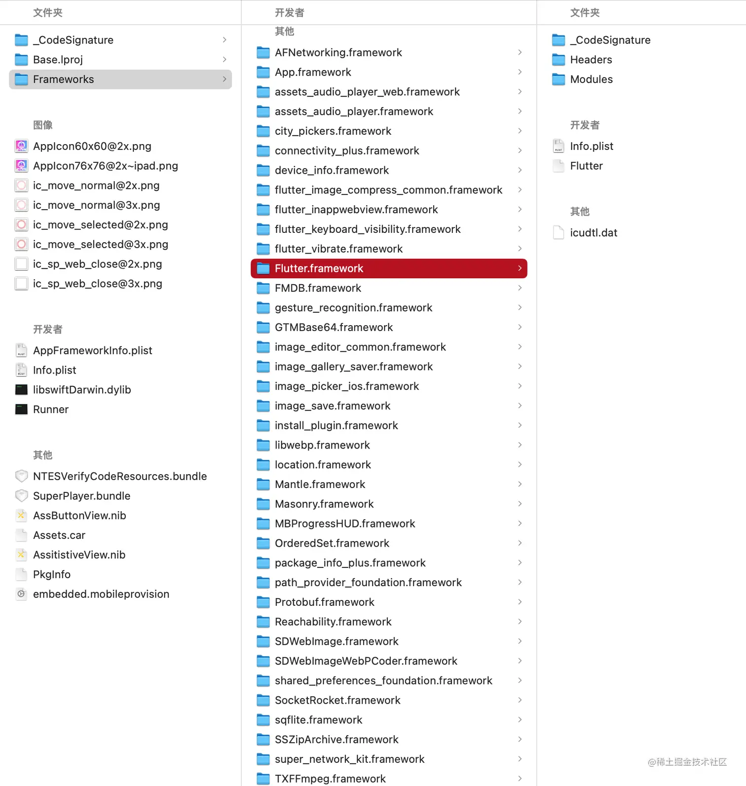</p>

启动 APP，进入某个直播间发现有一个 30 秒的倒计时之后便出现了如下界面。

<p align=center></p>

打开终端，使用 cycript 远程附加到 APP 上。递归打印出当前 APP 的界面层级结构：


根据经验，推测绿框中的视图应该就是弹出来的视图，让它隐藏之后你就会看到你想要看的东西了😛。。。当然目前这种做法只不过是在内存中修改了视图的 hidden 属性，如果想要做到永久的修改 APP 的逻辑，还需要学习更多的内容，我会在接下来的时间里陆续更新内容，敬请期待。也欢迎感兴趣的开发者共同学习，一起交流。


