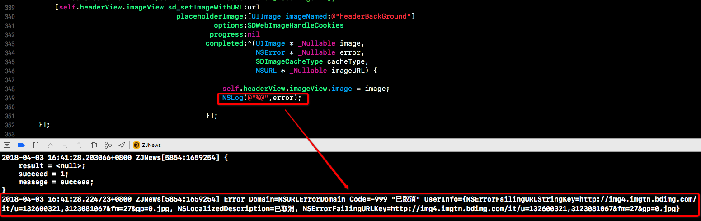
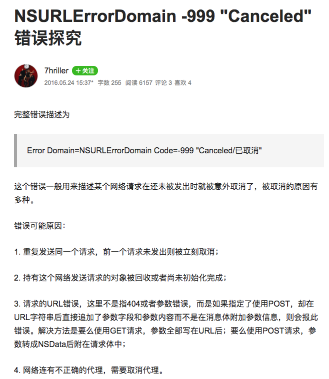
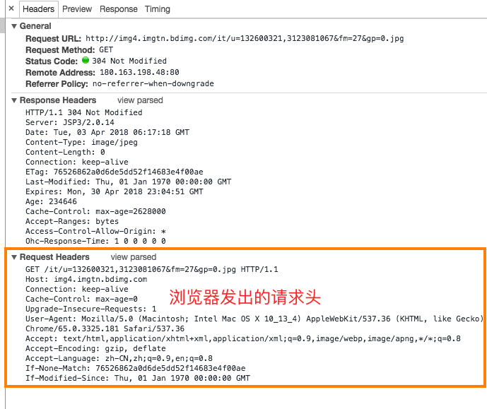
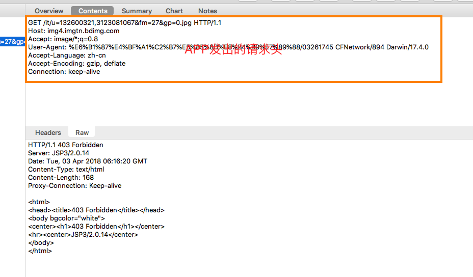
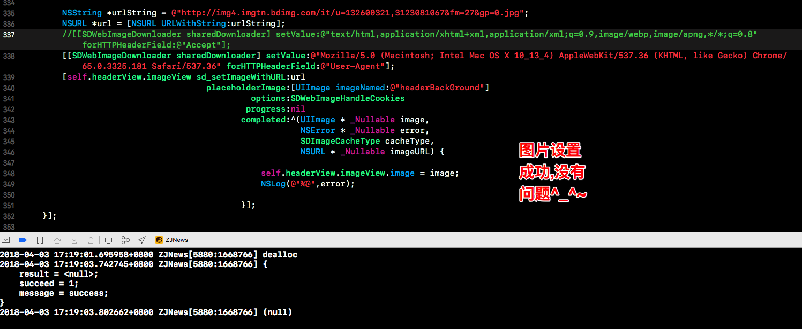

今天遇到这么一个问题,在使用 SDWebimage 设置 UIImageView 的图片的时候,发现这个图片
`http://img4.imgtn.bdimg.com/it/u=132600321,3123081067&fm=27&gp=0.jpg`怎么也设置不成功,后来调试一看发现

说是什么已取消,我是一脸懵逼啊,谁 TM 取消了啊???百思不得其解之后网上搜了一下;

嘿,还有人写了个总结

然而看了上面的总结后发现貌似都没有关系...所以说这个总结也并不全面...后来想想用浏览器打开这个图片试试看,发现浏览器上能正常打开;这下我估计是请求图片的请求头有问题了;于是我将浏览器的请求头和从 APP 发出的请求头都列出来了;如下

**浏览器上的请求头**

**使用Charles抓取APP发出的请求头**

其实一下子也看不出什么东西出来,那就先从都有的请求头开始试吧,再将 APP 发出的请求头的 User-Agent 设置之后发现能够设置成功了...那么问题就可以这么解释了,这个图片所在的服务器会对请求的 User-Agent 进行判断,具体判断规则是怎样的那我就不得而知了;如果不符合它的规则那么就会请求失败,在上图 Charles 抓包的响应里面可以看到一段 403 Forbidden 的 html 代码,而在 APP 中,就是报的 `Error Domain=NSURLErrorDomain Code=-999 "已取消"` 的错误

其实吧,这个问题根本不重要,因为实际我根本不可能使用这个 URL;重要的是解决问题的思路,你得学会一套方法去解决问题,而不是学会解决这个问题...