# 最终实现的效果

在 Xcode 中使用自己编译的 clang 编译自己的源码,并给出符合自己风格或者公司所需的代码规范的提示!还可以给出修复建议

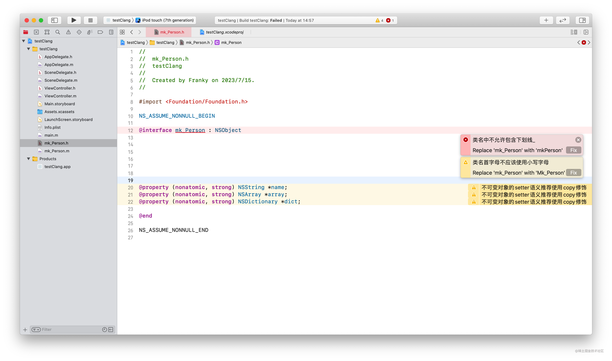

在动手开发之前,先了解一下相关理论知识,特别强调 clang 插件开发并不是一件很容易的事情,需要有一定的知识储备,你需要:

- 对 C++ 有一定的了解
- 对编译原理有一定的了解

不想了解,只想直接动手开发 clang 插件的可以直接跳到 clang 插件开发

# 编译型语言和解释型语言

计算机语言按照是否需要编译可以分为编译型语言和解释型语言,编译型语言和解释型语言是两种不同的编程语言类型，它们在代码执行方式、性能、开发速度和可移植性等方面存在一些区别。

1. 执行方式：
   - 编译型语言：编译型语言的代码在运行之前需要通过编译器将源代码转换为目标机器的可执行文件。在运行时，计算机直接执行生成的机器码，无需进一步解释。典型的编译型语言包括C、C++、Objective-C、Swift等。
   - 解释型语言：解释型语言的代码在运行时逐行解释执行，而不需要事先进行编译。解释器逐行读取源代码，并将其转换为机器指令并立即执行。典型的解释型语言包括 Python、JavaScript 等。Mac 电脑自带 python 解释器,打开终端,输入 python 命令可以看到

2. 性能：
   - 编译型语言：由于编译型语言在运行之前已经将源代码转换为机器码，因此通常具有较高的执行速度和更好的性能。编译器可以进行各种优化，提高代码的效率。
   - 解释型语言：解释型语言在每次执行时都需要进行解释，这会导致相对较低的执行速度和较低的性能。然而，一些解释型语言使用了即时编译（Just-in-Time Compilation）技术，可以提高执行速度。

3. 开发速度：
   - 编译型语言：编译型语言的开发过程需要先编写源代码，然后进行编译。这种过程可能需要额外的时间来编译和构建项目，因此在开发速度上可能相对较慢。
   - 解释型语言：解释型语言通常具有更快的开发速度，因为它们无需编译和构建过程。开发人员可以更快地进行代码修改和测试。

4. 可移植性：
   - 编译型语言：由于编译型语言的可执行文件是针对特定的目标机器生成的，因此在不同的平台上可能需要重新编译以适应不同的体系结构。这可能导致一定程度的可移植性问题。
   - 解释型语言：解释型语言的代码是在解释器上运行的，因此可以在不同的平台上运行，无需重新编译。这提高了解释型语言的可移植性。

需要注意的是，以上的对比只是一般情况下的概括，并不适用于所有编译型和解释型语言。实际上，有些语言可能具有混合型的特性，同时具备编译和解释的能力。此外，编译型和解释型语言在不同的应用场景中都有各自的优势和适用性。选择哪种类型的语言取决于具体的需求和项目要求。本篇文章关注的重点在编译器相关的知识介绍,不会讲解解释器相关的内容。

# 传统的编译器架构


源代码经过编译器前端处理,结果交给优化器去优化,优化的结果交给编译器后端生成不同平台的机器码,也就是可执行文件,GCC 编译器就是采用这种架构

- 前端(Frontend),对程序员编写的源代码进行
    - 词法分析
    - 语法分析
    - 语义分析
    - 生成中间代码
- 优化器(Optimizer)
    - 优化前端生成的中间代码
- 后端(Backend)
    - 将中间代码处理成不同平台对应的机器码

# LLVM 架构

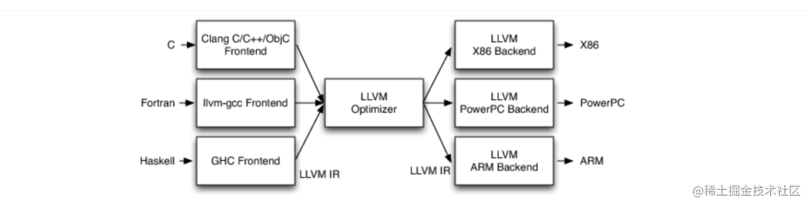

LLVM 架构下,对传统的编译器架构进行了一步优化，不同的前端和后端使用统一的中间代码 LLVM InterMediate Representation(LLVM IR)

- 如果需要支持一门新的编程语言，只需要实现一个新的前端
- 如果需要支持一款新的硬件设备，只需要实现一个新的后端

优化阶段是一个通用的阶段，他针对的是统一的 LLVM IR，不论是支持新的编程语言，还是支持新的硬件设备，都不需要对优化阶段的代码做修改。相比之下，GCC 的前端后端没有实现分离，前端后端耦合在了一起，所以 GCC 为了支持一门新的编程语言，或者为了支持一个新的硬件设备，就变得特别困难。比如新增一门语言,如果是 GCC 就还需要编写这门语言生成不同平台的编译器后端,这需要对各个平台的指令都有深刻的了解。反之,如果新增了一个平台,那么还需要同时实现各个语言的编译器前端。LLVM 现在被作为实现各种静态和运行时编译语言的通用基础结构（GCC家族、Java、.NET、Python、Ruby、Scheme、Haskell、D等）

# 什么是 LLVM

官方的说法是:**LLVM** 项目是模块化、可重用的编译器和工具链技术的集合。尽管名称如此，**LLVM** 与传统虚拟机关系不大。**LLVM** 并不是一个由首字母组成的缩略词，而是一个独特的项目名称它就叫 **LLVM**。

**LLVM** 计划启动于 2000 年,最初是伊利诺伊大学的 Chris Lattner 博士主持开展一个研究项目，目标是提供一种基于 SSA 的现代编译策略，能够支持任意编程语言的静态和动态编译。从那时起，**LLVM** 已发展成为一个由许多子项目组成的伞型项目，其中许多子项目被各种商业和开源项目用于生产，并广泛用于学术研究。2006 年 Chris Lattner 加盟 Apple Inc. 并致力于 **LLVM** 在 Apple 开发体系中的应用，其中的故事后面会讲到。Apple 也是 **LLVM** 计划的主要资助者。Swift 语言的创造者也是 Chris Lattner

**个人的理解或者说通俗一点的说法是: LLVM 是一个主要由 C++ 语言编写的,开源的编译器框架,这个项目可以
用来编译,分析,优化许多不同语言的源代码;可以用它来实现一门新的编程语言;可以用来分析语法树;可以进行语言的转换;可以开发clang插件;Pass开发代码优化,代码混淆...等等功能**

LLVM 的主要子项目有：

- LLVM 核心库提供了一个现代的独立于源代码和目标平台的优化器，以及对许多流行 CPU 以及一些不太常见的 CPU 的代码生成支持。这些库是围绕称为 LLVM 中间表示（“LLVM IR”）构建的。LLVM 核心库有详细的文档记录，并且特别容易发明自己的语言（或移植现有的编译器）以使用 LLVM 作为优化器和代码生成器。
- Clang 是一个“LLVM 原生”C/C++/Objective-C 编译器前端，旨在提供惊人的快速编译、极其有用的错误和警告消息，并提供一个用于构建出色的源代码级工具的平台。Clang 静态分析器和 clang-tidy 是自动查找代码中错误的工具，并且是可以使用 Clang 前端作为解析 C/C++ 代码的库来构建的工具的绝佳示例。
- LLDB 项目建立在 LLVM 和 Clang 提供的库的基础上，提供了一个出色的本机调试器。LLVM 项目使用 Clang 的 AST（抽象语法树）和表达式解析器、LLVM JIT（即时编译器）、LLVM 反汇编器等等，从而提供了一个"即插即用"的体验。它的速度非常快，加载符号时比 GDB 更加高效地利用内存。

除了 LLVM 的官方子项目之外，还有各种各样的其他项目使用 LLVM 组件来执行各种任务。通过这些外部项目，您可以使用 LLVM 编译 Ruby、Python、Haskell、Rust、D、PHP、Pure、Lua、Julia 和许多其他语言。LLVM 的主要优势在于其多功能性、灵活性和可重用性，这就是它被用于如此广泛的不同任务的原因：从对 Lua 等嵌入式语言进行轻量级 JIT 编译，到为大型超级计算机编译 Fortran 代码，无所不包。

LLVM 是 Apple 目前官方使用的编译器，而该编译器的前端是 Clang，这两个工具都被集成到了 Xcode 里面。在使用 LLVM 之前苹果公司一直使用 GCC 作为官方的编译器。GCC 作为开源世界的编译器标准一直做得不错，但 Apple 对编译工具提出了更高的要求。仗着自己在开源社区的地位(又或者是 GCC 开发者根本忙不过来?)，GCC 开发者对 Apple 的 Objective-C 语言新增的很多特性不予理睬，甚至当 Apple 想做的很多功能需要用模块化的方式来调用 GCC 时，GCC 却一直不给做。一般的公司遇到这种情况可能会选择默默忍受，但乔布斯领导的 Apple 怎么会？

与 GCC 的不和让 Apple 一直在寻找一个高效的、模块化的、协议更放松的开源的编译器替代品。最终，Apple 相中了 Chris Lattner 的 LLVM。Chris Lattner 可是一位大神，他于 2000 年毕业于俄勒冈州波特兰大学计算机科学专业，同年前往 UIUC(伊利诺伊大学厄巴纳香槟分校)，攻读计算机科学硕士和博士学位。在 UIUC 期间，他的 GPA 是 4.0(满分)，并不断地研究探索关于编译器的未知领域，发表了多篇论文。在硕士毕业论文中，他提出了一套完整的在编译时、链接时、运行时甚至是在闲置时优化程序的编译思想，奠定了 LLVM 的基础。LLVM 在 Chris Lattner 念博士时更加的成熟。这项研究让 Chris Lattner 在 2005 年毕业的时候，成为了小有名气的编译器专家。他也因此早早地被 Apple 相中，成为其编译器项目的骨干。进入 Apple 之后，Chris Lattner 首先在 OpenGL 小组做代码优化，把 LLVM 运行时的编译架在 OpenGL 栈上，这样 OpenGL 栈能够产出更高效率的图形代码。这个强大的 OpenGL 实现被用在了后来发布的 Mac OS X 10.5 上。同时，LLVM 的链接优化被直接加入到 Apple 的代码链接器上。 

LLVM 能够实现很多华丽的功能，要归功于 LLVM 自身的新前端 —— Clang。 GCC 系统庞大而笨重，因此，Apple 决定从零开始写 C、C++、Objective-C 语言的前端 Clang，以求完全替代掉 GCC。 Clang 于 2007 年开始开发，C 编译器最早完成，在 2009 年的时候，Objective-C 编译器已经完全可以用于生产环境，而在一年之后，Clang 基本实现了对 C++ 编译的支持。 Clang 一个重要的特性是编译快速、占内存少，而代码质量还比 GCC 来得高。得益于本身健壮的架构和 Apple 的大力支持，Clang 越来越全能，支持的项目越来越多，如 Mac OS X 10.6 时代的 Xcode 和 Interface Builder 等，皆由 Clang 编译。Clang 的加入也代表着 LLVM 真正走向成熟。 此外，Clang 有一个重要的衍生项目是静态分析工具，能够通过自动分析程序的逻辑，在编译时就找出程序可能的 bug 。除了 LLVM 核心和 Clang 以外，LLVM 还包括一些重要的子项目，比如一个原生支持调试多线程程序的调试器 LLDB 和一个 C++ 的标准库 libstdc++ 等等。不光是 Apple，很多的项目和编程语言都从 LLVM 中取得了关键性的技术。

# 什么是 clang

[Clang](https://clang.llvm.org/) 是 LLVM 的项目的子项目。它是 LLVM 架构下的 C/C++/Objective-C 的编译器前端。诞生之初是为了替代 GCC，提供更快的编译速度。对比 GCC，Clang 具有如下优点：

- 编译速度快:在某些平台上，Clang 的编译速度显著的快过 GCC (Debug模式下编译OC速度比GGC快3倍)
- 占用内存小: Clang 生成的 AST 所占用的内存是 GCC 的五分之一左右
- 模块化设计: Clang 采用基于库的模块化设计，易于 IDE 集成及其他用途的重用
- 诊断信息可读性强:在编译过程中，Clang 创建并保留了大量详细的元数据 (metadata)，调试和错误报告更容易阅读
- 设计清晰简单，容易理解，易于扩展增强

# Clang 与 LLVM 关系

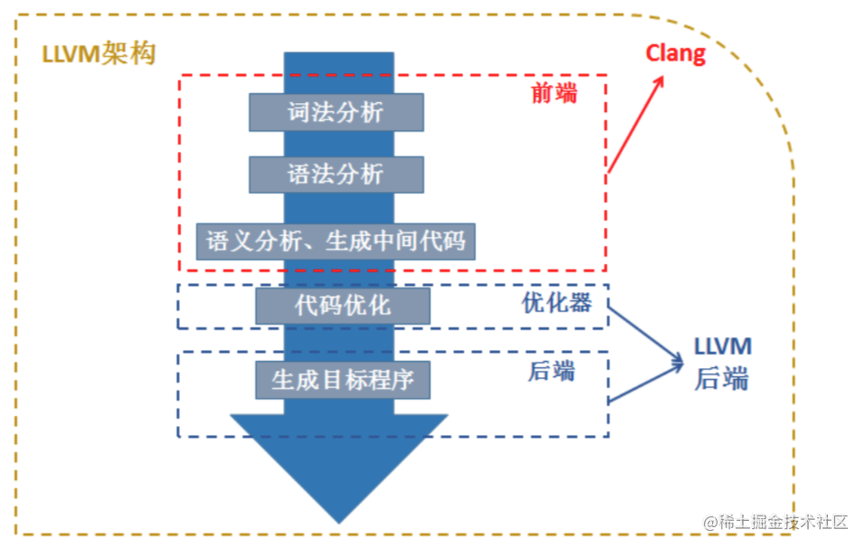

Clang 作为 LLVM 的前端，负责词法分析、语法分析、语义分析，然后生成中间代码。接下来把中间代码转交给优化器，优化器会对中间代码进行与架构无关的代码优化，优化后的代码体积更小、运行速度更快。最终 LLVM 后端会把优化后的中间代码转化为机器码。流程如下：

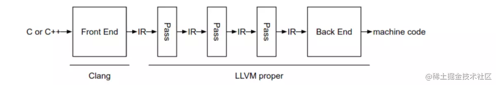

虽然 Clang 是 LLVM 的前端，但是 LLVM 的前端不只有 Clang。Clang 只是为 C、C++、Objective-C 设计的 LLVM 的编译器前端。除此之外，还有为 Swift 设计的编译器前端 Swiftc,兼容 gcc 的 llvm-gcc 前端，GHC 前端等等...这些在前面 LLVM 的配图中可以看到。

# LLVM 编译 Objective-C 源码完整流程

可以使用 clang 查看 Objective-C 源代码的编译完整过程;为了简单,我们使用最简单的 Objective-C 源码,创建一个 main.m 文件,实现如下代码:

``` objc
#import <Foundation/Foundation.h> 
#define Number 10
int main() {
    @autoreleasepool {
        int a = 3;
        int b = 7;
        int c = a + b + Number;
        NSLog(@"Hello, World! %d", c); 
    } 
    return 0; 
}
```

1. 预处理（Preprocessing）：使用 Clang 预处理器对`main.m`文件进行预处理。预处理阶段会将源代码中的`#import`指令替换为相应的头文件内容，展开宏定义，处理条件编译指令等。生成预处理后的源代码。
    
    输入命令 `clang -E main.m -o main_preprocessed.m` 之后查看 main_preprocessed.m 文件
    
    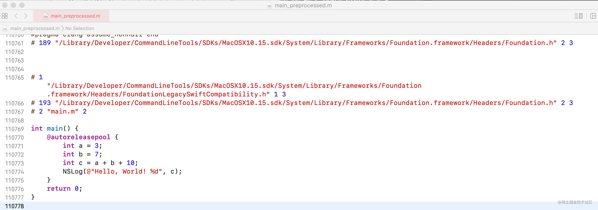
     
     可以明显看到我们的宏 `Number` 被直接替换成了 `10`,导入的头文件 `Foundation/Foundation.h` 也没替换成了实际的内容

2. 词法分析（Lexical Analysis）：将预处理后的源代码分解为标记（tokens），例如标识符、关键字、运算符等。对于上述代码，将生成一系列的标记，如`#import`、`<Foundation/Foundation.h>`、`int`、`main`、`@autoreleasepool`、`NSLog`等。

    输入命令 `clang -fmodules -fsyntax-only -Xclang -dump-tokens main.m` 查看 `main.m` 经过 clang 词法分析后的结果
    
    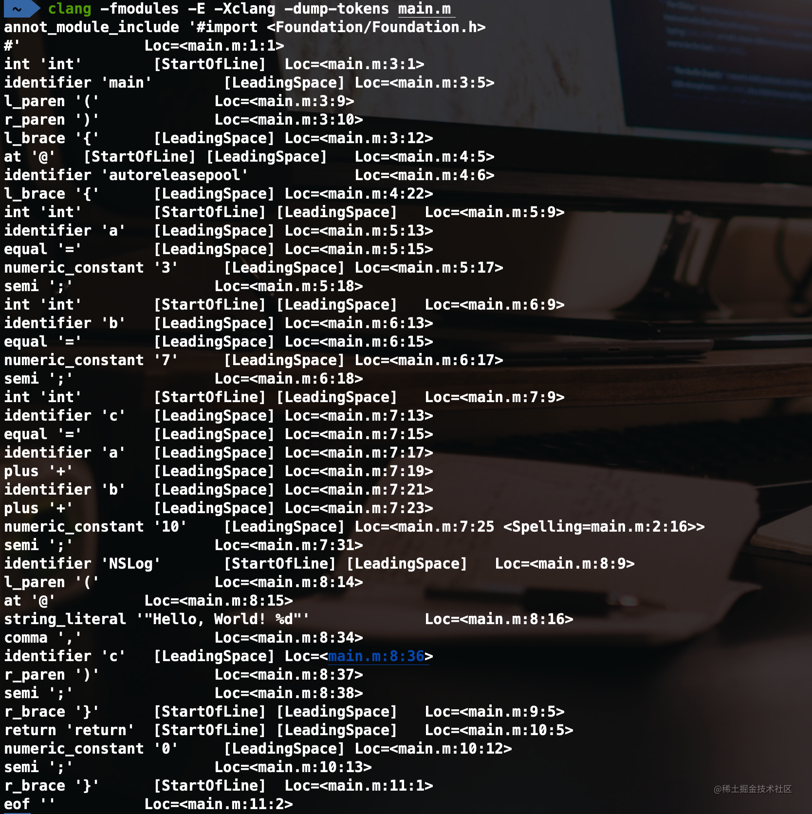

3. 语法分析（Parsing）：将标记转换为抽象语法树（Abstract Syntax Tree，AST）。我们的 clang 插件开发就是基于 AST 进行的。语法分析阶段会根据语法规则和上下文，将标记组织为语法树的结构，表示代码的语法结构和关系。对于上述代码，将生成一个包含语法树节点的层次结构，其中包括`import`、`function`、`expression`等节点。

    输入命令 `clang -fmodules -fsyntax-only -Xclang -ast-dump main.m` 查看 `main.m` 经过 clang 语法分析后的结果，一般都是对 .m 文件进行分析，因为 .m 文件中会导入 .h 头文件

    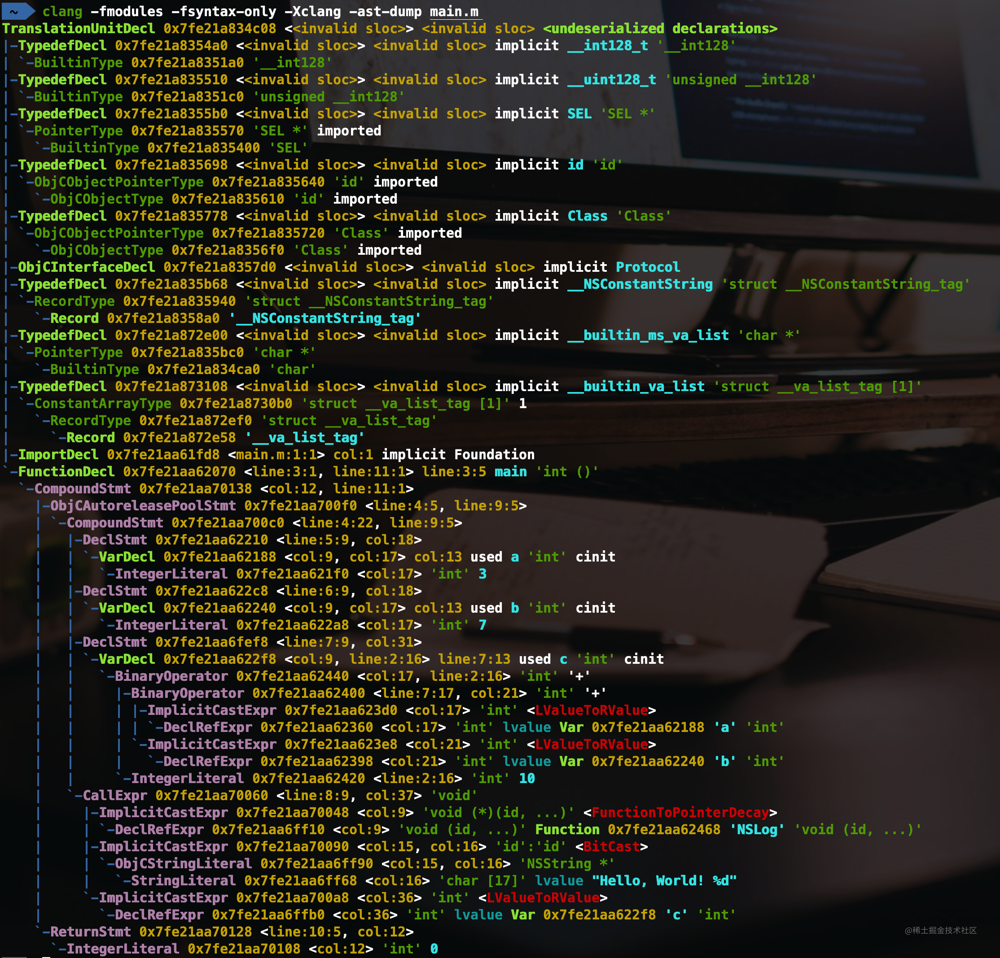
    
    如果对导入了 UIKit.h 等其它系统库头文件的源码文件进行语法分析，需要给 clang 命令指定 SDK 路径，使用 `-isysroot sdk路径`，以 main.m 为例
    
    ``` zsh
    clang -isysroot /Applications/Xcode.app/Contents/Developer/Platforms/iPhoneSimulator.platform/Developer/SDKs/iPhoneSimulator14.4.sdk -fmodules -fsyntax-only -Xclang -ast-dump main.m
    ```

4. 语义分析（Semantic Analysis）：对 AST 进行语义分析。这一阶段涉及类型检查、符号解析、作用域分析等操作，以确保源代码的语义正确性。例如，检查变量的类型是否匹配、解析函数和类的定义以及查找符号的定义等。

    使用命令 `clang -fsyntax-only main.m` 可以分析 `main.m` 文件是否有语法或语义错误,如果没有任何输出就表示没有语义或语法错误

5. 中间代码生成（Intermediate Code Generation）：将 AST 转换为中间表示（LLVM IR）。在 Objective-C 编译流程中，中间代码生成阶段将 AST 转换为 LLVM IR，这是一种抽象的低级表示形式，类似于汇编语言，但比机器码更抽象。LLVM IR 提供了对源代码进行优化和生成目标代码所需的基础。

    使用命令 `clang -S -emit-llvm main.m -o main.ll` 可以将 main.m 文件处理成 LLVM IR 格式的中间代码。执行上述命令后，Clang 将对`main.m`文件进行编译，并生成LLVM IR（中间代码）文件`main.ll`。在这个命令中，`-S`选项表示只执行编译阶段而不进行汇编和链接。`-emit-llvm`选项指示 Clang 生成 LLVM IR 作为输出。LLVM IR 是一种低级中间表示，类似于汇编语言，但比机器码更抽象。它可以用于进一步的优化、分析和目标代码生成。执行命令后，您将获得生成的`main.ll`文件，其中包含`main.m`的 LLVM IR 代码。您可以使用文本编辑器打开该文件，查看生成的中间代码。请注意，LLVM IR 是针对 LLVM 平台的中间表示，不直接对应特定的机器码。
    
    LLVM IR 有三种不同的表现形式,可以用不同的格式进行表示和展示。
    
    - 文本格式（Textual Format）：通常使用`.ll`作为文件后缀名，表示 LLVM IR 的文本格式。LLVM IR 的文本格式是人类可读的，类似于类似于汇编语言。它使用类似于 LLVM 汇编的语法，可以用于查看和编辑 LLVM IR 代码。
    - 位码格式（Bitcode Format）：位码格式的文件通常使用`.bc`作为文件后缀名。这些文件包含了 LLVM IR 的二进制表示。LLVM IR 还可以以二进制形式存储，称为位码（bitcode）。位码是一种紧凑的、可移植的中间表示形式，可以在不同平台和系统上进行传递和处理。位码可以使用`llvm-as`工具将文本格式的 LLVM IR 转换为位码格式，使用`llvm-dis`工具将位码格式的 LLVM IR 转换回文本格式。
    - 内存表现形式（In-memory Representation）：LLVM IR 也可以在内存中以数据结构的形式表示。在 LLVM 编程接口中，可以使用 LLVM API 来创建、修改和处理 LLVM IR，而不需要使用文本或位码格式。这种内存表现形式使得可以在程序中动态生成和操作 LLVM IR。 

6. 优化（Optimization）：对生成的 LLVM IR 进行各种优化，以改善代码的性能和效率。优化阶段使用 LLVM 提供的各种优化技术，例如内联展开、循环优化、指令选择等。这些优化技术可以根据配置和命令行选项进行调整。

    Xcode 中集成了优化的选项,如图
        
    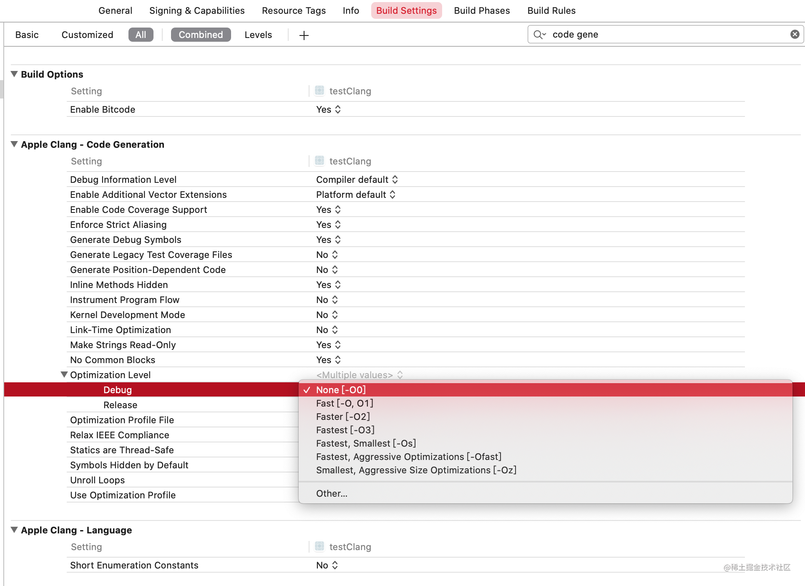

7. 目标代码生成（Code Generation）：将优化后的 LLVM IR 转换为特定目标机器的机器码。在 Objective-C 编译过程中，LLVM 会根据目标机器的架构、操作系统等信息，将优化后的 LLVM IR 转换为适当的机器码表示。

    使用命令 `clang -c main.m -o main.o` 
    
    执行上述命令后，Clang将对`main.m`文件进行编译，并生成目标文件（object file）`main.o`。在这个命令中，`-c`选项指示 Clang 只进行编译，不进行链接操作。这将生成与目标平台相关的二进制目标代码。目标文件（object file）是一种机器代码的二进制表示形式，用于后续的链接操作，生成可执行文件或库文件。

8. 链接（Linking）：将生成的目标代码与其他必要的库进行链接，以创建最终的可执行文件或库文件。在 Objective-C 编译过程中，需要链接 Objective-C 运行时库以支持 Objective-C 特定的功能。

    使用命令 `clang main.o -o main`
    
    执行上述命令后，Clang 将对目标文件`main.o`进行链接，并生成可执行文件`main`。在这个命令中，`main.o`是之前使用 Clang 生成的目标文件，`-o`选项指定输出文件的名称，这里是`main`。通过指定输出文件名，您可以自定义生成的可执行文件的名称。链接操作将目标文件与所需的库文件进行关联，并解析符号引用，生成最终的可执行文件。

--------------------------------------------------------------------------------------

了解了以上理论知识部分之后,我们开始动手开发一个 clang 插件

# clang 插件开发

想要实现最终的效果,需要以下四个步骤

1. 下载 LLVM 源码
2. 编译 LLVM 源码得到 clang 可执行文件
3. 编写 clang 插件,编译后得到动态库
4. 集成到 Xcode 中

## 下载 LLVM 源码

大多数人可能第一步就放弃了,因为 [LLVM](https://github.com/llvm/llvm-project) 源码在 github 上并且占用空间以 GB 为单位导致下载不下来,如果没有好的代理可以尝试一下 [清华大学提供的镜像站 ](https://mirror.tuna.tsinghua.edu.cn/help/llvm-project.git/)

## 编译 LLVM 源码得到 clang 可执行文件

编译这一步也是很多人放弃的一个环节,毕竟 LLVM 不是一个小项目,比较吃机器的配置,可能需要几个小时,这里推荐使用 ninja 编译,会比直接编译快很多,也是大多数 LLVM 开发者推荐使用的方式,安装 ninja 需要使用 brew ,作为开发者,我相信大多数人电脑上都已经安装 [brew](https://brew.sh/) ,如果没有那就去官网下载安装,如果喜欢使用图形用户界面的 brew 可以尝试一下 [cakebrew](https://www.cakebrew.com/) ,打开 cakebrew 可以很方便的管理,下载,更新,查看电脑上的这些工具

brew 安装好之后,可以使用以下方式安装好 cmake 和 ninja

``` sh
brew install cmake
brew install ninja
```

或者在 cakebrew 上搜索并安装

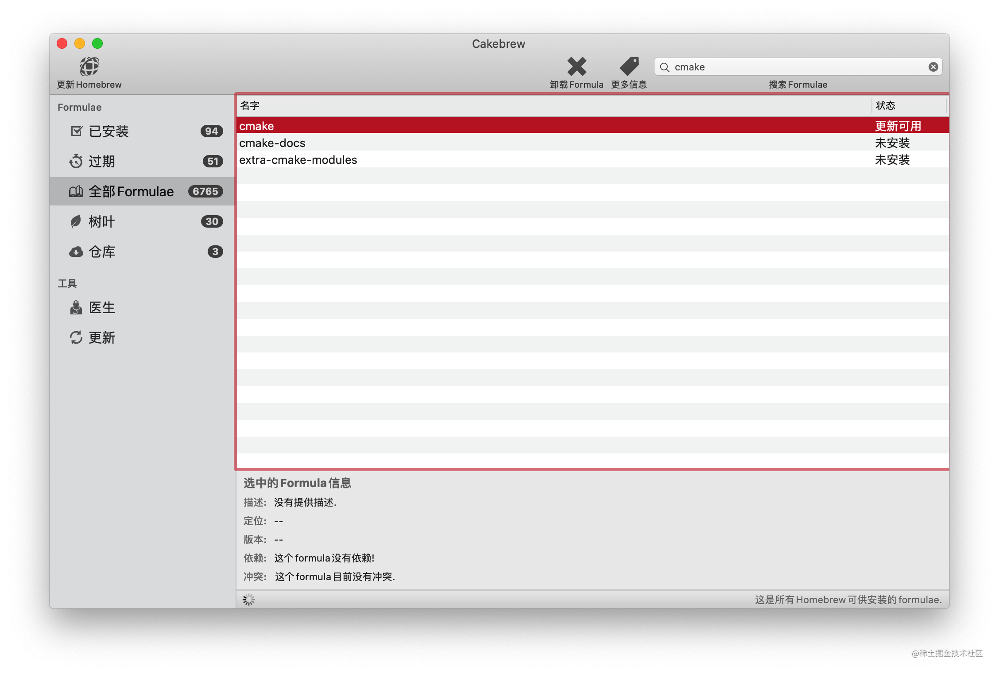

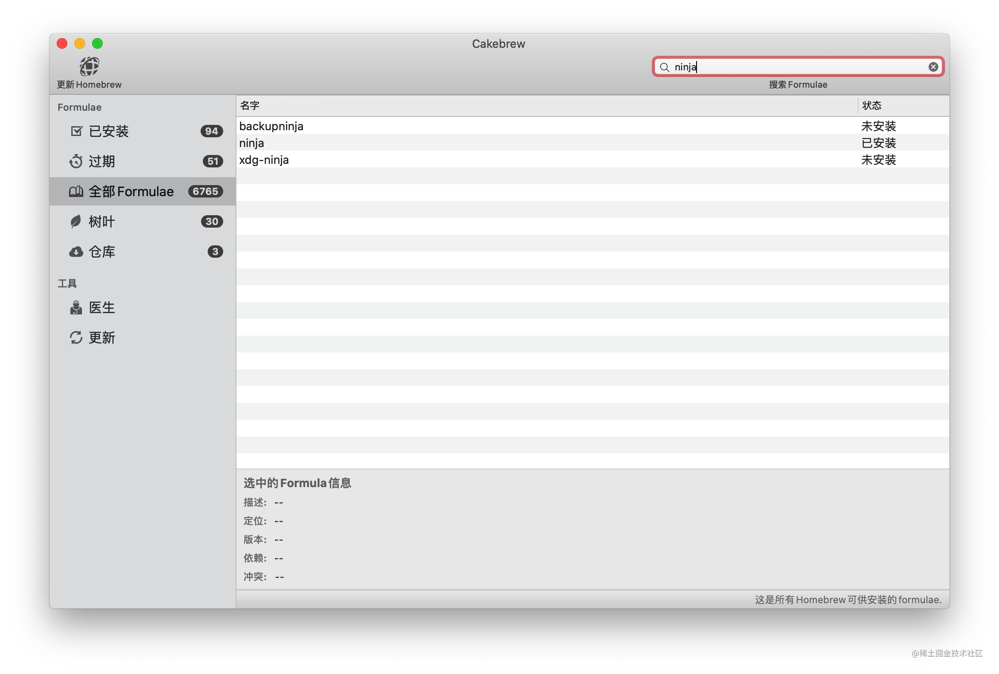

上面两个工具都安装好之后,打开终端进入 LLVM 源码目录,输入以下命令

``` sh
cmake -S llvm -B build -G Ninja -DCMAKE_BUILD_TYPE=Release -DLLVM_ENABLE_PROJECTS="clang"
```

因为 clang 是 LLVM 的子项目,LLVM 默认只编译它的核心库,不会编译子项目所以需要添加参数 `-DLLVM_ENABLE_PROJECTS="clang"` 这一步只是生成 ninja 相关文件,并不是真正的编译,还需要执行以下命令才是真正开始编译 LLVM 和 clang

``` sh
ninja -C build
```

根据电脑配置,可能需要几十分钟到几个小时不等吧,这里是真正耗时的地方,编译成功之后在 llvm-project 目录下出现一个 build 目录, build 目录下会出现一个 bin 目录,里面能看到我们编译好的 clang 可执行文件

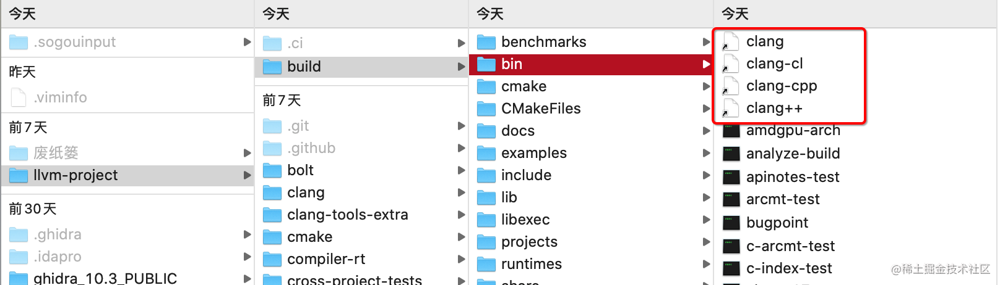

## 编写 clang 插件,实现需求

除了使用 Ninja 编译 LLVM ,其实还可以生成 Visual Studio 或者 Xcode 工程进行编译,作为 iOS 开发者当然是优先选择比较熟悉的 Xcode 工程来编写插件代码了;在生成 Xcode 工程编写插件代码之前,我们需要先创建一个插件

### 创建 MKPlugin 目录

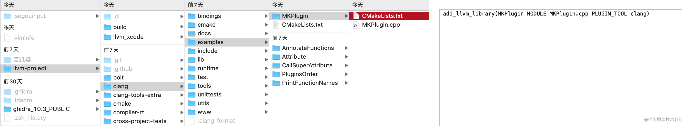

如上图所示,在 `llvm-project/clang/examples` 目录下创建一个目录 `MKPlugin` ,这个名称可以改成你自己插件名称,然后在 `MKPlugin` 目录下创建

- `CMakeLists.txt` 文件：文件内容为 `add_llvm_library(MKPlugin MODULE MKPlugin.cpp PLUGIN_TOOL clang)`
- `MKPlugin.cpp` 文件：这个文件是等会写插件代码的地方

### 配置 MKPlugin 插件

插件目录创建好之后,需要在插件目录同级的 CMakeList.txt 文件中添加我们的插件,如下图所示

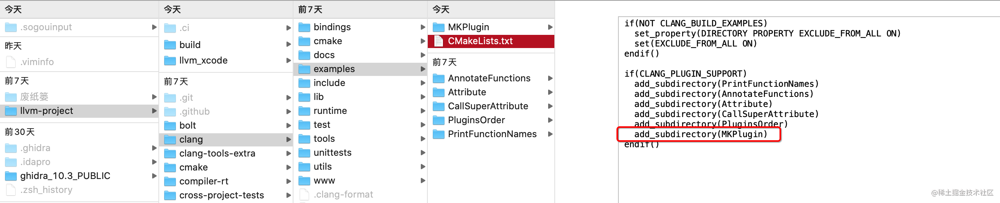

### 生成 Xcode 工程

上面两个步骤完成之后,就可以生成我们熟悉的 Xcode 工程了,首先在 `llvm-project` 目录下创建一个目录,用来存放我们生成的 Xcode 工程,我这里取名为 `llvm_xcode` ,如下图

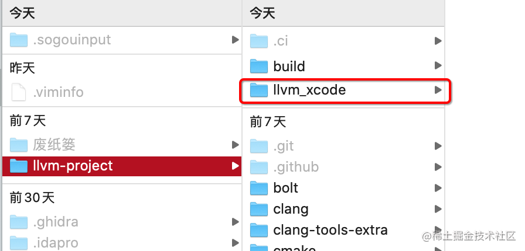

然后使用终端,进入 `llvm_xcode` 目录,输入以下命令 

``` sh
cmake -G Xcode ../llvm -DLLVM_ENABLE_PROJECTS=clang
```

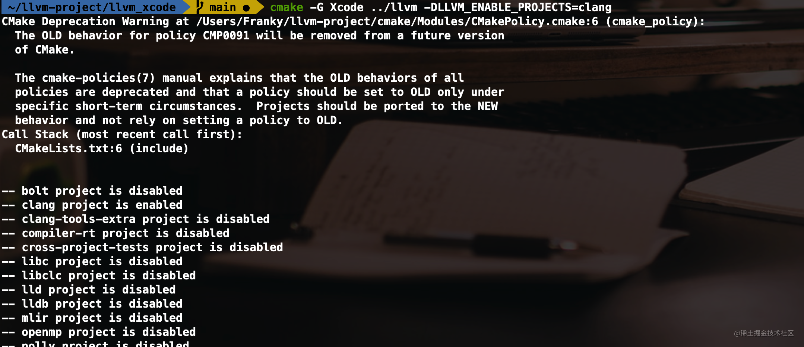

同样,默认不会生成 clang 子项目,所以需要添加参数 `-DLLVM_ENABLE_PROJECTS=clang` ,执行完成之后,终端结果如下图

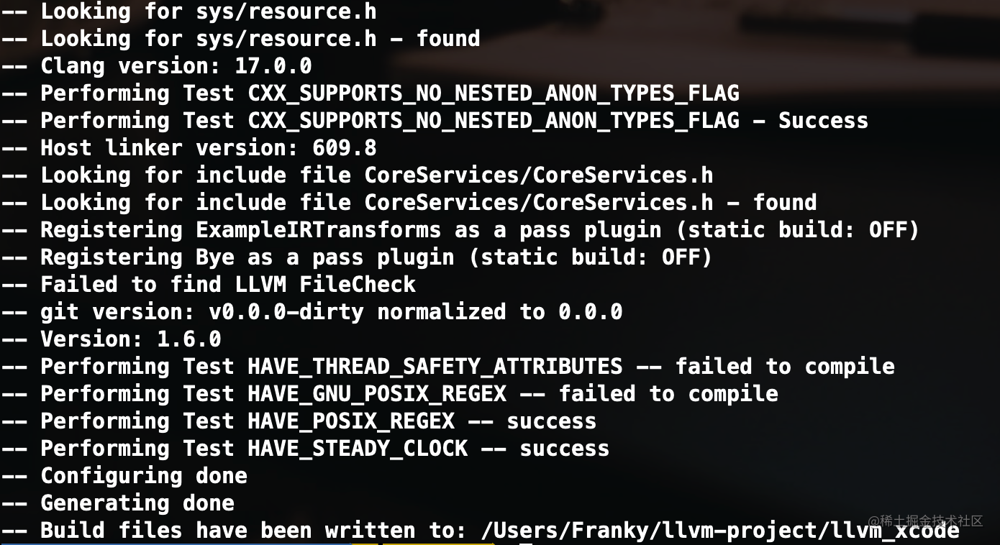

使用 Finder 查看 `llvm_xcode` 目录如下

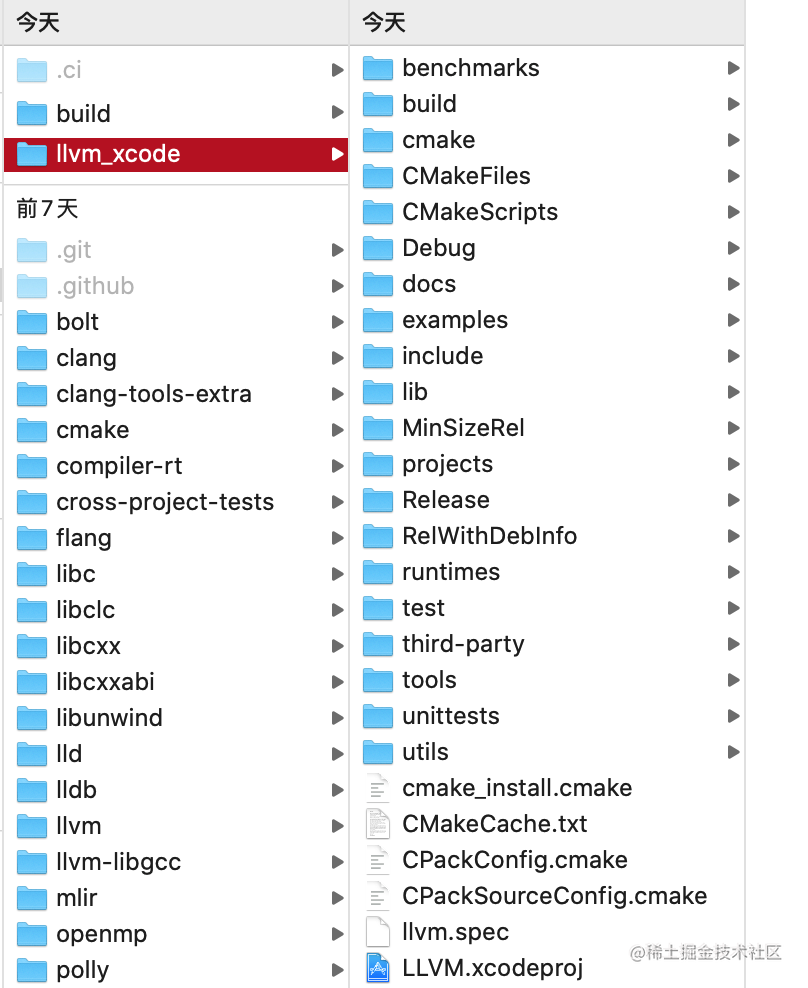

打开 `LLVM.xcodeprog` 就到了熟悉的 Xcode 界面了,第一次打开会提示是否自动创建 Schemes

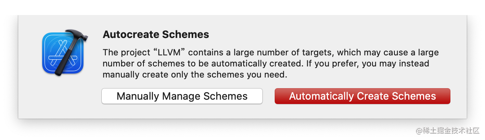

这里我个人还是推荐选择 `Automatically Create Schemes` 自动创建,因为 Schemes 特别多所以电脑配置不太行的 Xcode 可能会卡顿一会,一般等一会就好了,而且如果我的电脑不会卡顿,那应该大多数人的电脑都不会有太大问题...

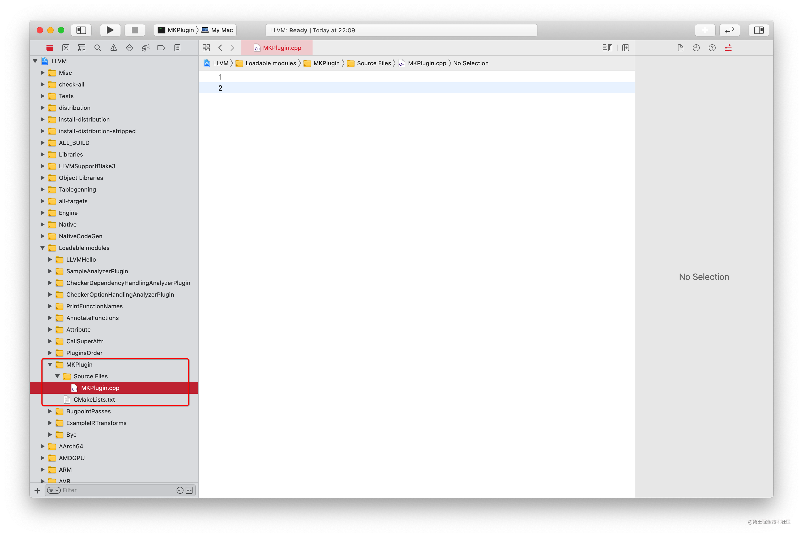

到这里,编写自己 clang 插件的 Xcode 工程就生成好了

### 编写插件代码

说明一下,我们需要实现的需求是:

- 类名不建议使用小写字母开头,如果有小写字母开头的类名,报一个警告并给出修复的建议
- 类名中不允许包含下划线`_`,如果类名中有下划线`_`,报一个错误并给出修复的建议
- 不可变属性,如 NSArray, NSString, NSDictionary 的 setter 语义建议使用 copy 修饰

编写插件思路是创建子类继承 clang 的解析语法树相关的类，重写父类的相关方法，在关键的节点插入我们的处理逻辑，源码如下:

``` cpp
#include <iostream>
#include <clang/AST/AST.h>
#include <clang/AST/DeclObjC.h>
#include <clang/AST/ASTConsumer.h>
#include <clang/ASTMatchers/ASTMatchers.h>
#include <clang/ASTMatchers/ASTMatchFinder.h>
#include <clang/Frontend/CompilerInstance.h>
#include <clang/Frontend/FrontendPluginRegistry.h>

using namespace clang;
using namespace std;
using namespace llvm;
using namespace clang::ast_matchers;

namespace MKPlugin {
    class MKMatchCallback : public MatchFinder::MatchCallback {
    private:
        CompilerInstance &CI;
        
        bool isUserSourceCode(const string filename) {
            if (filename.empty()) return false;
            if (filename.find("/Applications/Xcode.app/") == 0) return false;
            return true;
        }
        
        bool shouldUseCopy(const string typeStr) {
            if (typeStr.find("NSArray") != string::npos ||
                typeStr.find("NSString") != string::npos ||
                typeStr.find("NSDictionary") != string::npos ) {
                return true;
            }
            return false;
        }
        
    public:
        MKMatchCallback(CompilerInstance &CI):CI(CI){}
        
        void run(const MatchFinder::MatchResult &Result) override {
            const ObjCPropertyDecl *propertyDecl = Result.Nodes.getNodeAs<ObjCPropertyDecl>("objcPropertyDecl");
            if (propertyDecl) {
                string fileName = CI.getSourceManager().getFilename(propertyDecl->getSourceRange().getBegin()).str();
                if (isUserSourceCode(fileName)) {
                    string classTypeStr = propertyDecl->getType().getAsString();
                    ObjCPropertyAttribute::Kind kind = propertyDecl->getPropertyAttributes();
                    if (shouldUseCopy(classTypeStr) && !(kind & ObjCPropertyAttribute::Kind::kind_copy)) {
                        DiagnosticsEngine &engine = CI.getDiagnostics();
                        unsigned int diagID = engine.getCustomDiagID(clang::DiagnosticsEngine::Warning, "不可变对象的setter语义推荐使用copy修饰");
                        engine.Report(propertyDecl->getBeginLoc(), diagID);
                    }
                }
            }
            
            const ObjCInterfaceDecl *objcInterfaceDecl = Result.Nodes.getNodeAs<ObjCInterfaceDecl>("objcInterfaceDecl");
            if (objcInterfaceDecl) {
                string filename = CI.getSourceManager().getFilename(objcInterfaceDecl->getSourceRange().getBegin()).str();
                DiagnosticsEngine &engine = CI.getDiagnostics();
                if (isUserSourceCode(filename)) {
                    StringRef name = objcInterfaceDecl->getName();
                    char c = name[0];
                    if (isLowercase(c)) {
                        unsigned diagID = engine.getCustomDiagID(DiagnosticsEngine::Warning, "类名首字母不应该使用小写字母");
                        SourceLocation location = objcInterfaceDecl->getLocation();
                        std::string tempName = name.str();
                        tempName[0] = toUppercase(c);
                        StringRef replacement(tempName);
                        SourceLocation nameStart = objcInterfaceDecl->getLocation();
                        SourceLocation nameEnd = nameStart.getLocWithOffset(name.size());
                        FixItHint fixItHint = FixItHint::CreateReplacement(SourceRange(nameStart, nameEnd), replacement);
                        engine.Report(location, diagID).AddFixItHint(fixItHint);
                    }
                    
                    size_t pos = objcInterfaceDecl->getName().find('_');
                    if (pos != StringRef::npos) {
                        std::string tempName = name.str();
                        std::string::iterator end_pos = std::remove(tempName.begin(), tempName.end(), '_');
                        tempName.erase(end_pos, tempName.end());
                        StringRef replacement(tempName);
                        SourceLocation nameStart = objcInterfaceDecl->getLocation();
                        SourceLocation nameEnd = nameStart.getLocWithOffset(name.size());
                        FixItHint fixItHint = FixItHint::CreateReplacement(SourceRange(nameStart, nameEnd), replacement);
                        SourceLocation loc = objcInterfaceDecl->getLocation().getLocWithOffset(pos);
                        engine.Report(loc, engine.getCustomDiagID(clang::DiagnosticsEngine::Error, "类名中不允许包含下划线_")).AddFixItHint(fixItHint);
                    }
                }
            }
        }
    };
    
    // 继承 ASTConsumer 实现自定义逻辑
    class MKConsumer : public ASTConsumer {
    private:
        MatchFinder matchFinder;
        MKMatchCallback callback;
    public:
        MKConsumer(CompilerInstance &CI):callback(CI) {
            matchFinder.addMatcher(objcPropertyDecl().bind("objcPropertyDecl"), &callback);//属性声明
            matchFinder.addMatcher(objcInterfaceDecl().bind("objcInterfaceDecl"), &callback);//类声明
        }
        void HandleTranslationUnit(ASTContext &Ctx) override {
            matchFinder.matchAST(Ctx);
        }
    };
    
    // 继承 PluginASTAction 实现自定义的逻辑
    class MKASTAction : public PluginASTAction {
    public:
        bool ParseArgs(const CompilerInstance &CI, const std::vector<std::string> &arg) override {
            return true;
        }
        std::unique_ptr<ASTConsumer> CreateASTConsumer(CompilerInstance &CI, StringRef InFile) override {
            return unique_ptr<MKConsumer>(new MKConsumer(CI));
        }
    };
}

// 注册插件
static FrontendPluginRegistry::Add<MKPlugin::MKASTAction> X("MKPlugin", "这里是插件的描述信息");
```

## 集成到 Xcode 中

插件代码编写完成之后，需要将插件编译成动态库，在 Xcode 中选择我们的 MKPlugin Scheme 进行编译，如下图

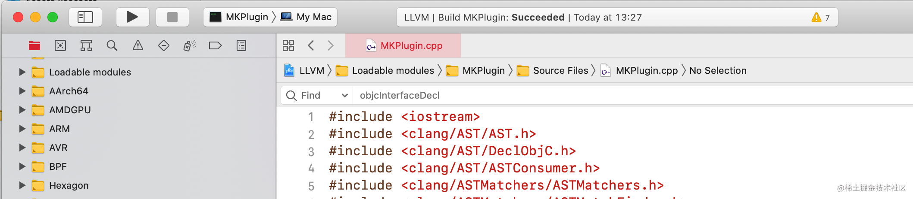

Scheme 可能有很多需要往下翻很久才能找到我们的插件，这时候可以直接输入我们的插件名称进行快速定位，编译成功之后，可以在 Products 目录下看到对应的动态库文件 `MKPlugin.dylib`，如下图

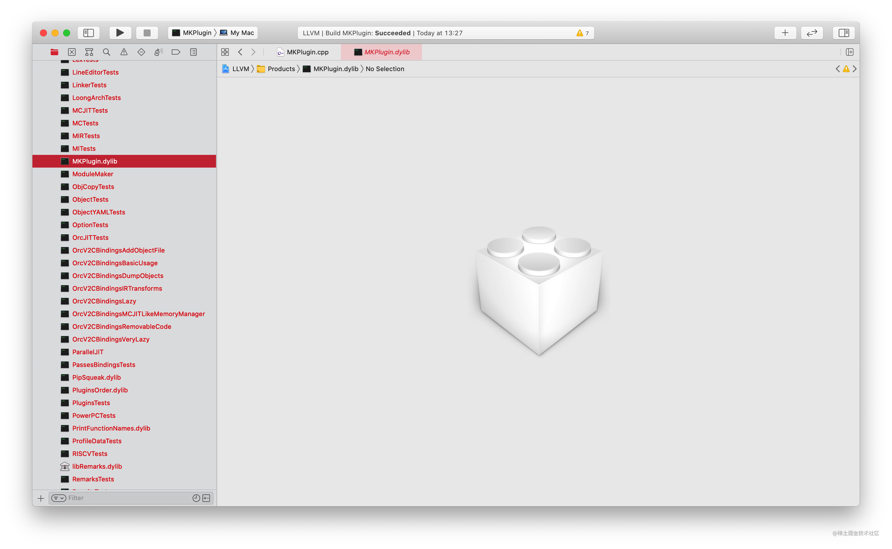

在集成到 Xcode 之前，可以先使用终端命令验证我们的 clang 和 MKPlugin.dylib 是否生效，此时需要一份 Objective-C 的源码进行编译，我们新建一个 Xcode 项目，编写一段简单的 Objective-C 代码。如下图：

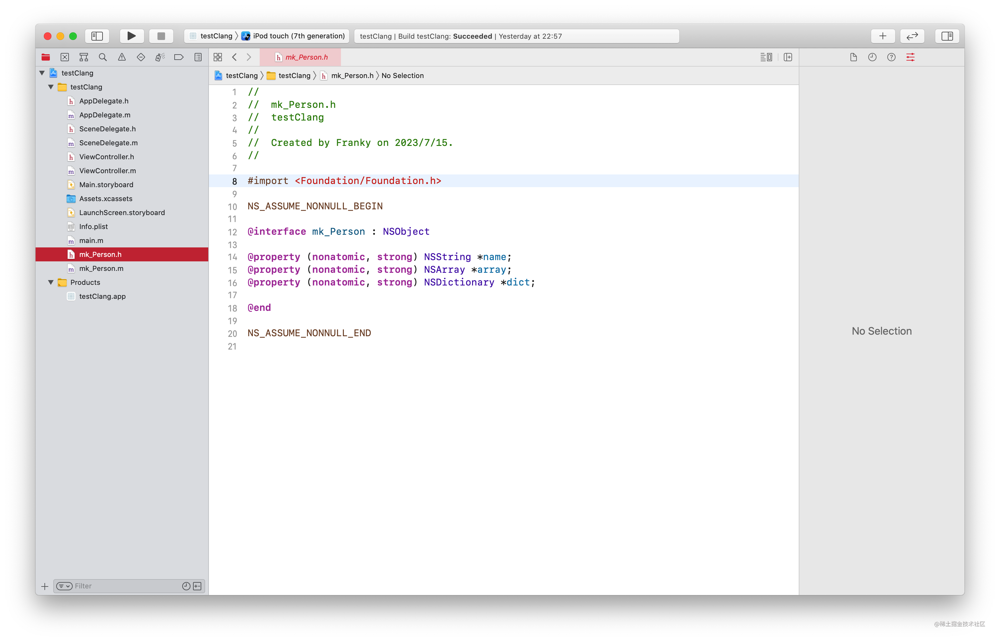

然后使用终端进入工程目录下，输入以下命令

``` sh
/Users/Franky/llvm-project/build/bin/clang -isysroot /Applications/Xcode.app/Contents/Developer/Platforms/iPhoneSimulator.platform/Developer/SDKs/iPhoneSimulator14.4.sdk -Xclang -load -Xclang /Users/Franky/llvm-project/llvm_xcode/Debug/lib/MKPlugin.dylib -Xclang -add-plugin -Xclang MKPlugin -c mk_Person.m
```

这个命令使用了我们之前编译好的 clang 和 MKPlugin.dylib 对 mk_Person.m 文件进行编译，结果如下图

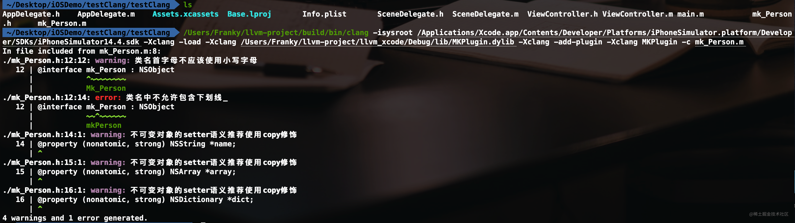

可以明显的看到，我们编写的插件代码生效了！下一步可以集成到 Xcode 中了，来到 testClang 工程的 build settings 中搜索 Other C Flags，输入刚刚的命令中的中间那一段

``` sh
-Xclang -load -Xclang /Users/Franky/llvm-project/llvm_xcode/Debug/lib/MKPlugin.dylib -Xclang -add-plugin -Xclang MKPlugin
```

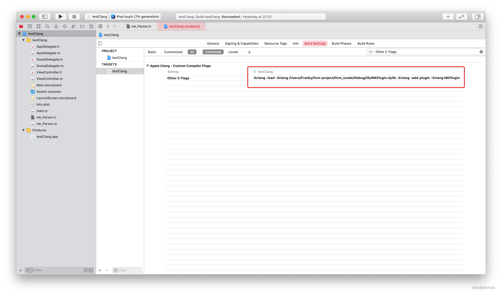

然后添加两个用户定义设置

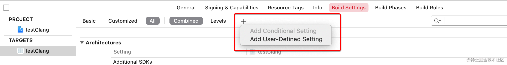

输入刚刚的命令中的 clang 路径，clang++ 也在同级的目录下


最后将 enable index-while-building functionality 设置为 NO 

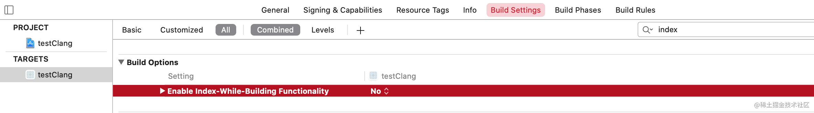

编译之后就会看到以下结果了


# 最后

了解了 LLVM 和 clang 的编译原理之后，我们能做的事情还有很多，可以用它来实现一门新的编程语言；可以用来分析语法树；可以进行语言的转换；可以开发 clang 插件；Pass 开发代码优化,代码混淆等等功能；借助 clang 来优化 APP 的启动速度；静态分析 C，C++，Objective-C 代码的一个开源工具 [OCLint](https://oclint.org/) 也是基于 clang 抽象语法树（AST），觉得自己实现插件麻烦的，也可以使用 OCLint。
