# 通用二进制(Universal binary)文件

macOS 系统一路走来，支持的 CPU 及硬件平台都有了很大的变化，从早期的 PowerPC 平台，到后来的 x86，再到现在主流的 arm、x86-64 平台。软件开发人员为了做到不同硬件平台的兼容性，如果需要为每一个平台编译一个可执行文件，这将是非常繁琐的。

为了解决软件在多个硬件平台上的兼容性问题，苹果开发了一个通用的二进制文件格式（Universal Binary）。又称为胖二进制（Fat Binary），通用二进制文件中将多个支持不同 CPU 架构的二进制文件打包成一个文件，系统在加载运行该程序时，会根据通用二进制文件中提供的多个架构来与当前系统平台做匹配，运行适合当前系统的那个版本。

有人或许会好奇，不是讲 Mach-O 文件吗?怎么开始讲通用二进制文件，不要着急，看下面 `file` 命令查看 dyld 的打印，universal binary 前面不就是 Mach-O 吗

苹果自家系统中存在着很多通用二进制文件。比如 /usr/lib/dyld，在终端中执行 `file` 命令可以查看它的信息：

``` sh
 ~/ file /usr/lib/dyld
/usr/lib/dyld： Mach-O universal binary with 3 architectures： [i386：Mach-O dynamic linker i386] [x86_64：Mach-O 64-bit dynamic linker x86_64] [arm64e]
/usr/lib/dyld (for architecture i386)：	Mach-O dynamic linker i386
/usr/lib/dyld (for architecture x86_64)：	Mach-O 64-bit dynamic linker x86_64
/usr/lib/dyld (for architecture arm64e)：	Mach-O 64-bit dynamic linker arm64e
```

我们创建一个名为 test 的 iOS 工程，然后在 Xcode 中通过设置 Build Settings 中的 Architectures 来生成兼容各种架构的 APP

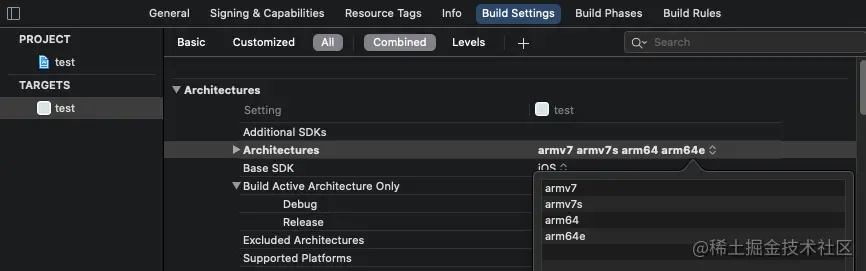

编译之后，使用 `file` 命令查看生成的 ipa 包里的可执行文件

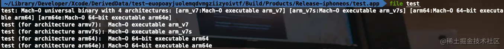

## lipo

系统提供了一个命令行工具`lipo`来操作通用二进制文件。它可以添加、提取、删除以及替换通用二进制文件中特定架构的二进制版本。

查看通用二进制文件信息： 

``` sh
lipo -info test
```

提取 test 中 armv7 版本的二进制文件可以执行：

``` sh
lipo test -extract armv7 -output test_armv7
```

提取 test 中 arm64 版本的二进制文件可以执行：

``` sh
lipo test -extract arm64 -output test_arm64
```

合并 test_armv7 和 test_arm64：

``` sh
lipo -create test_armv7 test_arm64 -output test0
```

删除 test 中 armv7s 版本的二进制文件可以执行：

``` sh
lipo test -remove armv7s -output test1
```

通用二进制的"通用"不止针对可以直接运行的可以执行文件，系统中的动态库 .dylib 文件，静态库 .a 文件以及 Framework 等都可以是通用二进制文件，对它们同样也可以使用 `lipo` 命令来进行管理

接下来打开我们的 Xcode，按 command + shift + o 输入 mach-o/fat.h 就可以看到对通用二进制文件格式的声明，从文件的命名和声明来看，将通用二进制叫作胖二进制或许更合适。胖二进制的头部定义如下：

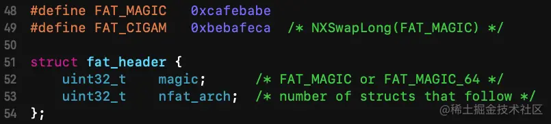

`magic` 字段被定义为常量 FAT_MAGIC，它的取值根据架构是固定的，在 32 位架构上是 **0xcafebabe**，在 64 位架构上是 **0xcafebabf**，表示这是一个通用二进制文件。这里要说一下字节序，计算机硬件有两种储存数据的方式，分别为大端字节序，和小端字节序，大端字节序：高位字节在前，低位字节在后，这是人类读写数值的方法。小端字节序：低位字节在前，高位字节在后，是大多数机器读取数据的方式。下图所示的是同一个数字 01234567 在大端和小端下的存储方式<br>

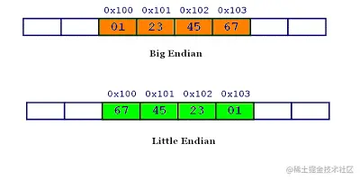<br>

`nfat_arch` 字段表示后面的 Mach-O 文件的数量<br>

每个通用二进制架构信息都使用 fat_arch 结构体表示，在 fat_header 结构体之后，紧接着的是一个或多个连续的 fat_arch 结构体，它的定义如下：

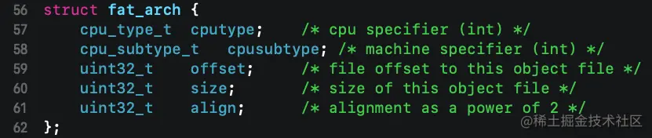

`cputype`字段是 cpu 说明符，类型是`cpu_type_t`，定义在\<mach/machine.h\>文件，使用同样的 command + shift + o 然后输入头文件的方法可以打开 \<mach/machine.h\> 文件，在 macOS 上取值一般为 `CPU_TYPE_I386` 或 `CPU_TYPE_X86_64`，在 iOS 平台上一般是 `CPU_TYPE_ARM` 或 `CPU_TYPE_ARM64` <br>

`cpu_subtype` 字段是机器说明符，类型是 `cpu_subtype_t`，同样定义在 \<mach/machine.h\> 文件，macOS 上一般是 `CPU_SUBTYPE_I386_ALL`，`CPU_SUBTYPE_X86_64_ALL`，在 iOS 上一般则是 `CPU_SUBTYPE_ARM64_ALL`，`CPU_SUBTYPE_ARM_V7`<br>

`offset` 字段指明了当前 Mach-O 数据相对于当前文件开头的偏移值<br>

`size` 字段指明了数据的大小<br>

`align` 字段指明了数据的内存对齐边界，取值必须是 2 的 n 次方，它确保了当前 cpu 架构的目标文件加载到内存中时，数据是经过内存优化对齐的

使用 [MachOView](https://github.com/gdbinit/MachOView) 可以十分清楚的看到这些信息

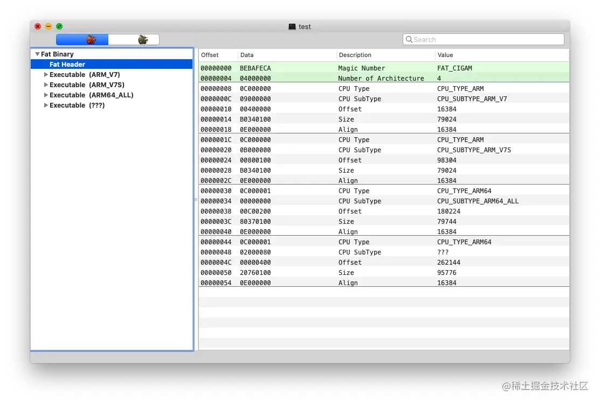

在 fat_arch 结构体往下就是具体的 Mach-O 格式文件了，它的内容复杂得多，将在下一小节进行讨论。

# Mach-O

## 简介

Mach-O（Mach Object file format）是一种文件格式，用于在 macOS、iOS 以及其他基于 Mach 内核的操作系统上保存可执行文件、目标文件、动态库和内核转储。Mach-O 格式是这些系统上程序的核心组成部分，存储了程序运行所需的所有信息，比如代码、数据、符号表、调试信息等。

熟悉 Mach-O 文件格式，有助于了解苹果软件底层运行机制，更好的掌握 dyld 加载 Mach-O 的步骤，为自己动手开发 Mach-O 相关的加解密工具打下基础

1. MacOS 上的可执行文件是一种 Mach-O 文件(比如 ruby，phtyon...)，但不是所有可执行文件都是 Mach-O 文件
2. 库文件是一种 Mach-O 文件，动态库 .dylib，静态库 .a，还有 Framework 都是一种 Mach-O 文件
3. .o 文件(clang 编译 c 源文件得到的)也叫目标文件夹，是一种 Mach-O 文件
4. .dsym 文件(符号表)也是一种 Mach-O 文件
5. dyld 是可执行文件，自然也是一种 Mach-O 文件

以上这些都属于 Mach-O 文件，当然除了以上这五种，还有其他类型的 Mach-O 文件，只是这五种比较常见...其他还有八种，其他八种会在下面对 Mach-O 文件结构的介绍中提到

从上面 MachOView 的截图中可以看到，test 文件内有 4 种不同架构的文件，每种架构的文件都可以称它为一个 Mach-O 文件，而刚刚所讲的通用二进制文件就是一个文件如果包含了 1 种以上的 Mach-O 文件，那么他就是通用二进制文件

我们知道了 Mach-O 文件就是一堆有着特定结构的二进制数据，那么我们如何从这一堆的二进制里获取我们所需要的数据?如果做过股票行情 APP，IM 通讯底层 SDK 或者说使用过 socket 长连接对二进制数据进行过处理，发送，接收的同学，一定会知道对一堆的二进制如何有效的处理，提取我们想要的数据的。以我曾经做过的一款股票行情软件为例，里面就定义了大量的结构体类型，用结构体来对二进制数据进行解析，得到我们想要的数据，那么这个 Mach-O 文件的解析有没有对应的结构体呢?

当然有，在 Xcode 中使用 command + shift + o 搜索 mach-o/loader.h 就会发现一堆的结构体，这些结构体都是系统用来解析 Mach-O 文件的，我们也能从中获取到不少的信息

## 结构

一个典型的 Mach-O 文件结构如下图所示：

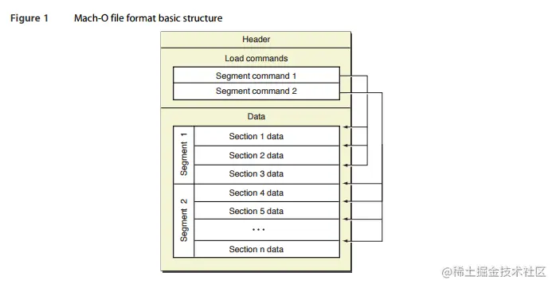

从图中可以了解到一个 Mach-O 文件的结构包括 Header，Load commands 和 Data

- **Header**：描述了 Mach-O 的 cpu 架构、文件类型以及加载命令等信息。
- **Load commands**：指定文件的逻辑结构和文件在虚拟内存中的布局。
- **Data**：原始段数据。每个段 Segment 都有一个或多个 Section，它们存放了具体的数据。

### Header

可以使用 `otool` 命令来查看 Mach-O 文件的头部信息

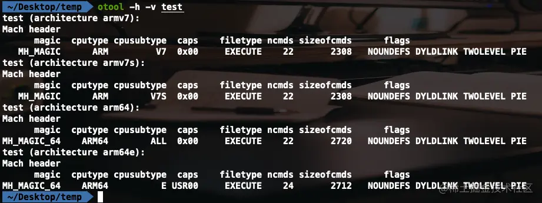

这个部分的定义，可以通过在 Xcode 中，按 command + shift + o 输入 mach-o/loader.h 的方式找到

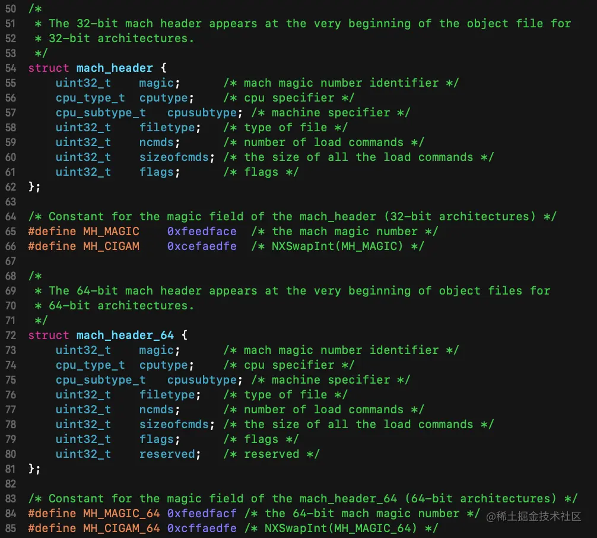

- **`magic`** 在截图中都能看到的宏定义，对 32 位架构的程序来说，它的值就是 **0xfeedface**，可以使用 **MH_MAGIC** 宏代替。对 64 位架构的程序来说，它的值就是 **0xfeedfacf**，对应的宏  **MH_MAGIC_64**
- **`cputype`** 和上一节中所讲的 fat_header 结构体的含义完全相同
- **`cpusubtype`** 同上
- **`filetype`** 表示 Mach-O 文件的具体类型，值有下图所示的12种，常见的有 MH_EXECUTE(可执行文件)，MH_DYLIB(动态库)，MH_DYLINKER(动态连接器)，MH_DSYM(符号表文件)
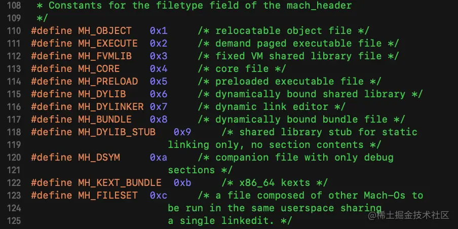
- **`ncmds`** load commands 的数量
- **`sizeofcmds`** 所有 load commands 的占的字节数
- **`flags`** 标记，值比较多，最好去头文件中查看详细说明

``` c
#define	MH_NOUNDEFS	0x1		/* the object file has no undefined
					   references */
#define	MH_INCRLINK	0x2		/* the object file is the output of an
					   incremental link against a base file
					   and can't be link edited again */
#define MH_DYLDLINK	0x4		/* the object file is input for the
					   dynamic linker and can't be staticly
					   link edited again */
#define MH_BINDATLOAD	0x8		/* the object file's undefined
					   references are bound by the dynamic
					   linker when loaded. */
#define MH_PREBOUND	0x10		/* the file has its dynamic undefined
					   references prebound. */
......
```
- **`reserved`** 这个字段只在 64 位架构的 Mach-O 文件中才有，目前它的取值系统保留

使用 MachOView 查看 Header 的信息

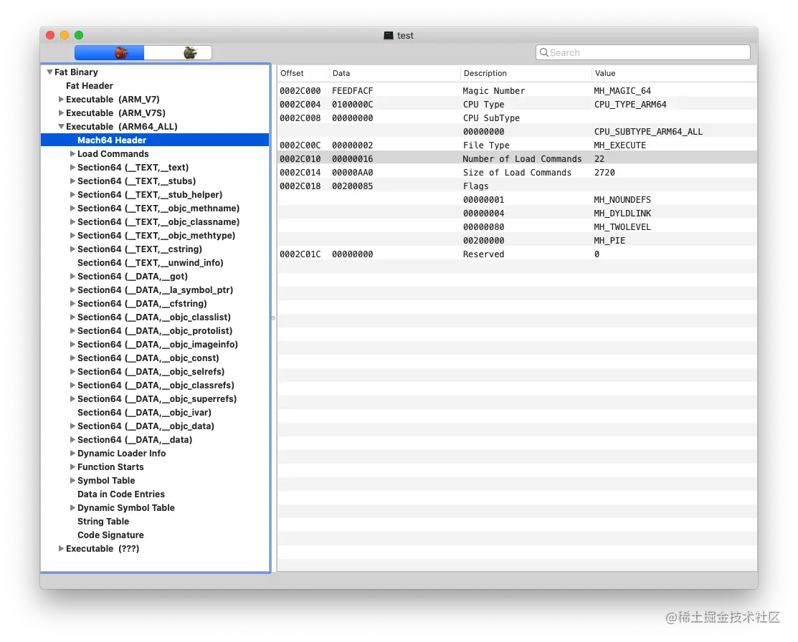

### Load Commands

Load Commands 描述的是文件的加载信息，加载信息有很多，加载的段、符号表、动态库信息等都在 Load Commands 中取到。这个部分信息还是比较有用的，我们可以从这里获取到符号表和字符串表的偏移量，下文中会有详细的解释。

Load Commands 加载命令紧跟在 Header 之后，所有加载命令的前两个字段必须是 cmd 和 cmdsize，cmd 字段用该命令类型的常量填充，头文件中定义了许多的宏用于该字段，每个命令类型都有一个特定的结构。cmdsize 字段是以字节为单位的特定加载命令结构的大小，再加上它后面作为加载命令一部分的任何内容（即节结构、字符串等）要前进到下一个加载命令，可以将 cmdsize 加上当前加载命令的偏移量

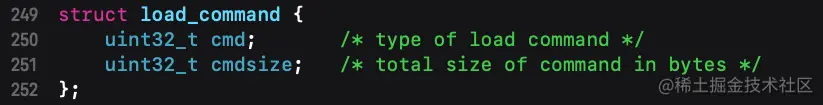

cmd 字段的取值有目前有 50 多种，太多了就不全部粘贴出来了...

``` c
#define LC_REQ_DYLD 0x80000000

/* Constants for the cmd field of all load commands， the type */
#define	LC_SEGMENT	0x1	/* segment of this file to be mapped */
#define	LC_SYMTAB	0x2	/* link-edit stab symbol table info */
#define	LC_SYMSEG	0x3	/* link-edit gdb symbol table info (obsolete) */
#define	LC_THREAD	0x4	/* thread */
#define	LC_UNIXTHREAD	0x5	/* unix thread (includes a stack) */
#define	LC_LOADFVMLIB	0x6	/* load a specified fixed VM shared library */
#define	LC_IDFVMLIB	0x7	/* fixed VM shared library identification */
#define	LC_IDENT	0x8	/* object identification info (obsolete) */
......
```

所有的这些加载命令由系统内核加载器直接使用，或由动态链接器处理。其中几个常见的加载命令有`LC_LOAD_DYLIB`、`LC_SEGMENT`、`LC_MAIN`、`LC_CODE_SIGNATURE`、`LC_ENCRYPTION_INFO`等，下面介绍其中的几个

#### LC_LOAD_DYLIB

`LC_LOAD_DYLIB`：表示这是一个需要动态加载的链接库。它使用 dylib_command 结构体表示。定义如下：

``` c
struct dylib_command {
	uint32_t	cmd。		/* LC_ID_DYLIB， LC_LOAD_{，WEAK_}DYLIB，
					   LC_REEXPORT_DYLIB */
	uint32_t	cmdsize。	/* includes pathname string */
	struct dylib	dylib。		/* the library identification */
}。
```

当 cmd 类型是`LC_ID_DYLIB`，`LC_LOAD_DYLIB`，`LC_LOAD_WEAK_DYLIB`，`LC_REEXPORT_DYLIB`时，都使用 dylib_command 结构体表示。其中 dylib 结构体存储要加载的动态库的具体信息如下

``` c
struct dylib {
    union lc_str  name。			/* library's path name */
    uint32_t timestamp。			/* library's build time stamp */
    uint32_t current_version。		/* library's current version number */
    uint32_t compatibility_version。	/* library's compatibility vers number*/
}。
```

`name` 字段是链接库的完整路径，动态链接器在加载库时，通用此路径来进行加载它。<br>
`timestamp`字段描述了库构建时的时间戳<br>
`current_version`与`compatibility_version`指明了前当版本与兼容的版本号<br>

如果你看了我的上一篇文章 [代码注入](https://juejin.cn/post/6977384497000448030) 里面提到了 `yololib`，这个工具的原理基本就是利用这条 `LC_LOAD_DYLIB` 加载命令的相关信息实现的

#### LC_MAIN

`LC_MAIN`：此加载命令记录了可执行文件的主函数 main() 的位置。它使用 entry_point_command 结构体表示。定义如下：

``` c
struct entry_point_command {
    uint32_t  cmd。	/* LC_MAIN only used in MH_EXECUTE filetypes */
    uint32_t  cmdsize。	/* 24 */
    uint64_t  entryoff。	/* file (__TEXT) offset of main() */
    uint64_t  stacksize。/* if not zero， initial stack size */
}
```

entryoff 字段中就指定了 main() 函数的文件偏移。stacksize 指定了初始的堆栈大小。

#### LC\_SEGMENT/LC\_SEGMENT_64

`LC_SEGMENT/LC_SEGMENT_64`：段加载命令，描述了 32 位或 64 位 Mach-O 文件的段的信息，常见的段有 `__PAGEZERO`，`__TEXT`，`__DATA`，`__LINKEDIT`。

`__PAGEZERO` 是一个空段，它位于文件起始段的位置

`__TEXT` 和 `__DATA` 分别是文本段和数据段，分别存储了代码信息和数据信息

`__LINKEDIT` 是链接信息段。段(segment)又可以细分为section，每个段(segment)可以包含多个section

段使用 segment_command 结构体来表示，它的定义如下：

``` c
struct segment_command { /* for 32-bit architectures */
	uint32_t	cmd。		/* LC_SEGMENT */
	uint32_t	cmdsize。	/* includes sizeof section structs */
	char		segname[16]。	/* segment name */
	uint32_t	vmaddr。		/* memory address of this segment */
	uint32_t	vmsize。		/* memory size of this segment */
	uint32_t	fileoff。	/* file offset of this segment */
	uint32_t	filesize。	/* amount to map from the file */
	vm_prot_t	maxprot。	/* maximum VM protection */
	vm_prot_t	initprot。	/* initial VM protection */
	uint32_t	nsects。		/* number of sections in segment */
	uint32_t	flags。		/* flags */
}
```

`segname` 字段是一个 16 字节大小的空间，用来存储段的名称，比如__TEXT...<br>

`vmaddr` 字段指明了段要加载的虚拟内存地址<br>

`vmsize` 字段指明了段所占的虚拟内存的大小<br>

`fileoff` 字段指明了段数据所在文件中偏移地址<br>

`filesize` 字段指明了段数据实际的大小<br>

`maxprot` 字段指明了页面所需要的最高内存保护<br>

`initprot` 字段指明了页面初始的内存保护<br>

`nsects` 字段指明了段所包含的节区（section）<br>

`flags` 字段指明了段的标志信息<br>

还有很多 Load Commands 加载命令，这里就不一一介绍了...贴一张图大概了解下

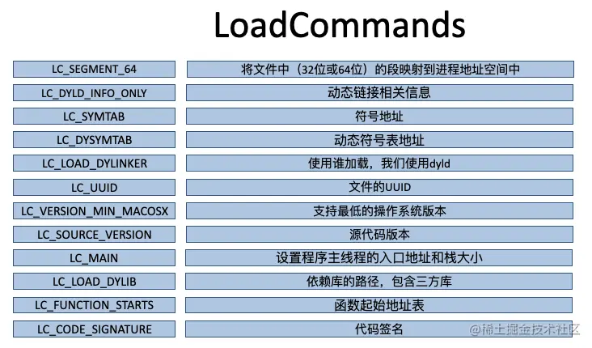

使用 MachOView 查看 Load Commands 的内容

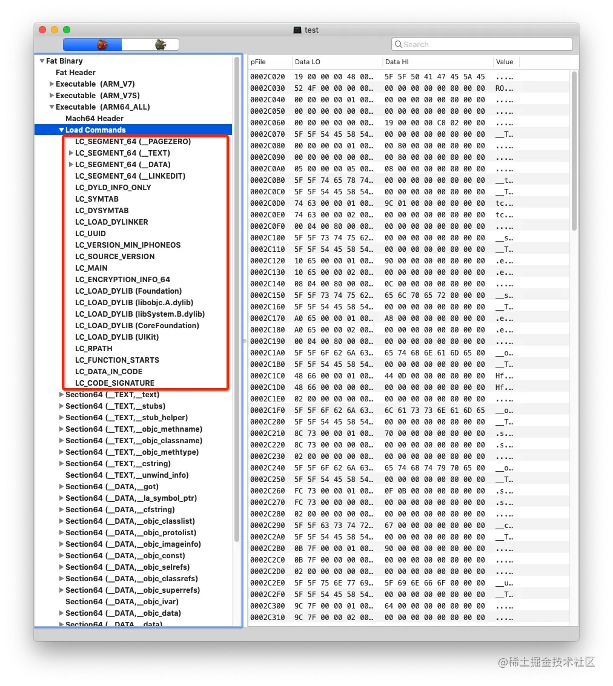

### Data

数据区，除了 Header 和 Load Commands 外所有的原始数据。Load Commands 是对数据的汇总概括，而数据区则是真实的数据。Load Commands 与数据区的关系就像书的目录与章节的关系，如图所示，Segment 为 __TEXT 的段里，显示有 8 个 section，每个 section 具体的内容就在 Data 区里了

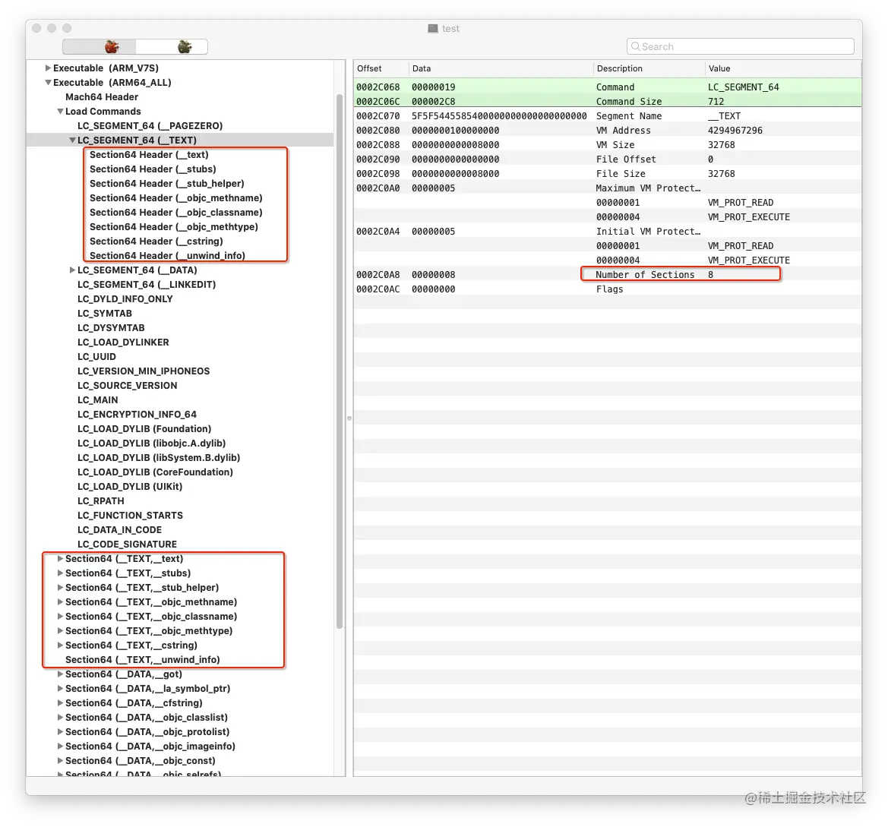

接下里介绍几个比较重要的 section

#### (`__TEXT`，`__text`)

这里存放的是汇编后的代码，当我们进行编译时，每个 .m 文件会经过预编译->编译->汇编形成 .o 文件，称之为目标文件。汇编后，所有的代码会形成汇编指令存储在 .o 文件的 (`__TEXT，__text`) 区（（`__DATA，__data`）也是类似）。

链接后，所有的 .o 文件会合并成一个文件，所有 .o 文件的 (`__TEXT，__text`) 数据都会按链接顺序存放到应用文件的 (`__TEXT，__text`) 中。

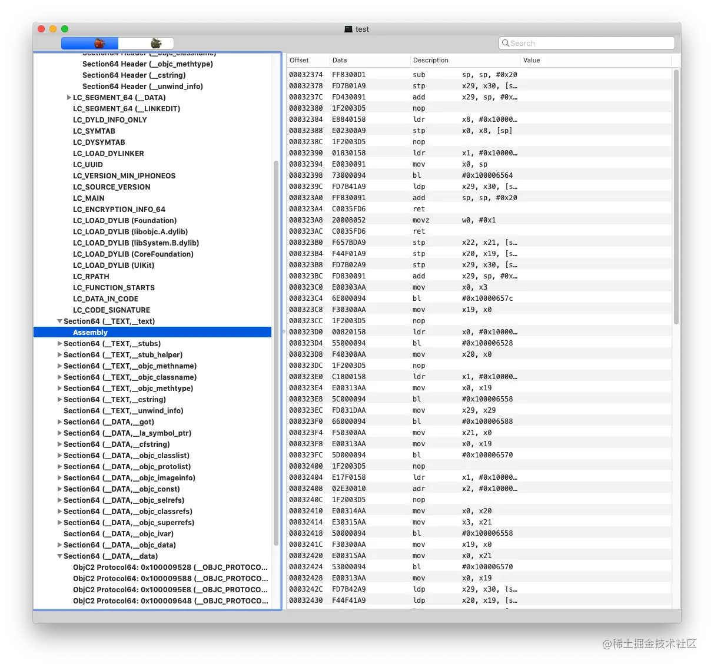

#### (`__TEXT，__objc_methname`)

这里存放了项目里，所有我们用 Objective-C 写的方法名

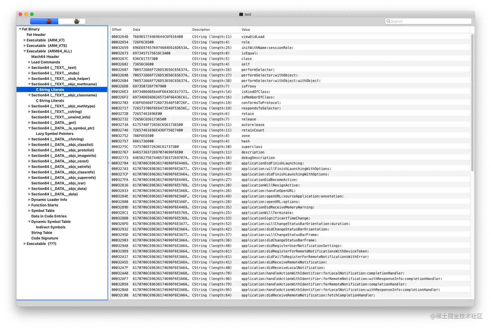

#### (`__TEXT，__objc_classname`)

这里存放了项目里所有 Objective-C 类的名字

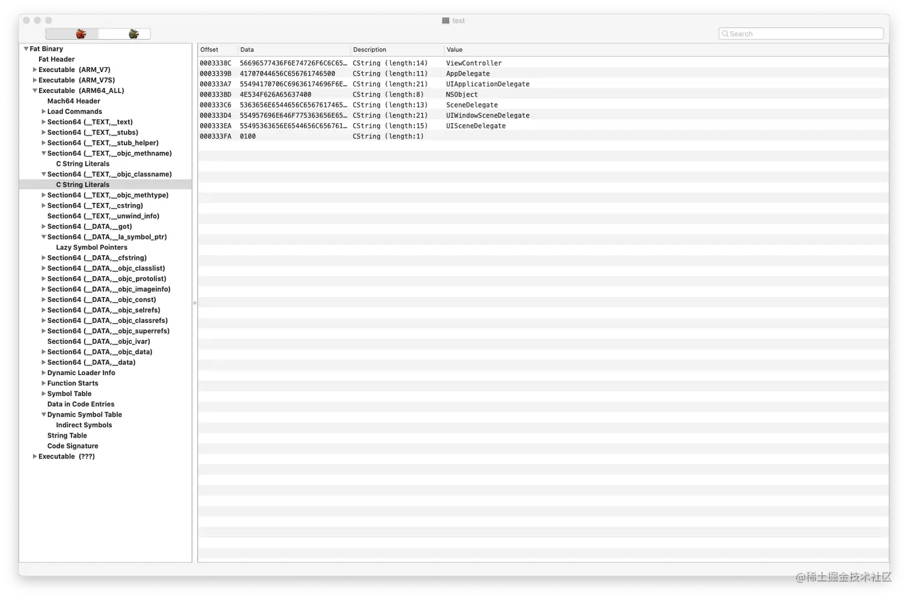

class-dump 工具能够解析出每个类的方法，属性，成员变量，应该就是来自上面两个 section 的数据了，当然这只是我的猜测，具体怎么实现的就要去看 class-dump 的源码了

#### Symbol Table

符号表，这个是重点中的重点，符号表是将地址和符号联系起来的桥梁。符号表并不能直接存储符号，而是存储符号位于字符串表的位置。

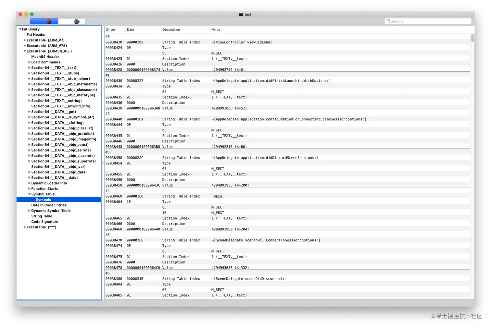

#### String Table

字符串表所有的变量名、函数名等，都以字符串的形式存储在字符串表中。

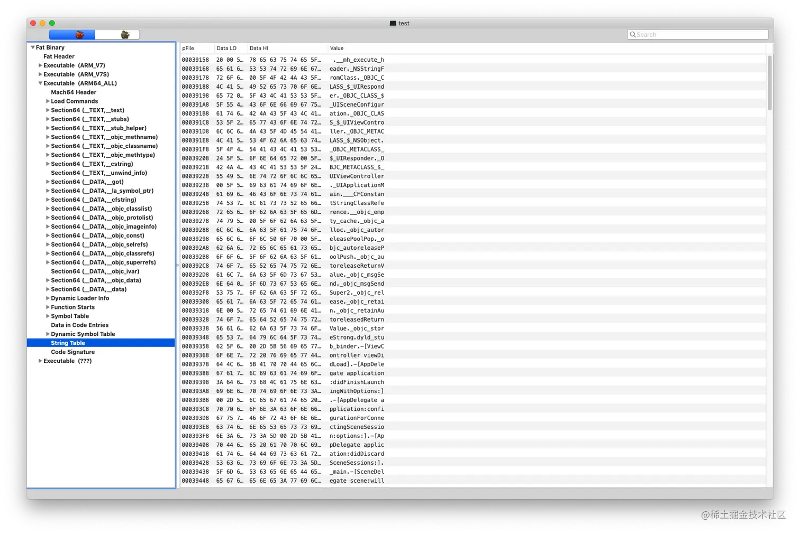

#### Dynamic Symbol Table

动态符号表存储的是动态库函数位于符号表的偏移信息。(`__DATA`，`__la_symbol_ptr`) section 可以从动态符号表中获取到该 section 位于符号表的索引数组。动态符号表并不存储符号信息，而是存储其位于符号表的偏移信息。Fishhook 源码看起来比较复杂主要是因为 hook 的是动态链接的函数，索引和链接关系比较绕。但是我们自己编写的 C 函数不是动态链接的，而是在编译链接后代码指令就存储在文件内部的函数，因此不会用到动态符号表也就无法 hook。

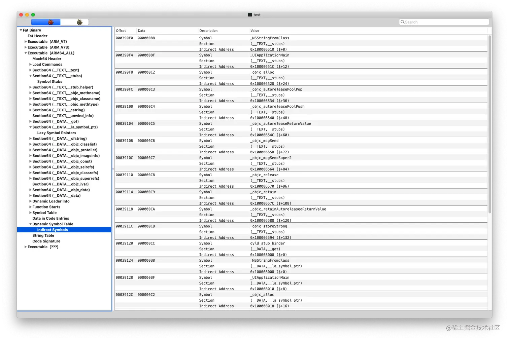

当然，关于 Mach-O 文件的知识远不止这么点，但是要完全讲清楚里面的所有内容，那估计不是这么一篇文章能够讲的清楚的，至少也得是一本书了，我也只是网上收集到的一些资料，自己写了篇总结而已<br>

# Mach-O 的应用

[class-dump](https://github.com/nygard/class-dump) 这个工具就是通过对 Mach-O 文件的解析得到的结果。
