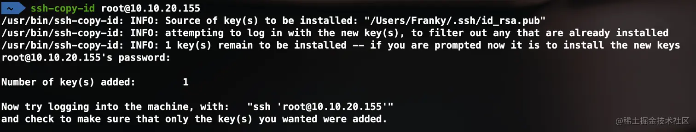
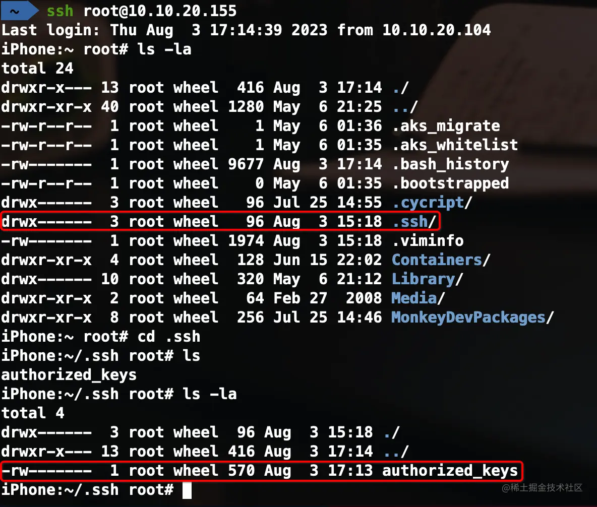
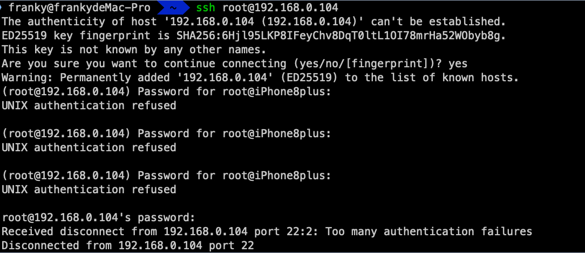

# 简介

平时在使用 Mac 的过程中，经常会使用终端输入命令来执行一些操作。在越狱开发的过程中，同样需要在 iOS 系统上输入一些命令来执行一些任务。那么如何才能在 iOS 系统上输入命令呢，在 iOS 上安装一个终端命令行工具，然后在 iPhone 那小小的屏幕上用触摸屏输入命令吗？虽然说理论上和实际上都是可行的，但是通过手指触摸屏幕来输入命令的方式效率比较低，也不是很方便。这里还是推荐在 Mac 上远程登录到 iOS 系统，这样就可以使用 Mac 的键盘输入命令到 iOS 上去执行，更加方便，快捷。

# SSL、openSSL、SSH、openSSH

SSL（Secure Sockets Layer）是一种用于在计算机网络上进行安全通信的协议。SSL 最初由 Netscape 开发，后来发展为 TLS（Transport Layer Security）。SSL/TLS 用于在客户端和服务器之间建立安全的加密连接，以保护敏感数据的传输，例如在网页浏览器和服务器之间的数据传输。

OpenSSL 是一个强大的、商业级的、功能齐全的开源工具包，它提供了一组库和命令行工具，用于处理 SSL/TLS 协议和加密算法，是 SSL 协议的一款开源实现工具。OpenSSL 可以用于创建和管理数字证书、实现安全传输和通信，以及进行加密和解密等操作。它不仅支持 SSL/TLS 协议，还支持多种加密算法和密码学功能。

SSH（Secure Shell）是一种用于安全远程登录和数据传输的网络协议。它为计算机之间的通信提供了加密和身份验证，以确保通信的机密性和完整性。SSH 使用公钥密码体制进行身份验证，并使用加密算法来保护数据的传输。

OpenSSH 是一个开源的 SSH 实现，它提供了 SSH 客户端和服务器的功能，用于安全远程登录、命令执行和文件传输。它包括客户端 ssh 和服务器 sshd、文件传输实用程序 scp 和 sftp 以及密钥生成工具 (ssh-keygen)、运行时密钥存储 (ssh-agent) 和许多支持程序。它是 Linux 和其他类 Unix 系统中最常见的 SSH 实现，也支持其他操作系统。

SSL 最早出现于 1994 年，用于 Web 浏览器和服务器之间的安全通信。OpenSSL 和 SSH 都起源于 1995 年，OpenSSL 是一个加密工具包，而 SSH 是用于安全远程登录和数据传输的协议。OpenSSH 是 SSH 协议的开源实现，起源于 1999 年，为 SSH 提供了广泛使用的实现。

OpenSSH 通常依赖于 OpenSSL。OpenSSH 使用 OpenSSL 库来实现加密和安全功能，包括加密通信、密钥生成、数字证书处理等。OpenSSL 提供了各种加密算法和密码学功能，使 OpenSSH 能够建立安全的 SSH 连接，并保护通信数据的机密性和完整性。在大多数情况下，安装 OpenSSH 时，系统会自动安装或链接到已经安装的 OpenSSL 库。这样，OpenSSH 就能够使用 OpenSSL 的功能来实现加密和安全性，而不必重新实现这些复杂的加密算法和协议。

因此，可以说 OpenSSH 依赖于 OpenSSL，OpenSSL 提供了 OpenSSH 所需的加密和安全功能，使得 OpenSSH 成为一种安全、可靠的远程登录和数据传输工具。这些安全协议和工具对于保护通信和数据安全至关重要。

# 实践

> ⚠️注意：这里作者使用的是 checkra1n 越狱的 iOS 12.5.7 iPhone5s。

对以上名词概念有了基本的了解之后，我们可以进行实践操作。如果感觉还是迷迷糊糊也不要紧，实践起来就会感觉简单多了。主要是对 OpenSSH 这个开源库提供的常用命令的使用。Mac 系统自带了这个工具所以不需要进行配置，而 iOS 系统上默认是没有安装这个工具的，包括越狱之后的 iOS 也没有，所以需要先下载安装这个工具。

安装过程很简单，如下图所示，在 Cydia 上搜索 OpenSSH 下载并按照提示进行安装就好了。


安装好之后，就可以在 Mac 上远程登录到越狱 iOS 了。iOS 系统默认提供了两个用户，一个是 root 用户，是 iOS 中最高权限的用户，我们在逆向开发过程中基本都是使用这个用户。还有一个是 mobile 用户，是普通权限用户，iOS 平时进行 APP 安装，卸载基本都是使用这个用户，但是我们在逆向开发中很少或者基本不会使用到这个用户，这里有个了解就够了。

Cydia 首页有 OpenSSH 访问教程，这个文档详细的记载了如何从 Mac 远程登录到 iOS 设备上，并且也提供了修改默认密码的方法。建议英文不错的同学直接阅读这篇文档，不想看的就看我后面的介绍也可以。文档位置如下图所示


### 通过默认账号密码登录到 iPhone

ssh 提供了两种登录到服务器的方式，第一种是使用账号和密码。第二种是免密码登录。下面先介绍第一种

1. 越狱 iPhone 在 Cydia 上安装 OpenSSH
2. 确认 iPhone 和 Mac 电脑在同一个局域网下，在 Mac 打开终端，输入以下命令
    ``` zsh
    ssh root@iPhone的IP地址
    ```
    第一次连接会出现 `Are you sure you want to continue connecting (yes/no/[fingerprint])?` 提示，输入 `yes` 确认进行连接
4. 输入默认的初始密码 `alpine` ,这里终端为了安全并不会显示密码的明文
3. 之后就会看到终端切换到了 `iPhone:~ root#` 用户，代表成功登录到远程 iPhone 手机的 root 用户上了。这个时候，你在 Mac 终端输入的指令都会被发送到 iPhone 上，如下图
    
    如果你觉得还不过瘾，可以输入 `reboot` 命令，体会一下远程操纵手机的快乐（重启之后，你可能需要重新越狱一下 iPhone 了😶）
4. 输入 `exit` 退出登录

刚刚我们登录的是 `root` 用户。在 iOS 中，除了 `root` 用户，还有一个 `mobile` 用户。其中 `root` 用户是 iOS 中最高权限的用户。`mobile` 是普通权限用户，其实平时越狱调试过程中，很少会使用这个 `mobile` 用户，这里只是介绍一下。

能够成功登录 iPhone 之后，建议修改一下用户的默认密码，既然做逆向开发了，当然对安全也要注意一点。在登录 root 用户之后，

* 输入 `passwd` 可以修改 root 用户的密码
* 输入 `passwd mobile` 可以修改 mobile 用户的密码。

### 通过免密码方式登录到 iPhone 

OpenSSH 除了默认的账号密码登录的方式，还提供了免密码登录的方式。需要进一步完成一些配置才可以实现。服务器（在当前情况下，iPhone是服务器，Mac是客户端）的 ~/.ssh 目录下需要添加一个 authorized_keys 文件，里面记录可以免密登录的设备的公钥信息。

当有客户端（Mac）登录的时候，服务器会查看 ~/.ssh/authorized_keys 文件中是否记录了当前登录的客户端的公钥信息，如果有就直接登录成功，没有就要求输入密码。所以我们要做的就是将 Mac 设备的公钥信息追加到 iPhone 的 authorized_keys 文件内容的最后面。追加是为了不影响其他的设备。完成这个操作需要先确保我们的 Mac 设备上已经有 ssh 生成的公钥文件。

打开 Mac 终端，输入 `ls ~/.ssh` 查看是否已经存在 `id_rsa.pub` 公钥文件，`.pub`就是公钥文件的后缀


如果没有看到公钥文件，需要使用 `ssh-keygen` 命令生成该文件。按回车键接受默认选项，或者根据需要输入新的文件名和密码。这将生成一个公钥文件（id_rsa.pub）和一个私钥文件（id_rsa）。

使用 SSH 复制公钥到远程服务器。使用以下命令将本地计算机（Mac）上的公钥复制到远程服务器（iPhone）。请将`user`替换为您的远程服务器用户名，以及`remote_server`替换为服务器的域名或IP地址。

``` sh
ssh-copy-id user@remote_server
```



在远程服务器（iPhone）上设置正确的权限。确保远程服务器上的`~/.ssh`文件夹权限设置为 700，并将`~/.ssh/authorized_keys`文件的权限设置为 600。这样可以确保SSH可以正确识别公钥并允许免密码登录。如下图所示：



.ssh 文件夹前面的 `drwx------` 是 Linux 和类 Unix 系统中表示文件或目录权限的一种格式。在这个格式中，每一组由10个字符组成，代表文件或目录的不同权限。让我们逐个解释这些字符的含义：

1.  第一个字符：文件类型

    -   `d` 表示目录（directory）
    -   `-` 表示普通文件
    -   `l` 表示符号链接（symlink）
    -   `b` 表示块设备文件（block device）
    -   `c` 表示字符设备文件（character device）
    -   `s` 表示套接字（socket）
    -   `p` 表示命名管道（named pipe）

1.  接下来的三个字符：文件所有者的权限

    -   `r` 表示读权限（read）
    -   `w` 表示写权限（write）
    -   `x` 表示执行权限（execute）

1.  接下来的三个字符：文件所有者所在组的权限

    -   `r` 表示读权限（read）
    -   `w` 表示写权限（write）
    -   `x` 表示执行权限（execute）

1.  最后三个字符：其他用户的权限

    -   `r` 表示读权限（read）
    -   `w` 表示写权限（write）
    -   `x` 表示执行权限（execute）

所以，`drwx------` 表示这是一个目录，并且具有以下权限：

-   文件所有者具有读、写和执行权限。
-   文件所有者所在组没有任何权限。
-   其他用户没有任何权限。

后面 9 个字符分为三组，每组从左至右如果有对应的权限就是`421`相加起来就是 7 后面都是0。所以 .ssh 文件夹的权限是正确的值 700，如果不是 700 的使用 `chmod 700 .ssh` 进行提权。authorized_keys 文件的权限是 `rw` 就是 `420` 相加起来就是 6 。后面都是 0，所以 authorized_keys 的权限也是正确的值 600。同样如果不是 600，使用 `chmod 600 authorized_keys` 命令修改权限。

配置完成后，您现在可以使用 SSH 免密码登录到远程服务器（iPhone）。在 Mac 上，使用以下命令连接到远程服务器：

``` sh
ssh root@10.10.20.155
```

这将直接连接到远程服务器，而无需输入密码。


### 通过 USB 有线的方式登录到 iPhone 

配置为免密码登录之后，还可以进一步使用 USB 有线连接的方式登录到手机。如果你经常使用 WiFi 这种方式远程登录调试就会发现偶尔会碰到指令输入，响应卡顿，反应慢的情况，这样的体验显然让人感到不爽。所以，在大部分情况下，更推荐使用 USB 有线连接登录到 iPhone 上，这样使用的过程中，就像在本地输入命令操作一样流畅。

`iproxy` 是一个用于端口转发的命令行工具。它通常用于在 iOS 设备和计算机之间建立端口映射，从而将 iOS 设备上运行的服务暴露到计算机上。这对于开发者来说非常有用，因为可以通过本地计算机访问 iOS 设备上运行的服务，而无需将服务部署到公共网络上。

`iproxy` 是 `usbmuxd` 的一部分，后者是一个用于连接和管理 iOS 设备的 USB 通信的守护进程。`usbmuxd` 允许通过 USB 连接与 iOS 设备进行通信，并且`iproxy` 则负责在本地计算机和iOS设备之间建立端口转发。

通常，您可以在命令行中使用 `iproxy` 命令来建立端口转发，例如：

``` sh
iproxy local_port device_port
```

其中，`local_port` 是本地计算机上的端口号，`device_port` 是 iOS 设备上的端口号。执行此命令后，iOS 设备上的服务将通过 `device_port` 映射到本地计算机上的 `local_port`。

请注意，使用 `iproxy` 需要先安装 `libusbmuxd` 包。在 macOS 上，您可以使用 Homebrew 来安装 `libusbmuxd`：

``` sh
brew install libusbmuxd
```

安装好之后，就可以使用 iproxy 命令了，使用 iproxy 将本机 10010 端口和 USB 设备的 22 端口进行映射的命令如下：

``` sh
iproxy 10010 22
```


这里本机的端口 10010 可以设置为你想要的其他端口，但是不能是系统保留的端口（系统保留的端口有哪些，可以看[百度](https://baike.baidu.com/item/%E7%AB%AF%E5%8F%A3/103505?fr=ge_ala)的介绍）。端口转发设置完成之后，这个终端就不要关闭，也不要管它了，新建另一个终端窗口进行 ssh 登录。此时，需要给 ssh 加上指定端口参数，命令如下：

``` sh
ssh -p 10010 root@localhost
```

同样第一次使用这种方式建立连接会给出提示，输入 `yes` 确认


之后，在 iPhone 设备上输入命令调试时，再也不会遇到卡顿，慢，延迟的现象啦。玩得开心~

# ssh 常见问题

有时候我们会对 iOS 设备重新越狱，重新越狱后的设备信息发生了变化，继续使用 ssh 登录是无法成功的。会给出如下信息：


在这种情况下，我们知道并不是发生了中间人攻击，而是 IP 地址跟设备不匹配了。所以可以使用 `ssh-keygen -R IP地址` 移除指定 IP 的设备信息。


再次使用 ssh 进行远程连接，就回到第一次远程登录那样了。


# 在 palera1n 越狱的 iOS16.7.10 iPhone8plus 上使用 OpenSSH 遇到的问题

使用 palera1n 越狱的时候，在安装 Sileo 的时候会提示设置一个终端密码，意味着默认的密码不再是 alpine 了。安装好 Sileo 之后，默认的软件源中已经有 openssh 了，所以直接在搜索框中搜索就好了。如下图所示：


原本以为安装好 openssh 之后，可以像 iOS 12.5.7 那样顺利的远程连接。实际发现无法使用 root 用户登录，即使密码输入的是正确的。如下图：



在 iOS 16 系统上，使用 palera1n 或者 dopamine 越狱成功之后，使用 ssh 的时候，默认的 root 用户出于安全考虑是禁用的，需要执行一次 `sudo passwd root` 修改 root 用户密码之后才可以使用，即使你修改的密码是一样的。 所以解决的方法有两种

1. 先用 mobile 用户登录，再执行 `sudo passwd root` 修改 root 密码之后，再次使用 root 用户登录。
2. 在 iPhone 上下载终端应用程序，然后输入 `sudo passwd root` 修改 root 密码，之后再使用 root 用户登录。

这里第一种方法我就不演示了，肯定没问题的。第 2 种方法需要用到 iOS 端的 Terminal App。我试过一些其他的终端程序无法成功运行。但是 [MTAC's Repo](https://mtac.app/repo/) 的 MTerminal 是可以成功在 iOS 16.7.10 上正常运行的。

在 iPhone 上运行 MTerminal 进行修改 root 用户密码操作如下图：


修改成功后，再次使用 root 用户进行 ssh 远程连接到 iPhone 就和之前一模一样了，可以愉快的玩耍了。


