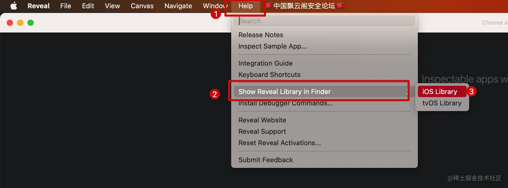
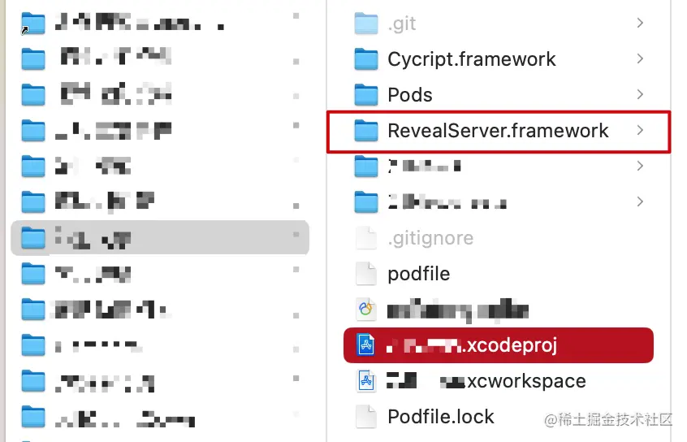
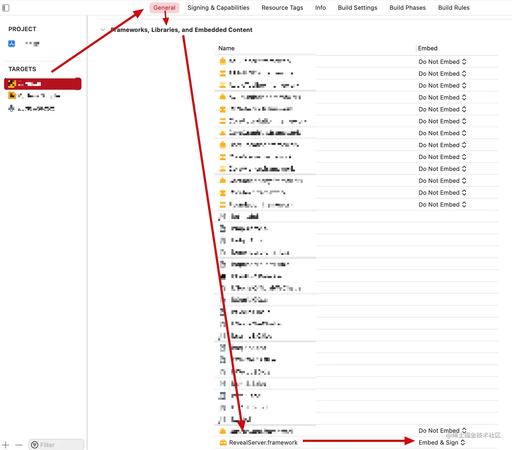
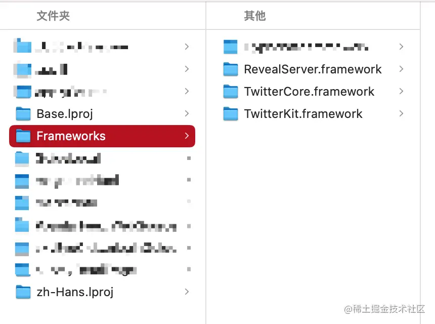
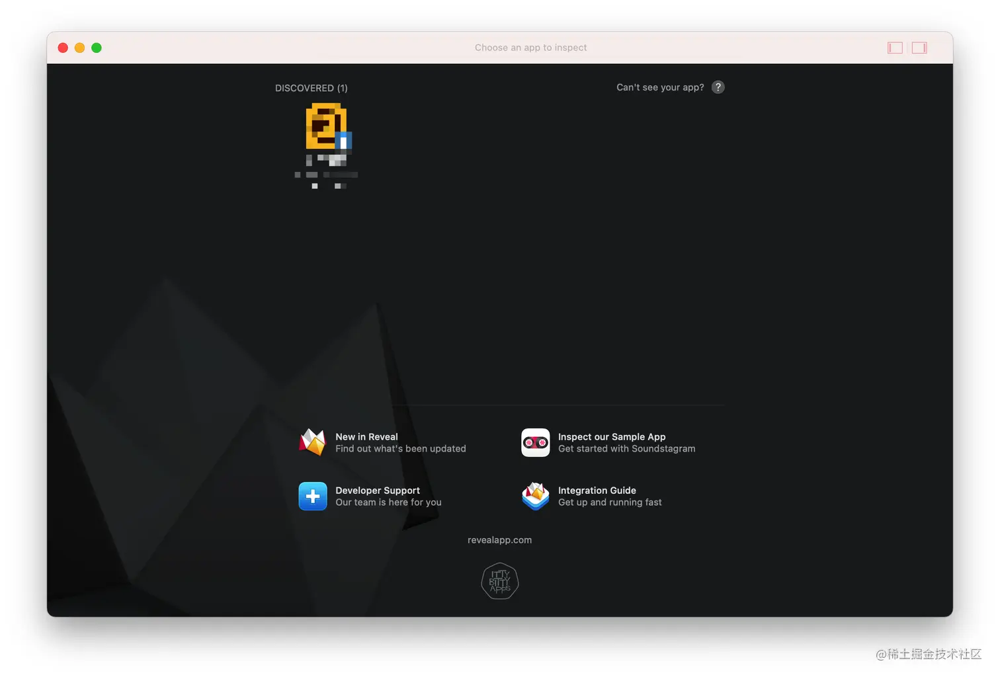
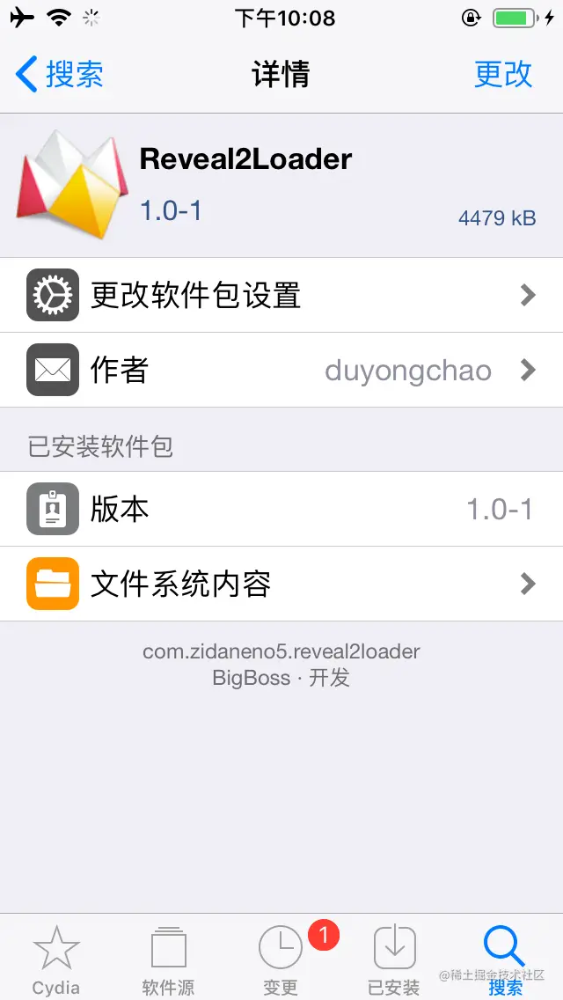
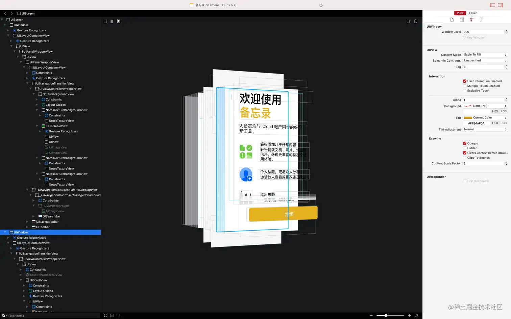

之前已经介绍过 Cycript 这个越狱动态分析的神器，Cycript 是纯命令式的分析工具，对于大多数人/普通开发者来说，这种方式还是显得太极客了。还是图形化的界面更容易接受和使用，所以今天介绍的就是这样一款神器 Reveal 。很多 iOS 的正向开发人员会感觉到困惑，说我用 Xcode 的 view debugger 用的挺好的啊。还去了解这个 Reveal 干什么。。。我只能说跟我在没接触逆向开发之前的想法一模一样，Reveal 不仅可以分析你的 APP 界面，它还可以分析其他开发者的 APP 界面，甚至分析 iOS 系统自带的 APP 界面。而且对于 flutter 项目生成的 App 使用 view debugger 只能看到视图层级结构内容却只显示一片黑色，而 Reveal 却能看到其中的内容。而且 Reveal 在分析 APP 界面的时候同样不需要中断分析的 APP 进程。

Cycript 相比 Reveal 功能更加强大，除了可以查看 APP 的 UI 界面以外，还可以获取 APP 中更多的信息，比如对象的成员变量，属性，对象方法，类方法等等。。。虽然 Reveal 仅限 UI 界面分析修改 UI 属性等简单功能，但 Reveal 提供的图形界面对大多数人更加友好。分析界面时选择哪个取决于你的个人爱好，但想动态调试调用方法，获取更多的信息的话，可能 Cycript 会更合适。

# 正向开发中使用 Reveal 

由于正向开发过程中使用 Reveal 的意义并不大（基本都是使用 Xcode 的 view debugger），而且就算要使用，集成过程也非常简单。在 [官网](https://revealapp.com/download/) 下载好 Reveal 之后，打开 Reveal 找到 iOS Library，然后将它集成到 APP 中不需要添加一行代码就完事了。然后启动 APP 重新（可能也不需要？）打开 Reveal 就可以看到你的 APP 显示在 Reveal 界面。

找到 Reveal 的 iOS Library：



呃，集成过程还是讲一下吧，不然可能会启动就崩溃。将 iOS Library 复制到项目的根目录下

<p align=center></p>

然后找到你的 target -> general -> frameworks,libraries,and embedded content -> RevealServer.framework 右侧选择 Embed & sign 。

<p align=center></p>

这样会将 RevealServer.framework 打包到 APP 包的 Frameworks 目录下。如下图：

<p align=center></p>

只有这样，才不会启动崩溃，（这是在我的 Reveal 版本 21 上是这样的，如果你不是这个版本，可能不会有这样的问题）。Reveal 界面如下：



# 逆向开发中中使用 Reveal 

## 未越狱环境使用

同样还是推荐使用 [AloneMonkey](https://github.com/AloneMonkey/MonkeyDev) 的 MonkeyApp 项目模板，项目模板默认就集成了 Reveal ，不过需要注意的是 AloneMonkey 自带的 RevealServer.framework 库版本十分古老了。所以需要将你的 Reveal 的 RevealServer.framework 替换过去。在 Reveal 的 help 中找到 iOS Library，替换 AloneMonkey 中的 RevealServer.framework，AloneMonkey 的 RevealServer.framework 路径如下：

``` sh
/opt/MonkeyDev/Frameworks/RevealServer.framework
```

## 越狱环境使用

越狱环境的使用需要以下三个步骤

1. ~~从 Cydia/Sileo 安装 Reveal2Loader~~
	
    
    
    在最新的越狱 iOS 设备上，无论是 rootless 还是 rootful 好像都无法正常使用了。作者进行了升级适配开源了 [RevealLoader2](https://github.com/masterKing/RevealLoader2) 可以添加作者的软件源：[https://masterking.github.io/sileorepo](https://masterking.github.io/sileorepo) 下载

2. 将 Mac 上的 Reveal 的 iOS Library 中的 RevealServer.framework 复制到越狱设备的 `/Library/Frameworks/RevealServer.framework` 路径。可以使用 scp 命令，也可以使用 iFunBox 图形界面操作更直观。

3. 在 iOS 设置 APP 中找到 Reveal -> Enabled Applications 选择你想要调试的 APP 打开右侧的开关。

执行上述步骤之后，打开 Mac 的 Reveal 就可以看到越狱 iPhone 上可以调试的 APP 了，可以看到系统的 APP 也可以。下面是系统 备忘录 APP 的界面结构：



# 最后

通过 Reveal 分析优秀的 APP 的 UI 界面简直是太棒了！当然这只是从 UI 层面的分析，这个时候可能很多人就会说了，光看一下 UI 界面有什么用啊，还不是不知道具体怎么实现的。

直接看到源码是不太可能的（除非你是苹果公司的工程师🙂），苹果并没有开源这些 APP 。但是想要查看和源码等价的伪代码也不是完全不可能，可以通过反汇编，反编译工具（**hopper**，**ghidra**，**IDA Pro**等工具）还原为高级代码，这些内容都会在后续的文章中更新。

还有很多 iOS 开发者经常在使用系统库的过程中，可能会遇到一些莫名其妙的问题，如 UIKit ，作者就曾经在子类化 `UIRefreshControl` 的时候遇到过奇怪的问题，很多时候都会在 `- (instancetype)initWithCoder:(NSCoder *)coder` 和 `- (instancetype)initWithFrame:(CGRect)frame` 方法内执行一些通用的公共的初始化方法，于是便实现了一个 `- (void)_commonInit` 方法完成这个目标。于是奇怪的现象发生了，代码并没有按照预期的那样运行。在作者百思不得其解的时候，想到了通过查看分析 UIRefreshControl 类的反编译伪代码发现，我自己的方法名 `_commonInit` 与该视图类的私有方法重名了，才导致出现莫名其妙的 bug 。

iOS 开发者们也许很好奇，经常使用 Xcode 跳到 UIKit 框架的头文件中阅读，然后还想尝试一下找到 UIKit.framework 所在的路径，通过 show in Finder 跳转到了指定的文件却始终找不到 UIKit 的二进制文件？那系统是如何知道 UIKit 的具体实现的？一般的 APP 在它的包内就能找到二进制文件（在 iOS 中也叫 MachO 文件），但是 iOS 系统库的二进制文件的确不太好找。关于如何找到系统库的二进制文件，如何查看它的反编译伪代码，这一切的答案都会在后续的文章更新中揭晓。


