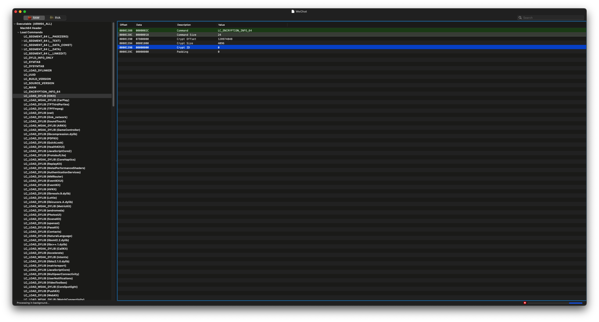

# 什么是壳

在软件保护和安全领域，“壳”指的是利用特殊的算法对应用程序的二进制文件进行加密或包装的保护层，通常被称为 “加壳”。壳的作用是保护应用程序的代码，防止未经授权的访问、篡改和逆向工程。壳通常会在应用程序启动时将其解密到内存中，以便正常运行。

苹果会在应用发布到 App Store 时，对应用程序进行 DRM（数字版权管理）保护，这种保护即一种壳，目的是防止非法分发。所以从 App Store 下载的应用程序，我们无法使用 hopper，ghidra，ida 等逆向工具进行静态分析，也无法使用 class-dump 这样的工具导出头文件。需要对其进行解密也就是砸壳，也有人喜欢称脱壳之后，才能进行逆向分析。

iOS 应用加壳只有苹果公司内部自己能处理，所以我们只讨论砸壳的方式：

# 砸壳的方式

1. **静态砸壳或硬砸壳：**就是在已经掌握和了解壳的加密算法和逻辑之后在不运行应用程序的情况下将应用程序的壳进行解密处理。静态砸壳的方法难度大，而且加密方发现应用被破解之后就可能会该用更高级和复杂的加密技术。

2. **动态砸壳：**动态砸壳就是从运行在进程内存空间中的可执行文件镜像入手，将内存中的内容进行转储（dump）处理实现脱壳。这种方式实现起来相对简单且不必关心使用的是什么加密技术。 

iOS 砸壳大多采用动态砸壳的方式。

# 查看 iOS 应用的壳状态

`LC_ENCRYPTION_INFO_64` 是 Mach-O 文件格式中的一个加载命令（load command），用于描述 64 位 Mach-O 文件的加密信息。该加载命令常见于 macOS 和 iOS 应用程序的可执行文件中，主要包含应用程序是否加密及其相关的加密信息。

## 主要字段

- **cryptoff**：加密数据的偏移量，表示从文件的哪个位置开始加密数据。
- **cryptsize**：加密数据的大小，以字节为单位，指示被加密的范围。
- **cryptid**：加密标识符，用于表明数据是否被加密。值为 0 表示数据未加密；其他值表示数据已加密。

## 用途

在 iOS 应用中，`LC_ENCRYPTION_INFO_64` 常用于 **FairPlay** DRM（数字版权管理）保护。iOS 应用在上传到 App Store 时，苹果会对其进行加密保护，以防止未经授权的访问或修改。通过检查 `LC_ENCRYPTION_INFO_64` 的字段值，可以判断应用是否经过 DRM 加密保护。

## 示例

查看 `LC_ENCRYPTION_INFO_64` 信息有以下两种方式：

1. **图形化工具：**MachOView
2. **命令行工具：**otool

### [MachOView](https://github.com/gdbinit/MachOView)

**MachOView** 是一款用于 macOS 的图形化工具，专门设计用于分析和查看 Mach-O 文件格式。Mach-O（Mach Object）是 macOS 和 iOS 操作系统使用的可执行文件格式，包含了二进制可执行文件、库文件、内核扩展等。

MachOView 提供了一个直观的界面，可以帮助开发者和逆向工程人员深入分析 Mach-O 文件的结构和内容。它展示了文件头、加载命令、段（segments）、节（sections）、符号表（symbol table）、动态符号、字符串表等各种信息。

#### 主要功能

- **查看文件头**：展示 Mach-O 文件的文件头信息，例如文件类型、CPU 架构等。
- **加载命令**：列出所有的加载命令，包括动态库依赖、入口点、数据段等。
- **段和节**：显示所有的段和节信息，并可以查看它们的详细内容。
- **符号表**：解析并显示符号表和动态符号，包括全局符号和本地符号。
- **反汇编**：支持代码段的反汇编，以查看可执行代码的汇编指令。
- **导出功能**：可以将分析结果导出为文本格式，以供进一步分析。

#### 使用场景

MachOView 是 macOS 和 iOS 逆向工程、应用开发及安全研究的重要工具。它使得用户可以深入了解 Mach-O 文件的内部结构，适合用于以下场景：

- **应用逆向工程**：了解应用内部的函数、符号等信息。
- **安全研究**：分析应用是否进行了加密保护，研究其安全机制。
- **调试和开发**：查看动态库依赖、文件结构等信息，以帮助调试和优化。

#### 下载和安装

MachOView 可以通过项目的 GitHub 页面进行下载，支持 macOS 平台。使用者可以直接下载预编译的二进制文件，或通过源码自行编译安装。

使用 MachOView 查看可执行文件的 `LC_ENCRYPTION_INFO_64` 信息



### otool

`otool` 是 macOS 上的一个命令行工具，用于显示可执行文件、动态库和目标文件的各种低级信息。它是开发者用来分析、调试和检查 Mach-O 文件结构的重要工具。Mach-O（Mach Object）文件格式是 macOS 和 iOS 使用的可执行文件格式，包括应用程序、动态库和内核扩展等。对于从事 macOS 或 iOS 应用开发及逆向工程的人员，`otool` 是一个非常有用的工具。

`otool` 并非 macOS 系统自带的，而是随 **Xcode Command Line Tools** 一起提供的。因此，默认情况下 macOS 并不包含 `otool`。要使用 `otool`，需要先安装 **Xcode Command Line Tools**。幸运的是，不需要安装完整的 Xcode 应用，只需安装命令行工具即可获取 otool。

可以通过以下命令快速安装 Xcode Command Line Tools：

```
xcode-select --install
```

#### 示例

假设我们有一个 Mach-O 文件 `example`，可以用以下命令查看其是壳的状态：

```bash
 ~/ otool -l MachO文件 | grep crypt
     cryptoff 16384
    cryptsize 265289728
      cryptid 0
```

显示 `cryptid 0` 表示壳已经被解密。


# iOS 应用砸壳工具

## [dumpdecrypted](https://github.com/stefanesser/dumpdecrypted)

是一个动态库，利用 DYLD 的环境变量，将自己插入需要砸壳的进程中，但是很多年没有维护更新了。。。

## [Clutch](https://github.com/KJCracks/Clutch)

是一个 iOS 上命令行程序，也是很多年没有维护更新了。下载编译后在 iOS12.5.7 上，能砸壳一些简单的 app，但是像微信，支付宝这样的 app 会失败。

## [frida-ios-dump](https://github.com/AloneMonkey/frida-ios-dump)

是一个 python 脚本，目前最强的 iOS 砸壳脚本，支持最新版本微信，支付宝等。

## LLDB

Xcode 自带的调试器，使用 lldb 命令手动实现砸壳。

## AppDump2

是一个 iOS App，不需要越狱设备，但是设备需要安装巨魔才能安装 AppDump2 实现砸壳。。。