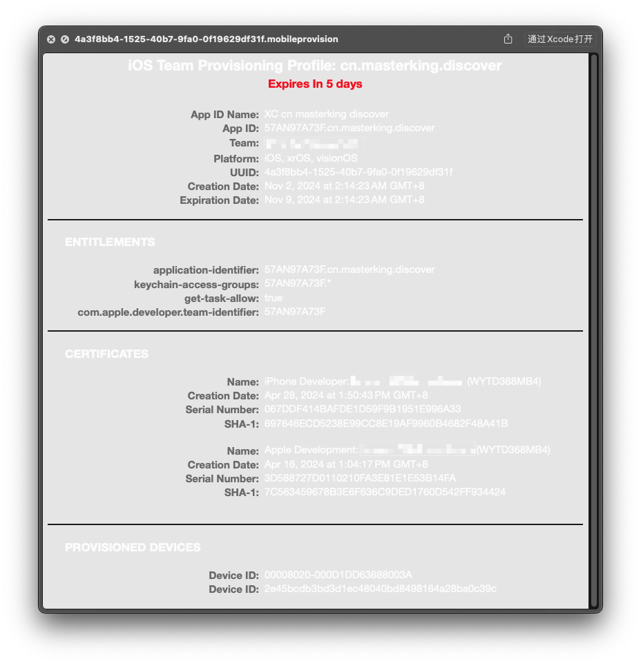

要看懂这篇文章的前提条件：

对密码学有一个大概的了解，了解对称加密算法，非对称加密算法，哈希算法等知识。。。

这里简单介绍一下，也可以看作者之前发布的文章 [密码学概述](https://masterking.github.io/2021/06/10/%E5%AF%86%E7%A0%81%E5%AD%A6%E6%A6%82%E8%BF%B0/)：

- 对称加密算法的加密和解密使用同一个密钥，速度快，效率高，适合处理大规模的数据。

- 非对称加密算法有一对公私钥，公钥加密的数据私钥可以解密，私钥加密的数据公钥可以解密。此算法速度慢，效率低，但安全性没得说，适合小规模的数据。

- 哈希算法，对原始数据进行哈希运算得到一个固定长度的数据这个数据类似于身份证具有唯一性。哈希算法存在哈希碰撞的可能，也就是不同的原始数据经过哈希算法得到了相同的结果，这是不可完全避免的。加密哈希函数（如 SHA-256）通常具有更强的抗碰撞性，但计算代价较高，适用于需要更高安全性的场景（如密码存储、数据完整性验证等）。

# iOS 应用签名

在 iOS 系统出来之前，主流的操作系统（Mac 或者 Windows）软件随便从哪里下载都能安装，运行，系统安全存在隐患，盗版软件，病毒入侵，静默安装等等问题，苹果希望 iOS 的系统上不会出现这样的问题，就要保证每一个安装到 iOS 系统上的 APP 都是经过苹果官方允许的，那么苹果是如何做到的呢？

那就是签名

## 什么是签名？

- 使用私钥对数据加密的这个动作就叫签名。
- 使用公钥对数据解密，解密之后和原始数据比对是否是一样的，这个动作就叫验证签名。

在实际情况中，原始数据的数据量往往比较大，而公钥私钥这种非对称加密算法如 RSA 算法的时间复杂度很高，意味着计算会很耗时。所以通常都会使用原始数据的 hash 值代替原始数据进行加密。

那么签名的过程就变成了，使用私钥对原始数据的 hash 值进行加密。发送数据的时候将原始数据和加密后的 hash 值一起发送出去。接收方收到这堆数据后，使用公钥对加密后的 hash 值解密得到明文 hash 值，有了这个 hash 值再和原始数据的 hash 值进行比对，如果是相同的就表示原始数据没有被他人篡改过，是可以信任的。在一些复杂的场景中，发送的数据中不仅仅只有原始数据和加密后的 hash 值。

上传到 App Store 的应用，苹果会对其进行加壳处理，再用它的私钥 Apple 对应用签名，这里使用 Apple 表示一对苹果的公私钥，应用下载到 iPhone 上之后，iOS 系统使用自带的公钥 Apple 验证签名，只有验证通过了才能进行安装，这样就保证了所有安装到 iPhone 上的应用都是经过苹果公司允许的。这种简单的情况可能只存在最初 iOS 系统刚刚诞生的时候，且 App Store 还没对外开放给大众的时候。

因为自 2008 年发布的 iOS 2.0 苹果正式开放 App Store 之后，这个版本首次允许第三方开发者将应用提交到 App Store，使得普通人也可以开发并发布自己的应用。那么普通人在开发 App 的时候肯定要调试 App，调试时候肯定不可能上传到 App Store 了，那这种情况苹果又如何保证即使是调试的 App 也要经过苹果的允许呢？还有苹果在 2011 年推出了苹果开发者的企业级账号，旨在满足大型企业的需求，企业级账号开发的应用不适合也不需要上传到 App Store 但依旧需要下发到 iOS 设备上使用。这种情况下又如何保证下发的应用是经过苹果允许的呢？

## 多层签名

开发者通过向苹果发送一个 CSR (Certificate Signing Request,证书签名请求) 文件申请开发或分发证书 (Development Certificate / Distribution Certificate)，苹果验证开发者身份后签发证书。这个过程中，开发者的电脑上生成了一对公私钥，这里用公钥 Mac 和私钥 Mac 表示。发送的 CSR 文件里面主要的内容就是公钥 Mac。所以苹果签发的证书里面其实主要内容也就是经过私钥 Apple 签名的公钥 Mac。所以可以理解成，证书就是经过 CA 机构签名的公钥，最简单的理解是证书就是公钥（这种说法肯定不完全正确，但是易于理解）。

有了这个证书之后：

开发者在使用 Xcode 编译打包 App 的时候，Xcode 会使用刚刚生成 CSR 文件时产生的私钥 Mac 对 App 进行签名。同时会将刚刚获取的证书放入 App 包内。

当这个 App 在 iOS 设备上安装的时候，iOS 系统会先验证 App 包内证书的签名。使用系统自带的公钥 Apple 可以验证由私钥 Apple 签名的证书确保证书没有被篡改，也就是公钥 Mac 可以信任使用。

然后，使用证书里面的公钥 Mac 对 App 进行验证，确保 App 在 Xcode 编译签名之后没有被篡改，可以安装。

以上只是最简单的双层签名，苹果为了控制更多的细节，如可以安装 app 的设备，app 的权限控制等等。新增了一个描述配置文件（Provisioning Profile），配置文件包含了 App ID，证书，应用授权信息和设备授权列表等信息。配置文件同样经过私钥 Apple 签名，所以里面的 App ID 信息，App 授权信息，证书，设备授权列表都是无法修改的。即使修改了也无法通过签名验证。到这里至少存在 3 层签名。

描述配置文件预览：

配置文件可以在 Mac 电脑上的以下路径找到： ~/Library/MobileDevice/Provisioning Profiles

这种为了实现更多的需求，将证书包了一层的做法在软件开发过程中经常使用。

此时，iOS 应用签名的完整流程就清晰了。

1. 对于上传到 App Store 的 App，使用私钥 Apple 签名就足够了。用户下载安装后通过 iOS 系统上私钥 Apple 验证签名。
2. 对于调试阶段的 App。使用证书和配置文件控制。

# 其他常见问题

* p12 文件是什么？
	p12 文件就是私钥 Mac 的拷贝，让除了证书申请的那台电脑以外的电脑也能够对 App 签名真机调试。

