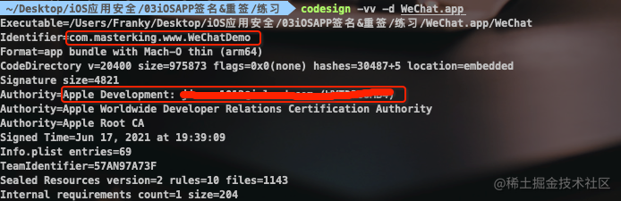

上一篇文章作者讲解了 iOS 应用签名的原理。理解了签名的流程之后，我们知道签名保证的是自签名之后原始数据没有被其他人篡改，我们的 App 在调试过程中每次安装到设备上都会签名，假设我们使用自己的配置文件和证书对他人的 App 进行签名，是不是就能冒充是我们自己开发的 APP 了？

是的。

如果你足够细心的话，在 Xcode 每次编译源码的时候，最后的几个步骤中就会看到签名过程：


由图中可以看到，Xcode 是利用 codesign 命令行工具进行签名的。。。所以我们也可以利用 codesign 手动签名。

# 重签名的前提

重签名要使用未加壳或者成功砸壳过的 App，为什么重签名一定要用砸壳过的 App 包呢？

- 经过实践证明，未砸壳的 App 即使重签名成功，安装也成功，但打开会闪退...

从 App Store 下载的应用都是加壳的，需要先砸壳。如果是开发调试阶段的 App 一般都是没有加壳的，可以直接重签名。

# 重签名的目的

1. 调试他人的 App；这种情况对于我们逆向开发很方便如 MonkeyDev 的原理，本文会重点讲解。
2. 在未越狱设备上安装调整过的 App。这个内容会在学了 Theos 开发 tweak 之后讲解。
3. 更换 App 的拥有者（例如外包公司提供了 ipa 包，但没有给源码的情况）。这种情况可以使用一些成熟的工具，如 [iOS App Signer](https://github.com/DanTheMan827/ios-app-signer)，[iReSign](https://github.com/maciekish/iReSign) 这些工具就不多说了，自行下载安装使用就好了。对于我们的情况，就算使用砸壳过后的 ipa 包使用它进行重签名肯定也无法正常安装使用的。

# 重签名过程中常用的命令

查看签名信息的命令：

``` sh
codesign -vv -d Mach-O
```

查看当前电脑上的证书信息：

``` sh
security find-identity -v -p codesigning
```

提取 mobileprovision 文件中的 entitlements 信息生成 plist 文件

``` sh
security cms -D -i embedded.mobileprovision | plutil -extract Entitlements xml1 - -o ent.plist
```

对库和 extension 签名

``` sh
codesign -f -s 证书ID xxx.dylib
```

对 app 包进行签名

``` sh
codesign -f -s 证书ID --entitlements entitlements.plist path/to/xxx.app
```


# MonkeyDev 的原理

我们一步一步探索 MonkeyDev 的原理

## 手动签名

我们以微信为例子来进行重签名，以下演示的是微信的老版本，但已在更新本文章时的最新微信版本 8.0.53 测试过，在拿到已经砸壳过的微信 ipa 包（可以自己动手砸壳，或者在网上搜索下载）之后，用归档实用工具解压


我们只需要 Payload 里面的 .app 包


右键 .app 包显示包内容后，开始下面的步骤

### 删除插件 PlugIns，Watch，com.apple.WatchPlaceholder 文件夹

删除的原因是我们使用的是免费的苹果开发者账号，一次性最多申请的 App ID 数量只有 10 个。但是微信这个包里面，包括 PlugIns，Watch，com.apple.WatchPlaceholder 文件夹里里外外的扩展，插件都重签名的话就会因为免费开发者账号的限制导致失败。但是删除这些文件夹并不影响使用主要的功能。

com.apple.WatchPlaceholder 文件夹是较新版本的微信中新增的，老版本中没有


**需要特别注意的是**，SC_Info 文件夹中还存在 PlugIns 相关的配置，所以还需要删除 Manifest.plist 文件中的以下相关配置，否则会出现第一次安装成功，以后安装都失败的问题。


### ~~对 Frameworks 里面的库进行重签名~~

这一步经过实践发现不是必须的。


### 给 APP 二进制文件加执行权限

没有权限的二进制文件是白色的


提升权限之后变成黑色的


### 往真机添加描述文件

新建一个工程，在真机上运行一次


再将新建 Demo 的描述文件，复制到 WeChat.app 内


### 替换 BundleID

把 WeChat.app 里面的 info.plist 的 BundleID 改为新建的 Demo 的 BundleID


### 使用 Entilements 权限信息重签 app 包

权限信息在描述文件里面,输入`security cms -Di embedded.mobileprovision`可以查看描述文件具体信息。

可以使用以下组合命令提取 embedded.mobileprovision 中的 Entitlements 的值并生成一个 plist 文件。

``` sh
security cms -D -i embedded.mobileprovision | plutil -extract Entitlements xml1 - -o ent.plist
```

再把这个 plist 文件,放到和 WeChat.app 同目录下,准备重签


打开终端,输入以下命令进行重签:

``` sh
codesign --force --sign "你的证书名或证书SHA-1" --entitlements=ent.plist WeChat.app
```

可以使用 `codesign -vv -d WeChat.app` 命令查看我们是否成功重签了,变成你的证书和 BundleID 就代表成功了



到此,这个 WeChat 就被我们重签成功了!!!此时,我们可以使用 Xcode 将这个 WeChat 安装到我们的手机上，打开 Xcode 的 Devices and Simulators 点击 + 号选择刚刚重签的 app 包安装。


如果你的手机上本来有一个官方正版微信，你现在会发现手机上出现了两个微信。接下来你可以打开刚刚新建的 WeChatDemo 项目，选择 Debug -> Attach to Process -> WeChat，如果有两个 WeChat 可以把正版的 WeChat 从后台划掉，或者选择后面数字较大的那个 WeChat（最后打开的进程 id 数字越大），你会发现微信就这样被我们的 WeChatDemo 项目连接起来了...可以对微信像调试我们自己 APP 一样 viewDebug 了


## 使用 Xcode 签名

通过使用 codesign 手动重签过程后，发现其实上述过程并不难，只是过程有些复杂和繁琐，Xcode 可以帮我们简化一些复杂繁琐的过程，那么现在我们借助 Xcode 来重签。

### 新建与重签 APP 同名的工程并在真机上运行一次

这一步和之前任何时候创建新的 iOS 项目没有什么区别。

### 删除插件 PlugIns，Watch，com.apple.WatchPlaceholder 文件夹

这一步跟上面刚刚手动重签名的步骤一样。

### 给 APP 二进制文件加执行权限

这一步同上。

### 替换 BundleID

这一步同上。

### 将上面步骤修改后的 app 包放到工程目录下

如下图所示：


### 修改工程的一些配置

将 User Script Sandboxing 设置为 NO。如下图：


添加 Xcode 编译阶段的自定义脚本，如下图：


脚本的位置一定要放在最下面，当然默认情况下肯定是在最后面的。这段脚本代码的作用很简单，就是将我们刚刚放在工程目录下的 app 包在编译的最后阶段，Xcode 签名 app 包之前替换编译生成的 app 包。这样 Xcode 就自动替我们完成签名的工作了。

接下来使用 command + R 运行工程就会看到启动我们重签名的微信了。在这一步里，我们只是用了最简单的一句复制脚本来替换 Xcode 编译生成的 app 包，然后 Xcode 继续完成签名安装的动作。那么前面的那些，删除文件夹的动作，替换 BundleID 的动作是否也能通过脚本完成呢？当然可以，这就是接下来的完善签名脚本

## 完善重签名脚本

``` sh
# Type a script or drag a script file from your workspace to insert its path.
echo "$(pwd)/${WRAPPER_NAME}"

if [ ! -e "$(pwd)/${WRAPPER_NAME}" ]; then
    echo "工程文件夹下不存在 ${WRAPPER_NAME} 包. 结束脚本..."
    exit 0
fi

# 删除 PlugIns Watch com.apple.WatchPlaceholder 文件夹及其内容
rm -rf "$(pwd)/${WRAPPER_NAME}/PlugIns" || true
rm -rf "$(pwd)/${WRAPPER_NAME}/Watch" || true
rm -rf "$(pwd)/${WRAPPER_NAME}/com.apple.WatchPlaceholder" || true

# 删除 SC_Info 文件夹中 Manifest.plist 中与 PlugIns 相关的字符串。。。这样删除太麻烦，干脆直接干掉整个文件夹
rm -rf "$(pwd)/${WRAPPER_NAME}/SC_Info" || true

# 更新 CFBundleIdentifier
/usr/libexec/PlistBuddy -c "Set :CFBundleIdentifier $PRODUCT_BUNDLE_IDENTIFIER" "$(pwd)/${WRAPPER_NAME}/Info.plist"

# 给 MachO 文件上执行权限
APP_BINARY=`plutil -convert xml1 -o - $(pwd)/${WRAPPER_NAME}/Info.plist | grep -A1 Exec | tail -n1 | cut -f2 -d\> | cut -f1 -d\<`
chmod +x "$(pwd)/${WRAPPER_NAME}/${APP_BINARY}"

# 将修改后的包替换编译后的包
cp -r "$(pwd)/${WRAPPER_NAME}" "${BUILT_PRODUCTS_DIR}"
```

使用脚本完成上面的所有操作步骤，以后我们就只需要将砸壳后的 app 包放入工程的根目录下就可以实现以上这些步骤完成重签名进行调试了。

当然微信作为社交聊天类数一数二的 App，它自然会对 App 进行重签名检测，所以如果你没有办法绕过它的检测的话，还是不建议使用这种方式登录账号的，被检测到后会被封号，当然是可以通过申诉的方式找回的。

至于如何绕过微信的重签名检测，以后有可能会更新一篇文章，目前可以想到的思路有：

1. 找到市面上那些重签名的微信，反编译出它的反检测代码
2. 从某些开源项目中获取，如 [https://github.com/DKJone/DKWechatHelper](https://github.com/DKJone/DKWechatHelper)
3. 直接逆向分析微信的源码

这段脚本只是最简单的重签名，像 MonkeyApp 这样的工具的原理就是利用 Xcode 的编译脚本实现的。它的实现更加复杂，也增加的更多的功能，如不再要求同名的工程等。

对于某些安全性更高的 App，即使你使用这种方法重签名了，依旧无法调试，那是因为做了反调试保护。如抖音，小红书之类的。不过有反调试也会有反反调试，这些内容作者也会在后续的文章中讲解。

那我们讲解这种重签名的目的是什么？当然是探索 MonkeyDev 的实现原理，同时也为了后面的内容做准备。


