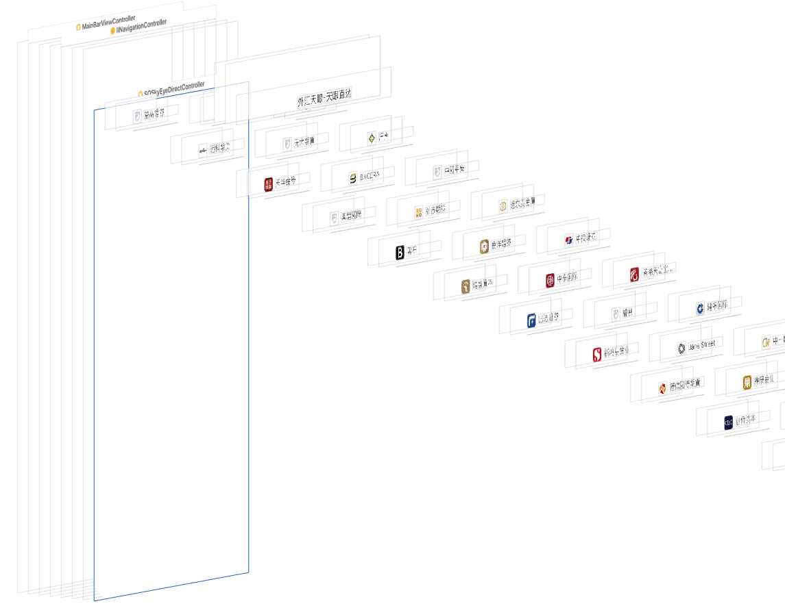
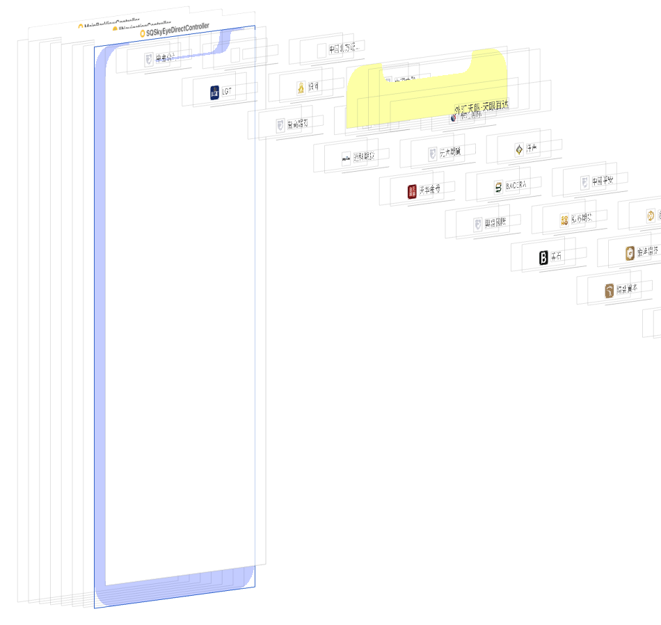

记录一个在 iPhone X 上发生的诡异的 bug...语言怎么描述都太苍白,那么直接看图

只有在滑动到最底部的时候,push 到下一个页面,然后在 pop 回来就会出现 contentOffset.y 值自动偏移的现象...

视图的层次结构如图:

选中的视图控制器就是 TabBarController 的第二个子控制器,控制器的 view 就是一个 UICollectionView;我是很懵逼的...同事说可能是 iPhone X 上的安全距离的原因(但我还是很懵逼)...于是我对视图层次结构做了下修改;

* 取消修改控制器的 view 为 UICollectionView
* 将 UICollectionView 作为控制器的 view 的子视图
* 设置 collectionView 的约束为,上左右等于控制器的 view,下等于控制器的 view 的下面,但是偏移一个 -34 的高度(仅在 iPhone X 上)

修改之后的视图层次结构如下:

这样,collectionView 不再漂移了...对上述偏移的值进行修改测试可以发现,当这个值小于等于 -34 的时候就不会发生漂移,大于 -34 时就会发生漂移...换一句话的意思就是,如果 collectionView 距离底部的距离小于 34 的那么就会漂移,大于等于 34 不会发生漂移...