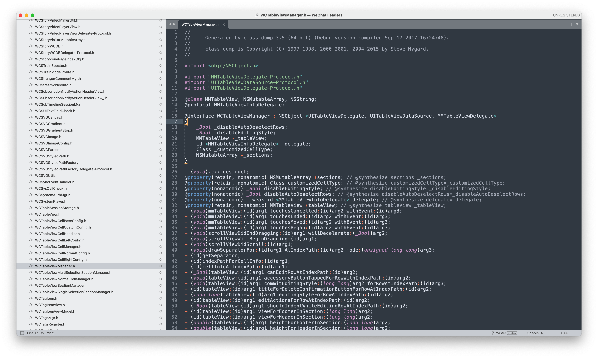
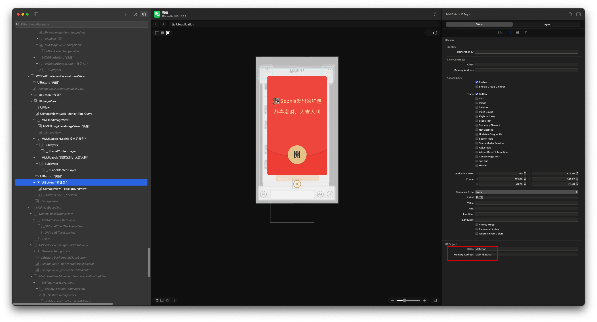
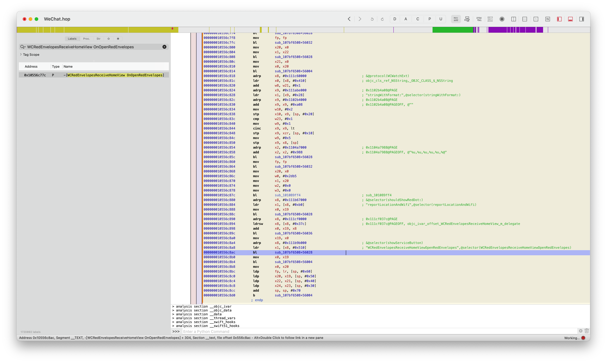

本篇文章将介绍如何从 0 到 1 一步步实现微信抢红包插件功能，需要用到

* 一部能越狱的 iPhone，作者使用的 iOS12.5.7 的 5s。
	
	 推荐使用 iOS15 之前的设备，因为 iOS15 [SSV](https://theapplewiki.com/wiki/Signed_System_Volume) 的出现诞生了一种新的越狱方案 [rootless](https://theapplewiki.com/wiki/Rootless)。导致很多以前能运行的越狱插件，工具都无法在 iOS15 及后续的系统上正常运行。因为这些工具大多都还没有针对 rootless 进行适配。使用 iOS15 之前的设备能够更完美的进行教学，和拥有更好的体验。当你学有所成的时候，可以尝试对那些暂时没有适配的越狱插件，工具自己进行适配了。这里特别说明一下，rootless 越狱并不是指越狱后没有 root 权限，而是 iOS15 SSV 的出现导致即使是 root 用户也无法往系统目录（如/System和/usr）写入文件，类似于 macOS 上的 SIP，所以诞生了 rootless 解决方案。
	 
	 如果你是 iOS15 及以上的设备，那么越狱也推荐选择 rootful 越狱而不是 rootless，同样还是因为 rootless 很多工具无法使用的原因。

* 一台 Mac 电脑，作者使用的系统是 14.5。

	理论上来说 Linux 或 Windows 也可以，因为 Theos 支持，但是作者没有亲自实践过。

* 使用终端输入命令行的基本知识。比如 cd 进入目录或删除文件

	其实最好是有 Linux 或者 Unix 系统的基础知识。毕竟 iOS 系统内核 XNU 就是 Unix 类的系统。这一点不算是必要条件吧，可以在过程中学习。

只需要具备以上先决条件即使你不了解 iOS 应用逆向开发也能实现这个功能，感受逆向开发的乐趣。而对于懂编程，对 iOS 应用逆向开发感兴趣的同学则可以通过这个实战项目，迅速的建立对 iOS 应用逆向开发的整体认知。作者将以这一实战项目为根基，实现项目过程中涉及的技术点为枝叶，建立起 iOS 应用逆向开发的知识体系。

从 0 到 1 实现微信抢红包项目的步骤为：

1. [越狱 iPhone](#1) 
	* [什么是 iPhone 越狱](#2)
	* [越狱的原理](#3)
	* [越狱的主要目的](#4)
	* [越狱后的注意事项](#5)
	* [iOS 越狱的四种类型](#6)
	* [包管理器](#7)
	* [越狱后常用的软件包](#8)
	* [iOS 如何判断设备是否越狱](#9)
2. [脱壳微信](#10)
	* [下载 frida-ios-dump 项目](#11)
	* [手机安装 frida](#12)
	* [安装 frida-ios-dump 的依赖库](#13)
	* [进行端口转发](#14)
	* [运行 dump.py 脚本 ](#15)
3. [安装 Theos 创建抢红包 tweak 项目](#16)
4. [实现抢红包插件的 UI 代码](#17)
5. [实现抢红包插件的功能代码](#18)
	* [1.定位收到微信消息的方法](#19)
	* [2.定位打开红包的方法](#20)
	* [3.静态分析开红包的方法](#21)
	* [最终代码](#22)

<!--
编写 tweak 的过程中用到了。。。
3. 界面分析：分析微信设置界面，实现抢红包功能 UI 界面
	* Cycript
	* Revael
	* Lookin
	* lldb 
5. 静态分析代码：反编译可执行文件，分析微信获取消息流程代码，开红包逻辑
	* MachOView，class-dump，Hopper Disassembler，ida，ghidra 等
6. 动态调试代码
	* lldb+debugserver
7. 编写插件：将我们的代码注入到app中，必要时可能需要重新签名，打包 ipa
-->

# 越狱 iPhone

这一步不是本篇文章的重点。因为有很多更好的越狱教程，推荐个[网站](https://ios.cfw.guide/)，大家自己去看，选择手机实现越狱。如果对越狱比较熟悉的同学就可以直接跳过这一部分了。

综合考虑下来，目前 8，8plus，x 都是不错的选择，价格合适，性能够用，LCD 屏不怕长时间亮屏幕导致烧屏，且最高支持 iOS16.7.10 越狱，即使出现任何问题导致白苹果，也可以通过刷机恢复之后再次越狱。不会像后面新出的手机如果出现问题，只能更新到最新系统，结果无法越狱的尴尬。

但从学习逆向的角度来说，可能最高搭载 iOS12.5.7 的 iPhone 6/6plus 是更合适的选择，一是它是 iOS15 以前的系统许多逆向相关的工具都能正常使用，二是同前面一样即使因为越狱出现了任何问题导致手机无法正常使用，也完全可以通过刷机之后重新越狱，可刷机可越狱的机型就是这么任性。

当然，如果你手中刚好有一台 iOS15 系统之前的 iPhone，也完全可以使用它进行逆向学习，毕竟因为越狱导致 iPhone
无法正常使用的情况还是蛮少的，实在不放心就将数据备份已备恢复。

其实越狱 iPhone 并不是逆向开发的必要条件，因为有 [MonkeyDev](https://github.com/AloneMonkey/MonkeyDev) 的存在可以实现在未越狱的 iOS 设备上开发插件，但在未越狱设备上开发插件时总会存在一些不方便的情况。比如一些知名的 App 都做了 CFBundleIdentifier 的防护，MonkeyDev 重签名 App 之后修改了 CFBundleIdentifier 就会导致获取不到数据的情况出现就会影响开发，虽然也可以做一些绕过措施但依旧存在其他的问题。

## 什么是 iPhone 越狱

iPhone 越狱是指通过特定工具或方法绕过苹果公司对 iOS 操作系统的限制，获取更高权限的过程。这使用户能够访问和修改系统文件、安装非苹果 App Store 中的应用程序，以及对系统进行其他未被官方允许的更改。

## 越狱的原理

越狱的原理主要在于利用 iOS 系统中的安全漏洞，获取 root 权限，从而绕过 Apple 的限制，允许用户安装未经过认证的应用和进行系统级的修改。一些开源的越狱工具如 [palera1n](https://github.com/palera1n/palera1n)，[Dopamine](https://github.com/opa334/Dopamine) 就是通过利用公开的 iOS 系统漏洞来实现的。

公开的 iOS 系统漏洞有 CVE-2021-1782，CVE-2022-32917，CVE-2021-30955 等等，CVE（Common Vulnerabilities and Exposures）是一个公共数据库，用于标识和记录已知的安全漏洞和暴露。每个 CVE 条目都有一个唯一的标识符，格式为 CVE-年份-序号。具体含义如下：

* **CVE：**代表“通用漏洞和曝光”。
* **年份：**指出该漏洞首次被记录或公开的年份。
* **序号：**在该年份中，为该漏洞分配的唯一数字。

至于这些公开的 iOS 系统漏洞是如何发现和记录的，一般通过以下这几种方式：

* **安全研究人员：**独立的安全专家和研究机构会对软件和系统进行审计和测试，发现漏洞后会将其报告给开发者，并在确认后提交 CVE 申请。

* **开发者和厂商：**软件开发者和公司在进行内部安全测试时，可能会发现漏洞，并会向 CVE 数据库提交这些信息。

* **社区报告：**开源软件社区和用户在使用软件时，可能会发现安全问题并进行报告。这些报告有时会引发更深入的安全审计。

* **安全会议和黑客大会：**在这些会议上，研究人员通常会展示他们的研究成果，包括新发现的漏洞，之后这些信息可能会被记录为 CVE。

* **自动化工具：**一些工具会扫描软件和系统以发现已知的漏洞，并将结果报告给开发者或安全机构。

那么安全研究人员又是如何发现漏洞的呢？一般也就是通过逆向工程，对二进制文件进行反汇编之后，分析代码的内部工作原理，找出潜在的漏洞。安全研究人员的要求通常比一般的程序员更高，主要体现在以下几个方面：

* **深厚的安全知识：**安全研究人员需要深入了解安全理论、漏洞类型、攻击向量以及防御机制。

* **逆向工程能力：**能够反汇编和分析二进制文件，理解底层实现，以发现潜在漏洞。

* **熟悉网络协议：**对网络安全、协议分析和加密技术有深入理解，以识别网络层面的安全问题。

* **编程能力：**熟悉多种编程语言，能够编写自动化工具或脚本来测试和分析系统。

* **持续学习：**安全领域不断变化，研究人员需要跟上最新的安全威胁和防护措施，参与安全社区的讨论和研究。

* **问题解决能力：**能够分析复杂问题，进行创新性思考，以找到漏洞或制定有效的安全策略。

## 越狱的主要目的

1. **安装非官方应用：** 越狱允许用户安装苹果官方 App Store 外的应用程序和插件。
2. **自定义界面：** 用户可以通过越狱自定义 iOS 设备的界面和功能，如主题、图标等。
3. **增强功能：** 可以使用各种增强功能的插件和工具，如系统优化、功能扩展等。
4. **完全的访问 iOS 文件系统：** 越狱之后的 iOS 设备可以完全访问它的文件系统。
5. **提供逆向开发的环境：** 越狱之后的 iOS 设备可以更方便的进行逆向开发。

## 越狱后的注意事项

1. 安全风险：
	* **恶意软件和病毒：**越狱解除了一些系统安全限制，非官方来源的应用可能包含恶意代码，增加设备感染恶意软件的风险。所以要谨慎安装不知名的插件。
	* **系统漏洞：**越狱会使设备暴露于更大的安全漏洞中，黑客可以利用这些漏洞攻击设备。
	* **App 沙盒机制可能被绕过：**虽然越狱不会直接破坏沙盒，但有的恶意插件可能试图绕过应用的沙盒保护，获取不应有的数据访问权限。
2. 系统稳定性降低：
	* **崩溃和异常：**越狱后安装的某些第三方插件和应用可能与系统不兼容，导致应用崩溃或系统不稳定，甚至出现无法启动的问题。
	* **电池续航缩短：**某些越狱插件可能在后台耗电增加，导致设备电池续航能力下降。
3. 设备保修失效：
	* **失去官方支持：**苹果公司规定，越狱设备不再享有官方保修服务。如果越狱导致设备问题，官方可能拒绝维修。
4. 应用兼容性问题：
	* **应用检测越狱：**某些应用（如金融类、支付类、游戏类应用）可能会检测越狱状态，并拒绝在越狱设备上运行。

## iOS 越狱的四种类型

有以下四种不同类型的越狱，每种类型取决于它与计算机的独立程度。

* **Untethered Jailbreaks 不受限制的越狱**

	不受限制的越狱可以被认为是所有越狱的圣杯。他们只需要通过网站、应用程序或计算机运行一次漏洞利用程序。之后，您的设备已完全越狱，不需要任何进一步的操作。即使您重新启动设备后，该漏洞仍将保留在设备上。

	不幸的是，已经很长一段时间没有为最终用户提供新的不受限制的越狱了，而且我们很可能以后都不会看到这样的越狱了。不受限制的越狱的唯一缺点是，如果出现问题，很可能会导致引导循环，要求您通过 iTunes 或 Finder（macOS Catalina 或更高版本）恢复设备。这种情况发生的可能性很低，但确实有可能。

* **Semi-Untethered Jailbreaks 半不受限制的越狱**

	半自由越狱是近这些年来最流行的越狱类型。这种类型的越狱需要在每次重新启动或关闭 iOS 设备时执行漏洞利用。大部分是通过 iOS 设备上的应用程序或者网站运行漏洞。

* **Semi-Tethered Jailbreaks 半受限制的越狱**

	半受限制的越狱与半不受限制的越狱非常相似，但是该漏洞必须使用计算机运行，而不是使用侧载应用程序。由于在每次重新启动 iOS 设备后需要计算机才能重新越狱，因此大多数人选择使用半不受限制的越狱。

* **Tethered Jailbreaks 受限制的越狱**

	受限制的越狱并不适合公众使用。这些漏洞会修改设备，甚至即使没有越狱也需要 PC 才能启动。因此，这些往往只被为新版 iOS 做好准备的越狱开发人员使用。

## 包管理器

在 iOS 设备未越狱时，我们只能通过 App Store 或爱思，沙漏这样的第三方平台下载安装应用程序。而越狱之后，我们不仅同样可以使用上面的方式下载安装应用程序，还可以通过像 Cydia，Sileo，等一些包管理器来安装 tweak，应用程序，命令行程序等其他软件。默认情况下，不同的越狱程序与不同的包管理器捆绑在一起，但目前最受欢迎的是 Sileo。

### Sileo

Sileo 是 [Amy](https://x.com/elihwyma) 为 iOS 11 及更高版本维护的包管理器。 Sileo 以其基于 Swift 的设计、快速性能和总体质量改进（例如适当的 iPad 支持）而自豪。

Sileo 默认安装在 Electra、Chimera、Odyssey、Taurine 和 Odysseyra1n 上。 Sileo 还可以在 iOS 12.0 及更高版本上通过 checkra1n 以及 unc0ver 下载。

### Cydia

Cydia 是一个包管理器，长期以来被认为是越狱的代表，以前是大多数越狱的首选包管理器。Cydia 的原始创建者 Saurik 已停止维护该项目，但近年来 Sam Bingner 更新了适用于现代设备和 iOS 版本的软件。

关于包管理器的使用，这里不做更深入的介绍了，网上有很多介绍。

> 在使用包管理器安装某些应用程序之后，包管理器有时会提示我们重启 SpringBoard 。
> 
> SpringBoard 是 iOS 的主屏幕应用程序，管理图标、壁纸、通知等元素，就是我们接触最多的 iOS 桌面。Apple 官方有专门的岗位 iOS SpringBoard Engineer 用于开发和维护 SpringBoard 。

## 越狱后常用的软件包

* **Apple File Conduit "2"：** 

	简称 AFC2，是一款在越狱后的 iOS 设备上使用的工具，它扩展了默认的 Apple File Conduit 服务，使得用户可以通过 USB 连接访问 iOS 文件系统中的完整内容。通常情况下，非越狱设备的文件系统只能通过 AFC 协议访问有限的部分，而 AFC2 则允许用户访问系统的根目录及其他受限制的区域。Mac 使用如 iFunBox、iExplorer、3uTools 等工具配合 AFC2 实现对越狱设备文件系统的完整访
* **AppSync Unified：** 

	它允许用户在设备上安装、管理和运行非官方签名的应用程序。这类应用通常包括未通过苹果审核的应用、已修改的应用、以及自行编译或未经 App Store 发布的应用。AppSync Unified 通过补丁系统文件，绕过了 iOS 的应用签名限制。
* **Filza File Manager：** 

	是一款功能强大的文件管理器，专为越狱后的 iOS 设备设计。它允许用户在设备上直接浏览、管理和编辑文件系统的内容。Filza 提供了与桌面操作系统文件管理器类似的体验，让用户可以轻松访问和操作 iOS 设备上的所有文件，包括系统文件和应用数据。
* **[OpenSSH](../openssh/openssh.md)** 

	是一个开源的 SSH 实现，它提供服务器的功能，用于安全远程登录、命令执行和文件传输。iOS 安装之后可以我们可以使用 Mac 远程登录到设备上。

> 如果遇到包管理器下载安装某些软件包失败的情况，可以手动安装软件包。

如果你已经下载了 .deb 文件（iOS 软件包的格式），可以通过以下步骤在 Sileo 中进行本地安装：

1. **将 .deb 文件传输到设备上：**你可以使用文件管理工具或其他方法将 .deb 文件传输到你的 iOS 设备上，比如使用文件传输工具或通过越狱后的文件系统。
2. **使用文件管理工具访问文件：**在设备上打开你用来管理文件的工具（例如 Filza File Manager）。
3. **找到 .deb 文件：**浏览到存储 .deb 文件的目录。
4. **使用 Sileo 安装：**在文件管理工具中找到 .deb 文件，点击它，通常会弹出一个选项，允许你选择使用 Sileo 或其他包管理工具进行安装。
5. **确认安装：**选择 Sileo 进行安装，Sileo 将会处理包的安装过程。

## iOS 如何判断设备是否越狱

iOS 可以通过多种方法来检测设备是否越狱，主要是利用越狱后系统的某些变化和越狱工具的行为。以下是常见的越狱检测方法：

### 检查系统文件的存在

越狱后，一些特定的文件和目录可能会存在，正常情况下这些文件不应该存在。例如：

* **Cydia 应用的路径：**/Applications/Cydia.app，如果这个路径存在，说明设备很可能已经越狱。
* **其他越狱工具的路径：**比如 Sileo.app 或者 Zebra.app。

常用代码：

``` objc
if ([[NSFileManager defaultManager] fileExistsAtPath:@"/Applications/Cydia.app"] ||
    [[NSFileManager defaultManager] fileExistsAtPath:@"/Library/MobileSubstrate/MobileSubstrate.dylib"] ||
    [[NSFileManager defaultManager] fileExistsAtPath:@"/usr/sbin/sshd"] ||
    [[NSFileManager defaultManager] fileExistsAtPath:@"/etc/apt"]) {
    // 设备已经越狱
}
```

但这种方式存在一个问题，即曾经越狱过的设备可能在系统中留下了这些文件，但后续升级了 iOS 之后失去了越狱状态就会导致明明是未越狱设备却被判定为越狱设备。

### 检查是否能够访问系统的根目录

越狱后，某些应用会获得更高权限，可以访问系统的根目录。因此，通过尝试在 /private 目录下写入文件，可以判断设备是否越狱：

``` objc
NSError *error;
NSString *testWrite = @"/private/jailbreak_test.txt";
[@"Jailbreak Test" writeToFile:testWrite atomically:YES encoding:NSUTF8StringEncoding error:&error];
if (error == nil) {
    // 设备已越狱
    [[NSFileManager defaultManager] removeItemAtPath:testWrite error:nil];
}

```

### 检查是否可以调用 fork() 函数

iOS 设备在非越狱环境下不允许创建子进程，而越狱设备可以使用 fork() 函数来创建子进程。通过检查是否可以成功调用 fork()，可以判断设备是否越狱：

``` c
int pid = fork();
if (pid >= 0) {
    // 设备已越狱
}

```

### 检测越狱工具的存在

有些应用会检查常见的越狱工具，如 Cydia 或 Sileo 是否能够被打开：

``` objc 
if ([[UIApplication sharedApplication] canOpenURL:[NSURL URLWithString:@"cydia://"]]) {
    // 设备已越狱
}

```

###  检查动态库注入

越狱通常会引入一些动态库来修改系统行为。可以通过查看运行时的动态库是否有常见的越狱库，例如 MobileSubstrate:

``` c 
int dyld_count = _dyld_image_count();
for (int i = 0; i < dyld_count; i++) {
    if (strstr(_dyld_get_image_name(i), "MobileSubstrate")) {
        // 设备已越狱
    }
}
```


# 脱壳微信

对一个应用程序进行逆向分析之前，首先需要对其进行脱壳操作。至于什么是壳，请看 [iOS 应用脱壳](../binary_dumping/binary_dumping.md)

在 iOS12.5.7 上脱壳微信的方法有很多，这里只介绍 frida-ios-dump，要想成功脱壳还需要不少的配置和步骤。简单点来说就是使用 frida-ios-dump 需要用到 frida 等第三方库，而安装 frida 又需要用到其他的库，所以导致可能不会一次性就能成功运行脱壳。加上每个人的电脑环境不同，可能出现的问题千奇百怪，这里就记录作者本人使用过程中遇到的问题和解决的办法。

### 1.手机安装 frida

在 cydia/sileo 上添加源 [https://build.frida.re](https://build.frida.re)，点击 frida 安装就好了。可以参考[官方文档](https://frida.re/docs/ios/#with-jailbreak) 

### 2.Mac下载 [frida-ios-dump](https://github.com/AloneMonkey/frida-ios-dump) 项目

这一步是最简单的，大家都是程序员的话应该不用多说了吧。在终端输入以下命令下载：

``` sh
git clone https://github.com/AloneMonkey/frida-ios-dump.git
```

### 3.安装 frida-ios-dump 的依赖库

按照 frida-ios-dump 的文档执行 `sudo pip install -r requirements.txt --upgrade` 的时候，出现了以下错误：

``` sh
 ~/frida-ios-dump/ [master*] sudo pip install -r requirements.txt --upgrade
Password:
sudo: pip: command not found
```

这个问题好解决，由于作者是用 brew 安装的 python3，可以使用它附带的 pip3。所以修改为 pip3 就好了。输入 `sudo pip3 install -r requirements.txt --upgrade`，还是出错了：

``` sh
 ~/frida-ios-dump/ [master*] sudo pip3 install -r requirements.txt --upgrade
WARNING: The directory '/Users/franky/Library/Caches/pip' or its parent directory is not owned or is not writable by the current user. The cache has been disabled. Check the permissions and owner of that directory. If executing pip with sudo, you should use sudo's -H flag.
error: externally-managed-environment

× This environment is externally managed
╰─> To install Python packages system-wide, try brew install
    xyz, where xyz is the package you are trying to
    install.

    If you wish to install a Python library that isn't in Homebrew,
    use a virtual environment:

    python3 -m venv path/to/venv
    source path/to/venv/bin/activate
    python3 -m pip install xyz

    If you wish to install a Python application that isn't in Homebrew,
    it may be easiest to use 'pipx install xyz', which will manage a
    virtual environment for you. You can install pipx with

    brew install pipx

    You may restore the old behavior of pip by passing
    the '--break-system-packages' flag to pip, or by adding
    'break-system-packages = true' to your pip.conf file. The latter
    will permanently disable this error.

    If you disable this error, we STRONGLY recommend that you additionally
    pass the '--user' flag to pip, or set 'user = true' in your pip.conf
    file. Failure to do this can result in a broken Homebrew installation.

    Read more about this behavior here: <https://peps.python.org/pep-0668/>

note: If you believe this is a mistake, please contact your Python installation or OS distribution provider. You can override this, at the risk of breaking your Python installation or OS, by passing --break-system-packages.
hint: See PEP 668 for the detailed specification.
```

好在给出的提示足够多，解决方法也有。于是按照提示使用 python 虚拟环境。这个虚拟环境一开始给我的感觉很懵逼。但实际的做法就是在项目的目录下新建一个文件夹用于存放 python 相关的资源，这样不影响系统的 python 环境。按照提示输入以下命令：

``` sh
 ~/frida-ios-dump/ [master] python3 -m venv path/to/venv
 ~/frida-ios-dump/ [master] source path/to/venv/bin/activate
(venv)  ~/frida-ios-dump/ [master] pip3 install -r requirements.txt --upgrade
Collecting asn1crypto (from -r requirements.txt (line 1))
  Using cached asn1crypto-1.5.1-py2.py3-none-any.whl.metadata (13 kB)
Collecting bcrypt (from -r requirements.txt (line 2))
  Using cached bcrypt-4.2.0-cp39-abi3-macosx_10_12_universal2.whl.metadata (9.6 kB)
Collecting cffi (from -r requirements.txt (line 3))
  Using cached cffi-1.17.1-cp312-cp312-macosx_10_9_x86_64.whl.metadata (1.5 kB)
Collecting colorama (from -r requirements.txt (line 4))
  Using cached colorama-0.4.6-py2.py3-none-any.whl.metadata (17 kB)
Collecting cryptography (from -r requirements.txt (line 5))
  Using cached cryptography-43.0.1-cp39-abi3-macosx_10_9_universal2.whl.metadata (5.4 kB)
Collecting enum34 (from -r requirements.txt (line 6))
  Using cached enum34-1.1.10-py3-none-any.whl.metadata (1.6 kB)
Collecting frida-tools (from -r requirements.txt (line 7))
  Using cached frida_tools-13.3.0-py3-none-any.whl
Collecting idna (from -r requirements.txt (line 8))
  Using cached idna-3.10-py3-none-any.whl.metadata (10 kB)
Collecting ipaddress (from -r requirements.txt (line 9))
  Using cached ipaddress-1.0.23-py2.py3-none-any.whl.metadata (923 bytes)
Collecting paramiko (from -r requirements.txt (line 10))
  Using cached paramiko-3.5.0-py3-none-any.whl.metadata (4.4 kB)
Collecting prompt-toolkit (from -r requirements.txt (line 11))
  Using cached prompt_toolkit-3.0.48-py3-none-any.whl.metadata (6.4 kB)
Collecting pyasn1 (from -r requirements.txt (line 12))
  Using cached pyasn1-0.6.1-py3-none-any.whl.metadata (8.4 kB)
Collecting pycparser (from -r requirements.txt (line 13))
  Using cached pycparser-2.22-py3-none-any.whl.metadata (943 bytes)
Collecting Pygments (from -r requirements.txt (line 14))
  Using cached pygments-2.18.0-py3-none-any.whl.metadata (2.5 kB)
Collecting PyNaCl (from -r requirements.txt (line 15))
  Using cached PyNaCl-1.5.0-cp36-abi3-macosx_10_10_universal2.whl.metadata (8.7 kB)
Collecting scp (from -r requirements.txt (line 16))
  Using cached scp-0.15.0-py2.py3-none-any.whl.metadata (4.3 kB)
Collecting six (from -r requirements.txt (line 17))
  Using cached six-1.16.0-py2.py3-none-any.whl.metadata (1.8 kB)
Collecting tqdm (from -r requirements.txt (line 18))
  Using cached tqdm-4.66.5-py3-none-any.whl.metadata (57 kB)
Collecting wcwidth (from -r requirements.txt (line 19))
  Using cached wcwidth-0.2.13-py2.py3-none-any.whl.metadata (14 kB)
Collecting frida<17.0.0,>=16.2.2 (from frida-tools->-r requirements.txt (line 7))
  Using cached frida-16.5.5-cp37-abi3-macosx_10_13_x86_64.whl.metadata (2.0 kB)
Collecting websockets<14.0.0,>=13.0.0 (from frida-tools->-r requirements.txt (line 7))
  Using cached websockets-13.1-cp312-cp312-macosx_10_9_x86_64.whl.metadata (6.8 kB)
Using cached asn1crypto-1.5.1-py2.py3-none-any.whl (105 kB)
Using cached bcrypt-4.2.0-cp39-abi3-macosx_10_12_universal2.whl (472 kB)
Using cached cffi-1.17.1-cp312-cp312-macosx_10_9_x86_64.whl (183 kB)
Using cached colorama-0.4.6-py2.py3-none-any.whl (25 kB)
Using cached cryptography-43.0.1-cp39-abi3-macosx_10_9_universal2.whl (6.2 MB)
Using cached enum34-1.1.10-py3-none-any.whl (11 kB)
Using cached idna-3.10-py3-none-any.whl (70 kB)
Using cached ipaddress-1.0.23-py2.py3-none-any.whl (18 kB)
Using cached paramiko-3.5.0-py3-none-any.whl (227 kB)
Using cached prompt_toolkit-3.0.48-py3-none-any.whl (386 kB)
Using cached pyasn1-0.6.1-py3-none-any.whl (83 kB)
Using cached pycparser-2.22-py3-none-any.whl (117 kB)
Using cached pygments-2.18.0-py3-none-any.whl (1.2 MB)
Using cached PyNaCl-1.5.0-cp36-abi3-macosx_10_10_universal2.whl (349 kB)
Using cached scp-0.15.0-py2.py3-none-any.whl (8.8 kB)
Using cached six-1.16.0-py2.py3-none-any.whl (11 kB)
Using cached tqdm-4.66.5-py3-none-any.whl (78 kB)
Using cached wcwidth-0.2.13-py2.py3-none-any.whl (34 kB)
Using cached frida-16.5.5-cp37-abi3-macosx_10_13_x86_64.whl (16.7 MB)
Using cached websockets-13.1-cp312-cp312-macosx_10_9_x86_64.whl (155 kB)
Installing collected packages: wcwidth, ipaddress, enum34, asn1crypto, websockets, tqdm, six, Pygments, pycparser, pyasn1, prompt-toolkit, idna, frida, colorama, bcrypt, frida-tools, cffi, PyNaCl, cryptography, paramiko, scp
Successfully installed PyNaCl-1.5.0 Pygments-2.18.0 asn1crypto-1.5.1 bcrypt-4.2.0 cffi-1.17.1 colorama-0.4.6 cryptography-43.0.1 enum34-1.1.10 frida-16.5.5 frida-tools-13.3.0 idna-3.10 ipaddress-1.0.23 paramiko-3.5.0 prompt-toolkit-3.0.48 pyasn1-0.6.1 pycparser-2.22 scp-0.15.0 six-1.16.0 tqdm-4.66.5 wcwidth-0.2.13 websockets-13.1
```

可以看到成功安装了 frida。可以使用 `pip3 list` 查看 frida 的版本号。确保 frida 的版本号和手机上的 frida 是同个版本。

### 4.进行端口转发

使用 frida-ios-dump 的前提是你的越狱设备安装并配置好了 [OpenSSH](../openssh/openssh.md) 免密码登录。这可以看我之前写过的文章。

使用 iproxy 进行端口转发，`iproxy 2222:22` 通过 USB 将电脑上的 2222 端口和手机的 22 端口建立映射。这一步基本没什么问题。`iproxy` 是 `libimobiledevice` 工具集的一部分，所以通过 `brew` 安装 `libimobiledevice` 获得 `iproxy`。

``` sh
brew install libimobiledevice
```

然后在终端新开一个窗口运行 `iproxy 2222:22`，之后这个终端窗口就不接受用户输入，无法交互了，但不要关闭它，因为它一直在工作中。。。

``` sh
 ~/ iproxy 2222:22
Creating listening port 2222 for device port 22
waiting for connection
 
```

### 5.运行 dump.py 脚本

在运行 dump.py 脚本之前，我们可能还需要对它进行一些修改。打开 dump.py 文件，找到下面配置，在文件的 40-43 行。

``` py
...
User = 'root'
Password = 'alpine'
Host = 'localhost'
Port = 2222
KeyFileName = None
...
```

这里的密码，是你在越狱 iPhone 之后设置的密码，如果是老旧的 iOS12 越狱可能是默认的密码 alpine。如果是新一点的版本如 iOS16，则是你越狱后安装 Sileo 时设置的密码，或者后续手动设置的密码。Host 设置为 localhost，是因为我们进行了 USB 端口转发，通过 USB 连接手机，就可以实现访问电脑的 2222 端口相当于访问了手机的 22 端口。

修改好以上配置之后使用命令 `python3 dump.py -l` 可以列举越狱设备上可砸壳的应用程序。然后输入以下命令 `python3 dump.py 微信` 运行，就可以看到终端脱壳的过程了。如果终端没有反应，可以手动打开 微信 app。

``` sh
(venv)  ~/frida-ios-dump/ [master*] python3 dump.py 微信
Start the target app 微信
attach pid : 18956
Dumping 微信 to /var/folders/rt/zkm8hst55kv45x396jh95v3h0000gn/T
[frida-ios-dump]: Load ilink_network.framework success.
[frida-ios-dump]: Load TPFFmpeg.framework success.
[frida-ios-dump]: Load NewMessageRingUtil.framework success.
[frida-ios-dump]: Load SoundTouch.framework success.
[frida-ios-dump]: Load openssl.framework success.
[frida-ios-dump]: Load MMRouter.framework success.
[frida-ios-dump]: Load owl.framework success.
[frida-ios-dump]: Load TPThirdParties.framework success.
[frida-ios-dump]: Load andromeda.framework success.
[frida-ios-dump]: Load matrixreport.framework success.
[frida-ios-dump]: Load Lottie.framework success.
[frida-ios-dump]: Load ProtobufLite.framework success.
[frida-ios-dump]: Load App.framework success.
[frida-ios-dump]: Load JavaScriptCore2.framework success.
start dump /private/var/containers/Bundle/Application/2171A776-C87B-4E20-8DD4-8163443CF339/WeChat.app/WeChat
0.00B [00:00, ?B/s]payload : {'dump': '/var/mobile/Containers/Data/Application/CC606C90-0A7C-4829-B31E-3027FFFCE2D7/Documents/WeChat.322542873.fid', 'path': '/private/var/containers/Bundle/Application/2171A776-C87B-4E20-8DD4-8163443CF339/WeChat.app/WeChat'}
Traceback (most recent call last):
  File "/Users/franky/frida-ios-dump/path/to/venv/lib/python3.12/site-packages/frida/core.py", line 562, in _on_message
    callback(message, data)
  File "/Users/franky/frida-ios-dump/dump.py", line 571, in on_message
    scp.get(scp_from, scp_to)
  File "/Users/franky/frida-ios-dump/path/to/venv/lib/python3.12/site-packages/scp.py", line 286, in get
    self._recv_all()
  File "/Users/franky/frida-ios-dump/path/to/venv/lib/python3.12/site-packages/scp.py", line 440, in _recv_all
    raise SCPException(asunicode(msg[1:]))
scp.SCPException: scp: /var/mobile/Containers/Data/Application/CC606C90-0A7C-4829-B31E-3027FFFCE2D7/Documents/WeChat.322542873.fid: No such file or directory
0.00B [00:00, ?B/s]
start dump /private/var/containers/Bundle/Application/2171A776-C87B-4E20-8DD4-8163443CF339/WeChat.app/Frameworks/TPThirdParties.framework/TPThirdParties
0.00B [00:00, ?B/s]payload : {'dump': '/var/mobile/Containers/Data/Application/CC606C90-0A7C-4829-B31E-3027FFFCE2D7/Documents/TPThirdParties.-1804490760.fid', 'path': '/private/var/containers/Bundle/Application/2171A776-C87B-4E20-8DD4-8163443CF339/WeChat.app/Frameworks/TPThirdParties.framework/TPThirdParties'}
Traceback (most recent call last):
  File "/Users/franky/frida-ios-dump/path/to/venv/lib/python3.12/site-packages/frida/core.py", line 562, in _on_message
    callback(message, data)
  File "/Users/franky/frida-ios-dump/dump.py", line 571, in on_message
    scp.get(scp_from, scp_to)
  File "/Users/franky/frida-ios-dump/path/to/venv/lib/python3.12/site-packages/scp.py", line 286, in get
    self._recv_all()
  File "/Users/franky/frida-ios-dump/path/to/venv/lib/python3.12/site-packages/scp.py", line 440, in _recv_all
    raise SCPException(asunicode(msg[1:]))
scp.SCPException: scp: /var/mobile/Containers/Data/Application/CC606C90-0A7C-4829-B31E-3027FFFCE2D7/Documents/TPThirdParties.-1804490760.fid: No such file or directory
0.00B [00:00, ?B/s]
start dump /private/var/containers/Bundle/Application/2171A776-C87B-4E20-8DD4-8163443CF339/WeChat.app/Frameworks/TPFFmpeg.framework/TPFFmpeg
0.00B [00:00, ?B/s]payload : {'dump': '/var/mobile/Containers/Data/Application/CC606C90-0A7C-4829-B31E-3027FFFCE2D7/Documents/TPFFmpeg.-1887525640.fid', 'path': '/private/var/containers/Bundle/Application/2171A776-C87B-4E20-8DD4-8163443CF339/WeChat.app/Frameworks/TPFFmpeg.framework/TPFFmpeg'}
100%|██████████████████████████████████████████████████████████████████████████████████████████████████████████████████████████████████████████████████████████████████████████| 12.3M/12.3M [00:00<00:00, 34.7MB/s]
start dump /private/var/containers/Bundle/Application/2171A776-C87B-4E20-8DD4-8163443CF339/WeChat.app/Frameworks/owl.framework/owl
0.00B [00:00, ?B/s]payload : {'dump': '/var/mobile/Containers/Data/Application/CC606C90-0A7C-4829-B31E-3027FFFCE2D7/Documents/owl.348061506.fid', 'path': '/private/var/containers/Bundle/Application/2171A776-C87B-4E20-8DD4-8163443CF339/WeChat.app/Frameworks/owl.framework/owl'}
100%|██████████████████████████████████████████████████████████████████████████████████████████████████████████████████████████████████████████████████████████████████████████| 1.36M/1.36M [00:00<00:00, 15.2MB/s]
start dump /private/var/containers/Bundle/Application/2171A776-C87B-4E20-8DD4-8163443CF339/WeChat.app/Frameworks/ilink_network.framework/ilink_network
0.00B [00:00, ?B/s]payload : {'dump': '/var/mobile/Containers/Data/Application/CC606C90-0A7C-4829-B31E-3027FFFCE2D7/Documents/ilink_network.928538910.fid', 'path': '/private/var/containers/Bundle/Application/2171A776-C87B-4E20-8DD4-8163443CF339/WeChat.app/Frameworks/ilink_network.framework/ilink_network'}
100%|██████████████████████████████████████████████████████████████████████████████████████████████████████████████████████████████████████████████████████████████████████████| 7.14M/7.14M [00:00<00:00, 21.6MB/s]
start dump /private/var/containers/Bundle/Application/2171A776-C87B-4E20-8DD4-8163443CF339/WeChat.app/Frameworks/SoundTouch.framework/SoundTouch
0.00B [00:00, ?B/s]payload : {'dump': '/var/mobile/Containers/Data/Application/CC606C90-0A7C-4829-B31E-3027FFFCE2D7/Documents/SoundTouch.1717022808.fid', 'path': '/private/var/containers/Bundle/Application/2171A776-C87B-4E20-8DD4-8163443CF339/WeChat.app/Frameworks/SoundTouch.framework/SoundTouch'}
100%|████████████████████████████████████████████████████████████████████████████████████████████████████████████████████████████████████████████████████████████████████████████| 113k/113k [00:00<00:00, 2.13MB/s]
start dump /private/var/containers/Bundle/Application/2171A776-C87B-4E20-8DD4-8163443CF339/WeChat.app/Frameworks/JavaScriptCore2.framework/JavaScriptCore2
0.00B [00:00, ?B/s]payload : {'dump': '/var/mobile/Containers/Data/Application/CC606C90-0A7C-4829-B31E-3027FFFCE2D7/Documents/JavaScriptCore2.514565318.fid', 'path': '/private/var/containers/Bundle/Application/2171A776-C87B-4E20-8DD4-8163443CF339/WeChat.app/Frameworks/JavaScriptCore2.framework/JavaScriptCore2'}
100%|██████████████████████████████████████████████████████████████████████████████████████████████████████████████████████████████████████████████████████████████████████████| 12.6M/12.6M [00:00<00:00, 34.6MB/s]
start dump /private/var/containers/Bundle/Application/2171A776-C87B-4E20-8DD4-8163443CF339/WeChat.app/Frameworks/ProtobufLite.framework/ProtobufLite
0.00B [00:00, ?B/s]payload : {'dump': '/var/mobile/Containers/Data/Application/CC606C90-0A7C-4829-B31E-3027FFFCE2D7/Documents/ProtobufLite.410267128.fid', 'path': '/private/var/containers/Bundle/Application/2171A776-C87B-4E20-8DD4-8163443CF339/WeChat.app/Frameworks/ProtobufLite.framework/ProtobufLite'}
100%|████████████████████████████████████████████████████████████████████████████████████████████████████████████████████████████████████████████████████████████████████████████| 544k/544k [00:00<00:00, 7.19MB/s]
start dump /private/var/containers/Bundle/Application/2171A776-C87B-4E20-8DD4-8163443CF339/WeChat.app/Frameworks/MMRouter.framework/MMRouter
0.00B [00:00, ?B/s]payload : {'dump': '/var/mobile/Containers/Data/Application/CC606C90-0A7C-4829-B31E-3027FFFCE2D7/Documents/MMRouter.-2017767432.fid', 'path': '/private/var/containers/Bundle/Application/2171A776-C87B-4E20-8DD4-8163443CF339/WeChat.app/Frameworks/MMRouter.framework/MMRouter'}
100%|██████████████████████████████████████████████████████████████████████████████████████████████████████████████████████████████████████████████████████████████████████████| 96.5k/96.5k [00:00<00:00, 1.82MB/s]
start dump /private/var/containers/Bundle/Application/2171A776-C87B-4E20-8DD4-8163443CF339/WeChat.app/Frameworks/Lottie.framework/Lottie
0.00B [00:00, ?B/s]payload : {'dump': '/var/mobile/Containers/Data/Application/CC606C90-0A7C-4829-B31E-3027FFFCE2D7/Documents/Lottie.1475886264.fid', 'path': '/private/var/containers/Bundle/Application/2171A776-C87B-4E20-8DD4-8163443CF339/WeChat.app/Frameworks/Lottie.framework/Lottie'}
100%|████████████████████████████████████████████████████████████████████████████████████████████████████████████████████████████████████████████████████████████████████████████| 488k/488k [00:00<00:00, 9.93MB/s]
start dump /private/var/containers/Bundle/Application/2171A776-C87B-4E20-8DD4-8163443CF339/WeChat.app/Frameworks/andromeda.framework/andromeda
0.00B [00:00, ?B/s]payload : {'dump': '/var/mobile/Containers/Data/Application/CC606C90-0A7C-4829-B31E-3027FFFCE2D7/Documents/andromeda.419211084.fid', 'path': '/private/var/containers/Bundle/Application/2171A776-C87B-4E20-8DD4-8163443CF339/WeChat.app/Frameworks/andromeda.framework/andromeda'}
100%|██████████████████████████████████████████████████████████████████████████████████████████████████████████████████████████████████████████████████████████████████████████| 8.50M/8.50M [00:00<00:00, 34.4MB/s]
start dump /private/var/containers/Bundle/Application/2171A776-C87B-4E20-8DD4-8163443CF339/WeChat.app/Frameworks/openssl.framework/openssl
0.00B [00:00, ?B/s]payload : {'dump': '/var/mobile/Containers/Data/Application/CC606C90-0A7C-4829-B31E-3027FFFCE2D7/Documents/openssl.680017982.fid', 'path': '/private/var/containers/Bundle/Application/2171A776-C87B-4E20-8DD4-8163443CF339/WeChat.app/Frameworks/openssl.framework/openssl'}
100%|██████████████████████████████████████████████████████████████████████████████████████████████████████████████████████████████████████████████████████████████████████████| 2.59M/2.59M [00:00<00:00, 17.5MB/s]
start dump /private/var/containers/Bundle/Application/2171A776-C87B-4E20-8DD4-8163443CF339/WeChat.app/Frameworks/matrixreport.framework/matrixreport
0.00B [00:00, ?B/s]payload : {'dump': '/var/mobile/Containers/Data/Application/CC606C90-0A7C-4829-B31E-3027FFFCE2D7/Documents/matrixreport.-1076983176.fid', 'path': '/private/var/containers/Bundle/Application/2171A776-C87B-4E20-8DD4-8163443CF339/WeChat.app/Frameworks/matrixreport.framework/matrixreport'}
100%|████████████████████████████████████████████████████████████████████████████████████████████████████████████████████████████████████████████████████████████████████████████| 469k/469k [00:00<00:00, 8.20MB/s]
start dump /private/var/containers/Bundle/Application/2171A776-C87B-4E20-8DD4-8163443CF339/WeChat.app/Frameworks/NewMessageRingUtil.framework/NewMessageRingUtil
0.00B [00:00, ?B/s]payload : {'dump': '/var/mobile/Containers/Data/Application/CC606C90-0A7C-4829-B31E-3027FFFCE2D7/Documents/NewMessageRingUtil.709267448.fid', 'path': '/private/var/containers/Bundle/Application/2171A776-C87B-4E20-8DD4-8163443CF339/WeChat.app/Frameworks/NewMessageRingUtil.framework/NewMessageRingUtil'}
100%|██████████████████████████████████████████████████████████████████████████████████████████████████████████████████████████████████████████████████████████████████████████| 87.6k/87.6k [00:00<00:00, 2.23MB/s]
start dump /private/var/containers/Bundle/Application/2171A776-C87B-4E20-8DD4-8163443CF339/WeChat.app/Frameworks/App.framework/App
0.00B [00:00, ?B/s]payload : {'dump': '/var/mobile/Containers/Data/Application/CC606C90-0A7C-4829-B31E-3027FFFCE2D7/Documents/App.-760674948.fid', 'path': '/private/var/containers/Bundle/Application/2171A776-C87B-4E20-8DD4-8163443CF339/WeChat.app/Frameworks/App.framework/App'}
100%|██████████████████████████████████████████████████████████████████████████████████████████████████████████████████████████████████████████████████████████████████████████| 50.6M/50.6M [00:01<00:00, 38.5MB/s]
0.00B [00:00, ?B/s]payload : {'app': '/private/var/containers/Bundle/Application/2171A776-C87B-4E20-8DD4-8163443CF339/WeChat.app'}
/var/folders/rt/zkm8hst55kv45x396jh95v3h0000gn/T/Payload/
666MB [00:25, 27.1MB/s]
0.00B [00:00, ?B/s]payload : {'done': 'ok'}
DONE!
0.00B [00:00, ?B/s]
Generating "微信.ipa"
```

输入 la 查看当前目录下，多了一个 微信.ipa 文件。

``` sh
(venv)  ~/frida-ios-dump/ [master*] la
total 590168
drwxr-xr-x@ 13 franky  staff   416B  9 26 18:46 .git
-rw-r--r--@  1 franky  staff   1.0K  5 31 20:48 LICENSE
-rw-r--r--@  1 franky  staff   804B  5 31 20:48 README.md
-rwxr-xr-x@  1 franky  staff    25K  9 26 11:19 dump.py
drwxr-xr-x@  3 franky  staff    96B  9 26 18:49 path
-rw-r--r--@  1 franky  staff   2.0K  5 31 20:48 process.sh
-rw-r--r--@  1 franky  staff    36B  9 26 18:53 requirements.txt
-rw-r--r--@  1 franky  staff   276M  9 26 19:35 微信.ipa
```

解压缩 ipa 之后，使用 `otool -l Payload/WeChat.app/WeChat | grep crypt` 查看 WeChat 是否脱壳成功，记得一定要检查，有时候会看起一切正常然而并没有脱壳成功。如何判断是否脱壳成功呢？检查 cryptid 后面的值，是 0 就代表脱壳成功了，非 0 表示脱壳失败，该二进制文件依旧有壳。

``` sh
 ~/frida-ios-dump/ [master*] otool -l Payload/WeChat.app/WeChat | grep crypt
     cryptoff 138072064
    cryptsize 4096
      cryptid 0
```

至此，你就得到了一个脱壳成功的 ipa 了。有了它之后才可以进行后面的分析。


# 安装 Theos 创建抢红包 tweak 项目

在 iOS 越狱环境中，"tweak" 通常指的是对系统或应用进行修改的小程序或插件。这些修改可以改变应用的外观、功能或行为。Tweaks 通常通过 Cydia、Sileo 等包管理器安装，允许用户自定义他们的设备。例如，有些 tweak 可以添加新的功能到现有的应用，或者移除一些系统限制。

编写 tweak 需要用到 Theos，Theos 最初是一个名为 “iphone-framework” 的项目，旨在简化命令行下的代码构建，主要用于越狱的 iOS 设备。后来，它经历了重大改进，成为 Theos —— 一个基于 Make 的灵活构建系统，专注于越狱软件开发，同时也支持为其他多个平台构建项目。安装 Theos 需要安装 Xcode 和 Homebrew。具体的安装方法可以查看 [官方文档](https://theos.dev/docs/installation-macos)

Theos 安装好之后，打开终端输入以下命令 `nic.pl` 创建 tweak 项目，然后按照提示输入相关信息：

``` sh
 ~/ nic.pl
NIC 2.0 - New Instance Creator
------------------------------
  [1.] iphone/activator_event
  [2.] iphone/activator_listener
  [3.] iphone/application
  [4.] iphone/application_swift
  [5.] iphone/application_swiftui
  [6.] iphone/control_center_module-11up
  [7.] iphone/cydget
  [8.] iphone/flipswitch_switch
  [9.] iphone/framework
  [10.] iphone/library
  [11.] iphone/notification_center_widget
  [12.] iphone/notification_center_widget-7up
  [13.] iphone/null
  [14.] iphone/preference_bundle
  [15.] iphone/preference_bundle_swift
  [16.] iphone/theme
  [17.] iphone/tool
  [18.] iphone/tool_swift
  [19.] iphone/tweak
  [20.] iphone/tweak_swift
  [21.] iphone/tweak_with_simple_preferences
  [22.] iphone/xpc_service
  [23.] iphone/xpc_service_modern
Choose a Template (required): 19
Project Name (required): redEnveloper
Package Name [com.yourcompany.redenveloper]:
Author/Maintainer Name [franky]:
[iphone/tweak] MobileSubstrate Bundle filter [com.apple.springboard]: com.tencent.xin
[iphone/tweak] List of applications to terminate upon installation (space-separated, '-' for none) [SpringBoard]: WeChat
Instantiating iphone/tweak in redEnveloper/...
Done.
```

这里我们填写了工程名为 redEnveloper

然后在 `[iphone/tweak] MobileSubstrate Bundle filter [com.apple.springboard]:` 这一栏输入的 `com.tencent.xin` 是微信的唯一标识，也就是 CFBundleIdentifier，至于如何知道微信的 CFBundleIdentifier 是这个的，其实有很多方法。。。

然后在 `[iphone/tweak] List of applications to terminate upon installation (space-separated, '-' for none) [SpringBoard]: ` 这一栏输入 `WeChat` 这是微信的进程名。

其他项都可以直接回车使用默认值就行了。我们先认识一下 tweak 项目都有哪些文件

``` sh
 ~/redEnveloper/ tree
.
├── Makefile
├── Tweak.xm
├── control
└── redEnveloper.plist

1 directory, 4 files
```

> `tree` 命令默认是没有的，可以使用 `brew install tree` 安装。

在 iOS Tweak 项目中，这些文件和文件夹的作用如下：

1. **Makefile**：用于编译和构建你的 tweak。它定义了如何将源代码（如 Tweak.x）编译成动态库，包括所需的编译器选项和依赖关系。

2. **Tweak.x**：这是你的插件主要源代码文件，通常包含了你想要实现的功能的代码。你可以在这里编写用于修改系统行为或应用程序功能的代码。

3. **control**：这个文件包含关于你的 tweak 的元数据，例如名称、版本、作者、依赖关系等。它通常用于生成一个可安装的包。

4. **packages**：这个文件夹通常用于存放编译后的 deb 包，方便发布和安装。

5. **redEnveloper.plist**：这是一个属性列表文件，这个部分用于定义哪些应用程序的行为会受到你的 tweak 影响。


# 实现抢红包插件的 UI 代码

实现微信自动抢红包功能可以完全不提供 UI 界面，这样每个红包消息过来的时候就自动拆开了。但这样不太好，而且实际的情况下不合适的红包自动抢了会很尴尬，另外从学习逆向开发的角度来说，多练习下也是不错的。但这个功能 UI 不是重点，所以我们还是尽可能的简单处理，只在微信的设置页面添加一个 cell 左边显示自动抢红包功能，右边显示一个开关用来控制该功能。

现在很多人可能会好奇，Tweak.x 编写什么代码呢？.x 文件里面写 Logos 语法的代码。Logos 是一个基于 Perl 语言的正则表达式的预处理器，它通过优雅的类似 Objective-C 的语法简化了为 Objective-C 方法和 C 函数创建 hook 所需的模板代码。如果熟悉 Objective-C 的 runtime 的话，就可以理解为 Logos 语法将平时我们自己通过 runtime 编写的 hook 代码简化了。Logos 语法也没有很多，官方文档在[这里](https://theos.dev/docs/logos-syntax)。

了解或熟悉 Logos 语法之后，接下来就是考虑对哪些类，哪些方法进行 hook 了，至于什么是 hook，[这篇文章]()有介绍。按照刚刚所说的 UI 需求的话，就需要分析微信的设置界面所用的类，和实现的逻辑了。这里会用到界面分析工具 [Reveal](这里写过文章) 或者 Lookin 等类似工具用于查看设置界面的控制器类，也可以用 [cycript](这里写过文章)，[lldb](这里也有文章了) 等命令行工具查看。知道了是哪个控制器类之后，就可以使用 [class-dump](需要一篇文章) 工具对前面脱壳过的微信可执行文件导出所有的头文件，阅读对应的控制器类的头文件了。再结合正向开发的经验，分析应该 hook 哪些类的哪些方法。

这里我们以 Reveal 为例，作者使用的是 Reveal46，因为 Reveal47 要求 iOS13 以上了，老版本可以在[官网下载](https://revealapp.com/updates/46/)。

在手机上的 Cydia 搜索安装 Reveal2Loader 并安装。安装成功之后还需要再去设置中，找到 Reveal 项，进入 Enabled Applications 打开微信的右侧开关，这样才会在启动微信的时候注入 Reveal 服务。Reveal2Loader 自带的 RevealServer.framework 很古老了，大概率和你 Mac 上的 Reveal 是不匹配的，但是不用担心，可以将 Mac 上 Reveal 的 RevealServer.framework 复制到越狱设备的 /Library/Frameworks 文件夹下。可以使用任何你熟悉的方式，如：使用 iFunBox，使用 scp 命令。这里以 scp 命令为例子：

``` sh
 ~/ scp -r -P 2222 /Applications/Reveal.app/Contents/SharedSupport/iOS-Libraries/RevealServer.framework root@localhost:/Library/Frameworks
CodeResources                                                                                                                                                100% 2754     1.1MB/s   00:00
RevealServer.h                                                                                                                                               100%  309   197.0KB/s   00:00
RevealServer                                                                                                                                                 100%   12MB  38.1MB/s   00:00
copy_and_codesign_revealserver.sh                                                                                                                            100% 1399   700.3KB/s   00:00
module.modulemap                                                                                                                                             100%  105    59.6KB/s   00:00
Info.plist
```

> 注意：需要提前进行端口转发 iproxy 2222:22

RevealServer.framework 的路径可以通过下图中的方式找到


如果你使用的是较新的 iOS 版本，可能 Reveal2Loader 或者 LookinLoader 都无法正常使用了，没关系，作者都已经发布了适配 rootless 越狱的和较新版本的 [RevealLoader2](https://github.com/masterKing/RevealLoader2) 和 [LookinLoader2](https://github.com/masterKing/LookinLoader2)。

最终，越狱设备打开微信进入到设置页面并且 Mac 打开 Reveal，就可以在 Reveal 中看到微信 APP 了。我们选择带有 USB 图标的微信，这是通过 USB 进行数据传输的方式，另一个是通过 WiFi 传输数据，在网络不好的情况下会比较慢。

Reveal 的显示如下图：


如果 `WCTableView` 对象的数据源就是 `NewSettingViewController` 对象那就可以直接对 `NewSettingViewController` 进行 hook 了。但如果不是的话，就没有必要对 `NewSettingViewController` 进行 hook 了没有意义。Reveal 无法进行命令交互，给我们提供更多的信息，这一点 Lookin 做的更好。这时，可以使用 cycript 或 lldb 进行验证。这里以 cycript 为例：

在越狱设备上进入 Cydia，搜索 Cycript 并安装，之后我们远程登录到越狱设备就可以使用 Cycript 了。

``` sh
 ~/ ssh root@localhost -p 2222
iPhone5s:~ root# cycript -p WeChat
cy# #0x117f56e00
#"<WCTableView: 0x117f56e00; baseClass = UITableView; frame = (0 0; 320 568); clipsToBounds = YES; gestureRecognizers = <NSArray: 0x286cee370>; layer = <CALayer: 0x2827e89e0>; contentOffset: {0, -64}; contentSize: {320, 942}; adjustedContentInset: {64, 0, 0, 0}>"
cy# #0x117f56e00.dataSource
#"<WCTableViewManager: 0x286cef9f0>"
cy#
```

> 提示：0x117f56e00 这个内存地址是从 Reveal 中获取的

结果发现 `WCTableView` 对象 0x117f56e00 的 `dataSource` 并不是控制器 `NewSettingViewController` 而是一个 `WCTableViewManager` 类的对象。那么接下来就是对 `WCTableViewManager` 类的头文件进行分析了。其实知道了 `WCTableView` 的数据源是 `WCTableViewManager` 之后也可以不用再分析下去了，`WCTableViewManager` 一定会实现 `UITableView` 的数据源方法的。但是为了方便后面编写 tweak 代码，我们这里还是要介绍一下 class-dump。

[class-dump](https://github.com/nygard/class-dump) 是一个用于从 macOS 和 iOS 应用的 Mach-O 可执行文件中提取 Objective-C 类、协议和方法声明的工具。它不进行完整的反汇编或反编译，而是专注于提取头文件（.h 文件）中的结构信息，从而帮助开发者和逆向工程师了解应用的类结构和接口。

使用 class-dump 提取微信的头文件的命令如下：

``` sh
 ~/frida-ios-dump/ [master*] class-dump -H Payload/WeChat.app/WeChat -o WeChatHeaders
2024-10-06 20:38:38.536 class-dump[80038:3372682] Unknown load command: 0x00000032
2024-10-06 20:38:52.655 class-dump[80038:3372682] Warning: Parsing instance variable type failed, ready_
2024-10-06 20:38:58.673 class-dump[80038:3372682] Warning: Parsing instance variable type failed, scheme
2024-10-06 20:38:58.673 class-dump[80038:3372682] Warning: Parsing instance variable type failed, queue
2024-10-06 20:38:58.676 class-dump[80038:3372682] Warning: Parsing instance variable type failed, svrID
...
省略很多打印
...
```

这里我们需要用到刚刚砸壳成功的微信，否则是无法成功提取头文件的。使用 `la` 查看当前文件夹下的内容，可以看到多了一个 WeChatHeaders 的文件，里面有接近3万个的头文件。

``` sh
 ~/frida-ios-dump/ [master*] la
total 526064
-rw-r--r--@     1 Franky  staff   6.0K Jul  2 16:39 .DS_Store
drwxr-xr-x     13 Franky  staff   416B Oct  6 18:57 .git
-rw-r--r--      1 Franky  staff    30B May  4  2023 .gitignore
-rw-r--r--      1 Franky  staff   1.0K May  4  2023 LICENSE
drwxr-xr-x      3 Franky  staff    96B Oct  6 20:29 Payload
-rw-r--r--@     1 Franky  staff   3.2K May  4  2023 README.md
drwxr-xr-x  29607 Franky  staff   925K Oct  6 20:39 WeChatHeaders
-rw-r--r--      1 Franky  staff    11K May  4  2023 dump.js
-rwxr-xr-x@     1 Franky  staff    11K Apr  2  2024 dump.py
-rwxr-xr-x      1 Franky  staff   2.0K May  4  2023 process.sh
-rw-r--r--@     1 Franky  staff   157B May  4  2023 requirements.txt
-rw-r--r--      1 Franky  staff   255M Oct  6 20:30 微信.ipa
```

使用 Sublime Text 打开这个 WeChatHeaders 文件夹，Sublime 是一个编辑器，对于这种上万份的头文件不推荐用 Xcode 打开，会很卡顿。当然也可以用你熟悉的其他编辑器打开。搜索 `WCTableViewManager` 就可以看到对应的头文件内容了。



有了这个头文件之后，我们在编写 tweak 的时候，就可以方便的进行复制粘贴了，而不是每一行每一句代码，如这里的 `UITableView` 的数据源方法都自己敲一遍。

最后同样是使用 Sublime 打开我们之前创建 tweak 项目，选择 Tweak.x 文件删掉默认生成的代码进行编辑，代码如下：

``` objective-c++
#import <UIKit/UIKit.h>
// 界面代码
@interface WCTableViewManager
- (long long)numberOfSectionsInTableView:(id)arg1;
@end

%hook WCTableViewManager

- (double)tableView:(UITableView *)tableView heightForRowAtIndexPath:(id)indexPath{
    if([tableView.nextResponder.nextResponder isKindOfClass:%c(NewSettingViewController)]
       &&([indexPath section] == [self numberOfSectionsInTableView:tableView] - 1)){
        return 44;
    }
    return %orig;
}

- (id)tableView:(UITableView *)tableView cellForRowAtIndexPath:(id)indexPath{
    if([tableView.nextResponder.nextResponder isKindOfClass:%c(NewSettingViewController)]
       &&([indexPath section] == [self numberOfSectionsInTableView:tableView] - 1)){
        UITableViewCell * cell = [[UITableViewCell alloc] initWithStyle:(UITableViewCellStyleDefault) reuseIdentifier:nil];
        cell.backgroundColor = [UIColor whiteColor];
        if([indexPath row] == 0){
            cell.textLabel.text = @"自动抢红包";
            UISwitch * switchView = [[UISwitch alloc] init];
            switchView.on = [[NSUserDefaults standardUserDefaults] boolForKey:@"RESWITCHKEY"];
            [switchView addTarget:self action:@selector(switchChang:) forControlEvents:(UIControlEventValueChanged)];
            cell.accessoryView = switchView;
            NSBundle *bundle = [NSBundle bundleWithPath:@"/Library/MobileSubstrate/DynamicLibraries/redEnveloper.bundle/"];
            NSString *imageName = ([[NSUserDefaults standardUserDefaults] boolForKey:@"RESWITCHKEY"] == 1) ? @"locked.png" : @"unlocked.png";
            UIImage *image = [UIImage imageNamed:imageName inBundle:bundle compatibleWithTraitCollection:nil];
            cell.imageView.image = image;
        }
        return cell;
    }
    return %orig;
}

- (long long)tableView:(UITableView *)tableView numberOfRowsInSection:(long long)section{
    if([tableView.nextResponder.nextResponder isKindOfClass:%c(NewSettingViewController)]
       &&(section == [self numberOfSectionsInTableView:tableView] - 1)){
        return 1;
    }
    return %orig;
}

- (long long)numberOfSectionsInTableView:(UITableView *)tableView{
    if([tableView.nextResponder.nextResponder isKindOfClass:%c(NewSettingViewController)]){
        return %orig+1;
    }
    return %orig;
}

%new
-(void)switchChang:(UISwitch *)switchView{
    [[NSUserDefaults standardUserDefaults] setBool:switchView.isOn forKey:@"RESWITCHKEY"];
    [[NSUserDefaults standardUserDefaults] synchronize];
    [MSHookIvar<UITableView *>(self,"_tableView") reloadData];
}

%end
```

这段代码对于有经验的 iOS 应用开发者来说，即很熟悉又有点陌生，陌生的是一些 Logos 语法，而熟悉的是这代码基本就像是 Objective-C。这段代码中的`[MSHookIvar<UITableView *>(self,"_tableView") reloadData];`用到了 Objective-C++ 的语法，直接编译会不通过。需要将 tweak.x 改为 tweak.xm，同时修改 Makefile 中的 `redEnveloper_FILES = Tweak.x` 为 `redEnveloper_FILES = Tweak.xm`。这样才能通过编译。同时我们使用了两张图片作为开关的状态显示。最终项目的结构如下：

```sh
 ~/redEnveloper/ tree
.
├── Makefile
├── Tweak.xm
├── control
├── layout
│   └── Library
│       └── MobileSubstrate
│           └── DynamicLibraries
│               └── redEnveloper.bundle
│                   ├── locked.png
│                   └── unlocked.png
└── redEnveloper.plist

6 directories, 6 files
```

其中 layout 及下面的子文件夹是我们自己创建的，在编译的时候，Thoes 会将这个文件夹下面的内容移动到越狱设备的对应文件路径下。意思就是在编译安装之后，越狱设备的 `/Library/MobileSubstrate/DynamicLibraries/redEnveloper.bundle` 路径下放了两张图片。这个 layout 文件夹相当于 iOS 文件系统的根目录一样。

这样界面相关的代码就全部完成了。我们编译打包安装看看效果：

``` sh
 ~/iOSREProject/redEnveloper/ make clean && make package && make install
==> Cleaning…
> Making all for tweak redEnveloper…
==> Preprocessing Tweak.xm…
==> Preprocessing Tweak.xm…
==> Compiling Tweak.xm (arm64)…
==> Compiling Tweak.xm (arm64e)…
==> Linking tweak redEnveloper (arm64)…
ld: warning: -multiply_defined is obsolete
==> Generating debug symbols for redEnveloper…
==> Linking tweak redEnveloper (arm64e)…
ld: warning: -multiply_defined is obsolete
==> Generating debug symbols for redEnveloper…
==> Merging tweak redEnveloper…
==> Signing redEnveloper…
> Making stage for tweak redEnveloper…
dm.pl: building package `com.yourcompany.redenveloper:iphoneos-arm' in `./packages/com.yourcompany.redenveloper_0.0.1-15+debug_iphoneos-arm.deb'
==> Installing…
(Reading database ... 7856 files and directories currently installed.)
Preparing to unpack /tmp/_theos_install.deb ...
Unpacking com.yourcompany.redenveloper (0.0.1-15+debug) over (0.0.1-14+debug) ...
Setting up com.yourcompany.redenveloper (0.0.1-15+debug) ...
Processing triggers for org.coolstar.sileo (2.5) ...
Not running in Sileo. Trigger UICache
==> Unloading WeChat…
```

这里使用了 `&&` 符号将多个命令合并一起执行了。命令运行时，手机上的微信会被杀死。命令完成后我们打开微信，进入设置页面，滑倒最底部就会看到新增的界面了。 


# 实现抢红包插件的功能代码

实现自动抢红包功能的思路就是，在我们收到消息的时候，判断是红包消息，就调用打开红包的代码。完整的分析流程会十分耗时耗力，这里只大概的讲述一下。实际完成抢红包功能之后就会发现，实际所写的代码并不多，但是分析出如何写才是真正耗费时间精力的地方。

## 1.定位收到微信消息的方法

为了定位收到微信消息的方法，我们可以从聊天页面出发，hook 聊天页面的所有方法，然后让对方发送消息过来，从而发现接收消息时调用了哪些方法。

Theos 附带了一个 logify.pl 命令行程序，它将 Objective-C 头文件（或任何包含 @interface 和方法定义的文件）转换为 Logos 输入文件，以便记录和打印所有函数调用。先使用 Reveal 查看微信聊天页面，可以知道是 `BaseMsgContentViewController` 类。然后将使用 logify.pl 将这个类的头文件转成 xm 文件并添加到我们抢红包的 tweak 工程中。

```sh
 ~/frida-ios-dump/ [master*] cd ~/redEnveloper
 ~/redEnveloper/ logify.pl ~/frida-ios-dump/WeChatHeaders/BaseMsgContentViewController.h > ./BaseMsgContentViewController.xm
 ~/redEnveloper/ ls
BaseMsgContentViewController.xm Tweak.xm                        layout                          redEnveloper.plist
Makefile                        control                         packages
```

可以看到使用 logify.pl 之后多出了一个 `BaseMsgContentViewController.xm` 文件。还需要在 Makefile 文件中添加这个文件，Theos 才会在编译时处理这个文件。makefile 文件内容如下所示:

``` objective-c++
TARGET := iphone:clang:latest:7.0
INSTALL_TARGET_PROCESSES = WeChat


include $(THEOS)/makefiles/common.mk

TWEAK_NAME = redEnveloper

redEnveloper_FILES = Tweak.xm BaseMsgContentViewController.xm
redEnveloper_CFLAGS = -fobjc-arc

include $(THEOS_MAKE_PATH)/tweak.mk
```

这个时候`make package`会报很多错误，主要是 logify.pl 生成的文件并不能直接使用，我们一起解决:

* 添加 `UIKit` 头文件
* 声明用到的类和协议
* 移除 `- (void).cxx_destruct { %log; %orig; }` 方法
* 将 `CDUnknownBlockType` 改为 id
* 删掉 `inout` 
* Makefile 中给 redEnveloper_CFLAGS = -fobjc-arc 后面添加 -Wno-ignored-qualifiers 编译器标记

再次`make package`就可以成功编译了。之后`make install`安装到越狱设备上。我们在微信的聊天页面等待接收消息，然后打开 Mac 的控制台程序，选择我们的越狱设备，右侧搜索框输入 WeChat 过滤其他不关心的打印信息。接下来就可以给我们的越狱设备发生微信消息了，查看控制器台的打印信息，可以发现每次收到新消息的时候，都会调用以下这些方法，而高亮选中的方法带有一个 `addMessageNode:` 参数令人感到兴奋。


尝试对这个方法下断点，打印它的调用堆栈，看能否看到有用的信息。这里运用到了 lldb+debugserver 远程调试

debugserver 和 lldb 是可以通过无线网络进行连接的，但是为了速度考虑，我们还是通过 USB 进行连接会更好，所以我们先进行端口映射，将越狱设备的 3333 端口和 Mac 电脑的 3333 端口关联。然后都通过访问本机的 3333 端口就可以通过 USB 建立连接了。

``` sh
 ~/ iproxy 3333:3333
Creating listening port 3333 for device port 3333
waiting for connection

```

越狱设备打开包管理器 Sileo 或 Cydia 搜索 debugserver 并安装。安装好之后，我们就可以在 iOS 上运行 debugserver 了。远程登录到越狱设备，然后运行 debugserver 程序附加到微信进程。

``` sh
 ~/ ssh root@localhost -p 2222
iPhone5s:~ root# debugserver-10 localhost:3333 --attach=WeChat
debugserver-@(#)PROGRAM:LLDB  PROJECT:lldb-10.0.0
 for arm64.
Attaching to process WeChat...
Listening to port 3333 for a connection from localhost...
 
```

然后再新建一个终端窗口，进入 lldb 交互，进行连接：

``` sh
 ~/ lldb
(lldb) process connect connect://localhost:3333
Process 11908 stopped
* thread #1, queue = 'com.apple.main-thread', stop reason = signal SIGSTOP
    frame #0: 0x000000018b5840f4 libsystem_kernel.dylib`mach_msg_trap + 8
libsystem_kernel.dylib`mach_msg_trap:
->  0x18b5840f4 <+8>: ret

libsystem_kernel.dylib`mach_msg_overwrite_trap:
    0x18b5840f8 <+0>: mov    x16, #-0x20
    0x18b5840fc <+4>: svc    #0x80
    0x18b584100 <+8>: ret
Target 0: (WeChat) stopped.
(lldb)
```

此时，我们就可以像在 Xcode 控制台里 po 一样调试微信了。从上面控制台的打印中或者 Reveal 里面，我们可以得到 `BaseMsgContentViewController` 的内存地址。调用对象的一个隐藏私有方法 `__methodDescriptionForClass:` 来获取它所有的方法。

``` sh
(lldb) po [0x117dad600 __methodDescriptionForClass:(id)[0x117dad600 class]]

in BaseMsgContentViewController:
	Class Methods:
		+ (void) reload:(id)arg1 sections:(id)arg2 withRowAnimation:(long)arg3; (0x118372ef4)
	Properties:
		@property (weak, nonatomic) MMPageSheetAdapter* pageSheetAdapter;
		@property (readonly) unsigned long hash;
		@property (readonly) Class superclass;
		@property (readonly, copy) NSString* description;
		@property (readonly, copy) NSString* debugDescription;
		@property (readonly) unsigned long hash;
		@property (readonly) Class superclass;
		@property (readonly, copy) NSString* description;
		@property (readonly, copy) NSString* debugDescription;
		@property (retain, nonatomic) MMMsgContentNavBar* tipsNavBar;  (@synthesize tipsNavBar = _tipsNavBar;)
		@property (retain, nonatomic) MMNewMsgContentNavBar* tipsNewNavBar;  (@synthesize tipsNewNavBar = _tipsNewNavBar;)
		@property (retain, nonatomic) MessageTipView* messageTipView;  (@synthesize messageTipView = _messageTipView;)
		@property (retain, nonatomic) UIScreenEdgePanGestureRecognizer* popBackInteractivePopGesture;  (@synthesize popBackInteractivePopGesture = _popBackInteractivePopGesture;)
		@property (retain, nonatomic) UIColor* chatroomBkgColor;  (@synthesize chatroomBkgColor = _chatroomBkgColor;)
		@property (retain, nonatomic) CMessageWrap* locateMsg;  (@synthesize locateMsg = _locateMsg;)
		@property (weak, nonatomic) <BaseMsgContentDelgate>* m_delegate;  (@synthesize m_delegate = m_delegate;)
		@property (weak, nonatomic) <BaseMsgContentInBackgroundThreadDelgate>* m_backgroundThreadDelegate;  (@synthesize m_backgroundThreadDelegate = m_backgroundThreadDelegate;)
		@property (retain, nonatomic) MMInputToolView* toolView;  (@synthesize toolView = _inputToolView;)
		@property (retain, nonatomic) MMTimer* m_LockerTimer;  (@synthesize m_LockerTimer = m_LockerTimer;)
		@property (retain, nonatomic) UIView* m_msgReceivingTipsView;  (@synthesize m_msgReceivingTipsView = m_msgReceivingTipsView;)
		@property (retain, nonatomic) NSMutableArray* m_shareContacts;  (@synthesize m_shareContacts = m_shareContacts;)
		@property (nonatomic) BOOL m_bIsInMainFrame;  (@synthesize m_bIsInMainFrame = _m_bIsInMainFrame;)
		@property (nonatomic) unsigned long m_searchScene;  (@synthesize m_searchScene = m_searchScene;)
		@property (retain, nonatomic) BadRoomLogicController* m_badRoomLogicController;  (@synthesize m_badRoomLogicController = _m_badRoomLogicController;)
		@property (retain, nonatomic) MMRichTextCoverView* richTextCoverView;  (@synthesize richTextCoverView = _richTextCoverView;)
		@property (retain, nonatomic) RichTextView* richTextView;  (@synthesize richTextView = _richTextView;)
		@property (weak, nonatomic) MMInputMsgReferView* msgReferView;  (@synthesize msgReferView = _msgReferView;)
		@property (nonatomic) unsigned int uiMultiSelectMaxCount;  (@synthesize uiMultiSelectMaxCount = _uiMultiSelectMaxCount;)
		@property (nonatomic) unsigned int uiMultiSelectMaxMegaBytes;  (@synthesize uiMultiSelectMaxMegaBytes = _uiMultiSelectMaxMegaBytes;)
		@property (retain, nonatomic) ChatRoomHistoryShareStat* oRoomHistoryStat;  (@synthesize oRoomHistoryStat = _oRoomHistoryStat;)
		@property (retain, nonatomic) UIView* chatRoomDismissedView;  (@synthesize chatRoomDismissedView = _chatRoomDismissedView;)
		@property (nonatomic) BOOL dismissWithoutReset;  (@synthesize dismissWithoutReset = _dismissWithoutReset;)
		@property (readonly) unsigned long hash;
		@property (readonly) Class superclass;
		@property (readonly, copy) NSString* description;
		@property (readonly, copy) NSString* debugDescription;
	Instance Methods:
		- (Class) superclass; (0x11838d270)
		- (unsigned long) hash; (0x11838d204)
		- (id) description; (0x11838d144)
		- (id) debugDescription; (0x11838d084)
		...
		...
		方法太多，后续都省略了

```

使用搜索功能，找到我们需要的方法 addMessageNode ：

``` sh
...
		- (void) MoreMsgBtnUpdate:(unsigned int)arg1 unReadCount:(unsigned int)arg2; (0x118382ec0)
		- (void) setM_searchScene:(unsigned long)arg1; (0x1183744a0)
		- (void) addNoMoreMessageNode:(id)arg1 addMoreMsg:(BOOL)arg2; (0x1183837f4)
		- (void) addMessageNode:(id)arg1 layout:(BOOL)arg2 addMoreMsg:(BOOL)arg3; (0x11838347c)
		- (void) updateBanner; (0x11837a644)
		- (long) getTextViewMarkedLength; (0x118385bb8)
		- (void) CancelRecording; (0x11837f898)
...
```

后面的地址就是方法实现的内存地址。对它下断点，然后让程序继续运行

``` sh
(lldb) breakpoint set --address 0x11838347c
Breakpoint 1: where = redEnveloper.dylib`_logos_method$_ungrouped$BaseMsgContentViewController$addMessageNode$layout$addMoreMsg$(BaseMsgContentViewController*, objc_selector*, objc_object*, bool, bool) at BaseMsgContentViewController.xm:491, address = 0x000000011838347c
(lldb) c
Process 12265 resuming
```

再次发送一条新的消息过来，就可以看到断点被命中了：

``` sh
Process 12265 stopped
* thread #1, queue = 'com.apple.main-thread', stop reason = breakpoint 1.1
    frame #0: 0x000000011838347c redEnveloper.dylib` _logos_method$_ungrouped$BaseMsgContentViewController$addMessageNode$layout$addMoreMsg$(self=0x0000000128322860, _cmd="\xa7\xb4\xba\U00000012\xa1%", arg1=0x000000010f1a96fa, arg2=false, arg3=false)  at BaseMsgContentViewController.xm:491
   488 	- (void)onLoadMoreMessage { %log; %orig; }
   489 	- (void)initHistroyMessageNodeData { %log; %orig; }
   490 	- (void)replaceMessageNode:(id)arg1 withMessageNodeList:(id)arg2 { %log; %orig; }
-> 491 	- (void)addMessageNode:(id)arg1 layout:(_Bool)arg2 addMoreMsg:(_Bool)arg3 { %log; %orig; }
   492 	- (void)addChatViewModel:(id)arg1 addMoreMsg:(_Bool)arg2 { %log; %orig; }
   493 	- (void)tryAddTipsNodeForInviteHistory:(id)arg1 addMoreMsg:(_Bool)arg2 { %log; %orig; }
   494 	- (unsigned int)getNeedAddTimeWithMsgWrap:(id)arg1 time:(unsigned int)arg2 { %log; unsigned int r = %orig; NSLog(@" = %u", r); return r; }
Target 0: (WeChat) stopped.
(lldb)
```

奇怪的是，断点怎么跑到了 redEnveloper.dylib 的 _logos_method... 中去了，其实这就是 Theos 的原理，它将我们写的代码制作成一个 dylib 文件，然后在启动目标进程的时候，注入到目标进程中去，所以我们在 tweak 中写的代码才会被执行。而断点断在这里的原因是 BaseMsgContentViewController.xm 中对 BaseMsgContentViewController 的所有方法进行了 hook 。

断点命中后，接下来使用 bt 命令查看调用堆栈信息：

``` sh
(lldb) bt
* thread #1, queue = 'com.apple.main-thread', stop reason = breakpoint 1.1
  * frame #0: 0x000000011838347c redEnveloper.dylib` _logos_method$_ungrouped$BaseMsgContentViewController$addMessageNode$layout$addMoreMsg$(self=0x0000000128322860, _cmd="\xa7\xb4\xba\U00000012\xa1%", arg1=0x000000010f1a96fa, arg2=false, arg3=false)  at BaseMsgContentViewController.xm:491
    frame #1: 0x0000000100f83ac8 WeChat` ___lldb_unnamed_symbol12406  + 800
    frame #2: 0x000000010374b558 WeChat` ___lldb_unnamed_symbol184229  + 64
    frame #3: 0x0000000100f62ee4 WeChat` ___lldb_unnamed_symbol12051  + 624
    frame #4: 0x000000010df9bb70 WeChat` ___lldb_unnamed_symbol875987  + 244
    frame #5: 0x000000010df31348 WeChat` ___lldb_unnamed_symbol874420  + 168
    frame #6: 0x00000001030a7ea8 WeChat` ___lldb_unnamed_symbol157924  + 648
    frame #7: 0x000000010df52fd4 WeChat` ___lldb_unnamed_symbol874880  + 180
    frame #8: 0x000000018c47a690 Foundation` __NSThreadPerformPerform  + 336
    frame #9: 0x000000018b984f1c CoreFoundation` __CFRUNLOOP_IS_CALLING_OUT_TO_A_SOURCE0_PERFORM_FUNCTION__  + 24
    frame #10: 0x000000018b984e9c CoreFoundation` __CFRunLoopDoSource0  + 88
    frame #11: 0x000000018b984784 CoreFoundation` __CFRunLoopDoSources0  + 176
    frame #12: 0x000000018b97f6c0 CoreFoundation` __CFRunLoopRun  + 1004
    frame #13: 0x000000018b97efb4 CoreFoundation` CFRunLoopRunSpecific  + 436
    frame #14: 0x000000018db8179c GraphicsServices` GSEventRunModal  + 104
    frame #15: 0x00000001b8211c38 UIKitCore` UIApplicationMain  + 212
    frame #16: 0x0000000106bc8968 WeChat` ___lldb_unnamed_symbol399385  + 956
    frame #17: 0x000000018b4428e0 libdyld.dylib` start  + 4
(lldb)
```

堆栈中出现了很多 ___lldb_unnamed_symbol 未命名的符号，导致我们无法知道具体的调用关系。有几种方式都可以让我们得到想要的信息。

- 第一种：使用调用栈帧中的地址减去当前可执行文件在内存中的地址，就得到了这段代码在 MachO 文件中的位置，然后通过反汇编工具，Hopper，ida，ghidra 等就可以找到这段代码所属的方法是什么了。

- 第二种：使用 sbt，如果一次 sbt 的结果没有成功，那么多试几次，总会有些成功的。sbt 是这个 LLDB [插件](https://github.com/DerekSelander/LLDB)中添加的，按照提示安装之后就有了。

``` sh
(lldb) sbt
frame #0 : 0x11838347c redEnveloper.dylib`_logos_method$_ungrouped$BaseMsgContentViewController$addMessageNode$layout$addMoreMsg$(BaseMsgContentViewController*, objc_selector*, objc_object*, bool, bool)
frame #1 : 0x100f83ac8 WeChat`-[BaseMsgContentLogicController DidAddMsg:] + 800
frame #2 : 0x10374b558 WeChat`-[RoomContentLogicController DidAddMsg:] + 64
frame #3 : 0x100f62ee4 WeChat`-[BaseMsgContentLogicController OnAddMsg:MsgWrap:] + 624
frame #4 : 0x10df9bb70 WeChat`-[MMExtensionCenter callExtension:selector:block:] + 244
frame #5 : 0x10df31348 WeChat`-[MMContext callExtension:selector:block:] + 168
frame #6 : 0x1030a7ea8 WeChat`-[CMessageMgr MainThreadNotifyToExt:] + 648
frame #7 : 0x10df52fd4 WeChat`___lldb_unnamed_symbol874880 ... unresolved womp womp + 180
frame #8 : 0x18c47a690 Foundation`__NSThreadPerformPerform + 336
frame #9 : 0x18b984f1c CoreFoundation`__CFRUNLOOP_IS_CALLING_OUT_TO_A_SOURCE0_PERFORM_FUNCTION__ + 24
frame #10: 0x18b984e9c CoreFoundation`__CFRunLoopDoSource0 + 88
frame #11: 0x18b984784 CoreFoundation`__CFRunLoopDoSources0 + 176
frame #12: 0x18b97f6c0 CoreFoundation`__CFRunLoopRun + 1004
frame #13: 0x18b97efb4 CoreFoundation`CFRunLoopRunSpecific + 436
frame #14: 0x18db8179c GraphicsServices`GSEventRunModal + 104
frame #15: 0x1b8211c38 UIKitCore`UIApplicationMain + 212
frame #16: 0x106bc8968 WeChat`___lldb_unnamed_symbol399385 ... unresolved womp womp + 956
frame #17: 0x18b4428e0 libdyld.dylib`start + 4
(lldb)
```

从调用堆栈中，看到了一个 `CMessageMgr` 类。从名称来看它叫消息管理者，一定可以从中得到更多信息。继续使用 logify.pl 将 `CMessageMgr` 类的全部方法进行 hook 并查看打印。会发现消息发送过来的时候，很多方法会执行，但是以下这个方法是比较合适的，因为能拿到消息参数。


最终找到 -[CMessageMgr onNewSyncAddMessage:] 方法。当然不是一定要这个方法，其他任何合适的方法都可以进行抢红包的。定位到收到微信消息的方法之后，自然就是分析如何开红包了，其实从正向开发的经验可以猜测，一定是点击红包的按钮之后，发生网络请求打开红包了。

## 2.定位打开红包的方法

这个相对来说简单一点，从 UI 入手。越狱设备点开一个红包，使用 Reveal 查看开按钮，复制按钮的内存地址，如下图:




我发现新版本的 Reveal 还没有老版本的好用呢，明明老版本的 Reveal 可以显示到具体的拆红包按钮，新版本却只能显示一个整体。

然后使用 lldb+debugserver 进行远程调试：

先远程登录越狱设备，使用 debugserver 附加到微信进程：

``` sh
 ~/ ssh root@localhost -p 2222
iPhone5s:~ root# debugserver-10 localhost:3333 --attach=WeChat
debugserver-@(#)PROGRAM:LLDB  PROJECT:lldb-10.0.0
 for arm64.
Attaching to process WeChat...
Listening to port 3333 for a connection from localhost...
Waiting for debugger instructions for process 0.
```

> 提示：这里进行了两个端口转发，一个 2222:22，另一个是 3333:3333，所以才能正常运行。`iproxy 2222:22 3333:3333`

然后进入 lldb 并调试这个按钮的 target 和 action ：

``` sh
 ~/ lldb
(lldb) process connect connect://localhost:3333
Process 12437 stopped
* thread #1, queue = 'com.apple.main-thread', stop reason = signal SIGSTOP
    frame #0: 0x000000018b5840f4 libsystem_kernel.dylib` mach_msg_trap  + 8
libsystem_kernel.dylib`mach_msg_trap:
->  0x18b5840f4 <+8>: ret
libsystem_kernel.dylib'mach_msg_overwrite_trap:    0x18b5840f8 <+0>: mov    x16, #-0x20
    0x18b5840fc <+4>: svc    #0x80
    0x18b584100 <+8>: ret
libsystem_kernel.dylib'semaphore_signal_trap:    0x18b584104 <+0>: mov    x16, #-0x21
    0x18b584108 <+4>: svc    #0x80
    0x18b58410c <+8>: ret
libsystem_kernel.dylib'semaphore_signal_all_trap:    0x18b584110 <+0>: mov    x16, #-0x22
Target 0: (WeChat) stopped.
(lldb) po [0x1476a1000 allTargets]
{(
    <WCRedEnvelopesReceiveHomeView: 0x147693670; frame = (0 0; 320 568); clipsToBounds = YES; autoresize = W+H; layer = <CALayer: 0x2829f1480>>
)}

(lldb) po [0x1476a1000 actionsForTarget:0x147693670 forControlEvent:64]
<__NSArrayM 0x286397990>(
OnOpenRedEnvelopes
)

(lldb)
```

找到了 `-[WCRedEnvelopesReceiveHomeView OnOpenRedEnvelopes]` 方法。找到这个方法就能成功实现抢红包功能了吗？当然没有那么简单。我们在收到微信消息的时候，很可能连聊天页面都没有进入，更不可能存在 `WCRedEnvelopesReceiveHomeView` 对象了，所以无法调用这个方法。有人会想，我自己创建一个 `WCRedEnvelopesReceiveHomeView` 对象调用 `OnOpenRedEnvelopes` 方法能不能行呢。前提是你得知道 `WCRedEnvelopesReceiveHomeView` 正确的初始化方法啊。微信开发人员在创建 `WCRedEnvelopesReceiveHomeView` 对象的时候肯定给了其他的参数，你不能认为调用一个 `initWithFrame:` 方法创建一个 `WCRedEnvelopesReceiveHomeView` 对象之后就万事大吉了。所以还得继续分析开红包的具体代码。这就需要静态分析反汇编代码了，从汇编代码尝试还原出源码。关于 iOS 的 arm64 汇编的文章，也在准备当中。。。敬请期待

## 3.静态分析开红包的方法

定位到开红包的方法之后，需要反编译分析这个方法，看看是如何打开红包的，这就需要用到常见的反编译工具如：IDA Pro，Ghidra，Hopper Disassembler 等。这里以 Hopper 为例:



`OnOpenRedEnvelopes` 方法的倒数第三个 bl 跳转指令，后面指向的是 objc_msgSend 函数，如果知道了它的参数是什么，也就知道了方法最后的走向是什么。所以我们给它下一个断点，但是这个地址 0x10556c8ac 只是在 MachO 文件中的地址，实际内存中的地址，还需要加上 MachO 文件在内存中的首地址，可以使用 `image list -o -f WeChat` 来获取。

``` sh
(lldb) image list -o -f WeChat
[  0] 0x000000000093c000 /var/containers/Bundle/Application/E51AA5D1-C65C-4E5B-A4AB-34C88E760D49/WeChat.app/WeChat(0x000000010093c000)
```

接下来将两者相加，就可以用来下内存断点了

``` sh
(lldb) p/x 0x10556c8ac+0x000000000093c000
(long) 0x0000000105ea88ac
(lldb) breakpoint set --address 0x0000000105ea88ac
Breakpoint 1: where = WeChat`___lldb_unnamed_symbol363752 + 304, address = 0x0000000105ea88ac
(lldb) c
Process 12437 resuming
(lldb)
```

断点下好之后，c 让程序继续执行，然后我们点击开红包按钮，此时断点命中，我们读取寄存器的内容：

``` sh
Process 12437 stopped
* thread #1, queue = 'com.apple.main-thread', stop reason = breakpoint 1.1
    frame #0: 0x0000000105ea88ac WeChat` ___lldb_unnamed_symbol363752  + 304
WeChat`___lldb_unnamed_symbol363752:
->  0x105ea88ac <+304>: bl     0x10853ffe4               ; ___lldb_unnamed_symbol518292
    0x105ea88b0 <+308>: mov    x0, x19
    0x105ea88b4 <+312>: bl     0x10853ffcc               ; ___lldb_unnamed_symbol518286
    0x105ea88b8 <+316>: mov    x0, x20
    0x105ea88bc <+320>: ldp    x29, x30, [sp, #0x60]
    0x105ea88c0 <+324>: ldp    x20, x19, [sp, #0x50]
    0x105ea88c4 <+328>: ldp    x22, x21, [sp, #0x40]
    0x105ea88c8 <+332>: ldp    x24, x23, [sp, #0x30]
Target 0: (WeChat) stopped.
(lldb) register read x0
      x0 = 0x0000000281d49a40
(lldb) po 0x0000000281d49a40
<WCRedEnvelopesReceiveControlLogic: 0x281d49a40>

(lldb) register read x1
      x1 = 0x000000010f1c6cc5  "WCRedEnvelopesReceiveHomeViewOpenRedEnvelopes"
(lldb)
```

通过对寄存器的读取，我们得知此时，调用了 `-[WCRedEnvelopesReceiveControlLogic WCRedEnvelopesReceiveHomeViewOpenRedEnvelopes]` 方法。终于来到了真正开红包的地方了！以及红包相关的逻辑处理的类 `WCRedEnvelopesReceiveControlLogic`。

继续查看反汇编之后的代码，可以看出这个方法中，拼接了一个字典参数，然后通过调用 `OpenRedEnvelopesRequest:` 方法发送了请求。

使用 logify.pl 将 `WCRedEnvelopesReceiveControlLogic` 的所有方法进行 hook，这下我们可以清晰的看到开红包的过程了。在聊天界面点击红包的时候，首先会调用查红包的接口 `ReceiverQueryRedEnvelopesRequest:` 它返回了一个重要的参数 `timingIdentifier`，之后显示了开红包的界面，点击开按钮才是开红包的请求 `OpenRedEnvelopesRequest:`，用到了这个参数。

## 最终代码

此时，我们的需要做的就是将逻辑完善。在收到微信消息的时候，判断是红包消息就发送一个查红包的请求，在它的响应回来的时候，判断是否开了自动抢红包，开了就调用开红包的请求。这就是自动抢红包的完整逻辑了。还有判断是否是红包消息，是否是未拆开的红包等判断逻辑也不用我们自己去猜，微信肯定有它自己的判断，我们只需要找到对应的代码拿过来用就行了，但这都是些小细节了就不再深入了。

最终的完整代码下：

``` objc
#import <UIKit/UIKit.h>

@interface WCTableViewManager
- (long long)numberOfSectionsInTableView:(id)arg1;
@end

@interface NSMutableDictionary (safeSetObject)
- (void)safeSetObject:(id)arg1 forKey:(id)arg2;
@end

@interface WCBizUtil
+ (id)dictionaryWithDecodedComponets:(id)arg1 separator:(id)arg2;
@end

@interface SKBuiltinBuffer_t
@property(retain, nonatomic) NSData *buffer; // @dynamic buffer;
@property(nonatomic) unsigned int iLen; // @dynamic iLen;
@end

@interface BaseRequest
@end

@interface HongBaoReq
@property(retain, nonatomic) BaseRequest *baseRequest; // @dynamic baseRequest;
@property(nonatomic) unsigned int cgiCmd; // @dynamic cgiCmd;
@property(nonatomic) unsigned int outPutType; // @dynamic outPutType;
@property(retain, nonatomic) SKBuiltinBuffer_t *reqText; // @dynamic reqText;
@end

@interface HongBaoRes
@property(nonatomic) int cgiCmdid; // @dynamic cgiCmdid;
@property(retain, nonatomic) NSString *errorMsg; // @dynamic errorMsg;
@property(nonatomic) int errorType; // @dynamic errorType;
@property(retain, nonatomic) NSString *platMsg; // @dynamic platMsg;
@property(nonatomic) int platRet; // @dynamic platRet;
@property(retain, nonatomic) SKBuiltinBuffer_t *retText; // @dynamic retText;
@end

@interface CContact
- (id)getContactDisplayName;
@property(retain, nonatomic) NSString *m_nsHeadImgUrl;
@end

@interface CContactMgr
- (id)getSelfContact;
- (id)getContactByNameFromCache:(id)cache;
@end

@interface WCRedEnvelopesLogicMgr
- (void)ReceiverQueryRedEnvelopesRequest:(id)arg1;
- (void)OpenRedEnvelopesRequest:(id)arg1;
@end

@interface MMContext
+ (id)currentContext;
- (id)getService:(Class)arg1;
@end

@interface MMMsgLogicManager
- (UIViewController *)GetCurrentLogicController;
@end

@interface WCPayInfoItem
@property(retain, nonatomic) NSString *m_c2cNativeUrl;
@end

@interface CMessageWrap
@property(retain, nonatomic) WCPayInfoItem *m_oWCPayInfoItem;
@property(retain, nonatomic) NSString *m_nsRealChatUsr;
@property(retain, nonatomic) NSString *m_nsFromUsr;
- (void)parseWCPayInfoItemIfNeed;
@end

@interface WCPayC2CMessageViewModel
@property(retain, nonatomic) CMessageWrap *messageWrap;
+ (BOOL)canCreateMessageViewModelWithMessageWrap:(id)wrap;
+ (id)createMessageViewModelWithMessageWrap:(id)arg1 contact:(id)arg2 chatContact:(id)arg3;
- (unsigned long long)bubbleType;
@end

// 界面代码
%hook WCTableViewManager
- (double)tableView:(UITableView *)tableView heightForRowAtIndexPath:(id)indexPath{
    if([tableView.nextResponder.nextResponder isKindOfClass:%c(NewSettingViewController)]
       &&([indexPath section] == [self numberOfSectionsInTableView:tableView] - 1)){
        return 44;
    }
    return %orig;
}
- (id)tableView:(UITableView *)tableView cellForRowAtIndexPath:(id)indexPath{
    if([tableView.nextResponder.nextResponder isKindOfClass:%c(NewSettingViewController)]
       &&([indexPath section] == [self numberOfSectionsInTableView:tableView] - 1)){
        UITableViewCell * cell = [[UITableViewCell alloc] initWithStyle:(UITableViewCellStyleDefault) reuseIdentifier:nil];
        cell.backgroundColor = [UIColor whiteColor];
        if([indexPath row] == 0){
            cell.textLabel.text = @"自动抢红包";
            UISwitch * switchView = [[UISwitch alloc] init];
            switchView.on = [[NSUserDefaults standardUserDefaults] boolForKey:@"RESWITCHKEY"];
            [switchView addTarget:self action:@selector(switchChang:) forControlEvents:(UIControlEventValueChanged)];
            cell.accessoryView = switchView;
            NSBundle *bundle = [NSBundle bundleWithPath:@"/Library/MobileSubstrate/DynamicLibraries/redEnveloper.bundle/"];
            NSString *imageName = ([[NSUserDefaults standardUserDefaults] boolForKey:@"RESWITCHKEY"] == 1) ? @"locked.png" : @"unlocked.png";
            UIImage *image = [UIImage imageNamed:imageName inBundle:bundle compatibleWithTraitCollection:nil];
            cell.imageView.image = image;
        }
        return cell;
    }
    return %orig;
}
- (long long)tableView:(UITableView *)tableView numberOfRowsInSection:(long long)section{
    if([tableView.nextResponder.nextResponder isKindOfClass:%c(NewSettingViewController)]
       &&(section == [self numberOfSectionsInTableView:tableView] - 1)){
        return 1;
    }
    return %orig;
}
- (long long)numberOfSectionsInTableView:(UITableView *)tableView{
    if([tableView.nextResponder.nextResponder isKindOfClass:%c(NewSettingViewController)]){
        return %orig+1;
    }
    return %orig;
}
%new
-(void)switchChang:(UISwitch *)switchView{
    [[NSUserDefaults standardUserDefaults] setBool:switchView.isOn forKey:@"RESWITCHKEY"];
    [[NSUserDefaults standardUserDefaults] synchronize];
    [MSHookIvar<UITableView *>(self,"_tableView") reloadData];
}
%end

// 功能实现代码
@interface AutoGrabRedEnvelopeMgr : NSObject{
    NSMutableArray *_array;//
}
+ (instancetype)shared;
- (BOOL)isEmpty;
- (void)enqueueDictionary:(NSDictionary *)parameter;
- (NSDictionary *)dequeueDictionary;
@end
@implementation AutoGrabRedEnvelopeMgr
+ (instancetype)shared{
    static AutoGrabRedEnvelopeMgr *mgr = nil;
    static dispatch_once_t onceToken;
    dispatch_once(&onceToken, ^{
        mgr = [[[self class] alloc] init];
    });
    return mgr;
}
- (instancetype)init{
    self = [super init];
    if (self) {
        _array = [NSMutableArray array];
    }
    return self;
}
- (BOOL)isEmpty {
    return _array.count == 0;
}
- (void)enqueueDictionary:(NSDictionary *)parameter {
    [_array addObject:parameter];
}
- (NSDictionary *)dequeueDictionary {
    if ([self isEmpty]) {
        return nil;
    } else {
        NSDictionary *dict = [_array firstObject];
        [_array removeObjectAtIndex:0];
        return dict;
    }
}
@end

// 初步分析每次收到消息的时候,都会调用到这个方法,那么就可以在这个方法里面进行抢红包;
%hook CMessageMgr
- (void)onNewSyncAddMessage:(id)arg1 { //CMessageWrap
    // 需要判断一下是否是红包消息,不然每次一有消息过来就去拆红包开红包不合理
    if ([%c(WCPayC2CMessageViewModel) canCreateMessageViewModelWithMessageWrap:arg1]) { // 这里确定是红包消息
        WCPayC2CMessageViewModel *model = [%c(WCPayC2CMessageViewModel) createMessageViewModelWithMessageWrap:arg1 contact:nil chatContact:nil];
        [model.messageWrap parseWCPayInfoItemIfNeed];
        if (model.bubbleType == 4) { // 未打开的红包
            if ([[NSUserDefaults standardUserDefaults] boolForKey:@"RESWITCHKEY"]) { // 打开了自动抢红包
                NSString *m_c2cNativeUrl = model.messageWrap.m_oWCPayInfoItem.m_c2cNativeUrl;
                NSUInteger len = [@"wxpay://c2cbizmessagehandler/hongbao/receivehongbao?" length];
                NSString * substring = [m_c2cNativeUrl substringFromIndex:len];
                NSDictionary * dict = [%c(WCBizUtil) dictionaryWithDecodedComponets:substring separator:@"&"];
                NSMutableDictionary * parameter = [%c(NSMutableDictionary) dictionary];
                [parameter safeSetObject:@"1" forKey:@"msgType"];
                [parameter safeSetObject:[dict objectForKey:@"sendid"] forKey:@"sendId"];
                [parameter safeSetObject:[dict objectForKey:@"channelid"] forKey:@"channelId"];
                [parameter safeSetObject:m_c2cNativeUrl forKey:@"nativeUrl"];
                MMMsgLogicManager *msgLogicMgr = [[%c(MMContext) currentContext] getService:[%c(MMMsgLogicManager) class]];
                UIViewController * vc = [msgLogicMgr GetCurrentLogicController];
                NSString *inWay;
                if (vc == nil || [vc valueForKey:@"m_contact"] == nil || ![[vc valueForKey:@"m_contact.isChatroom"] boolValue]) {
                    inWay = @"1";
                } else {
                    inWay = @"0";
                }
                [parameter safeSetObject:inWay forKey:@"inWay"];
                [parameter safeSetObject:@"0" forKey:@"agreeDuty"];
                WCRedEnvelopesLogicMgr *mgr = [[%c(MMContext) currentContext] getService:[%c(WCRedEnvelopesLogicMgr) class]];
                [mgr ReceiverQueryRedEnvelopesRequest:[parameter copy]];
                [parameter safeSetObject:model.messageWrap.m_nsFromUsr forKey:@"sessionUserName"];
                [AutoGrabRedEnvelopeMgr.shared enqueueDictionary:parameter];
            }
        }
    }
    %orig;
}
%end

%hook WCRedEnvelopesLogicMgr
- (void)OnWCToHongbaoCommonResponse:(HongBaoRes *)arg1 Request:(HongBaoReq *)arg2{
    %orig;
    NSError *error;
    NSDictionary *response = [NSJSONSerialization JSONObjectWithData:arg1.retText.buffer options:NSJSONReadingMutableContainers error:&error];
    if (arg1.cgiCmdid == 3) { // 表示拆红包,开红包的前一个步骤
        if (![AutoGrabRedEnvelopeMgr.shared isEmpty] && [response[@"timingIdentifier"] length] > 0) {
            NSMutableDictionary *dic = [AutoGrabRedEnvelopeMgr.shared dequeueDictionary].mutableCopy;
            dic[@"timingIdentifier"] = response[@"timingIdentifier"];
            MMContext *context = [%c(MMContext) currentContext];
            CContactMgr *contactMgr = [context getService:[%c(CContactMgr) class]];
            CContact *contact = [contactMgr getSelfContact];
            NSString *displayName = [contact getContactDisplayName];
            [dic setObject:displayName forKey:@"nickName"];
            NSString *headImgUrl = [contact m_nsHeadImgUrl];
            [dic setObject:headImgUrl forKey:@"headImg"];
            if ([dic objectForKey:@"agreeDuty"]) [dic removeObjectForKey:@"agreeDuty"];
            if ([dic objectForKey:@"inWay"]) [dic removeObjectForKey:@"inWay"];
            dispatch_after(dispatch_time(DISPATCH_TIME_NOW, (int64_t)(0.5 * NSEC_PER_SEC)), dispatch_get_main_queue(), ^{
                [self OpenRedEnvelopesRequest:dic]; 
            });
        }
    }
}
%end
```

代码完成之后，我们进入终端，cd 到项目的文件夹下，编译打包安装之后，再次进入微信，找到自动抢红包的开关，打开之后，给这个微信账号发送一个红包试试有没有成功！

可以看到实现自动抢红包的 UI 和功能的代码并不是很多，仅仅 200 多行，但是这 200 多行的代码要能自己写出来也是真的挺不容易的。


